# DivaWasteTextile — Technical Architecture & Database Blueprint

> **Status:** Draft for validation by Diva Software (phase « Cadrage »: the cahier requires the MCD to be validated before development starts).
> **Source of truth:** *Cahier des charges — DivaWaste Textile* (dated 28 Sep 2026, 13 pages), referred to below as **"the cahier"**.
> **Scope of this document:** technical architecture, tenancy model, full relational schema (MVP and V2), integrity rules, API architecture, security review, open questions. It contains **no application code**.

---

## How to read this document

Every important statement carries one of three labels:

| Label | Meaning |
|---|---|
| **[CDC]** | **Cahier requirement**: stated explicitly in the cahier, with the requirement ID where one exists (e.g. `M2-06`). |
| **[INF]** | **Architectural inference**: not written in the cahier, but needed to implement a cahier requirement correctly. |
| **[REC]** | **Recommendation**: a choice the cahier leaves open. This document picks one option and gives the reasons. |

Requirement IDs (M0-01 … M7-04) and non-functional domains (Multi-tenant, Sécurité, Performance, Volumétrie, Sauvegarde, Traçabilité…) refer to sections 3 and 4 of the cahier.

**Naming:** every table and column is written in `snake_case` English, the Laravel convention. French business terms appear in prose so readers can map them back to the cahier (e.g. *lot d'expédition* = grouped lot, *enlèvement* = `pickups`, *bordereau de suivi* = `hazardous_waste_manifests`, *agrément* = `provider_accreditations`, *prestataire* = provider).

---

## Table of contents

1. [Tech stack](#1-tech-stack)
2. [System architecture](#2-system-architecture)
3. [Multi-tenant architecture](#3-multi-tenant-architecture)
4. [Database blueprint — conventions and global design rules](#4-database-blueprint--conventions-and-global-design-rules)
5. [Database domains — design decisions](#5-database-domains--design-decisions)
6. [Waste lot / traceability model](#6-waste-lot--traceability-model)
7. [Offline mobile / synchronization design](#7-offline-mobile--synchronization-design)
8. [Pickups / collectors / recyclers](#8-pickups--collectors--recyclers)
9. [Documents / regulatory compliance](#9-documents--regulatory-compliance)
10. [Reporting / RSE](#10-reporting--rse)
11. [Production / Divatex integration](#11-production--divatex-integration)
12. [Audit log](#12-audit-log)
13. [Notifications](#13-notifications)
14. [Complete table inventory](#14-complete-table-inventory)
15. [Full schema for each table](#15-full-schema-for-each-table)
16. [Entity relationship diagrams](#16-entity-relationship-diagrams)
17. [Indexing / performance](#17-indexing--performance)
18. [Data integrity / business rules](#18-data-integrity--business-rules)
19. [MVP vs V2](#19-mvp-vs-v2)
20. [Migration / implementation order](#20-migration--implementation-order)
21. [Laravel implementation recommendation](#21-laravel-implementation-recommendation)
22. [API architecture](#22-api-architecture)
23. [Security review](#23-security-review)
24. [Points à trancher / incohérences / risques](#24-points-à-trancher--incohérences--risques)
25. [Architecture Decision Record](#25-architecture-decision-record)

---

# 1. Tech stack

The cahier (§5, *Architecture et stack technique*) imposes most of the stack. It also states: *« Toute dépendance externe payante, tout paquet Composer ou npm non listé ici qui touche à la sécurité, ou toute dérogation à cette stack doit être validée par écrit par Diva Software. »* Any package below marked **[REC]** that touches security is flagged **"needs written validation"**.

Version targets are relative to the project start (Q4 2026). The rule is **latest stable at kickoff, then pinned**, with version upgrades handled as planned tasks and never as side effects of other work.

Legend for the "Mandatory?" column: **Imposed** = explicitly in the cahier · **Implied** = strongly implied by a requirement · **Rec.** = this document's recommendation.

## 1.1 Backend

| Layer | Technology | Version/target | Mandatory from cahier? | Recommended choice | Reason |
|---|---|---|---|---|---|
| Framework | Laravel | Latest stable at kickoff (13.x expected; never below 12.x) | **Imposed** (§5 "Laravel, dernière version stable, en API REST uniquement") | Laravel, API-only skeleton (no Blade views except mail templates) | API-first is a cahier decision. Blade is used only for email and PDF templates, never for pages. |
| Language | PHP | 8.4 (8.3 is the floor per cahier) | **Imposed** floor "PHP-FPM 8.3 ou supérieur" | PHP 8.4 | 8.4 gives `BcMath\Number` (exact decimal maths for weights and money without floats), property hooks and asymmetric visibility for value objects, and longer security support. |
| Authentication | Laravel Sanctum + Laravel Fortify | Latest major | **Imposed** (Sanctum SPA session for web, tokens for mobile & API; Fortify for 2FA) | Sanctum: cookie session for the web SPA and device-bound tokens for the PWA. Fortify runs headless (`views=false`) for login, password reset, email verification and TOTP 2FA. | Imposed. Fortify's TOTP covers M0-09. Lockout after 5 failures (M0-09) is implemented as a persistent account lock (see §18), not only as Fortify's throttle. |
| Password hashing | Argon2id | PHP native | **Imposed** "bcrypt ou Argon2" | **Argon2id** (`HASH_DRIVER=argon2id`, memory 64 MB, time 4, threads 1) | Argon2id is memory-hard and the current OWASP recommendation. Size PHP-FPM so login bursts don't exhaust RAM. |
| Authorization / RBAC | spatie/laravel-permission | 6.x (or current major) | **Imposed** | Spatie for the **role × permission matrix** (`roles`, `permissions`, `role_has_permissions`). **Site-scoped user→role assignment uses a custom table** (`user_role_assignments`). See §5.B. | Spatie's `model_has_roles` cannot express "role R on site S, role R' on site S'" together with company-wide roles without abusing the *teams* feature. The custom assignment table is small; the matrix itself stays in Spatie. |
| Validation | Laravel Form Requests | — | **Imposed** ("Form Requests pour la validation") | Form Requests + readonly DTOs built from `validated()` data | Imposed. Domain invariants are re-checked inside Actions (a validated request does not guarantee a valid state transition). |
| API layer | Laravel API Resources, JSON, REST | — | **Imposed** ("ressources API") | `/api/v1` prefix, API Resources, RFC 9457 *problem+json* errors, cursor pagination for large collections | External ERPs (M3-01) and API keys (M7-03) need a stable, versioned contract from day one. |
| List filtering/sorting | spatie/laravel-query-builder | latest | Rec. | Allowlisted filters/sorts/includes only | Standard and explicit allowlists. It does not touch authentication, but because it builds queries it should be listed in the validation letter. |
| OpenAPI | Scribe **or** L5-Swagger | latest | **Imposed** (either one) | **Scribe** | Scribe infers request bodies from Form Requests and responses from Resources. L5-Swagger needs hand-written annotations on every endpoint, which drift. The cahier wants the spec "tenue à jour à chaque sprint", which is only realistic if the spec is mostly generated. |
| Background jobs | Laravel Queues + Redis + Horizon | Horizon latest | **Imposed** | Horizon supervisors per queue: `critical`, `notifications`, `default`, `reports`, `stats` (`imports` in V2) | Imposed. Separate supervisors stop long PDF/Excel jobs from delaying emails. |
| Scheduler | Laravel Scheduler | — | **Imposed** | `schedule:run` via cron on **one** node, `onOneServer()` on every task | Imposed. Accreditation expiry (M4-02), trial end, invoicing, purges. |
| Cache | Redis | 7.2+ | **Imposed** (Redis) | Redis DB 1 = cache, DB 2 = sessions, DB 0 = queues (separate logical DBs, `maxmemory-policy noeviction` on the queue instance) | Queue data must never be evicted. Cache can be. In production, use **two Redis instances** (queue/sessions with `noeviction`, cache with `allkeys-lru`). |
| Sessions | Redis session driver | — | Implied (SPA sessions) | Redis | No `sessions` table needed. |
| Notifications | Laravel Notifications (mail + database) | — | **Imposed** in spirit (M7-01 email + in-app) | `mail` + `database` channels; custom `whatsapp` channel in V2 | Native Laravel. |
| Email transport | Transactional email provider via Symfony Mailer | — | Implied (M0-02, M0-06, M0-08, M4-03) | **Brevo** (EU-based) with SPF/DKIM/DMARC on the sending domain | EU data location fits GDPR clients; good deliverability; simple SMTP/API transport. Paid → *needs written validation*. |
| File storage | Laravel Storage (Flysystem) | — | **Imposed** ("disque local, puis stockage compatible S3") | **S3-compatible from production day 1** (Hetzner Object Storage); local disk only in dev/CI | Starting on S3 avoids a data migration later and keeps files off the app server, which simplifies backups and scaling. Requires `league/flysystem-aws-s3-v3`. |
| PDF generation | barryvdh/laravel-dompdf | latest | **Imposed** | dompdf for labels, registers, manifests, certificates and reports in **French (MVP)** | Imposed. **Known limitation:** dompdf does not do Arabic glyph shaping or bidi correctly, so it will produce broken Arabic PDFs (V2 language). See §24, point P-27. |
| Excel generation | maatwebsite/excel (Laravel Excel) | latest | **Imposed** | `FromQuery` + `WithChunkReading` + queued exports | Imposed. Large registers are exported in a queued job and never in the request. |
| QR generation | simplesoftwareio/simple-qrcode | latest | **Imposed** | Server-side QR for printed labels (PDF). **Client-side QR rendering in the PWA** (npm `qrcode`) for offline labels | Offline label printing (M2-08 + M2-02) cannot call the server. The npm lib renders the same payload. *Not security-relevant, but listed for validation.* |
| Logging | Monolog (Laravel) | — | Implied | JSON formatter, daily files, `request_id` and `company_id` added through Laravel `Context` | Structured logs that can be correlated with audit logs. |
| Audit trail | Custom `Auditable` trait + `audit_logs` table | — | **Imposed** functionally (M7-02) | **Custom** (about 300 lines), no package | Needs `company_id`, `request_id`, source (web/mobile/api/sync), actor company and impersonation context. A package would need as much customization and would also need written validation (security-relevant). See §12. |
| Antivirus (uploads) | ClamAV (clamd) | distro package | Rec. | Asynchronous scan of every upload; file is not downloadable until `scan_status=clean` | Providers upload PDFs (M0-05, M5-04) that industrial users will open. |
| Testing | Pest (on PHPUnit) | Pest latest | **Imposed** ("Pest ou PHPUnit") | **Pest**, including `arch()` tests | Arch tests enforce module boundaries and ban `withoutGlobalScopes()` outside allowlisted namespaces. |
| Test database | MariaDB (same major as prod) in CI | — | Implied | **Never SQLite** for tests | Composite FKs, generated columns, CHECK constraints, JSON and partitioning are MariaDB-specific. Tenant-isolation tests must run on the real engine. |
| Static analysis | Larastan (PHPStan) | latest, level 8 | **Imposed** (Larastan) | Level 8 + `spaze/phpstan-disallowed-calls` for tenancy guard rules | Mechanically forbids `withoutGlobalScopes`, `DB::select`, etc. outside allowlisted code (see §3.10). |
| Code formatting | Laravel Pint | latest | **Imposed** | `laravel` preset, enforced in CI (`pint --test`) | Imposed. |

## 1.2 Database / infrastructure

| Layer | Technology | Version/target | Mandatory from cahier? | Recommended choice | Reason |
|---|---|---|---|---|---|
| RDBMS | MariaDB | **11.4 LTS** (cahier floor 10.11) | **Imposed** (≥10.11) | MariaDB 11.4 LTS from the official MariaDB repository | Longer support window than 10.11, better optimizer and JSON functions. All features used here (CHECK, generated stored columns, composite FKs, `WITH RECURSIVE`, partitioning, instant ADD COLUMN) also exist in 10.11, so 10.11 remains acceptable. |
| Charset | utf8mb4 / `utf8mb4_unicode_ci` | — | Implied (Arabic V2) | utf8mb4 everywhere; ULID columns `CHAR(26) CHARACTER SET ascii COLLATE ascii_bin` | Arabic and emoji support; ASCII binary for compact, exact-match identifiers. |
| Server time zone | UTC | — | Rec. | `default_time_zone='+00:00'`, `APP_TIMEZONE=UTC` | Sites span TN/MA/FR/BE (France and Belgium have daylight saving time). Store UTC and convert at the edges. |
| Cache/queue store | Redis | 7.2+ (Valkey 8 acceptable as a drop-in, *needs written validation*) | **Imposed** | Redis | Imposed. |
| OS | Ubuntu Server LTS | **24.04 LTS** | **Imposed** ("Ubuntu LTS") | 24.04 LTS, upgrade to 26.04 LTS as a planned 2027 task | Mature package ecosystem (ondrej/php PPA, MariaDB repo); supported to 2029. |
| Hosting | Hetzner | — | **Imposed** ("Serveur Hetzner") | Hetzner Cloud, EU region (Falkenstein/Nuremberg/Helsinki), private network | Imposed. See the INPDP note in §23/§24 on transferring Tunisian personal data abroad. |
| Web server | Nginx | stable | **Imposed** | Nginx: TLS from Cloudflare (Full-Strict with origin certificate), serves Angular builds as static files, reverse-proxies `/api` to PHP-FPM | Imposed. |
| App runtime | PHP-FPM | 8.4 | **Imposed** | `pm=static` sized to RAM, OPcache + JIT off (no benefit for I/O-bound API) | Predictable memory use. |
| Edge | Cloudflare | — | **Imposed** | Proxy + WAF managed rules + DDoS + rate limiting on `/api/v1/auth/*`; **real client IP restored** via `set_real_ip_from` (Cloudflare ranges) + `real_ip_header CF-Connecting-IP`, and Laravel `TrustProxies` | Without real-IP restoration, Laravel's IP rate limiting (cahier §4 Sécurité) and the audit IP (M7-02) would record Cloudflare's IPs. |
| Object/file storage | S3-compatible object storage | — | **Imposed** ("compatible S3") | Hetzner Object Storage, **private buckets**, one bucket per environment, per-tenant prefix; Object Lock (compliance mode) for regulatory document versions if the provider supports it (verify in sprint 0) | 10-year retention (M5-04) and no physical deletion of documents (cahier §4 Traçabilité). |
| Backups | mariadb-backup (physical) + binlogs + restic | — | **Imposed** functionally ("quotidienne chiffrée, conservée 30 jours, stockage externe, test de restauration mensuel") | Nightly `mariadb-backup` full + binlog shipping every 15 min (PITR), encrypted with **restic** to an **external** repository (different provider or Hetzner Storage Box in another location), `forget --keep-daily 30`; files: restic of the object bucket (or bucket replication) | Meets the cahier exactly. PITR keeps the RPO at about 15 minutes, well inside what a 99.5 % SLA implies. |
| Backup verification | Automated monthly restore test | — | **Imposed** ("test de restauration mensuel") | Scheduled CI job restores the latest backup into a disposable MariaDB, runs `CHECK TABLE`, row-count and checksum queries against a manifest recorded at backup time, and posts a signed report | A restore test only counts if it is automated and leaves evidence. |
| Environments | dev / recette (staging) / production | — | **Imposed** ("développement, recette, production") | Dev: Docker Compose (MariaDB, Redis, Mailpit, S3 emulator, ClamAV). Recette: smaller copy of the production topology. Production: see below. Each has separate credentials, bucket and Cloudflare zone rules | Imposed. Recette must be reachable by Diva Software at the end of each sprint (§7 Livrables). |
| Production topology | 2 nodes + managed edge | — | Rec. | **Node A (app):** Nginx, PHP-FPM, Horizon, Scheduler, ClamAV. **Node B (data):** MariaDB, Redis. Private network between them. Phase 2: second app node behind a Hetzner Load Balancer and a MariaDB async replica (reporting reads + fast failover) | Separating data from compute makes resizing and patching safer. 99.5 % monthly allows about 3.6 h of downtime per month (excluding announced maintenance), which a well-run 2-node setup can meet. |

## 1.3 Frontend

| Layer | Technology | Version/target | Mandatory from cahier? | Recommended choice | Reason |
|---|---|---|---|---|---|
| Framework | Angular, standalone components | Latest stable at kickoff (v22 expected) | **Imposed** | One Angular workspace with **two applications** (`web`, `workshop`) and **shared libraries** (`api`, `auth`, `i18n`, `ui`, `domain`) | The workshop PWA needs a small offline bundle and its own service worker scope. The back-office does not need to be cached offline. Two apps sharing libraries keep each concern simple. |
| Language | TypeScript | version bundled with Angular, `strict: true` | **Imposed** | Strict mode, `noUncheckedIndexedAccess` | — |
| Reactivity | Angular Signals + RxJS | — | Rec. | Signals for component/feature state, RxJS for HTTP and streams | Signals are the native Angular state primitive. |
| State management | No global store | — | Rec. | Feature-level signal services (`@Injectable` + `signal`/`computed`). **No NgRx Store.** | Most screens are server-driven lists and forms. The only complex client state is the PWA outbox, which lives in IndexedDB (Dexie) behind one `SyncService`. A Redux store would add ceremony without adding value. |
| UI library | PrimeNG **or** Angular Material | latest major matching Angular | **Imposed** (one of the two) | **PrimeNG** | This is ERP-style UI: server-side lazy data tables with column filters, frozen columns, tree tables, multiselects, steppers (M0-07 4-step wizard), file upload, calendars. PrimeNG covers these out of the box; Material would need a lot of custom table work. **Risks:** PrimeNG majors have breaking changes, and RTL quality must be checked. Mitigation: a 2-day RTL spike in sprint 0 (Arabic is V2 but "RTL prévu dès la conception"), CSS logical properties everywhere, PrimeNG version pinned. |
| Charts | Apache ECharts via `ngx-echarts` | ECharts latest | **Imposed** (ECharts) | ECharts with lazy-loaded modules (tree-shaken `echarts/core`) | Imposed. |
| Forms / validation | Angular Reactive Forms (typed) | — | Implied | Typed reactive forms; server 422/problem+json errors mapped onto controls by a shared helper | Mature and stable. Signal Forms only once they are declared stable. |
| HTTP/API layer | `HttpClient` + types generated from OpenAPI | `openapi-typescript` | Rec. | Types generated from the Scribe spec in CI. Thin hand-written typed services per module. Interceptors: auth, `X-Request-Id`, problem+json normalization, `Idempotency-Key` on unsafe methods | Keeps the front and API contract in sync without generated service boilerplate. |
| Authentication (web) | Sanctum SPA cookie session | — | **Imposed** | `GET /sanctum/csrf-cookie` → login → `HttpClient` XSRF (`withXsrfConfiguration`) | Imposed. Cookies are `HttpOnly`, `Secure` and `SameSite=Lax`, and bound to the host (not the parent domain). |
| Authentication (PWA) | Sanctum token bound to a registered device | — | **Imposed** ("jetons pour le mobile") | Token with abilities `mobile:*`, 30-day sliding expiry, rotation endpoint, stored in IndexedDB, strict CSP | Imposed. The PWA runs on its own origin, so session cookies never mix with the bearer token (see §2.4). |
| i18n | Transloco (+ Laravel lang files on the API) | `@jsverse/transloco` latest | **Imposed** | `fr` (V1), `en`/`ar` (V2). `dir` attribute is set from the locale. Dates, numbers and currency are formatted per country (TND has **3 decimals**) | Imposed (cahier §4 Internationalisation). |
| PWA | Angular service worker (`@angular/service-worker`) | — | **Imposed** | `workshop` app only; app shell + reference data cached; update prompt through `SwUpdate` that **never** reloads while outbox operations are in flight | Imposed. |
| Local storage | IndexedDB via **Dexie** | Dexie 4.x | **Imposed** | Versioned Dexie schema (see §7.2); `navigator.storage.persist()` requested at install | Imposed. Persistence reduces the risk of iOS eviction. |
| QR scanning | ZXing (`@zxing/browser`) | latest | **Imposed** | Use `@zxing/browser` directly in one small standalone component, not a third-party Angular wrapper | Angular wrappers tend to lag Angular majors. The camera component is about 100 lines and needs large touch targets (gloves, cahier §4 Mobile). |
| Offline sync | Custom outbox + `/mobile/sync` endpoints | — | **Imposed** functionally (M2-08) | See §7 | Imposed. |
| Testing | Vitest + ESLint (angular-eslint) | latest | **Imposed** | Vitest unit tests, ESLint flat config, Prettier; **Playwright** E2E for 5 critical flows (login, create lot offline→sync, pickup request, provider confirm, register export) | Playwright is a recommendation (dev dependency only, not security-relevant). |

## 1.4 DevOps

| Layer | Technology | Version/target | Mandatory from cahier? | Recommended choice | Reason |
|---|---|---|---|---|---|
| Git | Private Git repositories owned by Diva Software | — | **Imposed** ("Dépôts Git privés (API et front)") | **Two repositories** (`divawaste-api`, `divawaste-front`) as imposed, plus this architecture repository for design docs; trunk-based development with short-lived branches; protected `main`; signed tags for releases | Imposed. The OpenAPI spec published by the API CI is the contract between the two repositories. |
| Code review | Pull requests | — | **Imposed** ("Revue de code obligatoire avant fusion") | At least 1 approval; CODEOWNERS on `Tenancy/`, `Access/`, `Audit/`, migrations | Security-critical paths get mandatory senior review. |
| CI | GitHub Actions (or the Git host's CI) | — | **Imposed** ("intégration continue") | API: Pint → Larastan → Pest (MariaDB + Redis service containers) → tenant-isolation suite → Scribe spec diff. Front: ESLint → Vitest → build both apps → Playwright smoke against an ephemeral API | — |
| Automated tests | Unit + feature + isolation + E2E | — | **Imposed** ("tests unitaires sur la logique métier et tests d'isolation multi-société") | See §3.11 and §18 for required test categories | Imposed deliverable. |
| Code quality | Larastan, Pint, ESLint, Prettier, `composer audit`, `npm audit` | — | **Imposed** (partly) | Plus Dependabot/Renovate for dependency PRs | — |
| Deployment | Deployer (PHP, open source) | latest | Rec. | Atomic symlink releases, `migrate --force` as a gated step, `horizon:terminate`, `queue:restart`, OPcache reset, health-check, automatic rollback. Front: upload hashed bundles, then switch `index.html` and `ngsw.json` | Zero-downtime and reversible. Migrations must be backward compatible with the previous release (expand → migrate → contract). |
| Monitoring / errors | Sentry (EU region) or self-hosted GlitchTip | — | Rec. | Backend + Angular SDK, PII scrubbing on, `company_id` as a tag (never user emails) | *Paid/external → needs written validation.* GlitchTip self-hosted is the fallback if data residency is a concern. |
| App metrics | Laravel Pulse + Horizon dashboard | — | Rec. | Pulse (slow queries, slow jobs, exceptions) restricted to platform staff | Native and free. |
| Uptime / infra metrics | External uptime checker + node metrics | — | Rec. | Uptime probe on `/up` and `/api/v1/health` every minute; Netdata or Prometheus node-exporter + Grafana; alerting on disk, replication lag, queue wait time, failed jobs | Required to prove 99.5 %. |
| Log management | JSON logs + logrotate (MVP) | — | Rec. | Centralized logs (Grafana Loki) in V2 | Proportionate to MVP. |
| Backup verification | Scheduled restore job (see 1.2) | — | **Imposed** | Report archived for 12 months | Evidence for audits. |

---

# 2. System architecture

## 2.1 Component diagram

The cahier (§5) says: *"Les quatre accès passent par la même API Laravel ; seules les données de la société connectée sont renvoyées."* The diagram below keeps that single-API principle and expands it into deployable components.

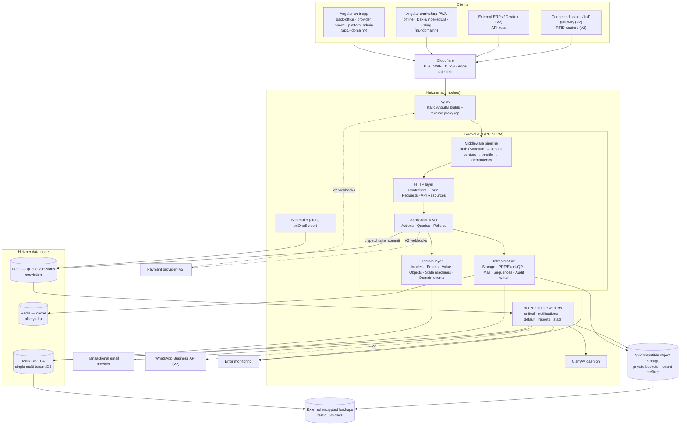

## 2.2 Hostnames and origins **[REC]**

| Host | Serves | Auth | Why |
|---|---|---|---|
| `app.<domain>` | Angular `web` build + `/api/*` proxied to Laravel | Sanctum **cookie session** (stateful domain) | Same origin, so no CORS. CSRF is handled by Sanctum's XSRF cookie. |
| `m.<domain>` | Angular `workshop` PWA + `/api/*` proxied to the same Laravel | Sanctum **bearer token** (not a stateful domain) | Separate origin, so the PWA has its own service-worker scope and IndexedDB, and never sends web session cookies. QR payload deep links point here. |
| `api.<domain>` (V2) | `/api/*` only | API-client tokens (M7-03) | Separate rate-limit and WAF rules for machine traffic. |

All three hosts reach the **same Laravel deployment**. This is one API, as the cahier requires.

## 2.3 Synchronous vs asynchronous operations

Rule: **anything the user waits for and that touches only a few rows runs synchronously. Anything that renders files, sends messages, fans out over many rows or calls a third party runs on a queue.** Jobs are always dispatched **after commit** (`after_commit=true` on the queue connection), so a job never sees uncommitted or rolled-back data.

| Operation | Mode | Queue | Notes |
|---|---|---|---|
| Login, 2FA, password reset request (DB part) | Sync | — | Reset email is queued. |
| CRUD on sites, zones, waste types, providers, users | Sync | — | — |
| Lot creation (web), status change, move, weighing, split, grouping | Sync | — | Single DB transaction. Stats recompute and threshold checks are queued afterwards. |
| `POST /mobile/sync/push` (batch ≤ 100 ops) | **Sync** | — | The device needs per-operation results to clear its outbox. Target p95 < 2 s for 100 ops. |
| QR scan resolution | Sync | — | Cahier: < 1 s. Single unique-index lookup. |
| Single label PDF (100×50 mm) | Sync | — | Small. The PWA renders labels client-side when offline. |
| Pickup request creation / provider confirmation | Sync | `notifications` | The email to the provider/industrial is queued. |
| Current stock (site/zone/type) | Sync | — | Live query on a covering index (§17). |
| Dashboards (3-year range) | Sync | — | Read from `waste_daily_stats` + Redis cache (§10). |
| Waste register export, RSE report, annual declaration PDF/Excel | **Async** | `reports` | Creates a `generated_reports` row; user is notified when ready. |
| Hazardous manifest PDF regeneration after each signature | Async | `default` | — |
| Daily stats recompute for a (company, site, date) bucket | Async, debounced | `stats` | `ShouldBeUnique`, 60 s window. |
| Stock threshold evaluation → `stock_alerts` | Async | `default` | Triggered by lot events; nightly safety run. |
| Accreditation expiry scan (J-30, J-7, J0) | Scheduled → async | `notifications` | M4-02. |
| Trial reminders, trial expiry, renewals, invoice generation | Scheduled → async | `default` | M0-03, M7-04. |
| Invoice PDF rendering + email | Async | `default` → `notifications` | — |
| Upload antivirus scan, photo thumbnail | Async | `default` | File is not served until `scan_status=clean`. |
| Audit log write | **Sync, same transaction** | — | An audit row must never be lost or orphaned. |
| ERP/Divatex import (V2), payment webhooks (V2), WhatsApp (V2) | Async | `imports` / `critical` / `notifications` | — |

## 2.4 Layer boundaries **[REC]**

The backend is a **modular monolith**. Code is organized by business module (§21), and each module uses the same thin layering. This is a pragmatic hexagonal-*lite* approach: no repository interfaces wrapped around Eloquent, and no CQRS bus.

| Layer | Contains | May depend on | Must not |
|---|---|---|---|
| **API (HTTP)** | Routes, Controllers (thin), Form Requests, API Resources, middleware | Application layer | Contain business rules, run queries directly, or call `DB::`. |
| **Application** (Actions & Queries) | One class per use case (`CreateWasteLot`, `SplitWasteLot`, `RequestPickup`, `ConfirmPickup`…) that opens the transaction, calls `Gate`, applies domain logic, dispatches events. Query classes for read models (stock, register, dashboards). | Domain, Infrastructure contracts | Know about HTTP (no `Request` objects; they receive DTOs). |
| **Domain** | Eloquent models (entities), backed enums, state machines (allowed transitions), value objects (`Weight`, `Money`, `Percentage`, `Composition`), domain events, domain exceptions, policies' rule logic | Nothing outside the domain except Eloquent | Send mail, render PDFs, touch storage. |
| **Persistence** | Eloquent + migrations + global scopes (`TenantScope`) + raw reporting SQL in dedicated Query classes | — | Be bypassed for tenant tables (see §3.10). |
| **Infrastructure** | File storage adapter, PDF/Excel/QR renderers, mailer, number sequences, audit writer, ClamAV client, payment/WhatsApp adapters (V2) | Laravel facades / SDKs | Contain business rules. |
| **Notifications** | Laravel Notification classes per business event; listeners mapping domain events → notifications | Application read models | Be sent synchronously inside a DB transaction. |
| **Reporting** | Stats projector (event → `waste_daily_stats` recompute), dashboard queries, report builders | Read-only access to domain tables | Write to domain tables. |
| **Documents** | Document generators (register, manifest, declaration, RSE report), versioning, signatures, retention | Reporting queries, Infrastructure renderers | Mutate lots or pickups (they only reference them). |

Communication between modules goes through public Actions and Query classes for commands and reads, and through domain events for side effects. For example, `PickupCollected` is consumed by Lots (status change), Reporting (stats) and Notifications. Modules may define Eloquent relationships to another module's models for **reading**. Writes always go through the owning module's Actions. Pest `arch()` tests enforce this (§21.4).

## 2.5 Future integration points (designed now, built later)

| Integration | Boundary | What exists in V1 that makes V2 cheap |
|---|---|---|
| ERP / Divatex (M3-01) | `Integrations` module, `/api/v1/integrations/*`, `import_batches` | `production_volumes` (MVP) and a lot model that does not need to change (production links live in a separate table, §11). |
| Payment provider (M0-04 V2) | `Billing\PaymentGateway` interface; `payments.provider`, `payments.provider_payment_id` columns already exist | Bank-transfer flow uses the same `payments` table. |
| WhatsApp (M7-01 V2) | Custom notification channel + `notification_preferences.channel='whatsapp'` | Channel enum and preferences table exist in V1. |
| RFID UHF (M2-03 V2) | `lot_tags.tag_type='rfid_epc'` | `lot_tags` is the only source of scannable identifiers from V1, so RFID is just another tag type. |
| Connected scales / IoT gateway (M2-04 V2) | `POST /api/v1/devices/scales/{id}/readings` with device credentials | `waste_lot_weighings.source` ('manual','scale','computed') and `device_reference` exist in V1. |

---

# 3. Multi-tenant architecture

**[CDC] cahier §4 Multi-tenant:** *"Une base unique avec un identifiant société sur chaque table ; aucune requête ne peut lire les données d'une autre société (filtre appliqué au niveau de la couche d'accès aux données, testé automatiquement)."*
**[CDC] cahier §5:** *"Global scope Eloquent sur l'identifiant société + middleware de contexte"*, *"Tests automatiques d'isolation entre sociétés"*.

## 3.1 The tenant root: `companies`

`companies` is the **tenant root**. One row is one legal entity using the platform. The cahier (§6) says *"Société … type (industriel / prestataire)"* and *"un prestataire est une société"*, so **providers are tenants too**: they log in to their own *espace prestataire*, manage their users, accreditations and the pickups addressed to them.

`companies.company_type` ∈ {`industrial`, `provider`, `brand`}. `brand` is reserved for the V2 *portail donneur d'ordre* (M6-05).

The tenant identifier column is **`company_id`** everywhere.

## 3.2 Table classification

Every table falls into exactly one category. A CI test (§3.11) fails the build if a table is added without being classified.

| Category | Rule | Tables |
|---|---|---|
| **TENANT ROOT** | Is the tenant | `companies` |
| **TENANT** | `company_id BIGINT UNSIGNED NOT NULL`, model uses `BelongsToCompany` (global `TenantScope`), composite FK target `(company_id, id)` when referenced | `company_textile_activities`, `company_users`, `user_role_assignments`, `user_invitations`, `user_invitation_sites`, `company_subscriptions`, `subscription_events`, `subscription_usage_records`, `invoices`, `invoice_items`, `payments`, `sites`, `zones`, `stock_thresholds`, `stock_alerts`, `waste_types`, `waste_type_compositions`, `waste_type_unit_conversions`, `number_sequences`, `waste_lots`, `waste_lot_compositions`, `lot_tags`, `waste_lot_events`, `waste_lot_weighings`, `waste_lot_operations`, `waste_lot_lineage`, `waste_lot_photos`, `devices`, `sync_operations`, `sync_conflicts`, `api_idempotency_keys`, `provider_partnerships`, `provider_invitations`, `pickup_charges`, `document_versions`, `document_waste_lots`, `annual_declarations`, `period_locks`, `production_volumes`, `waste_daily_stats`, `generated_reports`, `notification_preferences` — V2: `integration_sources`, `import_batches`, `import_batch_errors`, `external_references`, `api_clients`, `customer_brands`, `product_models`, `production_orders`, `waste_lot_production_links`, `brand_access_grants`, `scale_devices`, `marketplace_listings`, `marketplace_listing_lots`, `sso_connections` |
| **TENANT, PARTY-SHARED** | Owned by `company_id` (the industrial), plus one or more *party* columns that grant **read and limited write** to another tenant (provider/transporter). The party-aware scope is described in §3.5. | `pickups` (`provider_company_id`, `transporter_company_id`), `pickup_lots` (same), `pickup_events` (same), `hazardous_waste_manifests` (`transporter_company_id`, `receiver_company_id`), `documents` (`shared_with_company_id`), `document_signatures` (`signer_company_id`) — V2: `marketplace_offers` (`provider_company_id`) |
| **TENANT, PUBLISHED DIRECTORY** | Owned by the **provider's** `company_id` (normal `TenantScope` for the provider's own users). Industrial tenants read a **published projection** through one allowlisted read service (`ProviderDirectory`). | `provider_profiles`, `provider_accepted_wastes`, `provider_accreditations`, `provider_accreditation_scopes` |
| **MIXED (global + tenant override)** | `company_id NULL` = platform row visible to all; `company_id = X` = tenant row. Scope: `company_id IS NULL OR company_id = :ctx`. Writes to NULL rows are platform-only. | `roles`, `stored_files`, `notifications`, `notification_logs`, `audit_logs` (read side only), V2: `emission_factors` |
| **GLOBAL REFERENCE** | No `company_id`. Read by everyone, written only by platform staff. Usually cached. | `countries`, `currencies`, `tax_rates`, `textile_activities`, `legal_documents`, `zone_types`, `packaging_types`, `units`, `waste_families`, `materials`, `color_families`, `regulatory_waste_codes`, `waste_catalog_items`, `waste_catalog_item_regulatory_codes`, `treatment_channels`, `accreditation_types`, `declaration_templates`, `subscription_plans`, `subscription_plan_prices`, `permissions`, `role_has_permissions` (guarded through its parent role) |
| **GLOBAL IDENTITY / SYSTEM** | No tenant filter. Accessed only through auth flows or platform services. | `users`, `password_reset_tokens`, `personal_access_tokens` (carries `company_id` as a *binding*, not as a scope), `legal_acceptances` (user-owned), `authentication_logs`, `invoice_number_sequences`, `model_has_roles` (platform roles only), `model_has_permissions` (unused), `failed_jobs`, `job_batches` — V2: `user_sso_identities`, `phone_verifications`, `payment_webhook_events` |

**Tables that must NOT have `company_id`** (they are global/system):
`countries`, `currencies`, `tax_rates`, `textile_activities`, `legal_documents`, `zone_types`, `packaging_types`, `units`, `waste_families`, `materials`, `color_families`, `regulatory_waste_codes`, `waste_catalog_items`, `waste_catalog_item_regulatory_codes`, `treatment_channels`, `accreditation_types`, `declaration_templates`, `subscription_plans`, `subscription_plan_prices`, `permissions`, `role_has_permissions`, `users`, `password_reset_tokens`, `legal_acceptances` (has a nullable informational `company_id` but is owned by the user), `authentication_logs` (nullable informational `company_id`), `invoice_number_sequences`, `model_has_roles`, `model_has_permissions`, `failed_jobs`, `job_batches`.

> **Why `users` is global [REC]:** one person can belong to several companies (a consultant, a group with several legal entities, a brand auditor invited by several industrials). A global identity with per-company **memberships** (`company_users`) avoids duplicate accounts with the same email and gives a single password/2FA. This reading of *"identifiant société sur chaque table"* is flagged in §24 (P-01).

## 3.3 How the tenant context is established

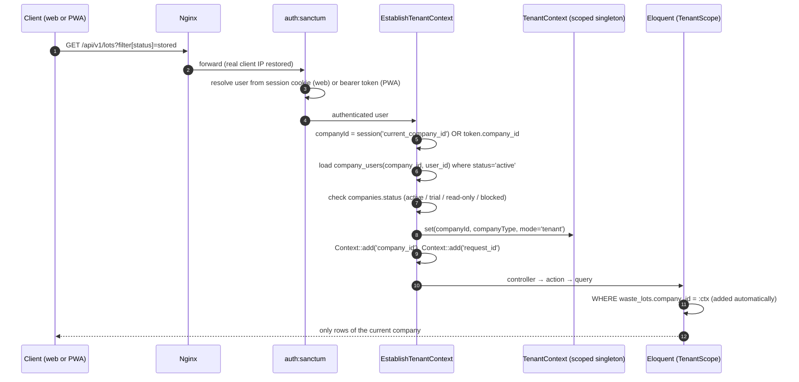

Rules **[REC]**:

1. **The client never chooses the tenant per request.** There is no `X-Company-Id` header. For the web SPA, the current company is stored server-side in the session and changed only through `POST /api/v1/me/current-company`, which checks membership and regenerates the session. For the PWA, the company is **bound to the token** (`personal_access_tokens.company_id`) when the device is registered.
2. `TenantContext` is registered as a **scoped** singleton (`$this->app->scoped(...)`). It is reset for every request and every job, which protects against leaks in long-lived workers.
3. **Fail closed.** If code queries a TENANT model while `TenantContext` is empty and not explicitly in *system* mode, `TenantScope` throws `MissingTenantContextException`. It does not return unfiltered rows.
4. **Company status gate.** `pending_approval` → only onboarding/profile endpoints. `suspended` or subscription `expired` → read-only plus billing endpoints (data stays exportable; see §18 rule R-31). `rejected`/`closed` → no access.

## 3.4 The Eloquent global scope **[CDC + REC]**

`BelongsToCompany` trait (applied to every TENANT model):

- Registers `TenantScope`: `where({table}.company_id, ctx.companyId)`. Always qualify the column with the table name, otherwise joins become ambiguous.
- `creating` hook: if `company_id` is empty, set it from context. If it is set and differs from context → throw `CrossTenantWriteException`.
- `updating` hook: if `company_id` is dirty → throw. **A row never changes tenant.**
- `belongsToCompany()` relationship.

`TenantScope` has three modes, read from `TenantContext`:

| Mode | When | Behaviour |
|---|---|---|
| `tenant` | HTTP requests, tenant jobs | Filter by `company_id` (or the party columns, §3.5) |
| `system` | Explicit `TenantContext::runAsSystem(string $reason, Closure $fn)` inside allowlisted classes only (scheduler fan-out, platform billing, provider directory) | No filter. **Every entry into system mode is logged** (reason, class, request/job id). |
| `none` | Nothing set | **Throws** |

## 3.5 Party-aware scope for shared records **[INF]**

Pickups are owned by the industrial but must be visible to the provider (M4-03 *"espace prestataire"*, M4-04 *"saisie du poids reçu par le prestataire"*). Instead of letting provider code bypass the scope, PARTY-SHARED models declare their party columns and `TenantScope` chooses the predicate based on the **type of the current company**:

| Context company type | Predicate on `pickups` / `pickup_lots` / `pickup_events` |
|---|---|
| `industrial` | `company_id = :ctx` |
| `provider` | `(provider_company_id = :ctx OR transporter_company_id = :ctx)` |

Equivalent predicates apply to `hazardous_waste_manifests` (`transporter_company_id`, `receiver_company_id`), `documents` (`shared_with_company_id`) and `document_signatures` (`signer_company_id`).

**Providers never read `waste_lots` directly.** `pickup_lots` carries a **snapshot** of what the provider needs (lot number, waste type label, regulatory code, hazardous flag, declared weight). The provider's QR scan resolves against `pickup_lots` rows of pickups addressed to them (§8). This keeps the most sensitive tenant table, `waste_lots`, strictly single-tenant.

Column-level confidentiality (for example, the industrial's internal prices on `pickup_lots`) is handled in the **API Resource** for the provider audience. It is not a scope concern.

## 3.6 Background jobs preserve tenant context **[REC]**

1. Tenant-specific jobs implement `TenantAwareJob` and carry an **explicit** `public readonly int $companyId`, captured at dispatch time. Being explicit makes the dependency visible and testable.
2. As a second line of defence for **all** jobs, including third-party jobs such as Laravel Excel's chunk jobs, the tenant id is also stored in Laravel's `Context` (hidden), which Laravel serializes into every job payload automatically.
3. A `Queue::before` listener restores `TenantContext` from the job (explicit property first, then `Context`). Listeners on `Queue::after` and `Queue::failing` **clear** it. A worker that processes a job for company A and then one for company B can never carry A's context into B.
4. Jobs that touch **no** tenant data (e.g. global catalog cache warm-up) run with an empty context. If they touch a tenant model by mistake, they throw.
5. Scheduler tasks are **fan-out** jobs: in system mode they list the eligible companies (global query on `companies`) and dispatch **one tenant job per company**. They never process several tenants in one loop.

## 3.7 Reports and exports preserve tenant context

- `generated_reports` rows are TENANT rows. The request validates parameters and permission, inserts the row and dispatches `GenerateReport($companyId, $reportId)`.
- The job **re-authorizes** against `requested_by_user_id` (the user may have lost the permission between request and execution) before building the query.
- Laravel Excel `FromQuery` exports run inside the restored context. The global scope is applied when each chunk query executes, which works because of §3.6.2.
- Output files are written under the tenant prefix (§3.8) and registered in `stored_files` with the same `company_id`.
- **Pre-aggregated data** (`waste_daily_stats`) is a TENANT table like the others. There is no cross-tenant aggregate table in MVP. Platform-level analytics (super-admin KPIs such as "number of active companies") come from global tables only.

## 3.8 File storage isolation

- **Path convention:** `tenants/{company_ulid}/{purpose}/{yyyy}/{mm}/{file_ulid}.{ext}`; platform files under `platform/{purpose}/...`. The client never supplies a path.
- Every object is registered in `stored_files` (`company_id`, `disk`, `path`, `checksum_sha256`, `scan_status`). Access always goes through the **owning record's policy** (document, accreditation, photo, invoice). `stored_files` is never exposed directly.
- **Private buckets only.** Download = `GET /api/v1/files/{ulid}` → policy check → stream through Laravel (small files) or a **5-minute pre-signed URL** (large files). Pre-signed URLs are bearer tokens, so they are short-lived, never logged and never emailed.
- **Provider uploads into an industrial's space** (certificates, M5-04): the file is stored under the **industrial's** prefix with `stored_files.company_id = industrial` and `uploaded_by_company_id = provider`. The provider's later access goes through the document's party column (`documents.shared_with_company_id`).

## 3.9 Preventing API queries from leaking another tenant's data

| Vector | Protection |
|---|---|
| Route-model binding (`/lots/{lot:ulid}`) | Binding runs through the model's scoped query → other tenant's id = **404**, never 403 (do not confirm existence). |
| IDs in request bodies (`zone`, `waste_type`, `site`) | Custom validation rule `TenantExists(Zone::class)` resolves through the scoped model. `Rule::exists()` on a bare table is forbidden for tenant tables (Larastan rule). |
| DB backstop | **Composite foreign keys** `(company_id, x_id) → x(company_id, id)` on every intra-tenant reference (§4.6). Even a buggy raw insert cannot attach company A's lot to company B's zone. |
| Uniqueness validation | `Rule::unique()` on tenant tables must include `->where('company_id', ctx)` (wrapped in `TenantUnique`). |
| Cache | Cache keys of tenant data **must** be prefixed `t:{companyId}:`. Helper `TenantCache::remember()`. Plain `Cache::remember()` with tenant data is a review-blocking defect. |
| Enumeration | Public identifiers are ULIDs. Sequential `id`s are never exposed in API payloads or URLs. |
| Search/autocomplete | Same scoped models. No separate search index in MVP. |

## 3.10 Preventing developers from bypassing isolation

| Bypass | Prevention |
|---|---|
| `withoutGlobalScopes()` / `withoutGlobalScope(TenantScope::class)` | **Banned by Larastan** (`spaze/phpstan-disallowed-calls`) everywhere except `App\Modules\Tenancy\System\*` and `App\Modules\Platform\Admin\*`. Allowed code must call `TenantContext::runAsSystem($reason, …)`, which logs. CODEOWNERS review on those namespaces. |
| Raw SQL (`DB::select`, `DB::table`, `DB::statement`, `whereRaw` with tenant tables) | `DB::table()` / `DB::select()` banned outside `App\Modules\*\Queries\Sql\*` (reporting) and migrations. Classes in that namespace extend `TenantSqlQuery`, which **injects `company_id = ?` as a mandatory bound parameter** and refuses to run if the SQL text does not reference `:company_id`. All values are bound; string interpolation is banned (Larastan rule on `DB::raw` with variables). |
| `Model::insert()`, `upsert()`, `query()->update()` (bypass model events) | Banned on TENANT models except inside `App\Modules\*\Persistence\Bulk\*` writers that set `company_id` explicitly and write the corresponding audit entries (§12.5). |
| Background jobs | §3.6: explicit tenant id, `Queue::before` restore, clear after, fail-closed scope. Test: two jobs for different tenants processed by the same worker. |
| Relationships | Eloquent applies the **related** model's global scopes to relationship queries, so `$lot->zone` is scoped. Composite FKs prevent cross-tenant references from being stored at all. Relationships to PARTY-SHARED models use the party-aware scope. |
| Exports | §3.7: export classes are tenant jobs; Excel chunk jobs inherit `Context`; an isolation test seeds a marker value in tenant B and asserts it never appears in A's export file. |
| Admin endpoints | `/api/v1/admin/*` (platform staff, `model_has_roles` super-admin). Admin controllers only touch GLOBAL tables and `companies`. Any tenant data access (e.g. reading a company's invoices) goes through `TenantContext::runAs($companyId, $reason)`, which writes an audit entry `platform_access`. **No generic impersonation in MVP.** |
| Spatie permission cache | Spatie caches roles/permissions globally, which is fine because no tenant data is in it. The custom `AccessResolver` cache key is `t:{companyId}:u:{userId}:perm:v{version}`. |

## 3.11 Automated cross-tenant isolation tests **[CDC: "testé automatiquement"]**

These run on **MariaDB** in CI and are part of the deliverable *"tests d'isolation multi-société"* (§7 of the cahier).

1. **Schema classification test.** Reads `information_schema.COLUMNS` and fails if any table is not listed in exactly one registry (`TenantTables`, `PartySharedTables`, `DirectoryTables`, `MixedTables`, `GlobalTables`, `SystemTables`). Every TENANT table must have `company_id NOT NULL`, an index starting with `company_id`, and a model using `BelongsToCompany`.
2. **Model isolation dataset.** Auto-discovers every model using `BelongsToCompany`. For each one: build records for companies A and B with factories, set context A, then assert `count()` only sees A, `find($bId)` is null, `create()` stamps A, changing `company_id` throws, and querying with no context throws.
3. **HTTP isolation sweep.** Iterates `Route::getRoutes()` for `/api/v1/*` routes with bound tenant models. Calls each one as a user of A with B's ULIDs and expects **404**. For write routes, also sends B's ULIDs inside the payload and expects **422** (`TenantExists`).
4. **Party-access tests.** Provider P sees pickups where it is provider or transporter, and nothing else. P gets 404 on every `/lots/*` endpoint. P can upload a certificate only to pickups addressed to it.
5. **Composite-FK test.** A raw insert linking company A's lot to company B's zone fails with an FK violation.
6. **Job leakage test.** One worker processes `JobForA` then `JobForB`. Assert B's job sees only B, and that the context is empty after each job.
7. **Export/report test.** Generate A's waste register while B has marker data; parse the file and assert no B marker appears.
8. **Cache-key test.** Arch test: no `Cache::` calls in tenant modules except through `TenantCache`.
9. **Static gate.** Larastan disallowed-calls rules (§3.10) run in CI. A violation fails the build.

---

# 4. Database blueprint — conventions and global design rules

The cahier's data model (§6) is explicitly *indicatif* and covers 11 entities. This section sets the conventions used by **every** table in §15. §14 has the full inventory (108 tables, 89 in MVP).

## 4.1 Engine and session settings **[REC]**

- InnoDB, `utf8mb4`, `utf8mb4_unicode_ci` (case-insensitive: emails and codes compare case-insensitively).
- `sql_mode = STRICT_TRANS_TABLES,ERROR_FOR_DIVISION_BY_ZERO,NO_ENGINE_SUBSTITUTION`, `time_zone = '+00:00'`.
- `transaction_isolation = READ-COMMITTED` with `binlog_format = ROW`. This reduces gap-lock contention on hot paths (sequence rows, sync batches) compared with REPEATABLE-READ, and every critical write in this design uses explicit `SELECT … FOR UPDATE` anyway.

## 4.2 Keys and identifiers

| Convention | Rule | Why |
|---|---|---|
| Primary key | `id BIGINT UNSIGNED AUTO_INCREMENT` on every table (except pure pivots with composite PKs, and `currencies.code`) | Compact clustered index and fast joins. Laravel default. |
| Public identifier | `ulid CHAR(26) ascii_bin NOT NULL UNIQUE` on every entity exposed through the API | No enumeration and no leaking of volumes. Can be **generated offline by the PWA** (lots, weighings, operations, photos, devices), so the server and client agree on identity without an ID-mapping table. Laravel `HasUlids` with `uniqueIds(): ['ulid']`, which keeps `id` as the PK. |
| Business key | Human-readable numbers (`lot_number`, `pickup_number`, `manifest_number`, `invoice_number`) assigned **server-side** from `number_sequences` / `invoice_number_sequences`, unique per company (per platform for invoices) | Printed on documents. Gapless where the law requires it (invoices). |
| Foreign keys | `<entity>_id`; actor columns `<role>_user_id` (e.g. `created_by_user_id`, `validated_by_user_id`) | Readable and consistent. |
| Constraint names | `fk_<table>_<column(s)>`, `uq_<table>_<column(s)>`, `ix_<table>_<column(s)>`; shortened only if they would exceed 64 chars | Explicit names make migrations and errors readable. |

## 4.3 Data types

| Data | Type | Notes |
|---|---|---|
| Weight | `DECIMAL(12,3)` kg | Canonical storage unit is **kg** (M1-05 "kg par défaut"), precise to the gram. Aggregates `DECIMAL(16,3)`. Never `FLOAT`. |
| Money | `DECIMAL(15,3)` + `currency_code CHAR(3)` | **TND has 3 decimals (millimes)**; MAD/EUR have 2. The value is rounded to the currency's `minor_unit` in the domain layer. |
| Percentage | `DECIMAL(5,2)` (0.00–100.00); signed variance `DECIMAL(7,2)` | — |
| Status / lifecycle | MariaDB `ENUM(...)` | Closed sets defined by the cahier (lot, pickup statuses). 1 byte. **Appending a value is an instant ALTER** in MariaDB; reordering or removing values is forbidden by convention. Mirrored by a PHP backed enum. |
| Open-ended types | `VARCHAR(40)` + PHP backed enum | Event types, operation types, report types, notification types and file purposes grow over time, so no DDL is needed to add one. |
| Booleans | `TINYINT(1)` | — |
| Timestamps | **`DATETIME`** (seconds) / **`DATETIME(3)`** for event ordering, always **UTC** | **Not `TIMESTAMP`**, because `TIMESTAMP` overflows in January 2038 and the cahier requires 10-year retention (a certificate archived in 2028 must stay valid to 2038). Use `$table->datetimes()` / `dateTime()` in migrations, never `timestamps()`. |
| Business dates | `DATE` | Pickup planned date, accreditation expiry, period bounds. |
| JSON | `JSON` (alias of `LONGTEXT` + `json_valid` CHECK in MariaDB) | Only for snapshots, flexible payloads and translations, **never** for data that is filtered or aggregated (see composition decision §5.D). |
| Translatable reference labels | `name JSON` → `{"fr":"…","en":"…","ar":"…"}` | Reference data is editable by super-admin at runtime, so it cannot live only in Transloco files. Stable `code` columns are used in code. |
| IP address | `VARCHAR(45)` | IPv6-safe, readable in audit screens. |
| ULID | `CHAR(26) CHARACTER SET ascii COLLATE ascii_bin` | — |

## 4.4 Standard columns

| Column set | Applied to |
|---|---|
| `id`, `created_at DATETIME NOT NULL`, `updated_at DATETIME NOT NULL` | All mutable tables. |
| Insert timestamp only (no `updated_at`) | Append-only tables. `created_at`: `audit_logs`, `authentication_logs`, `subscription_events`, `document_versions`, `document_waste_lots`, `legal_acceptances`. Traceability tables use **`recorded_at`** (server time) next to their business time (`occurred_at`, `measured_at`, `performed_at`): `waste_lot_events`, `waste_lot_weighings`, `waste_lot_operations`, `waste_lot_lineage`, `pickup_events`. `sync_operations` uses `received_at` / `processed_at`. |
| `company_id` | TENANT, PARTY-SHARED and DIRECTORY tables (§3.2). **Not** on global tables. |
| `deleted_at DATETIME NULL` (Laravel `SoftDeletes`) | Only where a "delete" action exists in the UI **and** the row must survive (see 4.5). |
| `deleted_by_user_id`, `deletion_reason VARCHAR(500)` | Tables where the cahier requires logical deletion of regulatory records: `waste_lots`, `documents`, `provider_accreditations`, `stored_files`. |
| `version INT UNSIGNED NOT NULL DEFAULT 1` | Optimistic locking for rows edited concurrently or offline: `waste_lots`, `pickups`. |

## 4.5 Deletion policy **[CDC: cahier §4 Traçabilité + REC]**

| Policy | Tables |
|---|---|
| **Never deleted, logical deletion only (SoftDeletes + reason)** **[CDC]** | `waste_lots`, `documents` (all regulatory documents) |
| **Never deleted, logical deletion [REC]** | `provider_accreditations`, `stored_files`, `sites`, `zones`, `waste_types`, `waste_lot_photos` |
| **Never deleted; cancellation is a status** | `pickups` (`cancelled`), `invoices` (`cancelled` + credit note), `payments` (`rejected`/`refunded`), `company_subscriptions`, `hazardous_waste_manifests` (`cancelled`), `companies` (`closed`), `users` (`anonymized`) |
| **Append-only, never updated or deleted by the app** | `waste_lot_events`, `waste_lot_weighings`, `waste_lot_lineage`, `waste_lot_operations`, `pickup_events`, `document_versions`, `document_signatures` (status changes only until signed), `audit_logs`, `subscription_events` |
| **Physically deletable (technical/transient)** | `user_invitation_sites`, `user_role_assignments` (deletion is audited), `api_idempotency_keys`, `sync_operations` (after retention), `generated_reports` (after expiry), `notifications`, `password_reset_tokens`, `authentication_logs` (after retention) |

**FK delete behaviour:** `ON DELETE RESTRICT` everywhere by default. `ON DELETE CASCADE` only from a parent to its pure technical children (`user_invitations` → `user_invitation_sites`, `roles` → `role_has_permissions`). Business data never cascades.

## 4.6 Composite tenant foreign keys **[REC — key integrity decision]**

Every TENANT table that is referenced by another TENANT table declares `UNIQUE (company_id, id)`, written as `uq_<table>_company_id_id` in §15. Child tables reference parents with **composite FKs**:

```text
waste_lots (company_id, zone_id)  →  zones (company_id, id)
```

And when the hierarchy matters:

```text
waste_lots (company_id, site_id, zone_id)  →  zones (company_id, site_id, id)
```

This guarantees **at database level** that a lot's zone belongs to the lot's site and that both belong to the lot's company. The global scope is the first line of defence; composite FKs are the backstop that no application bug can bypass. Nullable FK columns are fine: MariaDB skips the check when any column of the FK is NULL.

Cost: one extra unique index per referenced parent table. Child indexes start with `company_id`, which most tenant queries need anyway.

References to **global** tables (`users`, `countries`, `waste_families`…) and **cross-tenant** references (`pickups.provider_company_id` → `companies.id`) are ordinary single-column FKs.

## 4.7 NULL-safe uniqueness patterns **[REC]**

MariaDB has no partial indexes, and a `UNIQUE` index treats NULLs as distinct. Two patterns are used, always in the same way:

1. **NULL-flag pattern** ("at most one active row"): a column `is_current TINYINT(1) NULL` (or `is_active_flag`, `open_flag`) that is either `1` or `NULL`, combined with `UNIQUE(scope_cols, flag)`. Rows with NULL never conflict, so only one row can hold `1`. Used for: one current subscription per company, one active QR tag per lot, one active pickup per lot, one open stock alert per subject, one pending invitation per email.
2. **Generated key pattern** ("nullable column part of a natural key"): a `STORED` generated column such as `site_scope_key BIGINT UNSIGNED AS (IFNULL(site_id, 0)) STORED`, included in the unique key. Used for: `user_role_assignments` (company-wide vs site role), `roles` (system vs company role), `stock_thresholds`, `waste_daily_stats`.

## 4.8 Snapshot vs reference **[REC — historical immutability]**

Regulatory history must not change when reference data is edited later. For example, if a waste type's regulatory code is corrected in 2027, lots declared in 2026 must keep the 2026 code. Therefore:

- `waste_lots` **copies** `is_hazardous` and `regulatory_waste_code_id` from its waste type at creation, and composition and color at creation/edit time.
- `pickup_lots` **snapshots** lot number, waste type label, regulatory code and hazardous flag when the lot is added to a pickup.
- `invoices` snapshot seller and buyer identity (`seller_snapshot`, `buyer_snapshot`).
- `hazardous_waste_manifests` snapshot producer, transporter and receiver identities.
- Documents store a `source_snapshot` (the data used for rendering) in `document_versions`.

FKs are kept **as well** for navigation. The snapshot is what regulatory outputs print.

---

# 5. Database domains — design decisions

This section explains the **why** for each domain. Exact columns are in §15.

## 5.A SaaS / companies / subscriptions / billing

**Cahier inputs:** M0-01 (raison sociale, matricule fiscal, pays, activité textile, contact principal), M0-03 (essai gratuit 30 jours, abonnement par site, par volume), M0-04 (virement MVP validé par super-admin, carte V2), M0-06 (valider / rejeter avec motif / suspendre), M0-11 (factures PDF, changement de formule, ajout de sites, résiliation), M7-04 (facturation automatique, matricule fiscal et TVA selon le pays), §6 *Société* and *Abonnement / Facture*, §7 *Points à trancher: grille tarifaire (par site, par volume, ou mixte), passerelle de paiement V2*.

| Concept | Table(s) | Decision |
|---|---|---|
| Tenant / company profile | `companies` | One table for the legal entity and its profile: no 1:1 `company_profiles` table, because every company has a profile. Provider-specific data lives in `provider_profiles` (§8). |
| Country | `countries` (global) | Holds country parameters managed by the super-admin (*"paramètres pays"*): currency, default locale, tax-ID label and validation pattern (matricule fiscal TN, ICE MA, SIREN/TVA FR, BCE BE), waste-code system, regulatory authority name, signup enabled. |
| Company type | `companies.company_type` ENUM | `industrial`, `provider`, `brand` (V2). Not a table: the type drives code paths, it is not editable data. |
| Company status | `companies.status` ENUM | `pending_verification` → `pending_approval` → `active` / `rejected`; `active` ↔ `suspended`; → `closed`. Rejection and suspension reasons are stored in columns. The full history is in `audit_logs`. |
| Textile activity | `textile_activities` (global) + `company_textile_activities` (pivot) | M0-01 lists several activities (*filature, tissage, teinture, confection…*), and one company can have several, so it is a many-to-many relationship. |
| Tax registration | `companies.tax_id` (+ `vat_number`, `trade_register_number`) | Validated against `countries.tax_id_pattern`. Required for invoices (M7-04). |
| Plans | `subscription_plans` + `subscription_plan_prices` | **Price components** (`base_fee`, `per_site`, `per_tonne`) with optional tiers and validity dates. This handles *par site*, *par volume* and *mixte* without a schema change, which matters because the pricing grid is still undecided (cahier §7). |
| Company subscription | `company_subscriptions` | **One row per plan period.** A plan change closes the current row (`ends_at`, `replaced_by_subscription_id`) and opens a new one. `is_current` (NULL-flag) guarantees one current subscription. `price_snapshot` JSON freezes the prices at subscription time. The sequence of rows **is** the subscription history. |
| Subscription history (fine-grained) | `subscription_events` | Append-only events: trial started, reminder sent, plan changed, sites added, cancellation requested, suspended, reactivated. |
| Trial (30 days) | `company_subscriptions.status='trialing'`, `trial_starts_at`, `trial_ends_at` | **[REC]** The trial starts **when the super-admin approves the company**, not at signup, otherwise trial days are lost waiting for validation. At the end, the company converts to a paid plan or goes to `expired`, which means **read-only with data still exportable** (no data loss). See P-08. |
| Site-based model | `subscription_plan_prices.component='per_site'` × `company_subscriptions.sites_quantity` | Adding sites (M0-11) raises `sites_quantity` and is prorated in the next invoice. The number of active sites cannot exceed `sites_quantity`. |
| Volume-based model | `subscription_usage_records` | Monthly computed `tonnes_managed` (definition to confirm, P-07) per subscription. The invoice line references the usage record. |
| Cancellation | `cancel_at_period_end`, `cancellation_requested_at`, `cancellation_reason`, `cancelled_at` | Effective at period end. Data is kept (retention obligations) and access becomes read-only. |
| Invoices | `invoices`, `invoice_items` | Issued by the platform to the company (TENANT rows). **Gapless numbering** through `invoice_number_sequences` (global, locked row). Seller/buyer snapshot. Never deleted; corrections are made with credit notes (`invoice_type='credit_note'`, `credited_invoice_id`). |
| Payment/billing status | `invoices.status` + `payments` | Bank transfer (MVP): the customer declares a transfer and may upload proof; the super-admin validates → `payments.status='validated'` → invoice `paid`/`partially_paid`. Card payments (V2) use the same table with `provider`/`provider_payment_id`. |
| Taxes | `tax_rates` (global) | VAT per country with validity dates, plus fixed duties such as the Tunisian **timbre fiscal** (`tax_type='stamp_duty'`, `fixed_amount`). Exact rules need an accountant's validation (P-10). |

## 5.B Users / authentication / authorization

**Cahier inputs:** §2 (*7 rôles; un même utilisateur peut avoir des rôles différents selon les sites; matrice rôle × permission paramétrable, sans modification du code*), M0-02 (email verification link valid 24 h), M0-08 (invite with a role and one or more sites, link expires after 7 days), M0-09 (12+ char password, forgot password, optional TOTP, lock after 5 failures), M0-10 (timestamped acceptance of terms and privacy policy, with version), §5 (Sanctum, Fortify, spatie/laravel-permission), §6 *Utilisateur: nom, email, téléphone, mot de passe haché, 2FA, langue — a des rôles par site*.

### The authorization model

```text
users (global identity)
  └── company_users (membership: user ∈ company, status)
        └── user_role_assignments (company_id, user_id, role_id, site_id NULL = all sites)
              └── roles ── role_has_permissions ── permissions
```

- **Site-specific roles are first-class.** A user can be `environment_manager` on *Site Sfax* and `workshop_operator` on *Site Monastir*: two rows in `user_role_assignments`. `site_id IS NULL` means the role applies to **all sites of the company, including future ones** (used for *Administrateur client* and *Direction*).
- **There is no `users.role_id`** and no single role per user.
- **Site membership is derived:** a user can access site S if they have an assignment with `site_id = S` or `site_id IS NULL`. **There is no separate `site_users` table**, because it would duplicate the assignment table and drift from it.
- **Permission scope level:** each permission has `scope_level` ∈ {`platform`, `company`, `site`}.
  - `site`-level permissions (`lots.create`, `pickups.request`…) are checked **against a site**, and granted by assignments on that site or company-wide.
  - `company`-level permissions (`users.manage`, `subscription.manage`, `audit.view`) are granted **only by company-wide assignments** (`site_id IS NULL`).
  - `platform` permissions are granted only through `model_has_roles` (platform staff).
- **Role × permission matrix configurable without code [CDC]:** `role_has_permissions` is editable at runtime.
  - **System roles** (`roles.company_id IS NULL`, `is_system=1`) are seeded and **edited only by the super-admin**. They are the platform-wide default matrix.
  - **[REC] Company custom roles** (`roles.company_id = X`): the *Administrateur client* can clone a system role and adjust its permissions for their company. The schema supports this in V1; enabling it in the MVP UI is a scoping choice (P-04).
  - Guard-rails: a company role can only receive permissions whose `audience` matches the company type, and never `platform` permissions.
- **Why not Spatie *teams* for site roles:** with teams, the team id would have to be the site. Company-wide roles would then need one assignment per site plus a listener on site creation, and company-level permissions would have no natural team to be checked against. Spatie remains in charge of what it is good at: role and permission definitions, the matrix, and its cache. `model_has_roles` is used **only** for platform staff (super-admin, support).
- **Runtime check:** `AccessResolver::can(User $u, string $permission, ?Site $site)` loads `{site_id|*: [permissions]}` for (user, company) from Redis (`t:{company}:u:{user}:perm:v{n}`; the version is bumped on any assignment or role-permission change) and is plugged into `Gate::before`. Policies call `$user->can('lots.create', $site)`.
- **"Opérateur atelier — mobile uniquement" [CDC §2]:** implemented as two permissions, `app.web.access` and `app.mobile.access`, checked by middleware per origin. The operator role is seeded **without** `app.web.access`. This is configurable, not hard-coded.
- **Seeded system roles** (codes): `super_admin` (platform), `platform_support` (platform, read-only), `client_admin`, `environment_manager`, `workshop_operator`, `management_viewer` (*Direction*), `auditor` (read-only, see P-05), `provider_admin`, `provider_operator`.

### Supporting tables

| Need | Table | Notes |
|---|---|---|
| Invitations (M0-08) | `user_invitations` + `user_invitation_sites` | Token stored **hashed** (SHA-256), `expires_at = sent_at + 7 days`, one pending invitation per (company, email) through a NULL-flag. Accepting creates `company_users` + `user_role_assignments` (one per invited site, or one company-wide if no site). |
| Terms/privacy acceptance (M0-10) | `legal_documents` (global, versioned) + `legal_acceptances` | Acceptance stores the exact version, timestamp, IP and user agent. A new version of the terms forces re-acceptance at next login. |
| 2FA (M0-09) | Fortify columns on `users`: `two_factor_secret`, `two_factor_recovery_codes` (encrypted with `APP_KEY`), `two_factor_confirmed_at` | Optional per user [CDC]. **[REC]** Mandatory for `super_admin` and `client_admin`. |
| Lockout after 5 failures (M0-09) | `users.failed_login_attempts`, `users.locked_until` | Persistent (survives a cache flush, visible to admins). **[REC]** 15-minute automatic unlock plus an email to the user; the client admin can unlock manually. Fortify IP throttling remains as an extra layer. See P-12. |
| Email verification 24 h (M0-02) | No table (Laravel signed URL) | Set `auth.verification.expire = 1440` minutes. |
| Password reset | `password_reset_tokens` (Laravel) | 60-minute expiry. |
| Tokens | `personal_access_tokens` (Sanctum) + custom columns `company_id`, `device_id`, `expires_at` | Device-bound PWA tokens; V2 API-client tokens use the same table (`tokenable_type = api_client`). |
| Login history | `authentication_logs` | Separate from `audit_logs` because it has high volume and a different retention (12 months). |
| Phone verification (M0-02) | V2 `phone_verifications` | See P-06: the cahier says MVP for phone verification but SMS and WhatsApp are both V2. |

## 5.C Sites / zones / storage capacity

**Cahier inputs:** M1-01 (sites and zones: coupe, confection, teinture, finissage, magasin, aire de stockage déchets), M2-07 (real-time stock per site, zone and type, with an alert when a capacity threshold is exceeded), §6 *Site / Zone: nom, adresse, type de zone, capacité de stockage*.

| Concept | Table | Decision |
|---|---|---|
| Sites | `sites` | Address, GPS (optional), `regulatory_identifier` (establishment number used on declarations), `timezone` (inherits the company's), `capacity_kg` (optional overall capacity). Soft-deletable; `is_active` controls billing (`per_site`). |
| Site types | `sites.site_kind` ENUM (`production`, `warehouse`, `mixed`) | **[REC]** Not a table: the cahier never mentions site types; this is only a descriptive filter. |
| Zones | `zones` | Belong to one site. `capacity_kg`, `capacity_m3` (both optional), `capacity_alert_pct` (default 90). `is_waste_storage` defaults from the zone type and can be overridden. |
| Zone types | **`zone_types` global reference table** | See justification below. |
| Waste storage limits | `stock_thresholds` | Optional per-site (and optionally per-zone and/or per-waste-type) limits, e.g. "max 2 000 kg of dye residues on Site X". |
| Alert state | `stock_alerts` | One **open** alert per subject (NULL-flag `open_flag`), so the system does not notify every time a lot is added while the zone is still over capacity. Resolved automatically when stock goes back under the limit. |
| Site users / site roles | `user_role_assignments` (5.B) | No separate table. |

**Zone types: ENUM vs reference table vs configurable table. Decision: global reference table `zone_types`.**

- **Not ENUM:** labels must be translated (fr/en/ar), and the super-admin will need values the cahier does not list. The activity list in M0-01 already implies *filature*, *tissage* and *tricotage* zones. Adding an ENUM value means a deployment.
- **Not company-configurable:** cross-company reporting and the platform's default catalog benefit from a shared vocabulary. Companies still name zones freely (`zones.name`) and choose an `other` type when nothing fits.
- **Global reference table:** `code` (stable, used by code), `name` JSON (translations), `is_waste_storage`, `sort_order`, `is_active`. Seeded with the cahier's six types plus `spinning`, `weaving`, `knitting`, `other` [INF].

## 5.D Waste reference system

**Cahier inputs:** M1-02 (catalog pre-filled by the super-admin; each client activates the types it uses and can create its own), M1-03 (default list), M1-04 (attributes: composition with percentages, color or color family, grammage, hazardous status, regulatory waste code), M1-05 (units: kg by default, conversion to tonne, m³ or piece depending on type), §6 *Type de déchet: libellé, famille, code réglementaire, dangereux (oui/non), unité — catalogue de référence + types propres au client*.

### Global catalog vs company waste types

```text
waste_families (global)  ←──  waste_catalog_items (global, super-admin)
                                   │  activate (copy + keep reference)
                                   ▼
                              waste_types (tenant)  ──→ used by waste_lots
```

- `waste_catalog_items` is the platform catalog (M1-02/M1-03), seeded with the 14 default types from the cahier.
- `waste_types` is the company's **active list**. Activating a catalog item **creates a company row that copies** the defaults and keeps `catalog_item_id`. A company can create **custom types** (`catalog_item_id NULL`) or **several variants** of one catalog item (e.g. "Chutes de coupe — coton blanc" and "Chutes de coupe — denim"), so there is **no unique constraint on `(company_id, catalog_item_id)`**.
- **Why copy rather than reference live:** a super-admin edit to the catalog must not silently change a client's historical labels or codes. A "sync from catalog" action can propose updates to the client admin explicitly.
- Provider matching (§8) uses the **global** keys (`catalog_item_id`, `waste_family_id`, `regulatory_waste_code_id`) of the company type, because providers cannot see an industrial's private types.

### Concept-by-concept decision

| Concept | Decision | Table / column |
|---|---|---|
| Waste families | Global reference table (textile fibres, textile products, packaging, chemicals & sludges, oils, metals, other) | `waste_families` |
| Waste categories | **Merged into families.** A second level brings no requirement-driven value in V1, and the catalog item already provides the fine level. | — |
| Regulatory waste codes | Global table **per code system** (`EU_LOW` for FR/BE, `TN`, `MA`), hierarchical (chapter → sub-chapter → code). `countries.waste_code_system` selects the system. | `regulatory_waste_codes` |
| Catalog item → code | **Per country**, because the same item has different codes in TN and FR | `waste_catalog_item_regulatory_codes` |
| Hazardous status | Boolean on `regulatory_waste_codes` (source of truth), copied to `waste_types.is_hazardous` and snapshotted to `waste_lots.is_hazardous`. Rule: if the code is hazardous, the type must be hazardous. | columns |
| Units | Global table: `kg`, `t`, `m3`, `l`, `piece`, with `dimension` (mass/volume/count) and `factor_to_base` within a dimension (t → 1000 kg) | `units` |
| Unit conversions across dimensions | **Per company waste type**, because kg↔m³ needs a density and kg↔piece needs a unit weight, and both depend on the type | `waste_type_unit_conversions` (`kg_per_unit`) — defaults copied from `waste_catalog_items.default_density_kg_m3` / `default_unit_weight_kg` |
| Storage of quantities | **Always kg** in `net_weight_kg`. If the operator enters m³ or pieces, `quantity` + `unit_id` keep the original input and kg is computed from the conversion. | `waste_lots` |
| Materials | Global reference (`CO` cotton, `PES` polyester, `EL` elastane, `CV` viscose, `PA` polyamide, `WO` wool, `LI` linen, `PAN` acrylic, …) aligned with EU Regulation 1007/2011 fibre names | `materials` |
| **Composition** | **Normalized** child rows `(material_id, percentage)` | `waste_type_compositions` (default) and `waste_lot_compositions` (actual) |
| Colors | Global `color_families` (white, ecru, black, navy, red…, `multicolor`, `mixed`) + free text `color_label` on the lot (e.g. a Pantone reference) | `color_families`, `waste_lots.color_family_id`, `color_label` |
| Grammage | Simple attribute (g/m²): default on type, actual on lot | `default_grammage_gsm`, `grammage_gsm` |
| Packaging (*sac, balle, big-bag, fût* — M2-01) | Global reference with default tare | `packaging_types` |
| Other waste-specific attributes | `extra_attributes JSON` on `waste_types` and `waste_lots` for non-queried extras (e.g. oil viscosity, sludge dryness) | JSON |

### Composition: normalized vs JSON. Decision: **normalized**.

| Criterion | Normalized rows | JSON (`[{"m":"CO","p":80}]`) |
|---|---|---|
| "Tonnes of cotton sent to recycling in 2026" (RSE, recycler sorting, marketplace V2 filters) | `SUM(lot.net_weight_kg × pct / 100)` with a plain join and index | `JSON_TABLE` per row: no index, slow over millions of lots |
| Referential integrity (material exists) | FK | None |
| Sum = 100 % | App-level check (in both cases) | App-level check |
| Write cost | 1–4 extra rows per lot (about 10 M rows at 5 M lots, which is small for InnoDB) | Single column |
| Display | Denormalized `waste_lots.composition_label` ("CO 80 % / PES 20 %") for lists | Native |

Composition is a reporting dimension that the cahier explicitly lists (M1-04, M4-06 V2 marketplace by composition), so it must be queryable. Each lot gets a copy of the type's default composition at creation, which the operator can edit. Grouped lots compute a weighted-average composition from their inputs (§6).

---

# 6. Waste lot / traceability model

**Cahier inputs:** M2-01 (operator creates a lot — *sac, balle, big-bag, fût* — from mobile: site, zone, waste type, weight), M2-02 (label with unique QR code, thermal printer 100 × 50 mm), M2-03 (RFID UHF V2), M2-04 (weight manual MVP, connected scale V2), M2-05 (statuses *créé, stocké, en attente d'enlèvement, enlevé, traité, clôturé*; every change timestamped with the user), M2-06 (grouping several lots into a shipping lot, and splitting a lot), M2-07 (real-time stock), §4 *Traçabilité* (no physical deletion), §6 *Lot / Mouvement de lot*.

## 6.1 Tables

| Table | Role |
|---|---|
| `waste_lots` | The lot. Holds the **current state** (status, site, zone, weight, attributes) for fast reads. |
| `lot_tags` | **All scannable identifiers** (QR now, RFID EPC in V2, pre-printed labels). Globally unique `(tag_type, tag_value)`. One active tag per type per lot. |
| `waste_lot_events` | **Append-only timeline**, the cahier's *Mouvement de lot*: every status change (from/to, user, device, timestamp), move, weighing, tag assignment, label print, split/grouping, pickup action. |
| `waste_lot_weighings` | Immutable weight measurements (initial, reweigh, pre-pickup). Gross/tare/net, manual or scale source. |
| `waste_lot_compositions` | Actual material percentages of the lot. |
| `waste_lot_operations` | One row per **transformation** (split or grouping): who, when, from which device, input/output totals. |
| `waste_lot_lineage` | **DAG edges** `parent_lot_id → child_lot_id` per operation, with the quantity transferred. Permanent. |
| `waste_lot_photos` | Optional evidence photos (cahier §5 diagram: *"Stockage fichiers: PDF, photos, agréments"*). |

**Why `waste_lot_events` replaces a separate "status history" table [REC]:** one ordered timeline is the traceability record. Status history is the subset where `to_status IS NOT NULL`. Two tables would need dual writes and could disagree about ordering.

## 6.2 Lot lifecycle (state machine)

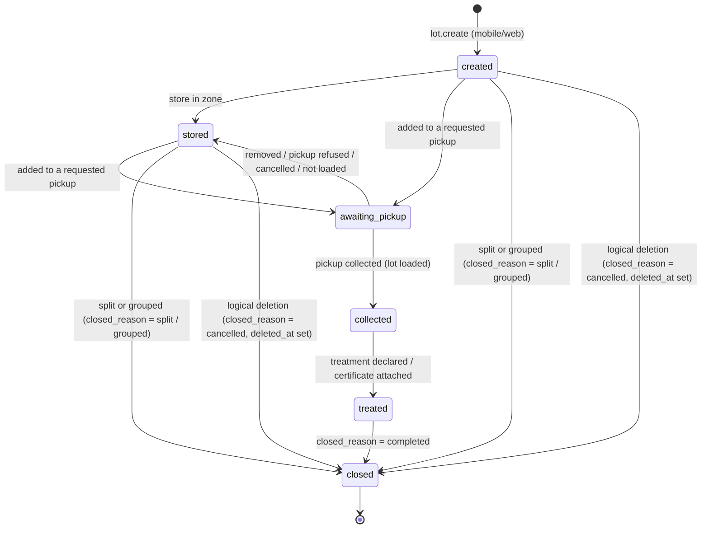

| Status (DB) | Cahier label | Counts in current stock? |
|---|---|---|
| `created` | créé | Yes |
| `stored` | stocké | Yes |
| `awaiting_pickup` | en attente d'enlèvement | Yes (physically still on site) |
| `collected` | enlevé | No |
| `treated` | traité | No |
| `closed` | clôturé | No |

- `closed_reason` ∈ {`completed`, `split`, `grouped`, `cancelled`}: **[INF]** split and grouped lots are *closed by transformation*, and logically deleted lots are *closed as cancelled*. This keeps the cahier's six statuses without adding statuses.
- **Logical deletion** (cahier §4): `deleted_at` + `deleted_by_user_id` + `deletion_reason`, **and** `status='closed'` with `closed_reason='cancelled'`, in one transaction. Moving the lot out of the stock statuses keeps the stock query index-only (§17, Q1). Allowed only while the lot is `created`/`stored`, not in an active pickup, not linked to a document, and not in a locked period. Its events remain, a `deleted` event is appended (it records the previous status), and the lot is excluded from stock and reports. **Restoration** (permission + reason) reverts to the status recorded in that event.
- Every transition goes through **one** domain service (`LotStateMachine`), which validates the transition, updates `waste_lots.status` and the matching timestamp column (`stored_at`, `collected_at`, `treated_at`, `closed_at`), increments `version` and appends a `waste_lot_events` row with `from_status`, `to_status`, `user_id`, `occurred_at` and `recorded_at`, **in the same transaction**. This satisfies M2-05.

## 6.3 QR codes, RFID and labels

- **QR payload [REC]:** `https://m.<domain>/t/{tag_value}`, where `tag_value` is a ULID generated **on the device** at lot creation (it is unique without the server, so labels can be printed offline). The URL form lets any phone camera open the PWA. The payload contains no business data.
- `lot_tags` holds the value. `UNIQUE (tag_type, tag_value)` is **global**, so a scan resolves with one index lookup (< 1 s, cahier §4 Performance). `UNIQUE (waste_lot_id, tag_type, is_active_flag)` allows one active QR per lot. Reprinting a damaged label reuses the same value. **Relabeling** revokes the old tag (`status='revoked'`, flag NULL) and adds a new one, so old labels still resolve with a "revoked tag" warning.
- **Pre-printed label rolls [REC, optional]:** the schema also supports `lot_tags` rows created in batches with `waste_lot_id NULL`, `status='unassigned'`, then assigned at scan time. This is a fallback when printing on the floor is impractical (P-19).
- **RFID (V2):** `tag_type='rfid_epc'`, `tag_value` = EPC hex. No schema change needed.
- **Label (100 × 50 mm):** QR (≈ 35 mm), lot number (or the last 8 characters of the ULID when printed offline before the number exists), waste type, site/zone, net weight, date, hazardous pictogram if relevant, company name. Server-side: dompdf + simple-qrcode. Offline: rendered by the PWA (§1.3).

## 6.4 Weighing

- `waste_lots.net_weight_kg` is the **current authoritative** weight, required at creation (M2-01).
- Every measurement is also an immutable `waste_lot_weighings` row: `weighing_type` (`initial`, `reweigh`, `pre_pickup`, `grouping`, `split`), `gross_weight_kg`, `tare_weight_kg` (default from `packaging_types.default_tare_kg`), `net_weight_kg`, `source` (`manual` MVP, `scale` V2, `computed` for derived weights), `measured_at`, user and device.
- A reweigh updates the lot's current weight and appends both a weighing and a `weighed` event. **Weights at pickup** (departure, received) live on `pickup_lots` (§8).

## 6.5 Lot movements

- Zone change within the same site → `moved` event (`from_zone_id`, `to_zone_id`); updates `waste_lots.zone_id`.
- Site change → `transferred` event (`from_site_id`, `to_site_id`, zones). **[INF]** The cahier does not mention inter-site transfers; they are allowed (central waste storage areas are common) but require `lots.move` permission on **both** sites. See P-35.

## 6.6 Grouping and splitting without destroying traceability

**Principle [REC]:** a transformation **never mutates or deletes its inputs' history**. It closes the inputs, creates **new lots** as outputs, and records the relationship in an append-only **lineage graph** (DAG). Weights of input lots are never changed by a transformation.

### Grouping (*regroupement en lot d'expédition*)

```text
Lot A (120 kg, stored) ─┐
Lot B ( 80 kg, stored) ─┼──[ waste_lot_operations #op1: type=grouping ]──▶ Lot G (300 kg, origin_type=grouping, status=stored)
Lot C (100 kg, stored) ─┘

waste_lots:          A,B,C → status=closed, closed_reason=grouped   (rows and weights unchanged)
                     G     → new lot, new QR, origin_type=grouping
waste_lot_lineage:   (A→G, 120), (B→G, 80), (C→G, 100), all with waste_lot_operation_id = op1
waste_lot_events:    A,B,C: 'grouped_into' (payload: G) + status_changed→closed
                     G    : 'created' + 'grouped_from' (payload: [A,B,C])
```

G's `net_weight_kg` is the sum of its inputs (300 kg) unless G is re-weighed. In that case a `grouping` weighing records the measured value, and the operation stores both `input_total_kg` and `output_total_kg`.

Rules **[REC]**:

- **Same company, same site, same waste type, same hazardous status** for all inputs. Mixed-type consolidation is not needed: a **pickup** already carries lots of different types to one provider (cahier §6 *Enlèvement: regroupe des lots*). Keeping G mono-type keeps tonnage-by-type reporting exact without allocation rules (P-15).
- Inputs must be `created` or `stored` and not in an active pickup.
- G's composition is the **weight-weighted average** of the inputs' compositions. Its color is the common color family, otherwise `mixed`.
- **"Ungrouping"** is a **split** of G. It produces new lots and never reopens A, B or C, because their physical labels have been superseded.

### Splitting (*scission*)

```text
Lot A (100 kg, stored) ──[ op2: type=split ]──▶ Lot A1 (60 kg, origin_type=split, new QR)
                                            └──▶ Lot A2 (40 kg, origin_type=split, new QR)

A  → status=closed, closed_reason=split
waste_lot_lineage: (A→A1, 60), (A→A2, 40)
```

Rules: at least 2 outputs. Outputs inherit type, hazardous flag, regulatory code, site and composition (editable per output, because splitting is often done *to sort* by color or composition). The sum of output weights may differ from the input: the weights measured after the split are authoritative, and the difference is recorded on the operation (`input_total_kg` vs `output_total_kg`). A difference greater than **2 % [REC]** requires a comment.

### Reading the lineage

- **Ancestors** of a lot (*"where did this bale come from?"*) and **descendants** (*"what became of lot A?"*) use `WITH RECURSIVE` over `waste_lot_lineage`, indexed on `(company_id, child_lot_id)` and `(company_id, parent_lot_id)`.
- Certificates attached to G (M5-04) are visible from A, B and C through the lineage, because traceability is navigable in both directions.

### Avoiding double counting in reports (key rule)

| Measure | Counts only | Why |
|---|---|---|
| **Waste generated** (tonnage produced, kg/piece) | Lots with `origin_type = 'created'` (excluding soft-deleted), dated by `generated_at` | Split and grouped lots are the *same matter* re-packaged. |
| **Waste disposed** (by channel, valorization rate, landfill share, economic balance) | `pickup_lots` rows of non-cancelled pickups | Only what physically leaves goes to a channel, whatever its packaging history. |
| **Current stock** | Lots in `created`/`stored`/`awaiting_pickup`, not deleted | Closed-by-transformation lots are excluded, and their outputs are counted instead. |

---

# 7. Offline mobile / synchronization design

**Cahier inputs:** M2-08 (*"L'application mobile fonctionne hors ligne et synchronise dès le retour du réseau, sans perte ni doublon"*), §5 (*Angular PWA, IndexedDB via Dexie, lecture QR par ZXing; synchronisation hors ligne sans perte ni doublon*), §4 Mobile (installable PWA on Android and iOS, large buttons for gloves, camera QR reading), §4 Performance (scan processed in < 1 s).

## 7.1 Principles **[REC]**

1. **Outbox always.** The workshop PWA writes **every** mutation to a local outbox first, whether online or offline. There is a single code path, and the online case is just an outbox that drains immediately.
2. **Client-generated identities.** Lots, weighings, operations, photos and devices get a **ULID generated on the device**. That ULID **is** the server's `ulid`. Nothing needs to be remapped except the server-assigned business number (`lot_number`) and the internal `id`, which the client never needs.
3. **Operations are intents, not row diffs.** The device sends `lot.create`, `lot.store`, `lot.move`, `lot.weigh`, `lot.split`… and the server re-validates each one against **current** server state through the same Actions as the web app.
4. **Exactly-once effect** = at-least-once delivery + idempotency key (`client_operation_id`) enforced by a unique index, inside the same transaction as the effect.
5. **History is never lost.** Facts that happened physically (a weighing, a move) are **recorded even when they conflict**. Only the *current-state projection* is subject to ordering rules.

## 7.2 Client-side IndexedDB structure (Dexie)

| Store | Primary key | Indexes | Content |
|---|---|---|---|
| `meta` | `key` | — | `deviceUlid`, `companyUlid`, `userUlid`, `tokenExpiresAt`, `lastPullCursor`, `nextSeq`, `schemaVersion`, `serverClockOffsetMs` |
| `refSites` / `refZones` | `ulid` | `siteUlid` (zones) | Sites/zones the user can act on (from `user_role_assignments`) |
| `refWasteTypes` | `ulid` | `code` | Active company waste types, with default composition, packaging and conversions |
| `refPackagingTypes`, `refMaterials`, `refColorFamilies`, `refUnits` | `code` | — | Global references |
| `lots` | `ulid` | `tagValue`, `[siteUlid+status]`, `zoneUlid`, `syncState` | **Local projection** of lots in stock for the user's sites (pulled) plus locally created ones. `serverVersion`, `lotNumber` (null until synced), `syncState` ∈ {`synced`, `pending`, `conflict`} |
| `tags` | `value` | `lotUlid` | Tag value → lot ULID, for **offline scan resolution** |
| `outbox` | `opId` (ULID) | `seq` (unique, monotonic), `status`, `entityUlid` | Pending operations (see 7.3) |
| `outboxArchive` | `opId` | `ackedAt` | Acknowledged operations kept **7 days** for diagnostics |
| `labels` | `lotUlid` | — | Label payload ready to print (QR rendered client-side) |
| `photos` | `ulid` | `lotUlid`, `uploadState` | Compressed photo blobs waiting for upload (separate from the JSON outbox) |

Dexie schema versions are migrated in place. **An app update never clears the outbox.** The service-worker update prompt is deferred while `outbox.status IN ('pending','inflight')` is not empty.

## 7.3 Synchronization queue (outbox entry)

```json
{
  "opId": "01JC2Z8M4W3V9R6T1QXK5B7N2D",
  "seq": 1842,
  "type": "lot.create",
  "entityUlid": "01JC2Z8M4V7H3K9P2RQW5X6Y8Z",
  "baseVersion": null,
  "occurredAt": "2026-10-01T07:02:11.004Z",
  "payload": {
    "site": "01HZX...", "zone": "01HZY...", "wasteType": "01HZW...",
    "packagingType": "big_bag",
    "netWeightKg": "184.500", "tareWeightKg": "1.200",
    "colorFamily": "white",
    "composition": [{"material": "CO", "pct": "80.00"}, {"material": "PES", "pct": "20.00"}],
    "tag": {"type": "qr", "value": "01JC2Z8M4V7H3K9P2RQW5X6Y8Z"}
  },
  "status": "pending",
  "attempts": 0,
  "lastError": null
}
```

- `opId`: idempotency key (ULID; contains time, sortable).
- `seq`: per-device monotonic counter (persisted in `meta.nextSeq`). It defines **causal order** for this device.
- `baseVersion`: the lot `version` the operator saw when acting. Used by conflict rules for structural operations.
- `occurredAt`: device time of the physical action (corrected by the server, §7.7).

**Operation types (MVP):** `lot.create`, `lot.store`, `lot.move`, `lot.transfer`, `lot.weigh`, `lot.update_attributes`, `lot.split`, `lot.group`, `lot.assign_tag`, `lot.label_printed`, `lot.photo_add`, `pickup.load_lot` (loading scan at collection), `pickup.unload_lot`.

## 7.4 Server-side tables

| Table | Purpose |
|---|---|
| `devices` | Registered device (ULID generated by the device), company binding, last sync, last applied `seq`, measured clock skew, revocation. |
| `sync_operations` | One row per **processed** operation: `client_operation_id` (UNIQUE), `client_sequence`, type, entity ULID, payload + SHA-256 hash, client and adjusted timestamps, status (`applied` / `rejected` / `conflict`), result JSON (returned verbatim on replay), error code. Retention 180 days; conflict rows are kept until resolved. |
| `sync_conflicts` | Conflicts that need a **human decision**, with client payload and server state, shown in the web app to the *Responsable environnement* of the site. |

Domain rows created by sync (events, weighings, operations) carry `sync_operation_id` and `device_id` for full provenance.

## 7.5 Concrete synchronization flow

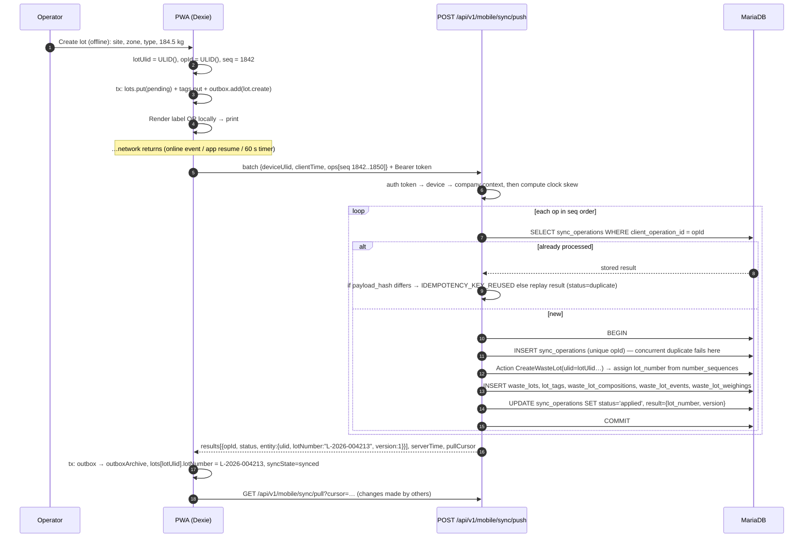

**Request:**

```http
POST /api/v1/mobile/sync/push
Authorization: Bearer <device token>
X-Device-Id: 01JBZ4…
X-Client-Time: 2026-10-01T09:15:02.120Z
Idempotency-Key: 01JC30…   (the batch id; per-op keys remain authoritative)

{ "operations": [ { "opId": "…", "seq": 1842, "type": "lot.create", … }, … ] }
```

**Response (HTTP 200 even when some operations are rejected):**

```json
{
  "serverTime": "2026-10-01T09:15:02.871Z",
  "results": [
    {"opId": "01JC2Z8M4W…", "seq": 1842, "status": "applied",
     "entity": {"type": "lot", "ulid": "01JC2Z8M4V…", "lotNumber": "L-2026-004213", "version": 1}},
    {"opId": "01JC2Z9A1B…", "seq": 1843, "status": "conflict",
     "error": {"code": "LOT_ALREADY_SPLIT", "conflictUlid": "01JC31…"}},
    {"opId": "01JC2Z9C3D…", "seq": 1844, "status": "rejected",
     "error": {"code": "DEPENDENCY_FAILED", "dependsOn": "01JC2Z9A1B…"}}
  ],
  "pullCursor": "eyJ0IjoiMjAyNi0xMC0wMVQwOToxNTowMi44NzFaIiwiaWQiOjkxMjM0fQ"
}
```

## 7.6 Idempotency, duplicates, ordering, retries

| Concern | Mechanism |
|---|---|
| **Idempotency key** | `sync_operations.client_operation_id` UNIQUE. The row is inserted **in the same transaction** as the domain effect. If the transaction commits, the key exists; if it rolls back, neither exists. |
| Replay after timeout (the server committed but the response was lost) | The next push finds the row and returns the **stored result** (`status: duplicate`, same payload as the first time). |
| Concurrent duplicate (two tabs, double tap) | The second `INSERT` hits the unique index, waits for the first transaction, then reads and returns its result. |
| Same key, different payload | `payload_hash` mismatch → `rejected` / `IDEMPOTENCY_KEY_REUSED`. This indicates a client bug and is logged to Sentry. |
| Entity-level duplicates | `waste_lots.ulid` UNIQUE, `lot_tags (tag_type, tag_value)` UNIQUE, `waste_lot_weighings.ulid` UNIQUE: even a forged op id cannot create the same lot twice. |
| **Ordering** | The server processes a batch in ascending `seq`. Ops that reference an entity created by an earlier op of the batch work naturally (same ULID). If an op fails, **later ops on the same entity** are rejected with `DEPENDENCY_FAILED`. Ops on other entities continue. |
| Gaps across batches | `devices.last_applied_sequence` is recorded. A `seq` lower than the last applied one with an unknown `opId` is accepted (out-of-order retries are harmless with idempotency). Gaps are logged for diagnostics, not blocking. |
| Transient server error (deadlock, 5xx, timeout) | The transaction rolls back, so no `sync_operations` row exists. The op stays `pending` on the device. **Retry with exponential backoff + jitter** (2 s, 4 s, 8 s … max 5 min). Triggers: app start, `online` event, `visibilitychange`, every 60 s while open. (Background Sync is not available on iOS, so no reliance on it.) |
| Permanent rejection (validation, permission) | `rejected` row stored (in a separate short transaction) so replays return the same answer. The device moves the op to `outboxArchive` with the error and shows it to the operator. |
| Batch size | ≤ 100 ops or ≤ 1 MB per request; photos are uploaded separately (`POST /mobile/photos`, multipart, idempotent on photo ULID). |
| Token expired while offline | Ops stay in the outbox. After re-login (same device ULID), sync resumes. **Nothing is ever dropped because of auth.** |
| Last-resort recovery | "Export diagnostics" in the PWA settings downloads the outbox as a JSON file that support can replay through an admin endpoint. |

## 7.7 Timestamps and device clocks

- Each op carries `occurredAt` (device clock). Each request carries `X-Client-Time`.
- The server computes `skew = serverNow − clientTime` per request and stores it on `devices.clock_skew_ms`. If |skew| > 2 minutes, `adjusted_occurred_at = occurredAt + skew`; otherwise it is kept as is. Both values are stored in `sync_operations`.
- `adjusted_occurred_at` is clamped to `≤ server now` and to `≥ lot.generated_at`.
- Events store `occurred_at` (business time, adjusted) and `recorded_at` (server time). **Timelines are ordered by `occurred_at`, then `id`.**

## 7.8 Conflict resolution policy

| Op type | Nature | Policy when server state changed since `baseVersion` |
|---|---|---|
| `lot.weigh` | Physical fact | **Always recorded** (weighing + event). The current weight is updated only if this weighing's `occurred_at` is later than the weighing that produced the current weight (*last-writer-wins by business time*). |
| `lot.move`, `lot.transfer` | Physical fact | Event always recorded. Current zone/site = the move with the latest `occurred_at`. **Rejected (conflict)** if the lot is already `collected`/`treated`/`closed`, because it is no longer on site. |
| `lot.store` and other status transitions | State change | Validated against the **current** status. If the target status is already reached → `applied` as a **no-op** (semantic idempotency, no duplicate event). If invalid (e.g. lot already collected) → `conflict`. |
| `lot.update_attributes` (composition, color, grammage) | Data edit | If `baseVersion` = current → apply. Otherwise, field-level merge: fields not changed on the server since `baseVersion` are applied, and fields changed on both sides → `conflict`. |
| `lot.split`, `lot.group` | Structural | Requires inputs in `created`/`stored`, not deleted, not in an active pickup. **First to sync wins.** The second is a `conflict` (`LOT_ALREADY_SPLIT`, `LOT_ALREADY_GROUPED`, `LOT_IN_PICKUP`). Output lots of a rejected structural op are **not created**, and the operator's printed labels for them are reported as void. |
| `lot.assign_tag` | Identity | Tag value already active on another lot → `conflict` (`TAG_ALREADY_ASSIGNED`). The lot itself stays valid without that tag and must be relabeled. |
| Any op in a **locked period** (`period_locks`) | Compliance | `conflict` (`PERIOD_LOCKED`) for review by the environment manager. |

Every `conflict` creates a `sync_conflicts` row (status `open`) with the client payload and a server-state snapshot, and notifies the site's environment manager in-app. Resolution options in the web app: **apply anyway** (when still possible), **apply adapted**, or **dismiss with comment**. Every resolution is audited.

## 7.9 Required scenarios

### Two operators modify the same lot offline

1. Lot L (v3) is in zone Z1. Operator A (device DA, offline) moves L to Z2 at 10:00. Operator B (device DB, offline) re-weighs L at 10:05 and moves it to Z3 at 10:07.
2. DB syncs first: weighing applied (v4), move to Z3 applied (v5).
3. DA syncs: its move to Z2 has `occurredAt = 10:00` < 10:07 → the `moved` event is **recorded** (history shows Z1→Z2 at 10:00, Z2→Z3 at 10:07) but the current zone stays **Z3**. Status `applied`. No conflict is raised, because physical moves are facts ordered by time.
4. If instead A had **split** L and B had **grouped** L with other lots, the first to sync wins and the other becomes a `sync_conflicts` row for a human to resolve (the physical bags must be checked).

### The same QR code is scanned twice offline

| Case | Behaviour |
|---|---|
| Same device scans the same lot twice for the same action (e.g. "store") | Locally, the second scan finds the lot already `stored` in the projection and the UI shows "already stored". No op is queued. |
| Two devices both perform "store" on the same lot offline | The second op reaches the server when the lot is already `stored` → **semantic no-op**, `applied`, no duplicate event. |
| Same device double-taps "create lot" | The UI disables the button after the first tap. If two ops are still produced, they have **different `opId` and different lot ULIDs**, so these are two genuine lots. The UI prevents this by requiring a fresh label for each creation. |
| Two devices assign the **same pre-printed label** to two different new lots offline | Both `lot.create` succeed. The second `lot.assign_tag` gets `TAG_ALREADY_ASSIGNED` → that lot is flagged *needs relabel* and a conflict is raised. **No lot is lost and no two lots share a QR.** |
| Device scans a QR it does not know (lot created on another device, not yet pulled) | The op is queued with `tagValue` instead of `entityUlid`. On sync, the server resolves the tag. If it is unknown or belongs to another company → `rejected` / `UNKNOWN_TAG` (no information leak). |

## 7.10 Pull (server → device)

`GET /api/v1/mobile/sync/pull?cursor=<opaque>` returns changes since the cursor for the device's allowed sites: reference data (sites, zones, waste types, packaging), lots in stock (upserts) and lots that left stock (tombstones). The cursor encodes `(updated_at, id)` (keyset). Initial bootstrap: `GET /api/v1/mobile/bootstrap` (paged).

**Volume check [INF]:** one site rarely has more than a few thousand lots in stock, which is a few MB in IndexedDB.

---

# 8. Pickups / collectors / recyclers

**Cahier inputs:** §2 (*Prestataire — collecteur, recycleur, transporteur — reçoit les demandes d'enlèvement, confirme, dépose les certificats*), M0-05 (provider signs up with a dedicated form and uploads accreditations as PDF, subject to validation), M4-01 (directory: contact details, accepted waste types, channel — *recyclage, réutilisation, valorisation énergétique, enfouissement* — accreditations and expiry dates), M4-02 (alert 30 days before expiry; **a provider with an expired accreditation can no longer be chosen**), M4-03 (pickup request by email + provider space; provider confirms a date or refuses), M4-04 (at pickup, lots are scanned and the provider enters the received weight; **variance flagged above 5 %**), M4-05 (sale price or disposal cost per lot; net economic balance per period), §6 *Prestataire / Agrément; Enlèvement: date prévue, date réelle, poids départ, poids reçu, prix ou coût — regroupe des lots, un prestataire*.

## 8.1 Provider model

| Concept | Table | Decision |
|---|---|---|
| Provider = company | `companies` (`company_type='provider'`) | **[CDC]** *"un prestataire est une société"*. Providers have their own users, roles (`provider_admin`, `provider_operator`) and space. |
| Provider profile | `provider_profiles` (1:1 with the provider company) | Service roles as booleans `is_collector`, `is_transporter`, `is_recycler`, `is_eliminator` (a provider can have several), service area description, public contact, `is_published` (listed in the directory only after super-admin validation). |
| Provider types | Booleans above | **[REC]** Four fixed roles derived from the cahier; booleans are simple to query. `is_eliminator` [INF] covers landfill/incineration operators, which the *enfouissement* channel implies. |
| Accepted waste types | `provider_accepted_wastes` | Expressed against **global** keys (`waste_catalog_item_id` or `waste_family_id` or `regulatory_waste_code_id`, at least one enforced by CHECK) and a `treatment_channel_id`. A provider cannot reference an industrial's private types. |
| Channels (*filières*) | `treatment_channels` (global) | `reuse`, `recycling`, `energy_recovery`, `landfill` [CDC] + `incineration`, `other_treatment` [INF, needed for hazardous waste such as oils and sludges]. Flags `is_valorization`, `is_landfill` drive the RSE KPIs. |
| Accreditations | `provider_accreditations` | Type (`accreditation_types`, per country), reference number, issuing authority, `valid_from`, `expires_on` (DATE, NOT NULL), PDF (`stored_file_id`), **super-admin review** (`review_status`: `pending`/`approved`/`rejected`/`revoked`). Renewal = a **new row** (`superseded_by_accreditation_id` on the old one), so history is kept. |
| Accreditation scope | `provider_accreditation_scopes` | Which service (`collection`, `transport`, `recycling`, `treatment`, `storage`) and which waste (family / code / hazardous allowed) an accreditation covers. **No scope rows = covers all non-hazardous waste for the provider's declared services** [REC]. |
| Expiration dates | `provider_accreditations.expires_on` | **"Expired" is computed, never stored**: `expires_on < :date`. A stored status would drift if the nightly job did not run. Notification bookkeeping columns (`notified_30d_at`, `notified_7d_at`, `notified_expired_at`) prevent duplicate alerts. |
| Industrial ↔ provider relationship | `provider_partnerships` (owned by the industrial) | M0-07 step 4 *"prestataires"*: the industrial selects providers from the directory (or invites them). `status` `active`/`suspended`/`ended`, internal reference, notes. **A pickup can only target an active partner.** |
| Inviting a provider that is not yet registered | `provider_invitations` | Email + token (hashed), 7-day expiry. On signup the provider goes through M0-05 validation, then the partnership is created automatically. |

## 8.2 Pickup model

| Table | Role |
|---|---|
| `pickups` | The *enlèvement*: industrial `company_id`, `site_id`, `provider_company_id` (receiver/collector), optional `transporter_company_id`, status, dates (requested, confirmed, collected, received, completed), totals (departure, received, variance), refusal/cancellation reasons. |
| `pickup_lots` | Lots in the pickup, with **snapshot** (lot number, type label, regulatory code, hazardous), per-lot `declared_weight_kg`, `departure_weight_kg`, `received_weight_kg`, variance, planned/actual channel, price, line status, manifest link. |
| `pickup_charges` | Pickup-level charges (transport, handling, container rental), signed amount. |
| `pickup_events` | Append-only timeline of the pickup (requested, confirmed, refused, date changed, loaded, received, variance flagged, completed…). |

### Pickup lifecycle

```mermaid
stateDiagram-v2
    [*] --> draft
    draft --> requested: industrial submits (lots → awaiting_pickup, email + provider space)
    requested --> confirmed: provider confirms a date (confirmed_date)
    requested --> refused: provider refuses (reason) → lots back to stored
    requested --> cancelled: industrial cancels → lots back to stored
    confirmed --> cancelled: industrial cancels → lots back to stored
    confirmed --> collected: loading scanned; departure weights → lots collected
    collected --> received: provider enters received weights → variance computed
    received --> completed: treatment recorded (+ certificate) and closure → lots treated → closed
    refused --> [*]
    cancelled --> [*]
    completed --> [*]
```

- **Planned date** = `requested_date` (industrial) and `confirmed_date` (provider). **Actual date** = `collected_at`.
- A refused pickup is **terminal**. The industrial re-sends to another provider with "duplicate to another provider", which creates a new pickup with `replaces_pickup_id`. This keeps a clean audit trail of refusals.
- **One active pickup per lot:** `pickup_lots.is_active_flag` (NULL-flag) + `UNIQUE (waste_lot_id, is_active_flag)`. The flag is cleared when the pickup reaches `refused`/`cancelled`/`completed`, or when the line is `not_loaded`.
- At collection, lots scanned during loading become `loaded` and their lots become `collected`. Unscanned lots become `not_loaded` and go back to `stored`.
- **Provider scanning (M4-04):** the provider resolves a QR through `GET /api/v1/provider/pickups/{pickup}/scan/{tagValue}`, which matches only `pickup_lots` of pickups addressed to that provider (snapshot data; no access to `waste_lots`, §3.5).

## 8.3 Weights and the > 5 % rule (M4-04)

- `departure_weight_kg` per line = the lot's `net_weight_kg` at loading, or re-weighed (`waste_lot_weighings.weighing_type='pre_pickup'`). `pickups.departure_weight_kg` = sum of lines, unless a weighbridge total is entered (`departure_weight_source` = `lots_sum` | `weighbridge`).
- `received_weight_kg`: entered by the provider **per line or as a pickup total** (P-16). When only a total is entered, per-line received weights are **not** invented; the variance is evaluated at pickup level.
- **Variance** (computed and **stored** at reception, so the threshold in force at that moment is frozen):
  `weight_variance_kg = received − departure`, `weight_variance_pct = 100 × (received − departure) / departure` (rounded to 2 decimals, NULL if departure = 0).
- **Flag:** `variance_flagged = 1` if `|weight_variance_pct| > threshold`. The threshold is **5.00 %** [CDC], stored as `companies.settings.weight_variance_threshold_pct` with a platform default of 5. It applies **in both directions**: losses and gains (moisture, contamination) are both suspicious (P-16).
- Flagging → `pickup_events('variance_flagged')` + notification to the environment manager. **[REC]** The pickup cannot be `completed` while a flagged variance is not **acknowledged** (`variance_acknowledged_at`, `variance_acknowledged_by_user_id`, `variance_comment`).

## 8.4 Price, cost and economic balance (M4-05)

- Per line: `pricing_mode` (`per_kg`, `per_tonne`, `flat`), `unit_price`, `net_amount` (**signed**: `+` = revenue for the industrial, `−` = cost), `currency_code`. The base weight for the price is the received weight when present, otherwise the departure weight (recorded in `price_basis`).
- Pickup-level charges: `pickup_charges.amount` (signed).
- **Net economic balance per period** = Σ `pickup_lots.net_amount` + Σ `pickup_charges.amount`, for pickups by `collected_at` in the period (live query, §10). Prices are **hidden from the provider audience** in API Resources unless the company enables sharing (P-17).

## 8.5 Where is "a provider with an expired accreditation cannot be selected" enforced? **Answer: all layers, each for a different reason.**

| Layer | What it does | Why it is needed |
|---|---|---|
| **Query filtering** | `ProviderDirectory::eligibleFor(company, wasteTypes, plannedDate)` returns only providers with: active company, published profile, active partnership, accepted waste matching each type, and **≥ 1 approved accreditation valid on the planned date** whose scope covers the service and (for hazardous waste) the code/family. The UI only offers these. | UX: users never see invalid choices. |
| **Validation (Form Request)** | `EligibleProvider` rule on `provider` and `transporter` fields. | Rejects crafted API calls with a clean 422. |
| **Domain/service layer (Action)** | `RequestPickup`, `ConfirmPickup` and `MarkPickupCollected` call `ProviderEligibility::assert()` **inside the transaction**, with `SELECT … FOR UPDATE` on the accreditation rows. | The rule must hold at **each state change**: an accreditation can expire between request (D) and collection (D+10). Collection with a provider whose accreditation expired in the meantime is **blocked** (override requires the `pickups.override_eligibility` permission + comment, audited — P-14). |
| **Scheduler** | Daily job: J-30 and J-7 alerts to the provider and to industrial partners, J0 "expired" alert; lists confirmed future pickups that the expiry now blocks. | M4-02 alert requirement; proactive. |
| **Database** | **Not enforceable**: a CHECK constraint cannot reference another table or the current date, and triggers would hide business logic. The DB guarantees only structural integrity: FKs, `expires_on NOT NULL`, CHECK `expires_on >= valid_from`. | Documented explicitly so nobody looks for it there. |
| **Tests** | Feature tests for each entry point: list, validation, action, collection-time re-check, scheduler notifications. | Business-critical regulatory rule. |

---

# 9. Documents / regulatory compliance

**Cahier inputs:** M5-01 (chronological waste register, generated automatically, exportable as PDF and Excel), M5-02 (hazardous waste tracking slip, pre-filled, **signed electronically by each party**), M5-03 (annual declaration for ANGed — Tunisia MVP; Morocco/France formats V2 as country parameters), M5-04 (recycling/destruction certificates attached to lots, **kept 10 years**), §4 Traçabilité (no physical deletion of regulatory documents), §6 *Document réglementaire: type (registre, bordereau, déclaration, certificat), période, fichier, signatures — lié à des lots ou à un enlèvement*.

## 9.1 Recommendation: generic `documents` + versions + typed detail tables + explicit link tables

| Option | Verdict |
|---|---|
| One generic `documents` table only | Not enough: manifests and declarations have structured data that must be validated, signed in stages and queried. |
| Specialized table per document type only | Duplicates file handling, versioning, retention and signatures four times. |
| Polymorphic `documentable_type/id` links | Rejected for core links: **no FK integrity and no composite tenant FK**. Lots and pickups are the only link targets the cahier mentions, so explicit links are cheap. |
| **Chosen:** `documents` (metadata, lifecycle, retention) + `document_versions` (immutable files) + `document_signatures` + **typed detail tables** where structure exists (`hazardous_waste_manifests`, `annual_declarations`) + **explicit links** (`documents.pickup_id`, `documents.site_id`, `document_waste_lots`) | One storage, retention and signature engine; structured data where needed; DB-enforced links. |

| Cahier concept | Implementation |
|---|---|
| Waste register (M5-01) | **Live read model** over `waste_lots`, `waste_lot_events` and `pickup_lots` (no copy of the data). Exports are `generated_reports` (transient). **Issuing** an official register for a period creates `documents(document_type='waste_register', period_start, period_end)` with an immutable version (PDF + Excel + `source_snapshot`) and can create a `period_locks` row. |
| Hazardous waste tracking slip (M5-02) | `hazardous_waste_manifests` (structured, one per hazardous regulatory code per pickup) + `documents(document_type='hazardous_manifest')` for the rendered versions + `document_signatures` for producer → transporter → receiver. |
| Annual declaration (M5-03) | `annual_declarations` (per site and year, `declaration_template_id` from the country) with computed `data` JSON snapshot, workflow `draft` → `in_review` → `validated` → `submitted`. Validation creates the document and a `period_locks` row for the year. |
| Recycling/destruction certificates (M5-04) | `documents(document_type IN ('recycling_certificate','destruction_certificate'))` **uploaded by the provider** (`uploaded_by_company_id`) into the industrial's space (`company_id` = industrial, `shared_with_company_id` = provider), linked to the pickup (`pickup_id`) and to lots (`document_waste_lots`). |
| Signatures | `document_signatures` (§9.3). |
| Document periods | `documents.period_start`, `period_end` (DATE). |
| Document files | `document_versions.stored_file_id` → `stored_files`. |
| Document ↔ lots | `document_waste_lots` (composite FKs). |
| Document ↔ pickup | `documents.pickup_id` (composite FK). |
| Long-term archival (10 years) | `documents.retention_until` (= issued date + 10 years, by default for all regulatory types), `legal_hold`. No physical deletion. Files of versions are stored with S3 Object Lock in compliance mode where available. Integrity: `checksum_sha256` per version, verified quarterly by a job. |
| Versions | `document_versions` (immutable, numbered). Re-generation, or correction before issuance, creates a new version. An issued document that must change is **superseded** (`status='superseded'`, `superseded_by_document_id`) by a new document. Issued content is never overwritten. |

## 9.2 Document lifecycle

`draft` → (`pending_signatures`) → `issued` → (`superseded`). Logical deletion (`deleted_at` + reason + user) is allowed only for drafts or by `documents.delete` permission with reason, and retention still applies to the stored files.

## 9.3 Electronic signatures (M5-02)

- **[REC] MVP signature method:** *authenticated click-to-sign*. The signer is logged in (2FA if enabled) and re-enters their password or confirms a one-time code sent by email. The system records `signed_at`, user, company, IP, user agent and the **SHA-256 of the exact content signed** (`signed_payload_hash`, the manifest data snapshot at that step). The final PDF embeds a signature page with this evidence.
- Signatures are **sequential** (`sequence`: producer = 1, transporter = 2, receiver = 3). Each party fills its section (e.g. the receiver enters received weight) and signs. Once a party signs, the data they signed is frozen. Later data is added in new sections, and a new document version is rendered after each signature.
- **Legal value:** a **qualified** signature (certificate issued by the Tunisian certification authority, e.g. via TunTrust/ANCE) may be required by ANGed for hazardous-waste manifests. The schema supports it (`signature_method='qualified_certificate'`), but the integration is out of MVP until confirmed (P-20).

---

# 10. Reporting / RSE

**Cahier inputs:** M6-01 (dashboard: tonnage by type, by channel, by site and per month; valorization rate; landfill share), M6-02 (kg of waste per produced piece — needs M3 *or manual entry of the number of pieces*), M6-03 (CO₂ avoided, emission factors configurable by type and channel — V2), M6-04 (RSE report export PDF/Excel with the client's logo), M6-05 (brand portal V2), M4-05 (net economic balance per period), §4 Performance (*tableaux de bord sur 3 ans de données en moins de 5 secondes*).

## 10.1 Data required

| Need | Source | Table |
|---|---|---|
| Tonnage generated by type/site/month | Lots `origin_type='created'`, by `generated_at` (in site time zone) | `waste_daily_stats.generated_kg` |
| Tonnage by channel | `pickup_lots` (actual channel, otherwise planned), weight = received, otherwise departure | `waste_daily_stats.disposed_kg` (row per channel) |
| Valorization rate | Σ disposed_kg where `treatment_channels.is_valorization=1` ÷ Σ disposed_kg | Computed from stats |
| Landfill share | Σ disposed_kg where `is_landfill=1` ÷ Σ disposed_kg | Computed from stats |
| Kg per produced piece | generated_kg ÷ pieces | `production_volumes` (MVP: manual monthly per site) |
| Economic balance | `pickup_lots.net_amount` + `pickup_charges.amount` | `waste_daily_stats.net_amount` (lot part) + live charges |
| CO₂ avoided (V2) | disposed_kg × factor(type, channel, date) | `emission_factors` (V2) + `waste_daily_stats.co2_avoided_kg` column added in V2 |
| Customer-specific reporting (V2) | Lots ↔ production orders ↔ customer brands | `waste_lot_production_links`, `production_orders`, `customer_brands` (V2) |

## 10.2 Requested concepts and decisions

| Concept | Decision |
|---|---|
| **Reporting periods** | **No table.** Periods are parameters (`period_start`/`period_end` DATE, month/quarter/year presets). Fiscal year start is a company setting. **Locked periods** are stored in `period_locks` (compliance, §9). |
| **Emission factors** (V2) | `emission_factors`: platform defaults (`company_id NULL`) by family/catalog item × channel × country, with validity dates and a source reference; company overrides (`company_id`, optionally `waste_type_id`). Resolution order: company+type → company+family → platform+item+country → platform+family+country → platform+family. **Versioned by validity dates** so historical reports stay stable. |
| **KPI definitions** | **In code, not in the DB** (`enum Kpi` + one calculator class per KPI). Storing formulas in tables means building a BI engine, which no requirement asks for. The list of KPIs is fixed by M6-01..03. |
| **Calculated metrics** | `waste_daily_stats` (pre-aggregated, see below). |
| **Report definitions / templates** | **In code** (report builder classes + Blade/dompdf templates). Per-company branding = company logo (`companies.logo_stored_file_id`, M6-04) + company name. A `report_templates` table is not needed. |
| **Generated reports** | `generated_reports` (request, parameters, status, file, expiry). These are transient exports. To keep one officially, it is **issued as a document** (§9). |

## 10.3 Dynamic vs pre-aggregated

| Data | Strategy | Reason |
|---|---|---|
| **Current stock** (site/zone/type) | **Live** query on a covering index of `waste_lots` (§17) | Must be real time (M2-07). Only in-stock lots are scanned (thousands, not millions). |
| **Dashboards over periods** (tonnage, channels, rates, kg/piece) | **Pre-aggregated** `waste_daily_stats` + Redis cache (10 min, invalidated on recompute) | 3 years for one company reads at most ~100 k small rows instead of millions of lots: well under 5 s (typically < 300 ms). |
| Economic balance | Lots part from stats, charges live (low volume) | — |
| Register, lot lists, pickup lists | Live, keyset-paginated | Detail data. |
| Annual declaration | Computed on demand from stats + detail, then **frozen** as a snapshot on validation | Regulatory immutability. |

**`waste_daily_stats` design:**

- **Grain:** `(company_id, site_id, stat_date, waste_type_id, treatment_channel_key)`, where `treatment_channel_key = IFNULL(treatment_channel_id, 0)` (generated column) and `stat_date` is the **site-local date**.
- **Measures:** `generated_kg`, `generated_lot_count`, `disposed_kg`, `disposed_lot_count`, `net_amount`. Rows with channel 0 carry generation measures; rows with a channel carry disposal measures.
- **Recompute, never increment:** domain events (`LotCreated`, `LotWeighed`, `LotDeleted`, `LotRestored`, `PickupCollected`, `PickupReceived`, `PickupLotPriced`, `PickupCancelled`…) dispatch `RecomputeDailyStats(companyId, siteId, date)`. The job is **unique per bucket for 60 s** (debounce). It deletes and re-inserts the bucket from source in one transaction (`INSERT … SELECT … GROUP BY`). It is idempotent and self-healing.
- **Nightly reconciliation** recomputes the last 7 days for every company. A **full rebuild** command exists for any range, e.g. after an emission-factor correction in V2.
- Size estimate: 500 sites × ~15 types × ~260 active days × ~1.5 channel rows ≈ 3 M rows/year platform-wide. The PK starts with `company_id`, so tenant scans stay local.

---

# 11. Production / Divatex integration

**Cahier inputs (all V2):** M3-01 (import manufacturing and cutting orders from Divatex API or CSV/Excel from other ERPs), M3-02 (link a lot of cutting scraps to a cutting order, a model and a client brand), M3-03 (theoretical waste rate from marker placement vs actual weighed rate, per order, model and client), M3-04 (waste cost per produced piece and per client), §6 *Lot … lié à un ordre de fabrication (V2)*. MVP touch point: M6-02 (manual number of pieces).

## 11.1 Integration boundary **[REC]**

| Entity | Lives in DivaWaste? | Why |
|---|---|---|
| Customer brands (*donneurs d'ordre*) | **Yes**, as `customer_brands` (V2) | Needed for per-client reporting and the brand portal. Minimal: name, code, external id, optional link to a `brand` company for portal access. |
| Product models | **Yes**, minimal `product_models` (V2) | Needed for "by model" reporting (M3-03). Code, name, brand, external id. **No** bill of materials. |
| Manufacturing / cutting orders | **Yes**, minimal `production_orders` (V2) | Needed for linking lots and computing rates: order number, type, parent order, model, brand, site, planned/produced pieces, `fabric_consumed_kg`, `theoretical_waste_rate_pct`, `fabric_cost_per_kg`, dates, status. |
| Marker/placement details, routings, fabric stock, purchasing, payroll | **No, stays in the ERP** | Not needed for waste KPIs; importing them would make DivaWaste an ERP. |
| Produced pieces per period (MVP) | `production_volumes` | Manual entry (MVP), later filled from orders (`source='production_orders'`). |

## 11.2 External IDs and imports

- **Integration-native entities** (`customer_brands`, `product_models`, `production_orders`) carry `integration_source_id` + `external_id` directly, with `UNIQUE (integration_source_id, external_id)`. They exist **because** of the integration, so direct columns are simplest and fastest for upserts.
- **DivaWaste-native entities** that an ERP may also know (sites ↔ ERP plants, waste types ↔ ERP articles) are mapped through the generic **`external_references`** table (`integration_source_id`, `entity_type`, `entity_id`, `external_id`). This avoids adding ERP-specific columns to core tables.
- **`integration_sources`** (per company): `divatex_api`, `csv`, `excel`, `erp_api`, with encrypted credentials and configuration.
- **`import_batches`** + **`import_batch_errors`**: every import (API pull or file) is a batch with counts, status, source file, error report file and per-row errors. Imports are idempotent upserts on `(integration_source_id, external_id)`.
- **Lot ↔ order link:** **`waste_lot_production_links`** (lot, order, `allocated_kg` or `allocation_pct`). It is many-to-many because one bin of cutting scraps is often filled by several orders. **No column is added to `waste_lots`** for V2, so the 5 M-row table needs no migration.

## 11.3 What V1 includes to be integration-ready (and nothing more)

- `production_volumes` (MVP requirement M6-02).
- ULIDs and server-assigned numbers on lots (stable references for external systems).
- Lot model unchanged by V2 (links in a side table).
- `/api/v1` versioning and OpenAPI generation from sprint 1.
- **Not in V1:** `integration_sources`, `import_batches`, `production_orders` and the rest of §11.2 tables (all V2). P-30 discusses pulling `import_batches` forward for onboarding imports.

---

# 12. Audit log

**Cahier inputs:** M7-02 (*journal d'audit de toutes les créations, modifications et suppressions, consultable par l'administrateur client*), §6 *Journal d'audit: utilisateur, action, objet, anciennes et nouvelles valeurs, date, IP — toutes les entités*.

## 12.1 Table design (`audit_logs`, full schema in §15)

| Concern | Decision |
|---|---|
| Old/new values: **JSON vs normalized** | **JSON** (`old_values`, `new_values`) containing **only changed attributes** (dirty set). A normalized `audit_log_changes(field, old, new)` table would multiply rows by about 5 and add nothing, because audit is read per entity or per user, never queried by field value at scale. Values are stored **raw** (ids, codes, enum values). The UI resolves labels at display time. |
| Actor identification | `actor_type` (`user`, `system`, `api_client`, `scheduler`), `actor_user_id`, `actor_company_id` (the company acting, e.g. a provider changing a pickup it shares), `impersonator_user_id` (platform staff acting through `runAs`, §3.10). |
| Tenant identification | `company_id` = **owner tenant of the audited row** (NULL for global/platform objects). Audit screens for the client admin filter by `company_id`. Actions by a provider on an industrial's pickup appear in the industrial's log **and** are attributed to the provider (`actor_company_id`). |
| Entity identification | `auditable_type` (morph-map alias, e.g. `waste_lot`, never a PHP class name), `auditable_id` (BIGINT), `auditable_ulid` (for the UI / API). Optional `parent_type`/`parent_id` (e.g. a `pickup_lot` row → its pickup) so an entity's history includes its children. |
| Action | `event` VARCHAR(40): `created`, `updated`, `deleted` (logical), `restored`, `status_changed`, `exported`, `downloaded`, `signed`, `login_as`, `platform_access`, `permission_changed`… |
| Request/correlation ID | `request_id` VARCHAR(64). The server generates a ULID per request, or accepts a well-formed incoming `X-Request-Id`. It is propagated through Laravel `Context` into jobs, logs and Sentry, and is echoed in API error responses. |
| IP / user agent | `ip_address VARCHAR(45)` (real IP restored from Cloudflare), `user_agent VARCHAR(512)`. |
| API source | `source` ENUM: `web`, `mobile`, `provider_portal`, `api`, `sync`, `system`, `console`. Plus `device_id` for mobile/sync. |
| Integrity | Append-only. The application DB user has **INSERT/SELECT only** on `audit_logs` (enforced with a dedicated MariaDB grant, see §23). **No foreign keys**, so audit rows survive anything and the table can be partitioned. |
| Volume & partitioning | Large (tens of millions of rows). **`PARTITION BY RANGE (YEAR(created_at))`** from day one, PK `(id, created_at)`. Old partitions can be exported to object storage and dropped after retention (P-25: 10 years recommended for regulatory objects). Partitioning a big table later is painful, which is why it is done now. |

## 12.2 Automatic auditing strategy in Laravel **[REC]**

1. **`Auditable` trait** on every business model. It hooks Eloquent `created`, `updated`, `deleted`, `restored`, computes the dirty diff (excluding `$auditExclude`: `password`, `remember_token`, `two_factor_*`, `token`, `updated_at`), and inserts an `audit_logs` row **synchronously in the same DB transaction** (an `afterCommit` audit can be lost on crash, and an audit row must not exist for rolled-back changes).
2. **Domain events with meaning** (status changes, signatures, exports, downloads of regulatory documents) write explicit audit entries through `AuditLogger::record()`, so the log reads as business actions, not only column diffs.
3. **Bulk operations** (Eloquent events do not fire): only through `Persistence\Bulk` writers that write one audit row per affected record, or one summarized row with the list of ids when there are more than 500 (§3.10).
4. **Pivot changes** (`role_has_permissions`, `user_role_assignments`, `document_waste_lots`) are audited by the Actions that perform them, because `attach`/`detach` do not fire model events.
5. **Not audited row-by-row** (they are history themselves): `waste_lot_events`, `waste_lot_weighings`, `waste_lot_lineage`, `pickup_events`, `sync_operations`, `waste_daily_stats`, `notifications`, `notification_logs`, `authentication_logs`, `audit_logs`.

## 12.3 Soft-deleted records

- Logical deletion is an **`updated` + `deleted` audit pair**: `old_values` holds the full row snapshot (not just the diff), `new_values` holds `{deleted_at, deleted_by_user_id, deletion_reason}`. A full snapshot is used because the row disappears from normal views and the audit becomes its readable trace.
- `restored` events are audited the same way. Restoration is allowed only for `waste_lots`/`documents` deleted by mistake, with a permission and a reason.
- Physical purges (technical tables only, §4.5) are **not** audited row-by-row. A summary entry (`event='purged'`, count, table, retention rule) is written by the purge job.
- **GDPR anonymization** of a user rewrites personal fields in `users` and replaces actor display data. `audit_logs` keeps `actor_user_id` (a pseudonymous id), so the trail stays consistent (P-24).

---

# 13. Notifications

**Cahier inputs:** M7-01 (email + in-app MVP; WhatsApp optional V2), M0-06 (applicant notified by email of approval, rejection or suspension), M0-08 (invitation email), M4-02 (accreditation alert 30 days before expiry), M4-03 (pickup request by email + provider space), M4-04 (variance flagged), M2-07 (capacity alert), M0-11/M7-04 (invoices).

## 13.1 Architecture

```text
Domain event (after commit) ─▶ Listener ─▶ resolves recipients (AccessResolver: who has permission X on site S)
                                        └▶ Notification class ─▶ channels per (type, user preference)
                                                                   ├─ mail      (queue: notifications)
                                                                   ├─ database  (in-app, table `notifications`, company_id set)
                                                                   └─ whatsapp  (V2, custom channel)
Every send attempt is logged in `notification_logs`.
```

- **All notifications are queued** (`ShouldQueue`, queue `notifications`, `afterCommit`). The only exception is the **in-app `database` channel for the acting user's own feedback**, which is cheap but still queued for uniformity. Mail never runs in the request, so SMTP latency never blocks the API.
- **Recipient resolution by permission, not by role name:** e.g. *pickup confirmed* → users with `pickups.view` on the pickup's site who have the notification enabled. Renaming or customizing roles therefore never breaks notifications.
- **Preferences** (`notification_preferences`): per user × company × notification type × channel. **Mandatory notifications** (security, invitation, account approval, invoices) cannot be disabled. WhatsApp (V2) requires an explicit opt-in.
- **In-app:** Laravel `notifications` table with an added `company_id` column, so a user who belongs to two companies sees each company's notifications in the right context. Polled every 60 s by the SPA (MVP); WebSockets are not needed.
- **Localization:** rendered in the recipient's `users.locale`. Mail templates are Blade with Laravel lang files [CDC §5 *fichiers de langue Laravel côté API*].
- **Delivery log** (`notification_logs`): channel, recipient, status (`queued`, `sent`, `failed`, `bounced` via provider webhook), provider message id, related object. This proves *"the pickup request was sent to the provider on date X"*.

## 13.2 Catalog (MVP)

| Notification type (code) | Trigger | Recipients | Channels |
|---|---|---|---|
| `account.verify_email` | Signup | Applicant | mail (mandatory) |
| `account.approved` / `account.rejected` / `account.suspended` | Super-admin decision (M0-06) | Company admins | mail (mandatory) + in-app |
| `account.pending_approval` | New company verified | Platform staff | mail + in-app |
| `user.invitation` | Invitation sent/resent (M0-08) | Invitee | mail (mandatory) |
| `user.locked` | 5 failed logins (M0-09) | User | mail (mandatory) |
| `provider.accreditation_submitted` | Provider uploads accreditation | Platform staff | in-app + mail |
| `provider.accreditation_expiring` | J-30, J-7 (M4-02) | Provider admins + environment managers of partner industrials | mail + in-app |
| `provider.accreditation_expired` | J0 | Same | mail + in-app |
| `pickup.requested` | Pickup submitted (M4-03) | Provider users with `provider.pickups.respond` | mail (mandatory) + in-app |
| `pickup.confirmed` / `pickup.refused` / `pickup.date_changed` | Provider response | Industrial users with `pickups.view` on site | mail + in-app |
| `pickup.weight_variance` | Variance > 5 % (M4-04) | Environment managers of site | mail + in-app |
| `pickup.certificate_uploaded` | Provider uploads certificate | Environment managers of site | in-app |
| `manifest.signature_requested` | Manifest awaiting a party's signature | Next signer's company users | mail + in-app |
| `stock.capacity_alert` | Threshold exceeded (M2-07) | Environment managers of site | mail + in-app |
| `sync.conflict` | Offline conflict needs a decision | Environment managers of site | in-app |
| `report.ready` / `report.failed` | Async report done | Requester | in-app (+ mail for long reports) |
| `subscription.trial_ending` | J-7, J-1 | Company admins | mail (mandatory) + in-app |
| `subscription.expired` / `subscription.suspended` | Status change | Company admins | mail (mandatory) |
| `invoice.issued` / `invoice.overdue` / `payment.validated` / `payment.rejected` | Billing (M7-04) | Company admins (+ billing contact email) | mail (mandatory) + in-app |
| `system.alert` | Platform incidents (failed backup, queue backlog) | Platform staff | mail (+ external alerting) |

---

# 14. Complete table inventory

**108 tables:** 89 in MVP (including 6 framework/package technical tables) + 19 V2.
Scope codes: **G** = global reference · **S** = global system/identity · **T** = tenant · **TP** = tenant, party-shared · **TD** = tenant, published directory · **M** = mixed (NULL = global) · **R** = tenant root.

| # | Table | Domain | Global/Tenant | Purpose | MVP/V2 | Main FK dependencies |
|---|---|---|---|---|---|---|
| 1 | `countries` | Platform reference | G | Country parameters (currency, tax-ID format, waste-code system, authority) | MVP | `currencies` |
| 2 | `currencies` | Platform reference | G | ISO 4217 currencies with minor units (TND = 3) | MVP | — |
| 3 | `tax_rates` | Platform reference | G | VAT and stamp duty per country with validity | MVP | `countries`, `currencies` |
| 4 | `textile_activities` | Platform reference | G | Textile activities (filature, tissage, teinture, confection…) | MVP | — |
| 5 | `legal_documents` | Platform reference | G | Versioned terms / privacy policy texts | MVP | — |
| 6 | `zone_types` | Platform reference | G | Zone type vocabulary | MVP | — |
| 7 | `packaging_types` | Platform reference | G | Sac, balle, big-bag, fût… with default tare | MVP | — |
| 8 | `units` | Platform reference | G | kg, t, m³, l, piece | MVP | — |
| 9 | `waste_families` | Waste reference | G | Waste families | MVP | — |
| 10 | `materials` | Waste reference | G | Textile fibres/materials for composition | MVP | — |
| 11 | `color_families` | Waste reference | G | Color families | MVP | — |
| 12 | `regulatory_waste_codes` | Waste reference | G | Regulatory waste nomenclatures (EU LoW, TN, MA) | MVP | self (`parent_id`) |
| 13 | `waste_catalog_items` | Waste reference | G | Platform waste catalog (M1-02/03) | MVP | `waste_families`, `units`, `packaging_types`, `treatment_channels` |
| 14 | `waste_catalog_item_regulatory_codes` | Waste reference | G | Catalog item → regulatory code per country | MVP | `waste_catalog_items`, `countries`, `regulatory_waste_codes` |
| 15 | `treatment_channels` | Waste reference | G | Recovery/disposal channels (filières) | MVP | — |
| 16 | `accreditation_types` | Providers reference | G | Accreditation types per country | MVP | `countries` |
| 17 | `declaration_templates` | Compliance reference | G | Annual declaration formats per country (ANGed…) | MVP | `countries` |
| 18 | `subscription_plans` | Billing reference | G | Plans (trial, per site, per volume, hybrid) | MVP | — |
| 19 | `subscription_plan_prices` | Billing reference | G | Price components and tiers per plan/currency | MVP | `subscription_plans`, `currencies` |
| 20 | `invoice_number_sequences` | Billing system | S | Gapless invoice numbering | MVP | — |
| 21 | `users` | Identity | S | Global user identity, credentials, 2FA, lock | MVP | `companies` (`last_company_id`, added later) |
| 22 | `password_reset_tokens` | Identity (framework) | S | Laravel password reset | MVP | — |
| 23 | `personal_access_tokens` | Identity (framework+) | S | Sanctum tokens (device/API), bound to company | MVP | `companies`, `devices` |
| 24 | `legal_acceptances` | Identity | S | Timestamped acceptance of terms/privacy versions | MVP | `users`, `legal_documents`, `companies` |
| 25 | `authentication_logs` | Identity / security | S | Login/2FA/lockout events | MVP | — (no FK, log) |
| 26 | `permissions` | RBAC (Spatie) | G | Permission catalog with scope level | MVP | — |
| 27 | `roles` | RBAC (Spatie+) | M | System roles (NULL company) and company custom roles | MVP | `companies` |
| 28 | `role_has_permissions` | RBAC (Spatie) | G (guarded via role) | Role × permission matrix | MVP | `roles`, `permissions` |
| 29 | `model_has_roles` | RBAC (Spatie) | S | Platform staff roles only | MVP | `roles` |
| 30 | `model_has_permissions` | RBAC (Spatie, framework) | S | Required by package; direct permissions forbidden | MVP | `permissions` |
| 31 | `companies` | Tenancy | R | Tenant root: industrial / provider / brand | MVP | `countries`, `currencies`, `users`, `stored_files` (logo, added later) |
| 32 | `company_textile_activities` | Tenancy | T | Company ↔ activities | MVP | `companies`, `textile_activities` |
| 33 | `company_users` | Tenancy / identity | T | Membership of a user in a company | MVP | `companies`, `users` |
| 34 | `user_role_assignments` | RBAC | T | User × role × site (NULL = all sites) | MVP | `company_users`, `roles`, `sites` |
| 35 | `user_invitations` | Identity | T | Email invitations with role, 7-day expiry | MVP | `companies`, `roles`, `users` |
| 36 | `user_invitation_sites` | Identity | T | Sites targeted by an invitation | MVP | `user_invitations`, `sites` |
| 37 | `company_subscriptions` | Billing | T | Subscription periods (history) | MVP | `companies`, `subscription_plans` |
| 38 | `subscription_events` | Billing | T | Subscription lifecycle events | MVP | `company_subscriptions`, `subscription_plans`, `users` |
| 39 | `subscription_usage_records` | Billing | T | Measured usage (active sites, tonnes) per period | MVP | `company_subscriptions` |
| 40 | `invoices` | Billing | T | Customer invoices / credit notes | MVP | `companies`, `company_subscriptions`, `currencies`, `stored_files` |
| 41 | `invoice_items` | Billing | T | Invoice lines | MVP | `invoices`, `tax_rates`, `subscription_plan_prices`, `subscription_usage_records` |
| 42 | `payments` | Billing | T | Transfers (MVP) / card payments (V2) | MVP | `invoices`, `stored_files`, `users` |
| 43 | `sites` | Sites | T | Company sites | MVP | `companies`, `countries` |
| 44 | `zones` | Sites | T | Zones within sites | MVP | `sites`, `zone_types` |
| 45 | `stock_thresholds` | Sites | T | Storage limits per site/zone/type | MVP | `sites`, `zones`, `waste_types` |
| 46 | `stock_alerts` | Sites | T | Open/resolved capacity alerts | MVP | `sites`, `zones`, `waste_types`, `stock_thresholds` |
| 47 | `waste_types` | Waste reference | T | Company waste types (activated or custom) | MVP | `waste_catalog_items`, `waste_families`, `regulatory_waste_codes`, `units`, `packaging_types`, `color_families`, `treatment_channels` |
| 48 | `waste_type_compositions` | Waste reference | T | Default composition of a type | MVP | `waste_types`, `materials` |
| 49 | `waste_type_unit_conversions` | Waste reference | T | kg per unit (m³, piece, l) per type | MVP | `waste_types`, `units` |
| 50 | `stored_files` | Files | M | Registry of every stored object | MVP | `companies`, `users` |
| 51 | `number_sequences` | Shared technical | T | Per-company business numbering (lots, pickups…) | MVP | `companies` |
| 52 | `waste_lots` | Traceability | T | Waste lots (current state) | MVP | `sites`, `zones`, `waste_types`, `packaging_types`, `units`, `color_families`, `regulatory_waste_codes`, `users`, `devices` |
| 53 | `waste_lot_compositions` | Traceability | T | Actual composition of a lot | MVP | `waste_lots`, `materials` |
| 54 | `lot_tags` | Traceability | T | QR / RFID identifiers | MVP | `waste_lots`, `users` |
| 55 | `waste_lot_events` | Traceability | T | Append-only lot timeline (status history, moves…) | MVP | `waste_lots`, `zones`, `sites`, `pickups`, `waste_lot_operations`, `users`, `devices`, `sync_operations` |
| 56 | `waste_lot_weighings` | Traceability | T | Immutable weight measurements | MVP | `waste_lots`, `users`, `devices`, `sync_operations` |
| 57 | `waste_lot_operations` | Traceability | T | Split/grouping transformations | MVP | `sites`, `users`, `devices`, `sync_operations` |
| 58 | `waste_lot_lineage` | Traceability | T | Parent → child lot edges | MVP | `waste_lot_operations`, `waste_lots` |
| 59 | `waste_lot_photos` | Traceability | T | Lot photos | MVP | `waste_lots`, `stored_files`, `users`, `devices` |
| 60 | `devices` | Sync | T | Registered mobile devices | MVP | `companies`, `users` |
| 61 | `sync_operations` | Sync | T | Processed offline operations (idempotency) | MVP | `devices`, `users` |
| 62 | `sync_conflicts` | Sync | T | Conflicts awaiting human decision | MVP | `sync_operations`, `waste_lots`, `users` |
| 63 | `api_idempotency_keys` | API technical | T | Idempotency for online unsafe requests | MVP | `users` |
| 64 | `provider_profiles` | Providers | TD | Provider service profile | MVP | `companies` |
| 65 | `provider_accepted_wastes` | Providers | TD | Accepted wastes × channel | MVP | `companies`, `waste_families`, `waste_catalog_items`, `regulatory_waste_codes`, `treatment_channels` |
| 66 | `provider_accreditations` | Providers | TD | Accreditations (agréments) with expiry and review | MVP | `companies`, `accreditation_types`, `stored_files`, `users` |
| 67 | `provider_accreditation_scopes` | Providers | TD | What an accreditation covers | MVP | `provider_accreditations`, `waste_families`, `regulatory_waste_codes` |
| 68 | `provider_partnerships` | Providers | T | Industrial ↔ provider relationship | MVP | `companies` ×2, `users` |
| 69 | `provider_invitations` | Providers | T | Invitations to unregistered providers | MVP | `companies` ×2, `users` |
| 70 | `pickups` | Pickups | TP | Pickup requests (enlèvements) | MVP | `companies` ×3, `sites`, `users`, `currencies`, self |
| 71 | `pickup_lots` | Pickups | TP | Lots in a pickup, weights, channel, price | MVP | `pickups`, `waste_lots`, `regulatory_waste_codes`, `treatment_channels`, `hazardous_waste_manifests`, `users` |
| 72 | `pickup_charges` | Pickups | T | Pickup-level charges | MVP | `pickups`, `users` |
| 73 | `pickup_events` | Pickups | TP | Pickup timeline | MVP | `pickups`, `users`, `companies` |
| 74 | `documents` | Compliance | TP | Regulatory & business documents | MVP | `companies` ×3, `sites`, `pickups`, `users`, self |
| 75 | `document_versions` | Compliance | T | Immutable document files | MVP | `documents`, `stored_files`, `users` |
| 76 | `document_waste_lots` | Compliance | T | Document ↔ lots | MVP | `documents`, `waste_lots` |
| 77 | `document_signatures` | Compliance | TP | Signatures per party | MVP | `documents`, `document_versions`, `companies`, `users`, `stored_files` |
| 78 | `hazardous_waste_manifests` | Compliance | TP | Bordereau de suivi des déchets dangereux | MVP | `pickups`, `sites`, `documents`, `regulatory_waste_codes`, `waste_types`, `packaging_types`, `treatment_channels`, `companies` ×2 |
| 79 | `annual_declarations` | Compliance | T | Annual regulatory declarations | MVP | `sites`, `declaration_templates`, `documents`, `users` |
| 80 | `period_locks` | Compliance | T | Locked periods (no retroactive edits) | MVP | `sites`, `users` |
| 81 | `production_volumes` | Reporting | T | Pieces produced per site and month | MVP | `sites`, `users` |
| 82 | `waste_daily_stats` | Reporting | T | Pre-aggregated daily facts | MVP | `sites`, `waste_types`, `treatment_channels` |
| 83 | `generated_reports` | Reporting | T | Async exports/reports | MVP | `users`, `stored_files` |
| 84 | `notifications` | Notifications (framework+) | M | In-app notifications (+ `company_id`) | MVP | — (morph) |
| 85 | `notification_preferences` | Notifications | T | Per-user channel preferences | MVP | `users` |
| 86 | `notification_logs` | Notifications | M | Delivery log | MVP | — (log) |
| 87 | `audit_logs` | Audit | M | Audit trail (partitioned) | MVP | — (no FK by design) |
| 88 | `failed_jobs` | Framework | S | Failed queue jobs | MVP | — |
| 89 | `job_batches` | Framework | S | Laravel job batches | MVP | — |
| 90 | `emission_factors` | Reporting | M | CO₂ factors by type × channel | V2 | `companies`, `countries`, `waste_families`, `waste_catalog_items`, `waste_types`, `treatment_channels` |
| 91 | `integration_sources` | Integrations | T | ERP/Divatex/CSV sources per company | V2 | `companies` |
| 92 | `import_batches` | Integrations | T | Import runs | V2 | `integration_sources`, `stored_files`, `users` |
| 93 | `import_batch_errors` | Integrations | T | Row-level import errors | V2 | `import_batches` |
| 94 | `external_references` | Integrations | T | Native entity ↔ external id mapping | V2 | `integration_sources` |
| 95 | `api_clients` | Integrations | T | API key holders (M7-03) | V2 | `companies`, `users` |
| 96 | `customer_brands` | Production | T | Brands / donneurs d'ordre | V2 | `companies` ×2, `integration_sources` |
| 97 | `product_models` | Production | T | Garment models | V2 | `customer_brands`, `integration_sources` |
| 98 | `production_orders` | Production | T | Manufacturing/cutting orders | V2 | `sites`, `product_models`, `customer_brands`, `integration_sources`, `import_batches`, self |
| 99 | `waste_lot_production_links` | Production | T | Lot ↔ order allocation | V2 | `waste_lots`, `production_orders`, `users` |
| 100 | `brand_access_grants` | Production / portal | T | Brand portal access grants (M6-05) | V2 | `companies` ×2, `customer_brands`, `users` |
| 101 | `scale_devices` | IoT | T | Connected scales (M2-04 V2) | V2 | `sites` |
| 102 | `marketplace_listings` | Marketplace | T | Sorted lots offered (M4-06) | V2 | `sites`, `waste_types` |
| 103 | `marketplace_listing_lots` | Marketplace | T | Lots in a listing | V2 | `marketplace_listings`, `waste_lots` |
| 104 | `marketplace_offers` | Marketplace | TP | Recycler offers | V2 | `marketplace_listings`, `companies` |
| 105 | `payment_webhook_events` | Billing | S | Idempotent payment-provider webhooks | V2 | — |
| 106 | `sso_connections` | Identity | T | SAML / OIDC connections per company (M0-12) | V2 | `companies` |
| 107 | `user_sso_identities` | Identity | S | User ↔ IdP subject | V2 | `users`, `sso_connections` |
| 108 | `phone_verifications` | Identity | S | SMS/WhatsApp phone codes (M0-02 V2) | V2 | `users` |

**Tables deliberately *not* created** (and why):

- `sessions`, `cache`, `cache_locks`, `jobs`: Redis is used for sessions, cache, locks and queues.
- `site_users`: derived from `user_role_assignments`.
- `waste_lot_status_history`: merged into `waste_lot_events`.
- `reporting_periods`, `kpi_definitions`, `report_templates`: code, not data (§10.2).
- `waste_categories`: merged into families.
- `company_profiles`: on `companies`.
- `site_types`: enum column.

---

# 15. Full schema for each table

Notation:

- `NOT NULL` / `NULL`, then the default, then a comment after `—`.
- `created_at`/`updated_at` are `DATETIME NOT NULL` (UTC, set by Eloquent) unless stated otherwise.
- "Composite FK" means `(company_id, x_id) → x(company_id, id)` (§4.6).
- Every TENANT table that is referenced by another tenant table has `uq_<table>_company_id_id (company_id, id)`. It is listed explicitly.
- Every table is InnoDB / utf8mb4.

## 15.1 Platform & reference data (global)

```text
TABLE: currencies

Purpose: ISO 4217 currencies used for prices, invoices and economic balances.
Scope: GLOBAL
Primary key: code (natural key — the only table without a surrogate id; a 3-letter ISO code never changes)
Business key: code

Columns:
- code             CHAR(3)       NOT NULL   PK — 'TND', 'MAD', 'EUR'
- name             JSON          NOT NULL   — {"fr":"Dinar tunisien",…}
- minor_unit       TINYINT UNSIGNED NOT NULL — 3 for TND, 2 for MAD/EUR
- symbol           VARCHAR(8)    NOT NULL
- is_active        TINYINT(1)    NOT NULL DEFAULT 1
- created_at, updated_at

Foreign Keys: —
Unique Constraints: PK
Indexes: —
Soft Deletes: NO
Audit: YES
Notes: Seeded. Amount rounding in the domain layer uses minor_unit.
```

```text
TABLE: countries

Purpose: Country parameters managed by the super-admin ("paramètres pays", cahier §2): currency, locale, tax-ID format, waste-code system, regulatory authority.
Scope: GLOBAL
Business key: iso2

Columns:
- id                        BIGINT UNSIGNED NOT NULL PK AUTO_INCREMENT
- iso2                      CHAR(2)       NOT NULL — 'TN','MA','FR','BE'
- iso3                      CHAR(3)       NOT NULL
- name                      JSON          NOT NULL
- currency_code             CHAR(3)       NOT NULL — default currency
- default_locale            VARCHAR(5)    NOT NULL DEFAULT 'fr'
- default_timezone          VARCHAR(64)   NOT NULL — 'Africa/Tunis', 'Europe/Paris'
- phone_prefix              VARCHAR(6)    NOT NULL — '+216'
- tax_id_label              JSON          NOT NULL — {"fr":"Matricule fiscal"} / ICE / SIREN / N° BCE
- tax_id_pattern            VARCHAR(191)  NULL — regex for validation
- waste_code_system         VARCHAR(20)   NOT NULL — 'TN', 'MA', 'EU_LOW'
- regulatory_authority_name VARCHAR(100)  NULL — 'ANGed' for TN
- is_signup_enabled         TINYINT(1)    NOT NULL DEFAULT 0 — TN enabled at launch
- is_active                 TINYINT(1)    NOT NULL DEFAULT 1
- created_at, updated_at

Foreign Keys:
- fk_countries_currency_code: currency_code → currencies(code)
Unique Constraints:
- uq_countries_iso2 (iso2), uq_countries_iso3 (iso3)
Indexes: —
Soft Deletes: NO (is_active)
Audit: YES
Notes: Seeded with TN (active), MA, FR, BE (signup disabled until regulatory parameters exist).
```

```text
TABLE: tax_rates

Purpose: Tax rules for subscription invoicing per country (M7-04 "TVA selon le pays"), including fixed duties (Tunisian timbre fiscal).
Scope: GLOBAL

Columns:
- id              BIGINT UNSIGNED NOT NULL PK
- country_id      BIGINT UNSIGNED NOT NULL
- tax_type        ENUM('vat','stamp_duty','withholding') NOT NULL
- code            VARCHAR(30)   NOT NULL — 'TN_VAT_STD', 'TN_STAMP'
- name            JSON          NOT NULL
- rate_pct        DECIMAL(6,3)  NULL — percentage taxes
- fixed_amount    DECIMAL(15,3) NULL — fixed duties
- currency_code   CHAR(3)       NULL — required when fixed_amount is set
- applies_to      VARCHAR(30)   NOT NULL DEFAULT 'subscription'
- valid_from      DATE          NOT NULL
- valid_to        DATE          NULL
- is_active       TINYINT(1)    NOT NULL DEFAULT 1
- created_at, updated_at

Foreign Keys:
- fk_tax_rates_country: country_id → countries(id)
- fk_tax_rates_currency: currency_code → currencies(code)
Unique Constraints:
- uq_tax_rates_code_valid_from (code, valid_from)
Indexes:
- ix_tax_rates_country_type (country_id, tax_type, valid_from)
Checks:
- chk_tax_rates_value: rate_pct IS NOT NULL OR fixed_amount IS NOT NULL
Soft Deletes: NO
Audit: YES
Notes: Rates are never edited in place once used; a new row with valid_from is added. Invoice lines snapshot the rate.
```

```text
TABLE: textile_activities

Purpose: Vocabulary of textile activities (M0-01: filature, tissage, teinture, confection…).
Scope: GLOBAL

Columns:
- id          BIGINT UNSIGNED NOT NULL PK
- code        VARCHAR(40)  NOT NULL — 'spinning','weaving','knitting','dyeing','finishing','garment_making','washing','printing','other'
- name        JSON         NOT NULL
- sort_order  SMALLINT UNSIGNED NOT NULL DEFAULT 0
- is_active   TINYINT(1)   NOT NULL DEFAULT 1
- created_at, updated_at

Unique Constraints: uq_textile_activities_code (code)
Soft Deletes: NO
Audit: YES
```

```text
TABLE: legal_documents

Purpose: Versioned CGU / privacy policy / DPA texts that users accept (M0-10).
Scope: GLOBAL

Columns:
- id              BIGINT UNSIGNED NOT NULL PK
- document_type   ENUM('terms','privacy','dpa','provider_terms') NOT NULL
- version         VARCHAR(20)  NOT NULL — '2026-10'
- locale          VARCHAR(5)   NOT NULL
- title           VARCHAR(191) NOT NULL
- content_html    MEDIUMTEXT   NOT NULL — sanitized HTML
- content_sha256  CHAR(64)     NOT NULL — proves what was accepted
- published_at    DATETIME     NULL
- requires_reacceptance TINYINT(1) NOT NULL DEFAULT 1
- created_at, updated_at

Unique Constraints:
- uq_legal_documents_type_version_locale (document_type, version, locale)
Indexes:
- ix_legal_documents_type_published (document_type, locale, published_at)
Soft Deletes: NO (never deleted once published)
Audit: YES
Notes: The current version = latest published_at per (type, locale). Published rows are immutable.
```

```text
TABLE: zone_types

Purpose: Zone type vocabulary (M1-01). Global reference table (decision in §5.C).
Scope: GLOBAL

Columns:
- id                BIGINT UNSIGNED NOT NULL PK
- code              VARCHAR(40)  NOT NULL — 'cutting','sewing','dyeing','finishing','warehouse','waste_storage','spinning','weaving','knitting','other'
- name              JSON         NOT NULL
- is_waste_storage  TINYINT(1)   NOT NULL DEFAULT 0
- sort_order        SMALLINT UNSIGNED NOT NULL DEFAULT 0
- is_active         TINYINT(1)   NOT NULL DEFAULT 1
- created_at, updated_at

Unique Constraints: uq_zone_types_code (code)
Soft Deletes: NO (is_active)
Audit: YES
```

```text
TABLE: packaging_types

Purpose: Lot packaging (M2-01: sac, balle, big-bag, fût) with default tare.
Scope: GLOBAL

Columns:
- id               BIGINT UNSIGNED NOT NULL PK
- code             VARCHAR(40)  NOT NULL — 'bag','bale','big_bag','drum','box','pallet','container','bulk'
- name             JSON         NOT NULL
- default_tare_kg  DECIMAL(12,3) NULL
- sort_order       SMALLINT UNSIGNED NOT NULL DEFAULT 0
- is_active        TINYINT(1)   NOT NULL DEFAULT 1
- created_at, updated_at

Unique Constraints: uq_packaging_types_code (code)
Soft Deletes: NO
Audit: YES
```

```text
TABLE: units

Purpose: Units of measure (M1-05). Same-dimension conversion via factor_to_base.
Scope: GLOBAL

Columns:
- id              BIGINT UNSIGNED NOT NULL PK
- code            VARCHAR(10)  NOT NULL — 'kg','t','m3','l','piece'
- name            JSON         NOT NULL
- symbol          VARCHAR(10)  NOT NULL
- dimension       ENUM('mass','volume','count') NOT NULL
- factor_to_base  DECIMAL(18,9) NOT NULL — kg for mass (t = 1000), m3 for volume (l = 0.001), 1 for count
- is_base         TINYINT(1)   NOT NULL DEFAULT 0
- created_at, updated_at

Unique Constraints: uq_units_code (code)
Soft Deletes: NO
Audit: YES
Notes: Cross-dimension conversions (kg↔m3, kg↔piece) live in waste_type_unit_conversions.
```

```text
TABLE: waste_families

Purpose: Families grouping waste kinds (textile fibres, textile products, packaging, chemicals & sludges, oils, metals, other).
Scope: GLOBAL

Columns:
- id          BIGINT UNSIGNED NOT NULL PK
- code        VARCHAR(40)  NOT NULL — 'textile_fibre','textile_product','packaging','chemical_sludge','oil','metal','other'
- name        JSON         NOT NULL
- is_textile  TINYINT(1)   NOT NULL DEFAULT 0 — composition/color/grammage relevant
- sort_order  SMALLINT UNSIGNED NOT NULL DEFAULT 0
- is_active   TINYINT(1)   NOT NULL DEFAULT 1
- created_at, updated_at

Unique Constraints: uq_waste_families_code (code)
Soft Deletes: NO
Audit: YES
```

```text
TABLE: materials

Purpose: Fibres/materials used in compositions (M1-04).
Scope: GLOBAL

Columns:
- id              BIGINT UNSIGNED NOT NULL PK
- code            VARCHAR(10)  NOT NULL — 'CO','PES','EL','CV','PA','WO','LI','PAN','OTHER'
- name            JSON         NOT NULL — "Coton", "Polyester", "Élasthanne"…
- material_class  ENUM('natural','synthetic','artificial','other') NOT NULL
- sort_order      SMALLINT UNSIGNED NOT NULL DEFAULT 0
- is_active       TINYINT(1)   NOT NULL DEFAULT 1
- created_at, updated_at

Unique Constraints: uq_materials_code (code)
Soft Deletes: NO
Audit: YES
```

```text
TABLE: color_families

Purpose: Color families for sorting (M1-04 "couleur ou famille de couleurs").
Scope: GLOBAL

Columns:
- id          BIGINT UNSIGNED NOT NULL PK
- code        VARCHAR(30)  NOT NULL — 'white','ecru','black','grey','navy','blue','red','pink','yellow','orange','green','brown','beige','multicolor','mixed','undyed'
- name        JSON         NOT NULL
- hex_color   CHAR(7)      NULL — UI swatch
- sort_order  SMALLINT UNSIGNED NOT NULL DEFAULT 0
- is_active   TINYINT(1)   NOT NULL DEFAULT 1
- created_at, updated_at

Unique Constraints: uq_color_families_code (code)
Soft Deletes: NO
Audit: YES
```

```text
TABLE: regulatory_waste_codes

Purpose: Regulatory waste nomenclatures per code system (M1-04 "code déchet réglementaire").
Scope: GLOBAL
Business key: (code_system, code)

Columns:
- id             BIGINT UNSIGNED NOT NULL PK
- code_system    VARCHAR(20)  NOT NULL — 'EU_LOW' (FR/BE), 'TN', 'MA'
- code           VARCHAR(20)  NOT NULL — e.g. '04 02 22'; hazardous codes carry '*'
- parent_id      BIGINT UNSIGNED NULL — chapter / sub-chapter
- level          TINYINT UNSIGNED NOT NULL — 1 chapter, 2 sub-chapter, 3 code
- label          JSON         NOT NULL
- is_hazardous   TINYINT(1)   NOT NULL DEFAULT 0
- is_selectable  TINYINT(1)   NOT NULL DEFAULT 1 — only leaf codes are selectable
- valid_from     DATE         NULL
- valid_to       DATE         NULL
- created_at, updated_at

Foreign Keys:
- fk_regulatory_waste_codes_parent: parent_id → regulatory_waste_codes(id)
Unique Constraints:
- uq_regulatory_waste_codes_system_code (code_system, code)
Indexes:
- ix_regulatory_waste_codes_parent (parent_id)
- ix_regulatory_waste_codes_system_selectable (code_system, is_selectable, is_hazardous)
Soft Deletes: NO (valid_to)
Audit: YES
Notes: Tunisian nomenclature (list of hazardous wastes) and Moroccan catalog to be loaded from official sources and validated by a regulatory expert before go-live (§24 P-21).
```

```text
TABLE: treatment_channels

Purpose: Recovery/disposal channels (M4-01 filières) and RSE KPI flags (M6-01).
Scope: GLOBAL

Columns:
- id               BIGINT UNSIGNED NOT NULL PK
- code             VARCHAR(30)  NOT NULL — 'reuse','recycling','energy_recovery','landfill','incineration','other_treatment'
- name             JSON         NOT NULL
- is_valorization  TINYINT(1)   NOT NULL — 1 for reuse, recycling, energy_recovery
- is_landfill      TINYINT(1)   NOT NULL DEFAULT 0
- hierarchy_rank   TINYINT UNSIGNED NOT NULL — waste hierarchy order (1 = best)
- sort_order       SMALLINT UNSIGNED NOT NULL DEFAULT 0
- is_active        TINYINT(1)   NOT NULL DEFAULT 1
- created_at, updated_at

Unique Constraints: uq_treatment_channels_code (code)
Soft Deletes: NO
Audit: YES
Notes: Whether energy recovery counts as "valorisation" in the client's RSE reporting must be confirmed (§24 P-28).
```

```text
TABLE: waste_catalog_items

Purpose: Platform waste catalog pre-filled by the super-admin (M1-02, M1-03).
Scope: GLOBAL
Business key: code

Columns:
- id                            BIGINT UNSIGNED NOT NULL PK
- code                          VARCHAR(40)  NOT NULL — 'cutting_scraps','selvedges','yarn_waste','garment_rejects','roll_ends','downgraded_pieces','cardboard','cones','plastic_films_bags','etp_sludge','dye_residues','oils','needles','metals'
- name                          JSON         NOT NULL
- description                   JSON         NULL
- waste_family_id               BIGINT UNSIGNED NOT NULL
- default_is_hazardous          TINYINT(1)   NOT NULL DEFAULT 0
- default_unit_id               BIGINT UNSIGNED NOT NULL — kg
- default_packaging_type_id     BIGINT UNSIGNED NULL
- default_treatment_channel_id  BIGINT UNSIGNED NULL
- default_density_kg_m3         DECIMAL(10,3) NULL
- default_unit_weight_kg        DECIMAL(12,3) NULL
- sort_order                    SMALLINT UNSIGNED NOT NULL DEFAULT 0
- is_active                     TINYINT(1)   NOT NULL DEFAULT 1
- created_at, updated_at

Foreign Keys:
- fk_waste_catalog_items_family: waste_family_id → waste_families(id)
- fk_waste_catalog_items_unit: default_unit_id → units(id)
- fk_waste_catalog_items_packaging: default_packaging_type_id → packaging_types(id)
- fk_waste_catalog_items_channel: default_treatment_channel_id → treatment_channels(id)
Unique Constraints: uq_waste_catalog_items_code (code)
Indexes: ix_waste_catalog_items_family (waste_family_id, is_active)
Soft Deletes: NO (is_active; items in use are never removed)
Audit: YES
```

```text
TABLE: waste_catalog_item_regulatory_codes

Purpose: Default regulatory code of a catalog item for each country (the same item has different codes in TN and FR).
Scope: GLOBAL

Columns:
- id                        BIGINT UNSIGNED NOT NULL PK
- waste_catalog_item_id     BIGINT UNSIGNED NOT NULL
- country_id                BIGINT UNSIGNED NOT NULL
- regulatory_waste_code_id  BIGINT UNSIGNED NOT NULL
- created_at, updated_at

Foreign Keys:
- fk_wcirc_item: waste_catalog_item_id → waste_catalog_items(id) ON DELETE CASCADE
- fk_wcirc_country: country_id → countries(id)
- fk_wcirc_code: regulatory_waste_code_id → regulatory_waste_codes(id)
Unique Constraints: uq_wcirc_item_country (waste_catalog_item_id, country_id)
Soft Deletes: NO
Audit: YES
Notes: Rule: the code's code_system must equal countries.waste_code_system (application check).
```

```text
TABLE: accreditation_types

Purpose: Accreditation (agrément) types per country, e.g. TN authorization for collection/transport of hazardous waste.
Scope: GLOBAL

Columns:
- id                    BIGINT UNSIGNED NOT NULL PK
- country_id            BIGINT UNSIGNED NOT NULL
- code                  VARCHAR(40)  NOT NULL
- name                  JSON         NOT NULL
- covers_hazardous      TINYINT(1)   NOT NULL DEFAULT 0
- description           JSON         NULL
- is_active             TINYINT(1)   NOT NULL DEFAULT 1
- created_at, updated_at

Foreign Keys: fk_accreditation_types_country: country_id → countries(id)
Unique Constraints: uq_accreditation_types_country_code (country_id, code)
Soft Deletes: NO
Audit: YES
```

```text
TABLE: declaration_templates

Purpose: Country-specific annual declaration formats (M5-03: ANGed for TN in MVP; MA/FR in V2 as parameters).
Scope: GLOBAL

Columns:
- id               BIGINT UNSIGNED NOT NULL PK
- country_id       BIGINT UNSIGNED NOT NULL
- code             VARCHAR(40)  NOT NULL — 'TN_ANGED_ANNUAL'
- name             JSON         NOT NULL
- version          VARCHAR(20)  NOT NULL
- valid_from_year  SMALLINT UNSIGNED NOT NULL
- valid_to_year    SMALLINT UNSIGNED NULL
- field_schema     JSON         NOT NULL — fields/sections and their mapping to KPIs
- generator_class  VARCHAR(191) NOT NULL — PHP class producing data + PDF/Excel
- is_active        TINYINT(1)   NOT NULL DEFAULT 1
- created_at, updated_at

Foreign Keys: fk_declaration_templates_country: country_id → countries(id)
Unique Constraints: uq_declaration_templates_code_version (code, version)
Soft Deletes: NO
Audit: YES
```

```text
TABLE: subscription_plans

Purpose: Commercial plans (M0-03: trial, per site, per volume; "mixte" possible).
Scope: GLOBAL
Business key: code

Columns:
- id                         BIGINT UNSIGNED NOT NULL PK
- code                       VARCHAR(40)  NOT NULL — 'trial','site_monthly','volume_monthly'
- name                       JSON         NOT NULL
- description                JSON         NULL
- billing_model              ENUM('trial','per_site','per_volume','hybrid') NOT NULL
- is_trial                   TINYINT(1)   NOT NULL DEFAULT 0
- trial_days                 SMALLINT UNSIGNED NULL — 30 for trial
- max_sites                  SMALLINT UNSIGNED NULL
- max_users                  SMALLINT UNSIGNED NULL
- included_tonnes_per_period DECIMAL(14,3) NULL
- features                   JSON         NULL — feature flags (e.g. {"co2":false})
- is_public                  TINYINT(1)   NOT NULL DEFAULT 1
- is_active                  TINYINT(1)   NOT NULL DEFAULT 1
- sort_order                 SMALLINT UNSIGNED NOT NULL DEFAULT 0
- created_at, updated_at

Unique Constraints: uq_subscription_plans_code (code)
Soft Deletes: NO (is_active; plans in use are never removed)
Audit: YES
```

```text
TABLE: subscription_plan_prices

Purpose: Price components of a plan per currency/interval, with tiers (per-site and per-volume pricing).
Scope: GLOBAL

Columns:
- id                    BIGINT UNSIGNED NOT NULL PK
- subscription_plan_id  BIGINT UNSIGNED NOT NULL
- currency_code         CHAR(3)      NOT NULL
- billing_interval      ENUM('monthly','yearly') NOT NULL
- component             ENUM('base_fee','per_site','per_tonne') NOT NULL
- unit_amount           DECIMAL(15,3) NOT NULL — excl. tax
- tier_min              DECIMAL(14,3) NOT NULL DEFAULT 0 — inclusive lower bound (sites or tonnes); 0 = first tier (NOT NULL so it can be part of the unique key)
- tier_max              DECIMAL(14,3) NULL — exclusive upper bound
- valid_from            DATE         NOT NULL
- valid_to              DATE         NULL
- is_active             TINYINT(1)   NOT NULL DEFAULT 1
- created_at, updated_at

Foreign Keys:
- fk_spp_plan: subscription_plan_id → subscription_plans(id)
- fk_spp_currency: currency_code → currencies(code)
Unique Constraints:
- uq_spp_plan_price (subscription_plan_id, currency_code, billing_interval, component, tier_min, valid_from)
Indexes:
- ix_spp_lookup (subscription_plan_id, currency_code, billing_interval, valid_from)
Soft Deletes: NO
Audit: YES
Notes: Prices are never edited once used; new rows with valid_from. company_subscriptions.price_snapshot freezes what a customer signed for.
```

```text
TABLE: invoice_number_sequences

Purpose: Gapless legal invoice numbering for the issuing entity (Diva Software).
Scope: GLOBAL SYSTEM

Columns:
- id            BIGINT UNSIGNED NOT NULL PK
- series        VARCHAR(10)  NOT NULL — 'INV', 'CN' (credit notes)
- fiscal_year   SMALLINT UNSIGNED NOT NULL
- prefix        VARCHAR(20)  NOT NULL — 'DW-2026-'
- next_number   INT UNSIGNED NOT NULL DEFAULT 1
- padding       TINYINT UNSIGNED NOT NULL DEFAULT 6
- created_at, updated_at

Unique Constraints: uq_invoice_number_sequences_series_year (series, fiscal_year)
Soft Deletes: NO
Audit: NO (each issued number is traceable on invoices)
Notes: Number taken with SELECT … FOR UPDATE in the same transaction that sets invoices.status='issued'. Draft invoices have no number.
```

## 15.2 Identity & authentication

```text
TABLE: users

Purpose: Global user identity (one per email), credentials, 2FA, lockout, preferences (cahier §6 Utilisateur).
Scope: GLOBAL IDENTITY (membership in companies via company_users)
Business key: email

Columns:
- id                         BIGINT UNSIGNED NOT NULL PK
- ulid                       CHAR(26)     NOT NULL
- first_name                 VARCHAR(100) NOT NULL
- last_name                  VARCHAR(100) NOT NULL
- email                      VARCHAR(191) NOT NULL — stored lowercase
- email_verified_at          DATETIME     NULL
- phone                      VARCHAR(30)  NULL — E.164
- phone_verified_at          DATETIME     NULL — V2 (SMS/WhatsApp)
- password                   VARCHAR(255) NOT NULL — Argon2id hash
- password_changed_at        DATETIME     NULL
- remember_token             VARCHAR(100) NULL
- two_factor_secret          TEXT         NULL — encrypted (Fortify)
- two_factor_recovery_codes  TEXT         NULL — encrypted (Fortify)
- two_factor_confirmed_at    DATETIME     NULL
- failed_login_attempts      TINYINT UNSIGNED NOT NULL DEFAULT 0
- locked_until               DATETIME     NULL
- locale                     VARCHAR(5)   NOT NULL DEFAULT 'fr'
- timezone                   VARCHAR(64)  NULL — overrides company timezone for display
- last_company_id            BIGINT UNSIGNED NULL — UI preference only, never a security context
- last_login_at              DATETIME     NULL
- last_login_ip              VARCHAR(45)  NULL
- status                     ENUM('active','disabled','anonymized') NOT NULL DEFAULT 'active'
- anonymized_at              DATETIME     NULL
- created_at, updated_at

Foreign Keys:
- fk_users_last_company: last_company_id → companies(id) ON DELETE SET NULL (added in the companies migration)
Unique Constraints:
- uq_users_ulid (ulid), uq_users_email (email)
Indexes:
- ix_users_status (status)
Soft Deletes: NO (status 'disabled' / 'anonymized'; identities referenced by audit and documents are never deleted)
Audit: YES (excluding password, remember_token, two_factor_*)
Notes: Password policy (M0-09): min 12 chars, checked by Password::min(12) [+ uncompromised() if approved]. Platform staff are users with model_has_roles entries.
```

```text
TABLE: password_reset_tokens

Purpose: Laravel password reset tokens (M0-09 "mot de passe oublié").
Scope: GLOBAL SYSTEM (framework)

Columns:
- email       VARCHAR(191) NOT NULL PK
- token       VARCHAR(255) NOT NULL — hashed
- created_at  DATETIME     NULL

Soft Deletes: NO
Audit: NO (authentication_logs records request + completion)
Notes: Expiry 60 minutes (config auth.passwords.users.expire).
```

```text
TABLE: personal_access_tokens

Purpose: Sanctum tokens: PWA device tokens (MVP) and API-client tokens (V2).
Scope: GLOBAL SYSTEM (framework + custom columns; company_id is a binding, not a scope)

Columns:
- id              BIGINT UNSIGNED NOT NULL PK
- tokenable_type  VARCHAR(191) NOT NULL — morph alias 'user' | 'api_client'
- tokenable_id    BIGINT UNSIGNED NOT NULL
- name            VARCHAR(191) NOT NULL
- token           CHAR(64)     NOT NULL — SHA-256 of the plain token
- abilities       TEXT         NULL — e.g. ["mobile:*"]
- company_id      BIGINT UNSIGNED NULL — tenant the token is bound to (custom)
- device_id       BIGINT UNSIGNED NULL — device the token is bound to (custom)
- last_used_at    DATETIME     NULL
- expires_at      DATETIME     NULL — 30 days sliding for devices
- created_at, updated_at

Foreign Keys:
- fk_pat_company: company_id → companies(id)
- fk_pat_device: device_id → devices(id) (added in the sync migration)
Unique Constraints: uq_pat_token (token)
Indexes:
- ix_pat_tokenable (tokenable_type, tokenable_id)
- ix_pat_device (device_id)
- ix_pat_expires (expires_at)
Soft Deletes: NO (revoked = deleted; revocation recorded in authentication_logs)
Audit: NO (authentication_logs)
```

```text
TABLE: legal_acceptances

Purpose: Timestamped acceptance of CGU / privacy policy with the accepted version (M0-10).
Scope: GLOBAL IDENTITY (user-owned; company_id informational)

Columns:
- id                 BIGINT UNSIGNED NOT NULL PK
- user_id            BIGINT UNSIGNED NOT NULL
- legal_document_id  BIGINT UNSIGNED NOT NULL — the exact version accepted
- company_id         BIGINT UNSIGNED NULL — company on whose behalf it was accepted (registration)
- context            ENUM('registration','invitation','reacceptance','provider_registration') NOT NULL
- accepted_at        DATETIME     NOT NULL
- ip_address         VARCHAR(45)  NOT NULL
- user_agent         VARCHAR(512) NULL
- created_at         DATETIME     NOT NULL

Foreign Keys:
- fk_legal_acceptances_user: user_id → users(id)
- fk_legal_acceptances_document: legal_document_id → legal_documents(id)
- fk_legal_acceptances_company: company_id → companies(id)
Indexes:
- ix_legal_acceptances_user_document (user_id, legal_document_id)
Soft Deletes: NO (append-only, legal evidence)
Audit: NO (the row is the evidence)
```

```text
TABLE: authentication_logs

Purpose: Security log of authentication events (login success/failure, lockout, 2FA, password reset, token creation/revocation).
Scope: GLOBAL SYSTEM

Columns:
- id               BIGINT UNSIGNED NOT NULL PK
- user_id          BIGINT UNSIGNED NULL — NULL when the email is unknown
- email_attempted  VARCHAR(191) NULL
- company_id       BIGINT UNSIGNED NULL
- event            VARCHAR(40)  NOT NULL — 'login_success','login_failed','lockout','unlock','logout','2fa_enabled','2fa_disabled','2fa_failed','password_reset_requested','password_reset','token_created','token_revoked'
- channel          ENUM('web','mobile','api') NOT NULL
- ip_address       VARCHAR(45)  NOT NULL
- user_agent       VARCHAR(512) NULL
- request_id       VARCHAR(64)  NULL
- metadata         JSON         NULL
- created_at       DATETIME(3)  NOT NULL

Foreign Keys: none (log table; survives user anonymization)
Indexes:
- ix_auth_logs_user_created (user_id, created_at)
- ix_auth_logs_ip_created (ip_address, created_at)
- ix_auth_logs_created (created_at) — purge
Soft Deletes: NO
Audit: NO
Notes: Retention 12 months (purge job). Used for suspicious-activity detection.
```

## 15.3 RBAC (Spatie + site-scoped assignments)

```text
TABLE: permissions

Purpose: Permission catalog (Spatie) extended with scope level and audience.
Scope: GLOBAL REFERENCE (seeded from code; permissions map to checks in code)

Columns:
- id           BIGINT UNSIGNED NOT NULL PK
- name         VARCHAR(125) NOT NULL — 'lots.create', 'pickups.request', 'platform.companies.approve'
- guard_name   VARCHAR(125) NOT NULL DEFAULT 'web'
- module       VARCHAR(40)  NOT NULL — 'lots','pickups','billing'…
- scope_level  ENUM('platform','company','site') NOT NULL
- audience     ENUM('platform','industrial','provider','brand','any') NOT NULL
- label        JSON         NOT NULL
- description  JSON         NULL
- sort_order   SMALLINT UNSIGNED NOT NULL DEFAULT 0
- created_at, updated_at

Unique Constraints: uq_permissions_name_guard (name, guard_name)
Indexes: ix_permissions_module (module)
Soft Deletes: NO
Audit: YES (seeder changes are audited as system actions)
```

```text
TABLE: roles

Purpose: Roles (Spatie, extended): system roles (company_id NULL, editable only by super-admin) and company custom roles.
Scope: MIXED (NULL = system role visible to all; X = company X's custom role)

Columns:
- id                   BIGINT UNSIGNED NOT NULL PK
- company_id           BIGINT UNSIGNED NULL
- company_scope_key    BIGINT UNSIGNED AS (IFNULL(company_id, 0)) STORED
- name                 VARCHAR(125) NOT NULL — code: 'client_admin', 'environment_manager', 'workshop_operator'…
- guard_name           VARCHAR(125) NOT NULL DEFAULT 'web'
- label                JSON         NOT NULL
- description          JSON         NULL
- audience             ENUM('platform','industrial','provider','brand') NOT NULL
- is_system            TINYINT(1)   NOT NULL DEFAULT 0
- cloned_from_role_id  BIGINT UNSIGNED NULL
- created_at, updated_at

Foreign Keys:
- fk_roles_company: company_id → companies(id) (added in the companies migration)
- fk_roles_cloned_from: cloned_from_role_id → roles(id) ON DELETE SET NULL
Unique Constraints:
- uq_roles_scope_name_guard (company_scope_key, name, guard_name)
Indexes:
- ix_roles_company (company_id)
Soft Deletes: NO (a role with assignments cannot be deleted — RESTRICT)
Audit: YES (including permission matrix changes, written by the action)
Notes: Seeded system roles: super_admin, platform_support (audience platform); client_admin, environment_manager, workshop_operator, management_viewer, auditor (industrial); provider_admin, provider_operator (provider).
```

```text
TABLE: role_has_permissions

Purpose: The configurable role × permission matrix (cahier §2).
Scope: GLOBAL (guarded through the parent role's company_id)

Columns:
- permission_id  BIGINT UNSIGNED NOT NULL
- role_id        BIGINT UNSIGNED NOT NULL

Primary key: (permission_id, role_id)
Foreign Keys:
- fk_rhp_permission: permission_id → permissions(id) ON DELETE CASCADE
- fk_rhp_role: role_id → roles(id) ON DELETE CASCADE
Indexes: ix_rhp_role (role_id)
Soft Deletes: NO
Audit: YES (by UpdateRolePermissions action: before/after permission lists)
Notes: Application rule: permission.audience must match role.audience (or 'any'); 'platform' permissions only on platform roles.
```

```text
TABLE: model_has_roles

Purpose: Spatie role assignment — used ONLY for platform staff (super_admin, platform_support).
Scope: GLOBAL SYSTEM

Columns:
- role_id     BIGINT UNSIGNED NOT NULL
- model_type  VARCHAR(191)    NOT NULL — 'user'
- model_id    BIGINT UNSIGNED NOT NULL

Primary key: (role_id, model_id, model_type)
Foreign Keys: fk_mhr_role: role_id → roles(id) ON DELETE CASCADE
Indexes: ix_mhr_model (model_id, model_type)
Soft Deletes: NO
Audit: YES
Notes: Rule: only roles with audience='platform'. Tenant roles use user_role_assignments.
```

```text
TABLE: model_has_permissions

Purpose: Required by spatie/laravel-permission. Direct user permissions are NOT used (forbidden by convention; arch test asserts the table is empty).
Scope: GLOBAL SYSTEM (framework)

Columns:
- permission_id  BIGINT UNSIGNED NOT NULL
- model_type     VARCHAR(191) NOT NULL
- model_id       BIGINT UNSIGNED NOT NULL

Primary key: (permission_id, model_id, model_type)
Foreign Keys: fk_mhp_permission: permission_id → permissions(id) ON DELETE CASCADE
Soft Deletes: NO
Audit: NO
```

## 15.4 Tenancy (companies, memberships, assignments, invitations)

```text
TABLE: companies

Purpose: Tenant root — industrial companies, providers (and brands in V2). Company profile and lifecycle (M0-01, M0-05, M0-06; cahier §6 Société).
Scope: TENANT ROOT
Business key: (country_id, tax_id)

Columns:
- id                        BIGINT UNSIGNED NOT NULL PK
- ulid                      CHAR(26)     NOT NULL
- company_type              ENUM('industrial','provider','brand') NOT NULL
- status                    ENUM('pending_verification','pending_approval','active','rejected','suspended','closed') NOT NULL DEFAULT 'pending_verification'
- legal_name                VARCHAR(191) NOT NULL — raison sociale
- trade_name                VARCHAR(191) NULL
- tax_id                    VARCHAR(50)  NULL — matricule fiscal / ICE / SIREN (required for industrial & provider, app rule)
- vat_number                VARCHAR(50)  NULL
- trade_register_number     VARCHAR(50)  NULL
- country_id                BIGINT UNSIGNED NOT NULL
- currency_code             CHAR(3)      NOT NULL — from country, overridable
- default_locale            VARCHAR(5)   NOT NULL DEFAULT 'fr'
- timezone                  VARCHAR(64)  NOT NULL
- address_line1             VARCHAR(191) NULL
- address_line2             VARCHAR(191) NULL
- city                      VARCHAR(100) NULL
- postal_code               VARCHAR(20)  NULL
- region                    VARCHAR(100) NULL — gouvernorat / région
- phone                     VARCHAR(30)  NULL
- email                     VARCHAR(191) NULL — general contact
- billing_email             VARCHAR(191) NULL
- website                   VARCHAR(191) NULL
- primary_contact_user_id   BIGINT UNSIGNED NULL — M0-01 "contact principal"
- logo_stored_file_id       BIGINT UNSIGNED NULL — M6-04 reports with client logo
- settings                  JSON         NULL — e.g. {"weight_variance_threshold_pct":"5.00","show_prices_to_providers":false,"fiscal_year_start_month":1}
- onboarding_state          JSON         NULL — M0-07 wizard: {"sites":"done","waste_types":"skipped","users":"pending","providers":"pending"}
- submitted_at              DATETIME     NULL — verified & sent to approval
- approved_at               DATETIME     NULL
- approved_by_user_id       BIGINT UNSIGNED NULL
- rejected_at               DATETIME     NULL
- rejected_by_user_id       BIGINT UNSIGNED NULL
- rejection_reason          VARCHAR(1000) NULL — M0-06 "avec motif"
- suspended_at              DATETIME     NULL
- suspended_by_user_id      BIGINT UNSIGNED NULL
- suspension_reason         VARCHAR(1000) NULL
- closed_at                 DATETIME     NULL
- data_erasure_requested_at DATETIME     NULL — GDPR/INPDP request (P-24)
- anonymized_at             DATETIME     NULL
- created_at, updated_at

Foreign Keys:
- fk_companies_country: country_id → countries(id)
- fk_companies_currency: currency_code → currencies(code)
- fk_companies_primary_contact: primary_contact_user_id → users(id) ON DELETE SET NULL
- fk_companies_approved_by / fk_companies_rejected_by / fk_companies_suspended_by → users(id)
- fk_companies_logo: logo_stored_file_id → stored_files(id) (added in the files migration)
Unique Constraints:
- uq_companies_ulid (ulid)
- uq_companies_country_tax_id (country_id, tax_id) — one account per legal entity (NULLs allowed for V2 brands)
Indexes:
- ix_companies_type_status (company_type, status)
- ix_companies_status_submitted (status, submitted_at) — super-admin approval queue
Soft Deletes: NO (status 'closed'; tenant rows are never deleted while retention obligations exist)
Audit: YES
```

```text
TABLE: company_textile_activities

Purpose: Textile activities of a company (M0-01).
Scope: TENANT

Columns:
- company_id            BIGINT UNSIGNED NOT NULL
- textile_activity_id   BIGINT UNSIGNED NOT NULL
- created_at            DATETIME NOT NULL

Primary key: (company_id, textile_activity_id)
Foreign Keys:
- fk_cta_company: company_id → companies(id)
- fk_cta_activity: textile_activity_id → textile_activities(id)
Soft Deletes: NO
Audit: YES (via company update action)
```

```text
TABLE: company_users

Purpose: Membership of a user in a company (tenant-level identity).
Scope: TENANT

Columns:
- id                  BIGINT UNSIGNED NOT NULL PK
- company_id          BIGINT UNSIGNED NOT NULL
- user_id             BIGINT UNSIGNED NOT NULL
- status              ENUM('active','suspended','removed') NOT NULL DEFAULT 'active'
- job_title           VARCHAR(100) NULL
- invited_by_user_id  BIGINT UNSIGNED NULL
- joined_at           DATETIME     NOT NULL
- suspended_at        DATETIME     NULL
- removed_at          DATETIME     NULL
- created_at, updated_at

Foreign Keys:
- fk_company_users_company: company_id → companies(id)
- fk_company_users_user: user_id → users(id)
- fk_company_users_invited_by: invited_by_user_id → users(id)
Unique Constraints:
- uq_company_users_company_user (company_id, user_id) — also composite-FK target for user_role_assignments
Indexes:
- ix_company_users_user_status (user_id, status) — "my companies" at login
Soft Deletes: NO (status 'removed'; re-invitation reactivates the row)
Audit: YES
```

```text
TABLE: user_role_assignments

Purpose: Site-scoped role assignment: user × role × site (site_id NULL = all sites of the company, including future ones). Core of "rôles différents selon les sites" (cahier §2).
Scope: TENANT

Columns:
- id                   BIGINT UNSIGNED NOT NULL PK
- company_id           BIGINT UNSIGNED NOT NULL
- user_id              BIGINT UNSIGNED NOT NULL
- role_id              BIGINT UNSIGNED NOT NULL
- site_id              BIGINT UNSIGNED NULL
- site_scope_key       BIGINT UNSIGNED AS (IFNULL(site_id, 0)) STORED
- granted_by_user_id   BIGINT UNSIGNED NULL
- created_at, updated_at

Foreign Keys:
- fk_ura_membership: (company_id, user_id) → company_users(company_id, user_id) — guarantees the user is a member
- fk_ura_role: role_id → roles(id)
- fk_ura_site: (company_id, site_id) → sites(company_id, id)
- fk_ura_granted_by: granted_by_user_id → users(id)
Unique Constraints:
- uq_ura_assignment (company_id, user_id, role_id, site_scope_key)
Indexes:
- ix_ura_company_site (company_id, site_id) — "who works on site S"
- ix_ura_role (role_id)
Soft Deletes: NO (deleted rows are audited)
Audit: YES (created/deleted, with role and site)
Notes: App rules: role.company_id IS NULL OR = company_id; role.audience matches company_type; company-level permissions only effective through rows with site_id NULL. Any change bumps the AccessResolver cache version.
```

```text
TABLE: user_invitations

Purpose: Email invitations with a role and one or more sites, expiring after 7 days (M0-08).
Scope: TENANT

Columns:
- id                   BIGINT UNSIGNED NOT NULL PK
- ulid                 CHAR(26)     NOT NULL
- company_id           BIGINT UNSIGNED NOT NULL
- email                VARCHAR(191) NOT NULL
- first_name           VARCHAR(100) NULL
- last_name            VARCHAR(100) NULL
- role_id              BIGINT UNSIGNED NOT NULL
- token_hash           CHAR(64)     NOT NULL — SHA-256 of the emailed token
- status               ENUM('pending','accepted','revoked','expired') NOT NULL DEFAULT 'pending'
- pending_flag         TINYINT(1)   NULL DEFAULT 1 — 1 while pending, NULL otherwise
- message              VARCHAR(1000) NULL
- invited_by_user_id   BIGINT UNSIGNED NOT NULL
- expires_at           DATETIME     NOT NULL — last_sent_at + 7 days
- last_sent_at         DATETIME     NOT NULL
- send_count           TINYINT UNSIGNED NOT NULL DEFAULT 1
- accepted_at          DATETIME     NULL
- accepted_user_id     BIGINT UNSIGNED NULL
- revoked_at           DATETIME     NULL
- revoked_by_user_id   BIGINT UNSIGNED NULL
- created_at, updated_at

Foreign Keys:
- fk_user_invitations_company: company_id → companies(id)
- fk_user_invitations_role: role_id → roles(id)
- fk_user_invitations_invited_by / accepted_user / revoked_by → users(id)
Unique Constraints:
- uq_user_invitations_ulid (ulid)
- uq_user_invitations_token (token_hash)
- uq_user_invitations_company_id_id (company_id, id)
- uq_user_invitations_pending (company_id, email, pending_flag) — one pending invitation per email per company
Indexes:
- ix_user_invitations_status_expires (status, expires_at) — expiry job
Soft Deletes: NO
Audit: YES (token_hash excluded)
Notes: Acceptance checks expires_at > now() regardless of status (the scheduler only tidies statuses).
```

```text
TABLE: user_invitation_sites

Purpose: Sites targeted by an invitation (no rows = company-wide assignment).
Scope: TENANT

Columns:
- id                   BIGINT UNSIGNED NOT NULL PK
- company_id           BIGINT UNSIGNED NOT NULL
- user_invitation_id   BIGINT UNSIGNED NOT NULL
- site_id              BIGINT UNSIGNED NOT NULL
- created_at           DATETIME NOT NULL

Foreign Keys:
- fk_uis_invitation: (company_id, user_invitation_id) → user_invitations(company_id, id) ON DELETE CASCADE
- fk_uis_site: (company_id, site_id) → sites(company_id, id)
Unique Constraints: uq_uis_invitation_site (user_invitation_id, site_id)
Soft Deletes: NO
Audit: NO (covered by invitation audit)
```

## 15.5 Billing

```text
TABLE: company_subscriptions

Purpose: Subscription periods per company; the ordered rows ARE the subscription history (M0-03, M0-11).
Scope: TENANT

Columns:
- id                           BIGINT UNSIGNED NOT NULL PK
- ulid                         CHAR(26)     NOT NULL
- company_id                   BIGINT UNSIGNED NOT NULL
- subscription_plan_id         BIGINT UNSIGNED NOT NULL
- status                       ENUM('trialing','active','past_due','suspended','cancelled','expired') NOT NULL
- billing_interval             ENUM('monthly','yearly') NOT NULL DEFAULT 'monthly'
- payment_method               ENUM('bank_transfer','card') NOT NULL DEFAULT 'bank_transfer'
- currency_code                CHAR(3)      NOT NULL
- sites_quantity               SMALLINT UNSIGNED NOT NULL DEFAULT 1
- trial_starts_at              DATETIME     NULL
- trial_ends_at                DATETIME     NULL
- starts_at                    DATETIME     NOT NULL
- ends_at                      DATETIME     NULL
- current_period_start         DATE         NULL
- current_period_end           DATE         NULL
- cancel_at_period_end         TINYINT(1)   NOT NULL DEFAULT 0
- cancellation_requested_at    DATETIME     NULL
- cancellation_reason          VARCHAR(1000) NULL
- cancelled_at                 DATETIME     NULL
- replaced_by_subscription_id  BIGINT UNSIGNED NULL — plan change chain
- is_current                   TINYINT(1)   NULL — 1 for the current row, NULL otherwise
- price_snapshot               JSON         NOT NULL — plan price components at subscription time
- created_by_user_id           BIGINT UNSIGNED NULL
- created_at, updated_at

Foreign Keys:
- fk_cs_company: company_id → companies(id)
- fk_cs_plan: subscription_plan_id → subscription_plans(id)
- fk_cs_currency: currency_code → currencies(code)
- fk_cs_replaced_by: (company_id, replaced_by_subscription_id) → company_subscriptions(company_id, id)
- fk_cs_created_by: created_by_user_id → users(id)
Unique Constraints:
- uq_cs_ulid (ulid)
- uq_cs_company_id_id (company_id, id)
- uq_cs_current (company_id, is_current) — exactly one current subscription
Indexes:
- ix_cs_status_period_end (status, current_period_end) — renewal job (system fan-out)
- ix_cs_status_trial_end (status, trial_ends_at) — trial reminders/expiry
Soft Deletes: NO
Audit: YES
```

```text
TABLE: subscription_events

Purpose: Fine-grained subscription lifecycle events (trial started, reminder sent, plan changed, sites added, cancellation requested, suspended, reactivated).
Scope: TENANT

Columns:
- id                        BIGINT UNSIGNED NOT NULL PK
- company_id                BIGINT UNSIGNED NOT NULL
- company_subscription_id   BIGINT UNSIGNED NOT NULL
- event_type                VARCHAR(40)  NOT NULL
- from_plan_id              BIGINT UNSIGNED NULL
- to_plan_id                BIGINT UNSIGNED NULL
- payload                   JSON         NULL
- actor_user_id             BIGINT UNSIGNED NULL — NULL = system/scheduler
- occurred_at               DATETIME     NOT NULL
- created_at                DATETIME     NOT NULL

Foreign Keys:
- fk_se_subscription: (company_id, company_subscription_id) → company_subscriptions(company_id, id)
- fk_se_from_plan / fk_se_to_plan: → subscription_plans(id)
- fk_se_actor: actor_user_id → users(id)
Indexes: ix_se_subscription_occurred (company_id, company_subscription_id, occurred_at)
Soft Deletes: NO (append-only)
Audit: NO (is itself history)
```

```text
TABLE: subscription_usage_records

Purpose: Measured usage per billing period (active sites, managed tonnes) for per-site / per-volume billing.
Scope: TENANT

Columns:
- id                        BIGINT UNSIGNED NOT NULL PK
- company_id                BIGINT UNSIGNED NOT NULL
- company_subscription_id   BIGINT UNSIGNED NOT NULL
- metric                    ENUM('active_sites','tonnes_managed') NOT NULL
- period_start              DATE         NOT NULL
- period_end                DATE         NOT NULL
- quantity                  DECIMAL(14,3) NOT NULL
- details                   JSON         NULL — breakdown (per site) for transparency
- computed_at               DATETIME     NOT NULL
- created_at, updated_at

Foreign Keys:
- fk_sur_subscription: (company_id, company_subscription_id) → company_subscriptions(company_id, id)
Unique Constraints:
- uq_sur_company_id_id (company_id, id)
- uq_sur_period (company_subscription_id, metric, period_start)
Soft Deletes: NO
Audit: YES
Notes: Frozen once referenced by an issued invoice item (app rule).
```

```text
TABLE: invoices

Purpose: Subscription invoices and credit notes issued by the platform to a company (M0-11, M7-04; cahier §6 Facture).
Scope: TENANT (written by platform billing jobs under explicit tenant context)
Business key: invoice_number (global)

Columns:
- id                        BIGINT UNSIGNED NOT NULL PK
- ulid                      CHAR(26)     NOT NULL
- company_id                BIGINT UNSIGNED NOT NULL
- company_subscription_id   BIGINT UNSIGNED NULL
- invoice_type              ENUM('invoice','credit_note') NOT NULL DEFAULT 'invoice'
- credited_invoice_id       BIGINT UNSIGNED NULL — for credit notes
- invoice_number            VARCHAR(30)  NULL — assigned at issue (gapless)
- status                    ENUM('draft','issued','partially_paid','paid','overdue','cancelled') NOT NULL DEFAULT 'draft'
- issue_date                DATE         NULL
- due_date                  DATE         NULL
- period_start              DATE         NULL
- period_end                DATE         NULL
- currency_code             CHAR(3)      NOT NULL
- subtotal_amount           DECIMAL(15,3) NOT NULL DEFAULT 0
- tax_amount                DECIMAL(15,3) NOT NULL DEFAULT 0
- stamp_duty_amount         DECIMAL(15,3) NOT NULL DEFAULT 0
- total_amount              DECIMAL(15,3) NOT NULL DEFAULT 0
- amount_paid               DECIMAL(15,3) NOT NULL DEFAULT 0
- seller_snapshot           JSON         NULL — issuer legal identity at issue
- buyer_snapshot            JSON         NULL — legal_name, tax_id, vat_number, address, country at issue
- notes                     VARCHAR(1000) NULL
- pdf_stored_file_id        BIGINT UNSIGNED NULL
- issued_at                 DATETIME     NULL
- issued_by_user_id         BIGINT UNSIGNED NULL
- paid_at                   DATETIME     NULL
- cancelled_at              DATETIME     NULL
- cancellation_reason       VARCHAR(500) NULL
- created_at, updated_at

Foreign Keys:
- fk_invoices_company: company_id → companies(id)
- fk_invoices_subscription: (company_id, company_subscription_id) → company_subscriptions(company_id, id)
- fk_invoices_credited: (company_id, credited_invoice_id) → invoices(company_id, id)
- fk_invoices_currency: currency_code → currencies(code)
- fk_invoices_pdf: (company_id, pdf_stored_file_id) → stored_files(company_id, id)
- fk_invoices_issued_by: issued_by_user_id → users(id)
Unique Constraints:
- uq_invoices_ulid (ulid)
- uq_invoices_number (invoice_number)
- uq_invoices_company_id_id (company_id, id)
Indexes:
- ix_invoices_company_status_due (company_id, status, due_date)
- ix_invoices_status_due (status, due_date) — overdue job (system)
- ix_invoices_company_issue (company_id, issue_date)
Checks:
- chk_invoices_credit_note: invoice_type = 'invoice' OR credited_invoice_id IS NOT NULL
Soft Deletes: NO (fiscal document: issued invoices are immutable; corrections via credit notes)
Audit: YES
Notes: Issued fields (number, amounts, snapshots) are frozen by the domain layer. PDF retention 10 years (stored_files.retention_until).
```

```text
TABLE: invoice_items

Purpose: Invoice lines (subscription fee, per-site, per-tonne, adjustments).
Scope: TENANT

Columns:
- id                             BIGINT UNSIGNED NOT NULL PK
- company_id                     BIGINT UNSIGNED NOT NULL
- invoice_id                     BIGINT UNSIGNED NOT NULL
- item_type                      ENUM('subscription','site','volume','adjustment','discount') NOT NULL
- description                    VARCHAR(255) NOT NULL — snapshot text
- quantity                       DECIMAL(14,3) NOT NULL
- unit_amount                    DECIMAL(15,3) NOT NULL
- tax_rate_id                    BIGINT UNSIGNED NULL
- tax_rate_pct                   DECIMAL(6,3) NOT NULL DEFAULT 0 — snapshot
- line_subtotal                  DECIMAL(15,3) NOT NULL
- tax_amount                     DECIMAL(15,3) NOT NULL
- line_total                     DECIMAL(15,3) NOT NULL
- subscription_plan_price_id     BIGINT UNSIGNED NULL
- subscription_usage_record_id   BIGINT UNSIGNED NULL
- period_start                   DATE NULL
- period_end                     DATE NULL
- sort_order                     SMALLINT UNSIGNED NOT NULL DEFAULT 0
- created_at, updated_at

Foreign Keys:
- fk_invoice_items_invoice: (company_id, invoice_id) → invoices(company_id, id)
- fk_invoice_items_tax_rate: tax_rate_id → tax_rates(id)
- fk_invoice_items_plan_price: subscription_plan_price_id → subscription_plan_prices(id)
- fk_invoice_items_usage: (company_id, subscription_usage_record_id) → subscription_usage_records(company_id, id)
Indexes: ix_invoice_items_invoice (company_id, invoice_id, sort_order)
Soft Deletes: NO
Audit: YES (draft stage)
```

```text
TABLE: payments

Purpose: Payments against invoices: bank transfers validated by the super-admin (M0-04 MVP), card payments (V2).
Scope: TENANT

Columns:
- id                     BIGINT UNSIGNED NOT NULL PK
- ulid                   CHAR(26)     NOT NULL
- company_id             BIGINT UNSIGNED NOT NULL
- invoice_id             BIGINT UNSIGNED NOT NULL
- method                 ENUM('bank_transfer','card') NOT NULL
- status                 ENUM('pending','validated','rejected','refunded') NOT NULL DEFAULT 'pending'
- amount                 DECIMAL(15,3) NOT NULL
- currency_code          CHAR(3)      NOT NULL
- bank_reference         VARCHAR(100) NULL
- declared_paid_on       DATE         NULL — date declared by the customer
- proof_stored_file_id   BIGINT UNSIGNED NULL — transfer receipt
- declared_by_user_id    BIGINT UNSIGNED NULL
- validated_at           DATETIME     NULL
- validated_by_user_id   BIGINT UNSIGNED NULL — super-admin
- rejection_reason       VARCHAR(500) NULL
- provider               VARCHAR(30)  NULL — V2 gateway code
- provider_payment_id    VARCHAR(100) NULL — V2 gateway reference
- created_at, updated_at

Foreign Keys:
- fk_payments_invoice: (company_id, invoice_id) → invoices(company_id, id)
- fk_payments_currency: currency_code → currencies(code)
- fk_payments_proof: (company_id, proof_stored_file_id) → stored_files(company_id, id)
- fk_payments_declared_by / fk_payments_validated_by: → users(id)
Unique Constraints:
- uq_payments_ulid (ulid)
- uq_payments_provider_ref (provider, provider_payment_id)
Indexes:
- ix_payments_company_invoice (company_id, invoice_id)
- ix_payments_status_created (status, created_at) — super-admin validation queue (system)
Soft Deletes: NO
Audit: YES
```

## 15.6 Sites & storage

```text
TABLE: sites

Purpose: Company sites (M1-01; cahier §6 Site).
Scope: TENANT
Business key: (company_id, code)

Columns:
- id                     BIGINT UNSIGNED NOT NULL PK
- ulid                   CHAR(26)     NOT NULL
- company_id             BIGINT UNSIGNED NOT NULL
- code                   VARCHAR(20)  NOT NULL — short code used in lot numbers/labels
- name                   VARCHAR(150) NOT NULL
- site_kind              ENUM('production','warehouse','mixed') NOT NULL DEFAULT 'production'
- address_line1          VARCHAR(191) NULL
- address_line2          VARCHAR(191) NULL
- city                   VARCHAR(100) NULL
- postal_code            VARCHAR(20)  NULL
- region                 VARCHAR(100) NULL
- country_id             BIGINT UNSIGNED NOT NULL
- latitude               DECIMAL(9,6) NULL
- longitude              DECIMAL(9,6) NULL
- regulatory_identifier  VARCHAR(64)  NULL — establishment number printed on declarations/manifests
- timezone               VARCHAR(64)  NULL — NULL = company timezone
- capacity_kg            DECIMAL(14,3) NULL — overall waste storage capacity
- is_active              TINYINT(1)   NOT NULL DEFAULT 1 — counts for per-site billing
- activated_at           DATETIME     NULL
- deactivated_at         DATETIME     NULL
- created_by_user_id     BIGINT UNSIGNED NULL
- created_at, updated_at
- deleted_at             DATETIME     NULL

Foreign Keys:
- fk_sites_company: company_id → companies(id)
- fk_sites_country: country_id → countries(id)
- fk_sites_created_by: created_by_user_id → users(id)
Unique Constraints:
- uq_sites_ulid (ulid)
- uq_sites_company_code (company_id, code)
- uq_sites_company_id_id (company_id, id)
Indexes:
- ix_sites_company_active (company_id, is_active)
Soft Deletes: YES (only when the site has no lots; otherwise deactivate)
Audit: YES
Notes: App rule: count(active sites) ≤ current subscription sites_quantity for per-site plans.
```

```text
TABLE: zones

Purpose: Zones within a site (coupe, confection, teinture, finissage, magasin, aire de stockage déchets…) with storage capacity (M1-01, M2-07).
Scope: TENANT

Columns:
- id                   BIGINT UNSIGNED NOT NULL PK
- ulid                 CHAR(26)     NOT NULL
- company_id           BIGINT UNSIGNED NOT NULL
- site_id              BIGINT UNSIGNED NOT NULL
- zone_type_id         BIGINT UNSIGNED NOT NULL
- code                 VARCHAR(20)  NOT NULL
- name                 VARCHAR(150) NOT NULL
- capacity_kg          DECIMAL(14,3) NULL
- capacity_m3          DECIMAL(12,3) NULL
- capacity_alert_pct   TINYINT UNSIGNED NOT NULL DEFAULT 90 — warning level in % of capacity
- is_waste_storage     TINYINT(1)   NOT NULL DEFAULT 0
- is_active            TINYINT(1)   NOT NULL DEFAULT 1
- created_at, updated_at
- deleted_at           DATETIME     NULL

Foreign Keys:
- fk_zones_site: (company_id, site_id) → sites(company_id, id)
- fk_zones_zone_type: zone_type_id → zone_types(id)
Unique Constraints:
- uq_zones_ulid (ulid)
- uq_zones_site_code (company_id, site_id, code)
- uq_zones_company_id_id (company_id, id)
- uq_zones_company_site_id (company_id, site_id, id) — target of the lot FK that enforces zone ∈ site
Indexes:
- ix_zones_type (zone_type_id)
Soft Deletes: YES (only when empty)
Audit: YES
```

```text
TABLE: stock_thresholds

Purpose: Configurable storage limits per site, optionally narrowed to a zone and/or waste type (M2-07 "alerte quand un seuil de capacité est dépassé").
Scope: TENANT

Columns:
- id                     BIGINT UNSIGNED NOT NULL PK
- ulid                   CHAR(26)     NOT NULL
- company_id             BIGINT UNSIGNED NOT NULL
- site_id                BIGINT UNSIGNED NOT NULL
- zone_id                BIGINT UNSIGNED NULL
- waste_type_id          BIGINT UNSIGNED NULL
- zone_scope_key         BIGINT UNSIGNED AS (IFNULL(zone_id, 0)) STORED
- waste_type_scope_key   BIGINT UNSIGNED AS (IFNULL(waste_type_id, 0)) STORED
- max_quantity_kg        DECIMAL(14,3) NOT NULL
- warning_pct            TINYINT UNSIGNED NOT NULL DEFAULT 90
- is_active              TINYINT(1)   NOT NULL DEFAULT 1
- created_by_user_id     BIGINT UNSIGNED NULL
- created_at, updated_at

Foreign Keys:
- fk_stock_thresholds_site: (company_id, site_id) → sites(company_id, id)
- fk_stock_thresholds_zone: (company_id, site_id, zone_id) → zones(company_id, site_id, id)
- fk_stock_thresholds_waste_type: (company_id, waste_type_id) → waste_types(company_id, id)
Unique Constraints:
- uq_stock_thresholds_ulid (ulid)
- uq_stock_thresholds_company_id_id (company_id, id)
- uq_stock_thresholds_subject (company_id, site_id, zone_scope_key, waste_type_scope_key)
Indexes:
- ix_stock_thresholds_waste_type (company_id, waste_type_id)
Soft Deletes: NO (is_active)
Audit: YES
```

```text
TABLE: stock_alerts

Purpose: Capacity alert state with de-duplication (one open alert per subject) and acknowledgement.
Scope: TENANT

Columns:
- id                        BIGINT UNSIGNED NOT NULL PK
- ulid                      CHAR(26)     NOT NULL
- company_id                BIGINT UNSIGNED NOT NULL
- site_id                   BIGINT UNSIGNED NOT NULL
- zone_id                   BIGINT UNSIGNED NULL
- waste_type_id             BIGINT UNSIGNED NULL
- stock_threshold_id        BIGINT UNSIGNED NULL
- subject_key               VARCHAR(100) NOT NULL — 'zone:123', 'site:45', 'threshold:9'
- alert_kind                ENUM('zone_capacity','site_capacity','threshold') NOT NULL
- level                     ENUM('warning','exceeded') NOT NULL
- measured_quantity_kg      DECIMAL(14,3) NOT NULL
- limit_quantity_kg         DECIMAL(14,3) NOT NULL
- triggered_at              DATETIME     NOT NULL
- last_evaluated_at         DATETIME     NOT NULL
- resolved_at               DATETIME     NULL
- acknowledged_at           DATETIME     NULL
- acknowledged_by_user_id   BIGINT UNSIGNED NULL
- open_flag                 TINYINT(1)   NULL DEFAULT 1 — NULL once resolved
- created_at, updated_at

Foreign Keys:
- fk_stock_alerts_site: (company_id, site_id) → sites(company_id, id)
- fk_stock_alerts_zone: (company_id, site_id, zone_id) → zones(company_id, site_id, id)
- fk_stock_alerts_waste_type: (company_id, waste_type_id) → waste_types(company_id, id)
- fk_stock_alerts_threshold: (company_id, stock_threshold_id) → stock_thresholds(company_id, id)
- fk_stock_alerts_ack_by: acknowledged_by_user_id → users(id)
Unique Constraints:
- uq_stock_alerts_ulid (ulid)
- uq_stock_alerts_open (company_id, subject_key, open_flag)
Indexes:
- ix_stock_alerts_site_resolved (company_id, site_id, resolved_at)
- ix_stock_alerts_waste_type (company_id, waste_type_id)
- ix_stock_alerts_threshold (company_id, stock_threshold_id)
Soft Deletes: NO
Audit: NO (state machine of a derived signal; acknowledgements are audited by the action)
Notes: Escalation warning → exceeded updates the open row and notifies again; going back under the warning level resolves it.
```

## 15.7 Company waste types

```text
TABLE: waste_types

Purpose: Waste types active for a company: activated from the catalog (copy + reference) or custom (M1-02, M1-04, M1-05).
Scope: TENANT
Business key: (company_id, code)

Columns:
- id                            BIGINT UNSIGNED NOT NULL PK
- ulid                          CHAR(26)     NOT NULL
- company_id                    BIGINT UNSIGNED NOT NULL
- waste_catalog_item_id         BIGINT UNSIGNED NULL — NULL = custom type
- code                          VARCHAR(40)  NOT NULL
- name                          VARCHAR(150) NOT NULL — company language label
- description                   VARCHAR(1000) NULL
- waste_family_id               BIGINT UNSIGNED NOT NULL
- regulatory_waste_code_id      BIGINT UNSIGNED NULL — from the company country's code system
- is_hazardous                  TINYINT(1)   NOT NULL DEFAULT 0
- default_unit_id               BIGINT UNSIGNED NOT NULL — kg by default
- default_packaging_type_id     BIGINT UNSIGNED NULL
- default_color_family_id       BIGINT UNSIGNED NULL
- default_grammage_gsm          DECIMAL(7,2) NULL
- default_treatment_channel_id  BIGINT UNSIGNED NULL
- extra_attributes              JSON         NULL
- is_active                     TINYINT(1)   NOT NULL DEFAULT 1
- activated_at                  DATETIME     NOT NULL
- created_by_user_id            BIGINT UNSIGNED NULL
- created_at, updated_at
- deleted_at                    DATETIME     NULL

Foreign Keys:
- fk_waste_types_company: company_id → companies(id)
- fk_waste_types_catalog_item: waste_catalog_item_id → waste_catalog_items(id)
- fk_waste_types_family: waste_family_id → waste_families(id)
- fk_waste_types_reg_code: regulatory_waste_code_id → regulatory_waste_codes(id)
- fk_waste_types_unit: default_unit_id → units(id)
- fk_waste_types_packaging: default_packaging_type_id → packaging_types(id)
- fk_waste_types_color: default_color_family_id → color_families(id)
- fk_waste_types_channel: default_treatment_channel_id → treatment_channels(id)
Unique Constraints:
- uq_waste_types_ulid (ulid)
- uq_waste_types_company_code (company_id, code)
- uq_waste_types_company_id_id (company_id, id)
Indexes:
- ix_waste_types_company_active (company_id, is_active)
- ix_waste_types_catalog_item (waste_catalog_item_id)
Soft Deletes: YES (deactivate when lots exist; soft delete only if unused)
Audit: YES
Notes: Rule: if regulatory code is hazardous ⇒ is_hazardous = 1. Several company types may reference the same catalog item (variants).
```

```text
TABLE: waste_type_compositions

Purpose: Default composition of a waste type (copied to lots at creation).
Scope: TENANT

Columns:
- id              BIGINT UNSIGNED NOT NULL PK
- company_id      BIGINT UNSIGNED NOT NULL
- waste_type_id   BIGINT UNSIGNED NOT NULL
- material_id     BIGINT UNSIGNED NOT NULL
- percentage      DECIMAL(5,2) NOT NULL
- created_at, updated_at

Foreign Keys:
- fk_wtc_waste_type: (company_id, waste_type_id) → waste_types(company_id, id) ON DELETE CASCADE
- fk_wtc_material: material_id → materials(id)
Unique Constraints: uq_wtc_type_material (company_id, waste_type_id, material_id)
Checks: chk_wtc_percentage: percentage > 0 AND percentage <= 100
Soft Deletes: NO
Audit: YES (through the waste type update action)
Notes: Sum = 100.00 validated in the domain layer (value object Composition).
```

```text
TABLE: waste_type_unit_conversions

Purpose: kg per non-mass unit for a waste type (density for m³, unit weight for pieces, litres for oils) — M1-05.
Scope: TENANT

Columns:
- id              BIGINT UNSIGNED NOT NULL PK
- company_id      BIGINT UNSIGNED NOT NULL
- waste_type_id   BIGINT UNSIGNED NOT NULL
- unit_id         BIGINT UNSIGNED NOT NULL
- kg_per_unit     DECIMAL(14,6) NOT NULL
- created_at, updated_at

Foreign Keys:
- fk_wtuc_waste_type: (company_id, waste_type_id) → waste_types(company_id, id) ON DELETE CASCADE
- fk_wtuc_unit: unit_id → units(id)
Unique Constraints: uq_wtuc_type_unit (company_id, waste_type_id, unit_id)
Checks: chk_wtuc_positive: kg_per_unit > 0
Soft Deletes: NO
Audit: YES
Notes: Mass units (t) convert via units.factor_to_base and need no row.
```

## 15.8 Files & numbering

```text
TABLE: stored_files

Purpose: Registry of every stored object (documents, accreditations, photos, logos, payment proofs, exports, invoices).
Scope: MIXED (company_id NULL = platform file)

Columns:
- id                        BIGINT UNSIGNED NOT NULL PK
- ulid                      CHAR(26)     NOT NULL
- company_id                BIGINT UNSIGNED NULL — owning tenant
- disk                      VARCHAR(30)  NOT NULL — 's3', 'local'
- path                      VARCHAR(500) CHARACTER SET ascii NOT NULL — tenants/{company_ulid}/{purpose}/{yyyy}/{mm}/{file_ulid}.{ext}
- original_name             VARCHAR(255) NOT NULL — display only, never used in paths
- mime_type                 VARCHAR(100) NOT NULL — detected server-side (finfo), not trusted from client
- extension                 VARCHAR(10)  NOT NULL
- size_bytes                BIGINT UNSIGNED NOT NULL
- checksum_sha256           CHAR(64)     NOT NULL
- purpose                   VARCHAR(40)  NOT NULL — 'document_version','accreditation','lot_photo','company_logo','payment_proof','report_export','invoice_pdf','signature_image','import_file'
- uploaded_by_user_id       BIGINT UNSIGNED NULL
- uploaded_by_company_id    BIGINT UNSIGNED NULL — differs from company_id when a provider uploads into an industrial's space
- scan_status               ENUM('pending','clean','infected','skipped') NOT NULL DEFAULT 'pending'
- scanned_at                DATETIME     NULL
- retention_until           DATE         NULL — 10 years for regulatory files
- legal_hold                TINYINT(1)   NOT NULL DEFAULT 0
- created_at, updated_at
- deleted_at                DATETIME     NULL
- deleted_by_user_id        BIGINT UNSIGNED NULL
- deletion_reason           VARCHAR(500) NULL

Foreign Keys:
- fk_stored_files_company: company_id → companies(id)
- fk_stored_files_uploaded_by: uploaded_by_user_id → users(id)
- fk_stored_files_uploaded_by_company: uploaded_by_company_id → companies(id)
Unique Constraints:
- uq_stored_files_ulid (ulid)
- uq_stored_files_disk_path (disk, path)
- uq_stored_files_company_id_id (company_id, id)
Indexes:
- ix_stored_files_company_purpose (company_id, purpose, created_at)
- ix_stored_files_retention (retention_until) — purge job (only non-regulatory purposes)
Soft Deletes: YES (logical; physical object purge only after retention_until AND not referenced AND not legal_hold)
Audit: YES (create, logical delete, regulatory downloads via AuditLogger)
```

```text
TABLE: number_sequences

Purpose: Per-company human-readable numbering (lots, pickups, manifests, documents), per period.
Scope: TENANT

Columns:
- id             BIGINT UNSIGNED NOT NULL PK
- company_id     BIGINT UNSIGNED NOT NULL
- sequence_key   VARCHAR(40)  NOT NULL — 'lot','pickup','manifest','document'
- period_key     VARCHAR(10)  NOT NULL — '2026' (yearly reset) or 'all'
- prefix         VARCHAR(20)  NOT NULL — 'L-2026-'
- next_value     BIGINT UNSIGNED NOT NULL DEFAULT 1
- padding        TINYINT UNSIGNED NOT NULL DEFAULT 6
- created_at, updated_at

Foreign Keys: fk_number_sequences_company: company_id → companies(id)
Unique Constraints: uq_number_sequences_key (company_id, sequence_key, period_key)
Soft Deletes: NO
Audit: NO
Notes: Incremented with SELECT … FOR UPDATE inside the business transaction ⇒ rollback restores the value (no gaps from failures). Format example: L-2026-004213, ENL-2026-0087.
```

## 15.9 Waste lots & traceability

```text
TABLE: waste_lots

Purpose: The waste lot (M2-01..M2-07; cahier §6 Lot). Holds current state; history is in waste_lot_events / weighings / lineage.
Scope: TENANT
Business key: (company_id, lot_number); public id: ulid (generated by the device when created offline)

Columns:
- id                        BIGINT UNSIGNED NOT NULL PK
- ulid                      CHAR(26)     NOT NULL
- company_id                BIGINT UNSIGNED NOT NULL
- lot_number                VARCHAR(32)  NOT NULL — server-assigned, e.g. L-2026-004213
- site_id                   BIGINT UNSIGNED NOT NULL
- zone_id                   BIGINT UNSIGNED NOT NULL — current (or last) zone
- waste_type_id             BIGINT UNSIGNED NOT NULL
- packaging_type_id         BIGINT UNSIGNED NULL — sac, balle, big-bag, fût
- origin_type               ENUM('created','split','grouping') NOT NULL DEFAULT 'created'
- status                    ENUM('created','stored','awaiting_pickup','collected','treated','closed') NOT NULL DEFAULT 'created'
- closed_reason             ENUM('completed','split','grouped','cancelled') NULL — 'cancelled' = logical deletion
- is_hazardous              TINYINT(1)   NOT NULL — snapshot from waste type
- regulatory_waste_code_id  BIGINT UNSIGNED NULL — snapshot from waste type
- gross_weight_kg           DECIMAL(12,3) NULL
- tare_weight_kg            DECIMAL(12,3) NULL
- net_weight_kg             DECIMAL(12,3) NOT NULL — current authoritative weight
- quantity                  DECIMAL(12,3) NULL — original input when not kg
- unit_id                   BIGINT UNSIGNED NULL — unit of quantity
- color_family_id           BIGINT UNSIGNED NULL
- color_label               VARCHAR(100) NULL
- grammage_gsm              DECIMAL(7,2) NULL
- composition_label         VARCHAR(255) NULL — denormalized "CO 80% / PES 20%"
- extra_attributes          JSON         NULL
- notes                     VARCHAR(1000) NULL
- generated_at              DATETIME     NOT NULL — when the lot was created on the floor (business time, UTC)
- stored_at                 DATETIME     NULL
- awaiting_pickup_at        DATETIME     NULL
- collected_at              DATETIME     NULL
- treated_at                DATETIME     NULL
- closed_at                 DATETIME     NULL
- created_by_user_id        BIGINT UNSIGNED NOT NULL
- updated_by_user_id        BIGINT UNSIGNED NULL
- created_device_id         BIGINT UNSIGNED NULL
- version                   INT UNSIGNED NOT NULL DEFAULT 1 — optimistic lock / sync base version
- created_at, updated_at
- deleted_at                DATETIME     NULL
- deleted_by_user_id        BIGINT UNSIGNED NULL
- deletion_reason           VARCHAR(500) NULL

Foreign Keys:
- fk_waste_lots_site: (company_id, site_id) → sites(company_id, id)
- fk_waste_lots_zone: (company_id, site_id, zone_id) → zones(company_id, site_id, id)  ← zone ∈ site ∈ company
- fk_waste_lots_waste_type: (company_id, waste_type_id) → waste_types(company_id, id)
- fk_waste_lots_device: (company_id, created_device_id) → devices(company_id, id)
- fk_waste_lots_packaging: packaging_type_id → packaging_types(id)
- fk_waste_lots_reg_code: regulatory_waste_code_id → regulatory_waste_codes(id)
- fk_waste_lots_unit: unit_id → units(id)
- fk_waste_lots_color: color_family_id → color_families(id)
- fk_waste_lots_created_by / updated_by / deleted_by → users(id)
Unique Constraints:
- uq_waste_lots_ulid (ulid)
- uq_waste_lots_company_number (company_id, lot_number)
- uq_waste_lots_company_id_id (company_id, id)
Indexes (justified in §17):
- ix_waste_lots_stock (company_id, status, site_id, zone_id, waste_type_id, net_weight_kg)
- ix_waste_lots_site_generated (company_id, site_id, generated_at)
- ix_waste_lots_company_generated (company_id, generated_at)
- ix_waste_lots_zone (company_id, site_id, zone_id) — FK support
- ix_waste_lots_waste_type (company_id, waste_type_id) — FK support
- ix_waste_lots_sync_pull (company_id, site_id, updated_at, id)
- ix_waste_lots_device (company_id, created_device_id)
Checks:
- chk_waste_lots_weight: net_weight_kg >= 0
- chk_waste_lots_closed: (status = 'closed') = (closed_reason IS NOT NULL)
Soft Deletes: YES — logical deletion only [CDC], with deleted_by_user_id + deletion_reason; also sets status='closed', closed_reason='cancelled' so the lot leaves stock indexes
Audit: YES
Notes: All status changes go through LotStateMachine (§6.2) in one transaction with a waste_lot_events row.
```

```text
TABLE: waste_lot_compositions

Purpose: Actual material composition of a lot (M1-04), normalized (decision §5.D).
Scope: TENANT

Columns:
- id              BIGINT UNSIGNED NOT NULL PK
- company_id      BIGINT UNSIGNED NOT NULL
- waste_lot_id    BIGINT UNSIGNED NOT NULL
- material_id     BIGINT UNSIGNED NOT NULL
- percentage      DECIMAL(5,2) NOT NULL
- created_at, updated_at

Foreign Keys:
- fk_wlc_lot: (company_id, waste_lot_id) → waste_lots(company_id, id)
- fk_wlc_material: material_id → materials(id)
Unique Constraints: uq_wlc_lot_material (company_id, waste_lot_id, material_id)
Indexes: ix_wlc_material (material_id)
Checks: chk_wlc_percentage: percentage > 0 AND percentage <= 100
Soft Deletes: NO (replaced as a set by the attributes action; previous set kept in the audit diff)
Audit: YES (through lot attribute update)
```

```text
TABLE: lot_tags

Purpose: Scannable identifiers: QR (MVP), RFID EPC (V2), pre-printed labels (M2-02, M2-03).
Scope: TENANT (lookup by global unique value, then scoped)

Columns:
- id                    BIGINT UNSIGNED NOT NULL PK
- company_id            BIGINT UNSIGNED NOT NULL
- waste_lot_id          BIGINT UNSIGNED NULL — NULL while 'unassigned' (pre-printed stock)
- tag_type              ENUM('qr','rfid_epc') NOT NULL
- tag_value             VARCHAR(64) CHARACTER SET ascii COLLATE ascii_bin NOT NULL — ULID for QR, EPC hex for RFID
- status                ENUM('unassigned','active','revoked') NOT NULL DEFAULT 'active'
- is_active_flag        TINYINT(1)   NULL — 1 when status='active', else NULL
- assigned_at           DATETIME     NULL
- assigned_by_user_id   BIGINT UNSIGNED NULL
- revoked_at            DATETIME     NULL
- revoked_by_user_id    BIGINT UNSIGNED NULL
- revocation_reason     VARCHAR(255) NULL
- print_count           SMALLINT UNSIGNED NOT NULL DEFAULT 0
- last_printed_at       DATETIME     NULL
- created_at, updated_at

Foreign Keys:
- fk_lot_tags_lot: (company_id, waste_lot_id) → waste_lots(company_id, id)
- fk_lot_tags_assigned_by / revoked_by → users(id)
Unique Constraints:
- uq_lot_tags_value (tag_type, tag_value) — global: one physical label = one lot, ever
- uq_lot_tags_active (waste_lot_id, tag_type, is_active_flag) — one active QR (and one active RFID) per lot
Indexes:
- ix_lot_tags_lot (company_id, waste_lot_id)
Soft Deletes: NO (revocation is a status; values are never reused)
Audit: YES
```

```text
TABLE: waste_lot_events

Purpose: Append-only lot timeline — the cahier's "Mouvement de lot" (ancien statut, nouveau statut, utilisateur, horodatage) plus moves, weighings, tags, transformations, pickup actions (M2-05).
Scope: TENANT

Columns:
- id                       BIGINT UNSIGNED NOT NULL PK
- company_id               BIGINT UNSIGNED NOT NULL
- waste_lot_id             BIGINT UNSIGNED NOT NULL
- event_type               VARCHAR(40)  NOT NULL — 'created','status_changed','moved','transferred','weighed','attributes_updated','tag_assigned','tag_revoked','label_printed','photo_added','split_into','split_from','grouped_into','grouped_from','added_to_pickup','removed_from_pickup','loaded','received','treated','deleted','restored'
- from_status              ENUM('created','stored','awaiting_pickup','collected','treated','closed') NULL
- to_status                ENUM('created','stored','awaiting_pickup','collected','treated','closed') NULL
- from_site_id             BIGINT UNSIGNED NULL — logical ref (no FK, see notes)
- to_site_id               BIGINT UNSIGNED NULL
- from_zone_id             BIGINT UNSIGNED NULL
- to_zone_id               BIGINT UNSIGNED NULL
- weight_kg                DECIMAL(12,3) NULL
- pickup_id                BIGINT UNSIGNED NULL
- waste_lot_operation_id   BIGINT UNSIGNED NULL
- payload                  JSON         NULL — event-specific details (e.g. list of related lot ulids)
- source                   ENUM('web','mobile','provider_portal','api','sync','system') NOT NULL
- occurred_at              DATETIME(3)  NOT NULL — business time (device time adjusted, §7.7)
- recorded_at              DATETIME(3)  NOT NULL — server insertion time
- user_id                  BIGINT UNSIGNED NULL
- actor_company_id         BIGINT UNSIGNED NULL — set when a provider acts (loading/reception)
- device_id                BIGINT UNSIGNED NULL
- sync_operation_id        BIGINT UNSIGNED NULL

Foreign Keys:
- fk_wle_lot: (company_id, waste_lot_id) → waste_lots(company_id, id)
- (other references are intentionally NOT declared as FKs: high-volume append-only table; each extra FK would require an extra index on ~40 M rows. Values are written only by domain actions that already validated them.)
Unique Constraints: —
Indexes:
- ix_wle_lot_timeline (company_id, waste_lot_id, occurred_at, id) — lot history + FK support
- ix_wle_company_occurred (company_id, occurred_at) — register, activity feeds, stats recompute
Soft Deletes: NO (append-only; the app DB user may additionally be denied UPDATE/DELETE on this table)
Audit: NO (is itself the traceability record)
```

```text
TABLE: waste_lot_weighings

Purpose: Immutable weight measurements (M2-04: manual MVP, scale V2).
Scope: TENANT

Columns:
- id                    BIGINT UNSIGNED NOT NULL PK
- ulid                  CHAR(26)     NOT NULL — device-generated when offline
- company_id            BIGINT UNSIGNED NOT NULL
- waste_lot_id          BIGINT UNSIGNED NOT NULL
- weighing_type         ENUM('initial','reweigh','pre_pickup','grouping','split') NOT NULL
- gross_weight_kg       DECIMAL(12,3) NULL
- tare_weight_kg        DECIMAL(12,3) NULL
- net_weight_kg         DECIMAL(12,3) NOT NULL
- source                ENUM('manual','scale','computed') NOT NULL DEFAULT 'manual'
- device_reference      VARCHAR(100) NULL — scale serial (V2), free text in MVP
- measured_at           DATETIME(3)  NOT NULL
- measured_by_user_id   BIGINT UNSIGNED NULL
- device_id             BIGINT UNSIGNED NULL
- sync_operation_id     BIGINT UNSIGNED NULL
- notes                 VARCHAR(500) NULL
- recorded_at           DATETIME(3)  NOT NULL

Foreign Keys:
- fk_wlw_lot: (company_id, waste_lot_id) → waste_lots(company_id, id)
- fk_wlw_measured_by: measured_by_user_id → users(id)
Unique Constraints: uq_wlw_ulid (ulid)
Indexes: ix_wlw_lot_measured (company_id, waste_lot_id, measured_at)
Checks: chk_wlw_net: net_weight_kg >= 0
Soft Deletes: NO (append-only; corrections are new weighings)
Audit: NO (append-only history)
```

```text
TABLE: waste_lot_operations

Purpose: One row per transformation (split / grouping) — M2-06.
Scope: TENANT

Columns:
- id                     BIGINT UNSIGNED NOT NULL PK
- ulid                   CHAR(26)     NOT NULL — device-generated when offline
- company_id             BIGINT UNSIGNED NOT NULL
- operation_type         ENUM('split','grouping') NOT NULL
- site_id                BIGINT UNSIGNED NOT NULL
- input_total_kg         DECIMAL(14,3) NOT NULL
- output_total_kg        DECIMAL(14,3) NOT NULL
- notes                  VARCHAR(1000) NULL — mandatory when |output − input| / input > 2 %
- performed_by_user_id   BIGINT UNSIGNED NOT NULL
- performed_at           DATETIME(3)  NOT NULL
- device_id              BIGINT UNSIGNED NULL
- sync_operation_id      BIGINT UNSIGNED NULL
- recorded_at            DATETIME(3)  NOT NULL

Foreign Keys:
- fk_wlo_site: (company_id, site_id) → sites(company_id, id)
- fk_wlo_performed_by: performed_by_user_id → users(id)
Unique Constraints:
- uq_wlo_ulid (ulid)
- uq_wlo_company_id_id (company_id, id)
Indexes: ix_wlo_site_performed (company_id, site_id, performed_at)
Soft Deletes: NO (append-only)
Audit: YES (as a business action via AuditLogger)
```

```text
TABLE: waste_lot_lineage

Purpose: Permanent DAG edges between input (parent) and output (child) lots of a transformation.
Scope: TENANT

Columns:
- id                       BIGINT UNSIGNED NOT NULL PK
- company_id               BIGINT UNSIGNED NOT NULL
- waste_lot_operation_id   BIGINT UNSIGNED NOT NULL
- parent_lot_id            BIGINT UNSIGNED NOT NULL — input
- child_lot_id             BIGINT UNSIGNED NOT NULL — output
- relation_type            ENUM('split','grouping') NOT NULL
- quantity_kg              DECIMAL(12,3) NOT NULL — matter transferred along this edge
- recorded_at              DATETIME(3)  NOT NULL

Foreign Keys:
- fk_wll_operation: (company_id, waste_lot_operation_id) → waste_lot_operations(company_id, id)
- fk_wll_parent: (company_id, parent_lot_id) → waste_lots(company_id, id)
- fk_wll_child: (company_id, child_lot_id) → waste_lots(company_id, id)
Unique Constraints: uq_wll_edge (company_id, parent_lot_id, child_lot_id) — also serves "descendants of X"
Indexes:
- ix_wll_child (company_id, child_lot_id) — "ancestors of X"
- ix_wll_operation (company_id, waste_lot_operation_id)
Checks: chk_wll_not_self: parent_lot_id <> child_lot_id
Soft Deletes: NO (append-only, never modified)
Audit: NO (covered by the operation)
```

```text
TABLE: waste_lot_photos

Purpose: Evidence photos of a lot (taken offline possible).
Scope: TENANT

Columns:
- id                  BIGINT UNSIGNED NOT NULL PK
- ulid                CHAR(26)     NOT NULL — device-generated
- company_id          BIGINT UNSIGNED NOT NULL
- waste_lot_id        BIGINT UNSIGNED NOT NULL
- stored_file_id      BIGINT UNSIGNED NOT NULL
- caption             VARCHAR(255) NULL
- taken_at            DATETIME(3)  NOT NULL
- taken_by_user_id    BIGINT UNSIGNED NULL
- device_id           BIGINT UNSIGNED NULL
- created_at, updated_at
- deleted_at          DATETIME     NULL

Foreign Keys:
- fk_wlp_lot: (company_id, waste_lot_id) → waste_lots(company_id, id)
- fk_wlp_file: (company_id, stored_file_id) → stored_files(company_id, id)
- fk_wlp_taken_by: taken_by_user_id → users(id)
Unique Constraints: uq_wlp_ulid (ulid)
Indexes: ix_wlp_lot (company_id, waste_lot_id), ix_wlp_file (company_id, stored_file_id)
Soft Deletes: YES
Audit: YES
```

## 15.10 Offline sync & API idempotency

```text
TABLE: devices

Purpose: Registered workshop devices (PWA installs) for token binding, sync provenance and clock-skew tracking.
Scope: TENANT

Columns:
- id                      BIGINT UNSIGNED NOT NULL PK
- ulid                    CHAR(26)     NOT NULL — generated by the device at first launch
- company_id              BIGINT UNSIGNED NOT NULL
- registered_by_user_id   BIGINT UNSIGNED NOT NULL
- name                    VARCHAR(100) NOT NULL — "Tablette coupe 2"
- platform                VARCHAR(30)  NULL — 'android','ios','other'
- user_agent              VARCHAR(512) NULL
- app_version             VARCHAR(20)  NULL
- last_seen_at            DATETIME     NULL
- last_sync_at            DATETIME     NULL
- last_applied_sequence   BIGINT UNSIGNED NOT NULL DEFAULT 0
- clock_skew_ms           INT          NULL
- revoked_at              DATETIME     NULL
- revoked_by_user_id      BIGINT UNSIGNED NULL
- created_at, updated_at

Foreign Keys:
- fk_devices_company: company_id → companies(id)
- fk_devices_registered_by / revoked_by → users(id)
Unique Constraints:
- uq_devices_ulid (ulid)
- uq_devices_company_id_id (company_id, id)
Indexes: ix_devices_company_seen (company_id, last_seen_at)
Soft Deletes: NO (revoked_at; revoking deletes its tokens)
Audit: YES
Notes: A shared workshop tablet is one device used by several operators; each operation records its user_id.
```

```text
TABLE: sync_operations

Purpose: Server-side record of every processed offline operation; the idempotency key store (M2-08 "sans perte ni doublon").
Scope: TENANT

Columns:
- id                     BIGINT UNSIGNED NOT NULL PK
- company_id             BIGINT UNSIGNED NOT NULL
- device_id              BIGINT UNSIGNED NOT NULL
- user_id                BIGINT UNSIGNED NOT NULL
- client_operation_id    CHAR(26)     NOT NULL — idempotency key (ULID)
- client_sequence        BIGINT UNSIGNED NOT NULL
- operation_type         VARCHAR(40)  NOT NULL — 'lot.create','lot.move'…
- entity_ulid            CHAR(26)     NULL
- payload                JSON         NOT NULL
- payload_hash           CHAR(64)     NOT NULL
- client_occurred_at     DATETIME(3)  NOT NULL
- adjusted_occurred_at   DATETIME(3)  NOT NULL
- received_at            DATETIME(3)  NOT NULL
- processed_at           DATETIME(3)  NOT NULL
- status                 ENUM('applied','rejected','conflict') NOT NULL — 'duplicate' is a response status only (replay), never stored
- result                 JSON         NULL — response returned on replay
- error_code             VARCHAR(50)  NULL

Foreign Keys:
- fk_sync_ops_device: (company_id, device_id) → devices(company_id, id)
- fk_sync_ops_user: user_id → users(id)
Unique Constraints:
- uq_sync_ops_client_op (client_operation_id)
- uq_sync_ops_company_id_id (company_id, id)
Indexes:
- ix_sync_ops_device_seq (company_id, device_id, client_sequence)
- ix_sync_ops_status (company_id, status, received_at)
- ix_sync_ops_entity (company_id, entity_ulid)
- ix_sync_ops_received (received_at) — purge
Soft Deletes: NO
Audit: NO (technical; domain effects are audited)
Notes: Retention 180 days, except rows referenced by open sync_conflicts.
```

```text
TABLE: sync_conflicts

Purpose: Offline conflicts requiring a human decision (§7.8).
Scope: TENANT

Columns:
- id                    BIGINT UNSIGNED NOT NULL PK
- ulid                  CHAR(26)     NOT NULL
- company_id            BIGINT UNSIGNED NOT NULL
- sync_operation_id     BIGINT UNSIGNED NOT NULL
- site_id               BIGINT UNSIGNED NULL — routes the conflict to the site's environment manager
- waste_lot_id          BIGINT UNSIGNED NULL
- conflict_type         VARCHAR(50)  NOT NULL — 'INVALID_TRANSITION','LOT_ALREADY_SPLIT','LOT_ALREADY_GROUPED','LOT_IN_PICKUP','TAG_ALREADY_ASSIGNED','FIELD_CONFLICT','PERIOD_LOCKED','LOT_DELETED'
- client_payload        JSON         NOT NULL
- server_state          JSON         NOT NULL
- status                ENUM('open','resolved','dismissed') NOT NULL DEFAULT 'open'
- resolution            VARCHAR(40)  NULL — 'applied','applied_adapted','dismissed'
- resolution_notes      VARCHAR(1000) NULL
- resolved_by_user_id   BIGINT UNSIGNED NULL
- resolved_at           DATETIME     NULL
- created_at, updated_at

Foreign Keys:
- fk_sync_conflicts_op: (company_id, sync_operation_id) → sync_operations(company_id, id)
- fk_sync_conflicts_site: (company_id, site_id) → sites(company_id, id)
- fk_sync_conflicts_lot: (company_id, waste_lot_id) → waste_lots(company_id, id)
- fk_sync_conflicts_resolved_by: resolved_by_user_id → users(id)
Unique Constraints: uq_sync_conflicts_ulid (ulid)
Indexes:
- ix_sync_conflicts_open (company_id, status, site_id, created_at)
- ix_sync_conflicts_op (company_id, sync_operation_id)
- ix_sync_conflicts_lot (company_id, waste_lot_id)
Soft Deletes: NO
Audit: YES (resolution)
```

```text
TABLE: api_idempotency_keys

Purpose: Idempotency for unsafe online web/API requests carrying an Idempotency-Key header (pickup requests, payments declarations, document issuance).
Scope: TENANT

Columns:
- id                BIGINT UNSIGNED NOT NULL PK
- company_id        BIGINT UNSIGNED NOT NULL
- user_id           BIGINT UNSIGNED NOT NULL
- idempotency_key   VARCHAR(100) NOT NULL
- request_method    VARCHAR(10)  NOT NULL
- request_path      VARCHAR(255) NOT NULL
- request_hash      CHAR(64)     NOT NULL
- response_status   SMALLINT UNSIGNED NULL — NULL while in progress
- response_body     MEDIUMTEXT   NULL
- locked_until      DATETIME     NULL
- created_at        DATETIME     NOT NULL
- expires_at        DATETIME     NOT NULL — created_at + 24 h

Foreign Keys:
- fk_aik_company: company_id → companies(id)
- fk_aik_user: user_id → users(id)
Unique Constraints: uq_aik_key (company_id, user_id, idempotency_key)
Indexes: ix_aik_expires (expires_at) — purge
Soft Deletes: NO (purged after expiry)
Audit: NO
```

## 15.11 Providers

```text
TABLE: provider_profiles

Purpose: Service profile of a provider company (M4-01 directory).
Scope: TENANT, PUBLISHED DIRECTORY (company_id = provider)

Columns:
- id                     BIGINT UNSIGNED NOT NULL PK
- company_id             BIGINT UNSIGNED NOT NULL — provider company
- is_collector           TINYINT(1)   NOT NULL DEFAULT 0
- is_transporter         TINYINT(1)   NOT NULL DEFAULT 0
- is_recycler            TINYINT(1)   NOT NULL DEFAULT 0
- is_eliminator          TINYINT(1)   NOT NULL DEFAULT 0
- description            TEXT         NULL
- service_area           VARCHAR(500) NULL — governorates/regions served
- public_contact_name    VARCHAR(150) NULL
- public_contact_email   VARCHAR(191) NULL
- public_contact_phone   VARCHAR(30)  NULL
- is_published           TINYINT(1)   NOT NULL DEFAULT 0 — set when the super-admin validates the provider
- published_at           DATETIME     NULL
- created_at, updated_at

Foreign Keys: fk_provider_profiles_company: company_id → companies(id)
Unique Constraints: uq_provider_profiles_company (company_id)
Indexes: ix_provider_profiles_published (is_published)
Checks: chk_provider_profiles_role: is_collector + is_transporter + is_recycler + is_eliminator >= 1
Soft Deletes: NO
Audit: YES
Notes: App rule: companies.company_type must be 'provider'.
```

```text
TABLE: provider_accepted_wastes

Purpose: Wastes a provider accepts and the channel applied (M4-01), expressed on global keys.
Scope: TENANT, PUBLISHED DIRECTORY

Columns:
- id                        BIGINT UNSIGNED NOT NULL PK
- company_id                BIGINT UNSIGNED NOT NULL — provider
- waste_family_id           BIGINT UNSIGNED NULL
- waste_catalog_item_id     BIGINT UNSIGNED NULL
- regulatory_waste_code_id  BIGINT UNSIGNED NULL
- treatment_channel_id      BIGINT UNSIGNED NOT NULL
- min_quantity_kg           DECIMAL(12,3) NULL
- notes                     VARCHAR(500) NULL
- is_active                 TINYINT(1)   NOT NULL DEFAULT 1
- created_at, updated_at

Foreign Keys:
- fk_paw_company: company_id → companies(id)
- fk_paw_family: waste_family_id → waste_families(id)
- fk_paw_catalog_item: waste_catalog_item_id → waste_catalog_items(id)
- fk_paw_reg_code: regulatory_waste_code_id → regulatory_waste_codes(id)
- fk_paw_channel: treatment_channel_id → treatment_channels(id)
Indexes:
- ix_paw_company (company_id, is_active)
- ix_paw_catalog_item (waste_catalog_item_id, is_active)
- ix_paw_family (waste_family_id, is_active)
- ix_paw_reg_code (regulatory_waste_code_id, is_active)
Checks: chk_paw_target: waste_family_id IS NOT NULL OR waste_catalog_item_id IS NOT NULL OR regulatory_waste_code_id IS NOT NULL
Soft Deletes: NO (is_active)
Audit: YES
```

```text
TABLE: provider_accreditations

Purpose: Provider accreditations (agréments) with expiry and super-admin review (M0-05, M4-01, M4-02).
Scope: TENANT, PUBLISHED DIRECTORY (company_id = provider)

Columns:
- id                               BIGINT UNSIGNED NOT NULL PK
- ulid                             CHAR(26)     NOT NULL
- company_id                       BIGINT UNSIGNED NOT NULL
- accreditation_type_id            BIGINT UNSIGNED NOT NULL
- reference_number                 VARCHAR(100) NOT NULL — numéro d'agrément
- issuing_authority                VARCHAR(191) NULL
- issued_on                        DATE         NULL
- valid_from                       DATE         NOT NULL
- expires_on                       DATE         NOT NULL
- stored_file_id                   BIGINT UNSIGNED NOT NULL — PDF of the accreditation
- review_status                    ENUM('pending','approved','rejected','revoked') NOT NULL DEFAULT 'pending'
- reviewed_by_user_id              BIGINT UNSIGNED NULL
- reviewed_at                      DATETIME     NULL
- rejection_reason                 VARCHAR(1000) NULL
- notified_30d_at                  DATETIME     NULL
- notified_7d_at                   DATETIME     NULL
- notified_expired_at              DATETIME     NULL
- superseded_by_accreditation_id   BIGINT UNSIGNED NULL — renewal chain
- created_by_user_id               BIGINT UNSIGNED NULL
- created_at, updated_at
- deleted_at                       DATETIME     NULL
- deleted_by_user_id               BIGINT UNSIGNED NULL
- deletion_reason                  VARCHAR(500) NULL

Foreign Keys:
- fk_pa_company: company_id → companies(id)
- fk_pa_type: accreditation_type_id → accreditation_types(id)
- fk_pa_file: (company_id, stored_file_id) → stored_files(company_id, id)
- fk_pa_superseded_by: (company_id, superseded_by_accreditation_id) → provider_accreditations(company_id, id)
- fk_pa_reviewed_by / created_by / deleted_by → users(id)
Unique Constraints:
- uq_pa_ulid (ulid)
- uq_pa_company_id_id (company_id, id)
- uq_pa_reference (company_id, accreditation_type_id, reference_number, valid_from)
Indexes:
- ix_pa_review_expires (review_status, expires_on) — scheduler J-30/J-7/J0 (system fan-out)
- ix_pa_company_expires (company_id, expires_on)
Checks: chk_pa_dates: expires_on >= valid_from
Soft Deletes: YES (logical; history of accreditations used for past pickups must remain)
Audit: YES
Notes: "Valid on date D" ⇔ review_status='approved' AND valid_from ≤ D ≤ expires_on AND deleted_at IS NULL. Expired is computed, never stored.
```

```text
TABLE: provider_accreditation_scopes

Purpose: What an accreditation covers (service × waste family/code × hazardous).
Scope: TENANT, PUBLISHED DIRECTORY

Columns:
- id                           BIGINT UNSIGNED NOT NULL PK
- company_id                   BIGINT UNSIGNED NOT NULL
- provider_accreditation_id    BIGINT UNSIGNED NOT NULL
- service_type                 ENUM('collection','transport','recycling','treatment','storage') NOT NULL
- waste_family_id              BIGINT UNSIGNED NULL
- regulatory_waste_code_id     BIGINT UNSIGNED NULL
- hazardous_allowed            TINYINT(1)   NOT NULL DEFAULT 0
- created_at, updated_at

Foreign Keys:
- fk_pas_accreditation: (company_id, provider_accreditation_id) → provider_accreditations(company_id, id)
- fk_pas_family: waste_family_id → waste_families(id)
- fk_pas_reg_code: regulatory_waste_code_id → regulatory_waste_codes(id)
Indexes: ix_pas_accreditation (company_id, provider_accreditation_id)
Soft Deletes: NO (scopes are immutable once the accreditation is approved; a correction is a new accreditation)
Audit: YES
Notes: No scope rows ⇒ the accreditation covers all non-hazardous wastes for the provider's declared services.
```

```text
TABLE: provider_partnerships

Purpose: Relationship between an industrial and a provider (M0-07 step "prestataires"); prerequisite for pickups.
Scope: TENANT (company_id = industrial)

Columns:
- id                    BIGINT UNSIGNED NOT NULL PK
- ulid                  CHAR(26)     NOT NULL
- company_id            BIGINT UNSIGNED NOT NULL — industrial
- provider_company_id   BIGINT UNSIGNED NOT NULL
- status                ENUM('active','suspended','ended') NOT NULL DEFAULT 'active'
- internal_reference    VARCHAR(100) NULL — supplier code in the industrial's ERP
- notes                 VARCHAR(1000) NULL
- started_at            DATETIME     NOT NULL
- ended_at              DATETIME     NULL
- created_by_user_id    BIGINT UNSIGNED NULL
- created_at, updated_at

Foreign Keys:
- fk_pp_company: company_id → companies(id)
- fk_pp_provider: provider_company_id → companies(id)
- fk_pp_created_by: created_by_user_id → users(id)
Unique Constraints:
- uq_pp_ulid (ulid)
- uq_pp_pair (company_id, provider_company_id)
Indexes: ix_pp_provider (provider_company_id, status) — notify partners of expiring accreditations
Checks: chk_pp_not_self: company_id <> provider_company_id
Soft Deletes: NO (status)
Audit: YES
```

```text
TABLE: provider_invitations

Purpose: Invite a provider that is not yet registered.
Scope: TENANT (company_id = inviting industrial)

Columns:
- id                             BIGINT UNSIGNED NOT NULL PK
- ulid                           CHAR(26)     NOT NULL
- company_id                     BIGINT UNSIGNED NOT NULL
- email                          VARCHAR(191) NOT NULL
- provider_name                  VARCHAR(191) NOT NULL
- token_hash                     CHAR(64)     NOT NULL
- status                         ENUM('pending','accepted','revoked','expired') NOT NULL DEFAULT 'pending'
- invited_by_user_id             BIGINT UNSIGNED NOT NULL
- expires_at                     DATETIME     NOT NULL — 7 days
- accepted_at                    DATETIME     NULL
- accepted_provider_company_id   BIGINT UNSIGNED NULL
- created_at, updated_at

Foreign Keys:
- fk_pi_company: company_id → companies(id)
- fk_pi_invited_by: invited_by_user_id → users(id)
- fk_pi_accepted_company: accepted_provider_company_id → companies(id)
Unique Constraints: uq_pi_ulid (ulid), uq_pi_token (token_hash)
Indexes: ix_pi_company_status (company_id, status), ix_pi_status_expires (status, expires_at)
Soft Deletes: NO
Audit: YES (token excluded)
```

## 15.12 Pickups

```text
TABLE: pickups

Purpose: Pickup request / enlèvement (M4-03, M4-04, M4-05; cahier §6 Enlèvement).
Scope: TENANT, PARTY-SHARED (owner: industrial company_id; parties: provider_company_id, transporter_company_id)
Business key: (company_id, pickup_number)

Columns:
- id                                 BIGINT UNSIGNED NOT NULL PK
- ulid                               CHAR(26)     NOT NULL
- company_id                         BIGINT UNSIGNED NOT NULL
- pickup_number                      VARCHAR(32)  NOT NULL — ENL-2026-0087
- site_id                            BIGINT UNSIGNED NOT NULL
- provider_company_id                BIGINT UNSIGNED NOT NULL — receiver / collector
- transporter_company_id             BIGINT UNSIGNED NULL — when different from provider
- status                             ENUM('draft','requested','confirmed','refused','collected','received','completed','cancelled') NOT NULL DEFAULT 'draft'
- requested_date                     DATE         NOT NULL — planned date (industrial)
- requested_time_slot                ENUM('morning','afternoon','any') NOT NULL DEFAULT 'any'
- confirmed_date                     DATE         NULL — planned date confirmed by provider
- submitted_at                       DATETIME     NULL
- requested_by_user_id               BIGINT UNSIGNED NULL
- confirmed_at                       DATETIME     NULL
- confirmed_by_user_id               BIGINT UNSIGNED NULL — provider user
- refused_at                         DATETIME     NULL
- refused_by_user_id                 BIGINT UNSIGNED NULL
- refusal_reason                     VARCHAR(1000) NULL
- collected_at                       DATETIME     NULL — actual pickup date
- collected_by_user_id               BIGINT UNSIGNED NULL
- received_at                        DATETIME     NULL
- received_by_user_id                BIGINT UNSIGNED NULL
- completed_at                       DATETIME     NULL
- completed_by_user_id               BIGINT UNSIGNED NULL
- cancelled_at                       DATETIME     NULL
- cancelled_by_user_id               BIGINT UNSIGNED NULL
- cancellation_reason                VARCHAR(1000) NULL
- departure_weight_kg                DECIMAL(14,3) NULL
- departure_weight_source            ENUM('lots_sum','weighbridge') NULL
- received_weight_kg                 DECIMAL(14,3) NULL
- weight_variance_kg                 DECIMAL(14,3) NULL — received − departure
- weight_variance_pct                DECIMAL(7,2) NULL
- variance_threshold_pct             DECIMAL(5,2) NULL — threshold in force at reception (snapshot, default 5.00)
- variance_flagged                   TINYINT(1)   NOT NULL DEFAULT 0
- variance_acknowledged_at           DATETIME     NULL
- variance_acknowledged_by_user_id   BIGINT UNSIGNED NULL
- variance_comment                   VARCHAR(1000) NULL
- vehicle_plate                      VARCHAR(20)  NULL
- driver_name                        VARCHAR(100) NULL
- notes                              VARCHAR(1000) NULL
- currency_code                      CHAR(3)      NOT NULL
- replaces_pickup_id                 BIGINT UNSIGNED NULL — re-sent after refusal
- version                            INT UNSIGNED NOT NULL DEFAULT 1
- created_by_user_id                 BIGINT UNSIGNED NOT NULL
- created_at, updated_at

Foreign Keys:
- fk_pickups_site: (company_id, site_id) → sites(company_id, id)
- fk_pickups_company: company_id → companies(id)
- fk_pickups_provider: provider_company_id → companies(id)
- fk_pickups_transporter: transporter_company_id → companies(id)
- fk_pickups_replaces: (company_id, replaces_pickup_id) → pickups(company_id, id)
- fk_pickups_currency: currency_code → currencies(code)
- fk_pickups_*_by_user: requested_by / confirmed_by / refused_by / collected_by / received_by / completed_by / cancelled_by / variance_acknowledged_by / created_by → users(id)
Unique Constraints:
- uq_pickups_ulid (ulid)
- uq_pickups_company_number (company_id, pickup_number)
- uq_pickups_company_id_id (company_id, id)
Indexes:
- ix_pickups_company_status_date (company_id, status, requested_date) — pending pickups dashboard
- ix_pickups_provider_status_date (provider_company_id, status, requested_date) — provider inbox (party scope)
- ix_pickups_transporter_status (transporter_company_id, status)
- ix_pickups_site_collected (company_id, site_id, collected_at) — economic balance, register
Checks:
- chk_pickups_parties: provider_company_id <> company_id
Soft Deletes: NO (status 'cancelled')
Audit: YES
```

```text
TABLE: pickup_lots

Purpose: Lots in a pickup with snapshot, departure/received weights, channel, price (M4-04, M4-05).
Scope: TENANT, PARTY-SHARED (parties: provider_company_id, transporter_company_id — denormalized from pickups for the scope)

Columns:
- id                              BIGINT UNSIGNED NOT NULL PK
- company_id                      BIGINT UNSIGNED NOT NULL
- pickup_id                       BIGINT UNSIGNED NOT NULL
- waste_lot_id                    BIGINT UNSIGNED NOT NULL
- provider_company_id             BIGINT UNSIGNED NOT NULL
- transporter_company_id          BIGINT UNSIGNED NULL
- lot_number_snapshot             VARCHAR(32)  NOT NULL
- qr_tag_value_snapshot           VARCHAR(64) CHARACTER SET ascii COLLATE ascii_bin NULL — lets the provider resolve scans without reading lot_tags
- waste_type_label_snapshot       VARCHAR(150) NOT NULL
- regulatory_waste_code_id        BIGINT UNSIGNED NULL
- regulatory_code_snapshot        VARCHAR(20)  NULL
- is_hazardous                    TINYINT(1)   NOT NULL
- line_status                     ENUM('planned','loaded','not_loaded','received','rejected','treated') NOT NULL DEFAULT 'planned'
- is_active_flag                  TINYINT(1)   NULL DEFAULT 1 — NULL when pickup terminal or line not_loaded
- declared_weight_kg              DECIMAL(12,3) NOT NULL — lot weight when added
- departure_weight_kg             DECIMAL(12,3) NULL
- received_weight_kg              DECIMAL(12,3) NULL
- weight_variance_kg              DECIMAL(12,3) NULL
- weight_variance_pct             DECIMAL(7,2) NULL
- variance_flagged                TINYINT(1)   NOT NULL DEFAULT 0
- planned_treatment_channel_id    BIGINT UNSIGNED NULL
- actual_treatment_channel_id     BIGINT UNSIGNED NULL
- treated_at                      DATETIME     NULL
- rejection_reason                VARCHAR(500) NULL — provider refused the lot at reception
- hazardous_waste_manifest_id     BIGINT UNSIGNED NULL
- pricing_mode                    ENUM('per_kg','per_tonne','flat') NULL
- unit_price                      DECIMAL(15,3) NULL
- price_basis                     ENUM('received','departure','flat') NULL
- net_amount                      DECIMAL(15,3) NULL — signed: + revenue, − cost
- currency_code                   CHAR(3)      NULL
- loaded_at                       DATETIME     NULL
- loaded_by_user_id               BIGINT UNSIGNED NULL
- received_at                     DATETIME     NULL
- received_by_user_id             BIGINT UNSIGNED NULL
- created_at, updated_at

Foreign Keys:
- fk_pl_pickup: (company_id, pickup_id) → pickups(company_id, id)
- fk_pl_lot: (company_id, waste_lot_id) → waste_lots(company_id, id)
- fk_pl_manifest: (company_id, hazardous_waste_manifest_id) → hazardous_waste_manifests(company_id, id) (added in the compliance migration)
- fk_pl_provider / fk_pl_transporter → companies(id)
- fk_pl_reg_code → regulatory_waste_codes(id)
- fk_pl_planned_channel / fk_pl_actual_channel → treatment_channels(id)
- fk_pl_currency → currencies(code)
- fk_pl_loaded_by / received_by → users(id)
Unique Constraints:
- uq_pl_company_id_id (company_id, id)
- uq_pl_pickup_lot (company_id, pickup_id, waste_lot_id)
- uq_pl_active_lot (waste_lot_id, is_active_flag) — a lot is in at most one active pickup
Indexes:
- ix_pl_lot (company_id, waste_lot_id) — lot → its pickups
- ix_pl_provider_pickup (provider_company_id, pickup_id) — party scope
- ix_pl_pickup_tag (pickup_id, qr_tag_value_snapshot) — provider scan
- ix_pl_manifest (company_id, hazardous_waste_manifest_id)
Soft Deletes: NO (removed lines become 'not_loaded' before collection; draft lines may be deleted)
Audit: YES
```

```text
TABLE: pickup_charges

Purpose: Pickup-level charges (transport, handling, container rental) for the economic balance (M4-05).
Scope: TENANT (industrial only; not visible to providers in MVP)

Columns:
- id                   BIGINT UNSIGNED NOT NULL PK
- company_id           BIGINT UNSIGNED NOT NULL
- pickup_id            BIGINT UNSIGNED NOT NULL
- charge_type          ENUM('transport','handling','container_rental','other') NOT NULL
- description          VARCHAR(255) NULL
- amount               DECIMAL(15,3) NOT NULL — signed (− = cost)
- currency_code        CHAR(3)      NOT NULL
- created_by_user_id   BIGINT UNSIGNED NULL
- created_at, updated_at

Foreign Keys:
- fk_pc_pickup: (company_id, pickup_id) → pickups(company_id, id)
- fk_pc_currency: currency_code → currencies(code)
- fk_pc_created_by: created_by_user_id → users(id)
Indexes: ix_pc_pickup (company_id, pickup_id)
Soft Deletes: NO
Audit: YES
```

```text
TABLE: pickup_events

Purpose: Append-only pickup timeline (requested, confirmed, refused, date_changed, lot_added, lot_removed, loaded, collected, received, variance_flagged, variance_acknowledged, certificate_uploaded, completed, cancelled).
Scope: TENANT, PARTY-SHARED

Columns:
- id                       BIGINT UNSIGNED NOT NULL PK
- company_id               BIGINT UNSIGNED NOT NULL
- pickup_id                BIGINT UNSIGNED NOT NULL
- provider_company_id      BIGINT UNSIGNED NOT NULL
- transporter_company_id   BIGINT UNSIGNED NULL
- event_type               VARCHAR(40)  NOT NULL
- from_status              ENUM('draft','requested','confirmed','refused','collected','received','completed','cancelled') NULL
- to_status                ENUM('draft','requested','confirmed','refused','collected','received','completed','cancelled') NULL
- payload                  JSON         NULL
- actor_user_id            BIGINT UNSIGNED NULL
- actor_company_id         BIGINT UNSIGNED NULL
- source                   ENUM('web','mobile','provider_portal','api','sync','system') NOT NULL
- occurred_at              DATETIME(3)  NOT NULL
- recorded_at              DATETIME(3)  NOT NULL

Foreign Keys:
- fk_pe_pickup: (company_id, pickup_id) → pickups(company_id, id)
Indexes:
- ix_pe_pickup_timeline (company_id, pickup_id, occurred_at)
- ix_pe_provider (provider_company_id, pickup_id)
Soft Deletes: NO (append-only)
Audit: NO
```

## 15.13 Documents & compliance

```text
TABLE: documents

Purpose: Regulatory and business documents (register, manifest, declaration, certificates, pickup proofs, RSE reports issued officially) — M5-01..M5-04, cahier §6 Document réglementaire.
Scope: TENANT, PARTY-SHARED (party: shared_with_company_id)

Columns:
- id                          BIGINT UNSIGNED NOT NULL PK
- ulid                        CHAR(26)     NOT NULL
- company_id                  BIGINT UNSIGNED NOT NULL — owner (industrial)
- document_type               VARCHAR(40)  NOT NULL — 'waste_register','hazardous_manifest','annual_declaration','recycling_certificate','destruction_certificate','pickup_proof','rse_report','other'
- title                       VARCHAR(191) NOT NULL
- reference_number            VARCHAR(50)  NULL — official number (manifest no., certificate no.)
- status                      ENUM('draft','pending_signatures','issued','superseded') NOT NULL DEFAULT 'draft'
- is_regulatory               TINYINT(1)   NOT NULL DEFAULT 1
- site_id                     BIGINT UNSIGNED NULL
- pickup_id                   BIGINT UNSIGNED NULL
- period_start                DATE         NULL
- period_end                  DATE         NULL
- shared_with_company_id      BIGINT UNSIGNED NULL — provider/transporter who may read it
- uploaded_by_company_id      BIGINT UNSIGNED NULL — provider who uploaded it (certificates)
- current_version_id          BIGINT UNSIGNED NULL
- issued_at                   DATETIME     NULL
- issued_by_user_id           BIGINT UNSIGNED NULL
- superseded_by_document_id   BIGINT UNSIGNED NULL
- retention_until             DATE         NOT NULL — default created date + 10 years [CDC M5-04]
- legal_hold                  TINYINT(1)   NOT NULL DEFAULT 0
- created_by_user_id          BIGINT UNSIGNED NULL
- created_at, updated_at
- deleted_at                  DATETIME     NULL
- deleted_by_user_id          BIGINT UNSIGNED NULL
- deletion_reason             VARCHAR(500) NULL

Foreign Keys:
- fk_documents_company: company_id → companies(id)
- fk_documents_site: (company_id, site_id) → sites(company_id, id)
- fk_documents_pickup: (company_id, pickup_id) → pickups(company_id, id)
- fk_documents_shared_with: shared_with_company_id → companies(id)
- fk_documents_uploaded_by_company: uploaded_by_company_id → companies(id)
- fk_documents_current_version: (company_id, current_version_id) → document_versions(company_id, id) (added after document_versions)
- fk_documents_superseded_by: (company_id, superseded_by_document_id) → documents(company_id, id)
- fk_documents_issued_by / created_by / deleted_by → users(id)
Unique Constraints:
- uq_documents_ulid (ulid)
- uq_documents_company_id_id (company_id, id)
- uq_documents_reference (company_id, document_type, reference_number)
Indexes:
- ix_documents_type_period (company_id, document_type, period_start)
- ix_documents_pickup (company_id, pickup_id)
- ix_documents_site_type (company_id, site_id, document_type)
- ix_documents_shared_with (shared_with_company_id, document_type)
- ix_documents_retention (retention_until)
Checks: chk_documents_period: period_end IS NULL OR period_start IS NULL OR period_end >= period_start
Soft Deletes: YES — logical only [CDC]; files retained until retention_until
Audit: YES (plus downloads of regulatory documents)
```

```text
TABLE: document_versions

Purpose: Immutable file versions of a document, with the data snapshot used to render it.
Scope: TENANT

Columns:
- id                       BIGINT UNSIGNED NOT NULL PK
- ulid                     CHAR(26)     NOT NULL
- company_id               BIGINT UNSIGNED NOT NULL
- document_id              BIGINT UNSIGNED NOT NULL
- version_number           SMALLINT UNSIGNED NOT NULL
- stored_file_id           BIGINT UNSIGNED NOT NULL
- checksum_sha256          CHAR(64)     NOT NULL — copy of the file checksum at creation (tamper evidence)
- origin                   ENUM('generated','uploaded') NOT NULL
- source_snapshot          JSON         NULL — data used to render (generated docs)
- change_reason            VARCHAR(500) NULL
- created_by_user_id       BIGINT UNSIGNED NULL
- created_by_company_id    BIGINT UNSIGNED NULL
- created_at               DATETIME     NOT NULL

Foreign Keys:
- fk_dv_document: (company_id, document_id) → documents(company_id, id)
- fk_dv_file: (company_id, stored_file_id) → stored_files(company_id, id)
- fk_dv_created_by: created_by_user_id → users(id)
- fk_dv_created_by_company: created_by_company_id → companies(id)
Unique Constraints:
- uq_dv_ulid (ulid)
- uq_dv_company_id_id (company_id, id)
- uq_dv_document_version (company_id, document_id, version_number)
Indexes: ix_dv_file (company_id, stored_file_id)
Soft Deletes: NO (immutable, append-only)
Audit: YES (creation)
```

```text
TABLE: document_waste_lots

Purpose: Links documents to lots (certificates attached to lots — M5-04; registers/manifests covering lots).
Scope: TENANT

Columns:
- id              BIGINT UNSIGNED NOT NULL PK
- company_id      BIGINT UNSIGNED NOT NULL
- document_id     BIGINT UNSIGNED NOT NULL
- waste_lot_id    BIGINT UNSIGNED NOT NULL
- created_at      DATETIME     NOT NULL

Foreign Keys:
- fk_dwl_document: (company_id, document_id) → documents(company_id, id)
- fk_dwl_lot: (company_id, waste_lot_id) → waste_lots(company_id, id)
Unique Constraints: uq_dwl_pair (company_id, document_id, waste_lot_id)
Indexes: ix_dwl_lot (company_id, waste_lot_id) — "certificates of this lot"
Soft Deletes: NO (links of issued documents are frozen)
Audit: YES (through the document action)
```

```text
TABLE: document_signatures

Purpose: Electronic signatures by each party (M5-02 "signé électroniquement par chaque intervenant").
Scope: TENANT, PARTY-SHARED (party: signer_company_id)

Columns:
- id                              BIGINT UNSIGNED NOT NULL PK
- ulid                            CHAR(26)     NOT NULL
- company_id                      BIGINT UNSIGNED NOT NULL — document owner
- document_id                     BIGINT UNSIGNED NOT NULL
- document_version_id             BIGINT UNSIGNED NULL — version presented when signing
- signer_party                    ENUM('producer','transporter','receiver','validator') NOT NULL
- sequence                        TINYINT UNSIGNED NOT NULL — 1 producer, 2 transporter, 3 receiver
- signer_company_id               BIGINT UNSIGNED NOT NULL
- signer_user_id                  BIGINT UNSIGNED NULL — set when signed/declined
- status                          ENUM('pending','signed','declined') NOT NULL DEFAULT 'pending'
- requested_at                    DATETIME     NOT NULL
- signed_at                       DATETIME     NULL
- declined_at                     DATETIME     NULL
- decline_reason                  VARCHAR(500) NULL
- signed_payload_hash             CHAR(64)     NULL — SHA-256 of the data signed
- signature_method                ENUM('authenticated_click','email_otp','drawn','qualified_certificate') NULL
- signature_image_stored_file_id  BIGINT UNSIGNED NULL
- ip_address                      VARCHAR(45)  NULL
- user_agent                      VARCHAR(512) NULL
- created_at, updated_at

Foreign Keys:
- fk_ds_document: (company_id, document_id) → documents(company_id, id)
- fk_ds_version: (company_id, document_version_id) → document_versions(company_id, id)
- fk_ds_signer_company: signer_company_id → companies(id)
- fk_ds_signer_user: signer_user_id → users(id)
- fk_ds_image: (company_id, signature_image_stored_file_id) → stored_files(company_id, id)
Unique Constraints:
- uq_ds_ulid (ulid)
- uq_ds_party (company_id, document_id, signer_party)
Indexes:
- ix_ds_signer_pending (signer_company_id, status) — "awaiting my signature"
Soft Deletes: NO (a signed row is immutable)
Audit: YES
```

```text
TABLE: hazardous_waste_manifests

Purpose: Bordereau de suivi des déchets dangereux — structured data, pre-filled from the pickup (M5-02). One per hazardous regulatory code per pickup.
Scope: TENANT, PARTY-SHARED (parties: transporter_company_id, receiver_company_id)
Business key: (company_id, manifest_number)

Columns:
- id                        BIGINT UNSIGNED NOT NULL PK
- ulid                      CHAR(26)     NOT NULL
- company_id                BIGINT UNSIGNED NOT NULL — producer (industrial)
- manifest_number           VARCHAR(32)  NOT NULL
- pickup_id                 BIGINT UNSIGNED NOT NULL
- site_id                   BIGINT UNSIGNED NOT NULL
- document_id               BIGINT UNSIGNED NULL — rendered document (versions + signatures)
- status                    ENUM('draft','pending_producer_signature','pending_transporter_signature','pending_receiver_signature','completed','cancelled') NOT NULL DEFAULT 'draft'
- regulatory_waste_code_id  BIGINT UNSIGNED NOT NULL
- waste_type_id             BIGINT UNSIGNED NOT NULL
- waste_description         VARCHAR(500) NOT NULL
- physical_state            ENUM('solid','pasty','liquid','sludge') NULL
- packaging_type_id         BIGINT UNSIGNED NULL
- package_count             SMALLINT UNSIGNED NOT NULL
- declared_weight_kg        DECIMAL(14,3) NOT NULL
- received_weight_kg        DECIMAL(14,3) NULL
- producer_snapshot         JSON         NOT NULL — legal name, tax id, site address, regulatory identifier
- transporter_company_id    BIGINT UNSIGNED NULL
- transporter_snapshot      JSON         NULL — includes accreditation number valid at collection
- receiver_company_id       BIGINT UNSIGNED NOT NULL
- receiver_snapshot         JSON         NOT NULL — includes accreditation number
- treatment_channel_id      BIGINT UNSIGNED NULL
- treatment_code            VARCHAR(10)  NULL — R/D operation code if required
- collected_at              DATETIME     NULL
- received_at               DATETIME     NULL
- treated_at                DATETIME     NULL
- cancelled_at              DATETIME     NULL
- cancellation_reason       VARCHAR(500) NULL
- created_by_user_id        BIGINT UNSIGNED NULL
- created_at, updated_at

Foreign Keys:
- fk_hwm_pickup: (company_id, pickup_id) → pickups(company_id, id)
- fk_hwm_site: (company_id, site_id) → sites(company_id, id)
- fk_hwm_document: (company_id, document_id) → documents(company_id, id)
- fk_hwm_waste_type: (company_id, waste_type_id) → waste_types(company_id, id)
- fk_hwm_reg_code: regulatory_waste_code_id → regulatory_waste_codes(id)
- fk_hwm_packaging: packaging_type_id → packaging_types(id)
- fk_hwm_transporter / fk_hwm_receiver → companies(id)
- fk_hwm_channel: treatment_channel_id → treatment_channels(id)
- fk_hwm_created_by: created_by_user_id → users(id)
Unique Constraints:
- uq_hwm_ulid (ulid)
- uq_hwm_company_number (company_id, manifest_number)
- uq_hwm_company_id_id (company_id, id)
- uq_hwm_pickup_code (company_id, pickup_id, regulatory_waste_code_id)
Indexes:
- ix_hwm_receiver_status (receiver_company_id, status)
- ix_hwm_transporter_status (transporter_company_id, status)
- ix_hwm_company_status (company_id, status, created_at)
Soft Deletes: NO (status 'cancelled'; regulatory record)
Audit: YES
Notes: Exact legal field list per Tunisian regulation to be validated (§24 P-20).
```

```text
TABLE: annual_declarations

Purpose: Annual regulatory declaration per site and year (M5-03 — ANGed for TN in MVP).
Scope: TENANT

Columns:
- id                         BIGINT UNSIGNED NOT NULL PK
- ulid                       CHAR(26)     NOT NULL
- company_id                 BIGINT UNSIGNED NOT NULL
- site_id                    BIGINT UNSIGNED NOT NULL
- declaration_template_id    BIGINT UNSIGNED NOT NULL
- reporting_year             SMALLINT UNSIGNED NOT NULL
- status                     ENUM('draft','in_review','validated','submitted') NOT NULL DEFAULT 'draft'
- data                       JSON         NULL — computed values; frozen at validation
- computed_at                DATETIME     NULL
- validated_by_user_id       BIGINT UNSIGNED NULL
- validated_at               DATETIME     NULL
- submitted_at               DATETIME     NULL
- submission_reference       VARCHAR(100) NULL — receipt from the authority
- document_id                BIGINT UNSIGNED NULL
- created_by_user_id         BIGINT UNSIGNED NULL
- created_at, updated_at

Foreign Keys:
- fk_ad_site: (company_id, site_id) → sites(company_id, id)
- fk_ad_template: declaration_template_id → declaration_templates(id)
- fk_ad_document: (company_id, document_id) → documents(company_id, id)
- fk_ad_validated_by / created_by → users(id)
Unique Constraints:
- uq_ad_ulid (ulid)
- uq_ad_company_id_id (company_id, id)
- uq_ad_site_year (company_id, site_id, declaration_template_id, reporting_year)
Soft Deletes: NO
Audit: YES
Notes: Per-site vs per-company declaration to be confirmed (§24 P-22).
```

```text
TABLE: period_locks

Purpose: Locks a period (per site or company) after a register/declaration is issued, preventing retroactive changes to lots, pickups and events dated in it.
Scope: TENANT

Columns:
- id                      BIGINT UNSIGNED NOT NULL PK
- ulid                    CHAR(26)     NOT NULL
- company_id              BIGINT UNSIGNED NOT NULL
- site_id                 BIGINT UNSIGNED NULL — NULL = all sites
- lock_scope              ENUM('register','declaration','all') NOT NULL
- period_start            DATE         NOT NULL
- period_end              DATE         NOT NULL
- reason                  VARCHAR(500) NOT NULL
- annual_declaration_id   BIGINT UNSIGNED NULL
- locked_by_user_id       BIGINT UNSIGNED NOT NULL
- locked_at               DATETIME     NOT NULL
- unlocked_by_user_id     BIGINT UNSIGNED NULL
- unlocked_at             DATETIME     NULL
- unlock_reason           VARCHAR(500) NULL
- created_at, updated_at

Foreign Keys:
- fk_plk_site: (company_id, site_id) → sites(company_id, id)
- fk_plk_declaration: (company_id, annual_declaration_id) → annual_declarations(company_id, id)
- fk_plk_locked_by / unlocked_by → users(id)
Unique Constraints: uq_plk_ulid (ulid)
Indexes: ix_plk_period (company_id, period_start, period_end)
Checks: chk_plk_dates: period_end >= period_start
Soft Deletes: NO (unlock is recorded, not deleted)
Audit: YES
```

## 15.14 Reporting

```text
TABLE: production_volumes

Purpose: Pieces produced per site and month for the kg/piece KPI (M6-02 "saisie manuelle du nombre de pièces").
Scope: TENANT

Columns:
- id                   BIGINT UNSIGNED NOT NULL PK
- ulid                 CHAR(26)     NOT NULL
- company_id           BIGINT UNSIGNED NOT NULL
- site_id              BIGINT UNSIGNED NOT NULL
- period_month         DATE         NOT NULL — first day of month
- pieces_produced      INT UNSIGNED NOT NULL
- source               ENUM('manual','import','production_orders') NOT NULL DEFAULT 'manual'
- notes                VARCHAR(500) NULL
- entered_by_user_id   BIGINT UNSIGNED NULL
- created_at, updated_at

Foreign Keys:
- fk_pv_site: (company_id, site_id) → sites(company_id, id)
- fk_pv_entered_by: entered_by_user_id → users(id)
Unique Constraints: uq_pv_ulid (ulid), uq_pv_site_month (company_id, site_id, period_month)
Checks: chk_pv_month: DAYOFMONTH(period_month) = 1
Soft Deletes: NO
Audit: YES
```

```text
TABLE: waste_daily_stats

Purpose: Pre-aggregated daily facts for dashboards and RSE reports (§10.3).
Scope: TENANT

Columns:
- id                       BIGINT UNSIGNED NOT NULL PK
- company_id               BIGINT UNSIGNED NOT NULL
- site_id                  BIGINT UNSIGNED NOT NULL
- stat_date                DATE         NOT NULL — site-local date
- waste_type_id            BIGINT UNSIGNED NOT NULL
- treatment_channel_id     BIGINT UNSIGNED NULL — NULL on generation rows
- treatment_channel_key    BIGINT UNSIGNED AS (IFNULL(treatment_channel_id, 0)) STORED
- generated_kg             DECIMAL(16,3) NOT NULL DEFAULT 0
- generated_lot_count      INT UNSIGNED NOT NULL DEFAULT 0
- disposed_kg              DECIMAL(16,3) NOT NULL DEFAULT 0
- disposed_lot_count       INT UNSIGNED NOT NULL DEFAULT 0
- net_amount               DECIMAL(15,3) NOT NULL DEFAULT 0 — company currency
- computed_at              DATETIME     NOT NULL

Foreign Keys:
- fk_wds_site: (company_id, site_id) → sites(company_id, id)
- fk_wds_waste_type: (company_id, waste_type_id) → waste_types(company_id, id)
- fk_wds_channel: treatment_channel_id → treatment_channels(id)
Unique Constraints:
- uq_wds_grain (company_id, site_id, stat_date, waste_type_id, treatment_channel_key)
Indexes:
- ix_wds_company_date (company_id, stat_date) — company-wide ranges
- ix_wds_waste_type (company_id, waste_type_id) — FK support
Soft Deletes: NO (recomputed by bucket)
Audit: NO (derived data)
Notes: V2 adds co2_avoided_kg DECIMAL(16,3) NULL (instant ADD COLUMN).
```

```text
TABLE: generated_reports

Purpose: Asynchronous exports and reports (registers, RSE reports, lot lists) — M5-01, M6-04.
Scope: TENANT

Columns:
- id                     BIGINT UNSIGNED NOT NULL PK
- ulid                   CHAR(26)     NOT NULL
- company_id             BIGINT UNSIGNED NOT NULL
- requested_by_user_id   BIGINT UNSIGNED NOT NULL
- report_type            VARCHAR(50)  NOT NULL — 'waste_register','rse_report','lot_export','economic_balance','pickup_export'
- format                 ENUM('pdf','xlsx','csv') NOT NULL
- parameters             JSON         NOT NULL
- status                 ENUM('queued','processing','completed','failed','expired') NOT NULL DEFAULT 'queued'
- stored_file_id         BIGINT UNSIGNED NULL
- error_message          VARCHAR(1000) NULL
- started_at             DATETIME     NULL
- completed_at           DATETIME     NULL
- expires_at             DATETIME     NULL — completed_at + 30 days
- created_at, updated_at

Foreign Keys:
- fk_gr_requested_by: requested_by_user_id → users(id)
- fk_gr_file: (company_id, stored_file_id) → stored_files(company_id, id)
Unique Constraints: uq_gr_ulid (ulid)
Indexes:
- ix_gr_company_user (company_id, requested_by_user_id, created_at)
- ix_gr_status_expires (status, expires_at)
- ix_gr_file (company_id, stored_file_id)
Soft Deletes: NO (expired → file purged, row kept 1 year)
Audit: YES (as 'exported' business event)
```

## 15.15 Notifications

```text
TABLE: notifications

Purpose: Laravel database notifications (in-app, M7-01), extended with company_id.
Scope: MIXED (company_id NULL for platform-staff notifications)

Columns:
- id                CHAR(36)     NOT NULL PK — UUID (Laravel)
- type              VARCHAR(191) NOT NULL
- notifiable_type   VARCHAR(191) NOT NULL
- notifiable_id     BIGINT UNSIGNED NOT NULL
- company_id        BIGINT UNSIGNED NULL
- data              JSON         NOT NULL
- read_at           DATETIME     NULL
- created_at, updated_at

Foreign Keys: — (purgeable technical table)
Indexes:
- ix_notifications_inbox (notifiable_type, notifiable_id, company_id, read_at)
- ix_notifications_created (created_at) — purge after 180 days
Soft Deletes: NO
Audit: NO
```

```text
TABLE: notification_preferences

Purpose: Per user × company × notification type × channel opt-in/out (mandatory types cannot be disabled).
Scope: TENANT

Columns:
- id                  BIGINT UNSIGNED NOT NULL PK
- company_id          BIGINT UNSIGNED NOT NULL
- user_id             BIGINT UNSIGNED NOT NULL
- notification_type   VARCHAR(100) NOT NULL
- channel             ENUM('mail','database','whatsapp') NOT NULL
- is_enabled          TINYINT(1)   NOT NULL
- created_at, updated_at

Foreign Keys: fk_np_membership: (company_id, user_id) → company_users(company_id, user_id)
Unique Constraints: uq_np_pref (company_id, user_id, notification_type, channel)
Soft Deletes: NO
Audit: NO
```

```text
TABLE: notification_logs

Purpose: Delivery log of every notification attempt (proof of sending, bounce tracking).
Scope: MIXED

Columns:
- id                    BIGINT UNSIGNED NOT NULL PK
- company_id            BIGINT UNSIGNED NULL
- user_id               BIGINT UNSIGNED NULL
- recipient             VARCHAR(191) NOT NULL — email / phone (V2)
- channel               ENUM('mail','database','whatsapp') NOT NULL
- notification_type     VARCHAR(100) NOT NULL
- subject               VARCHAR(255) NULL
- related_type          VARCHAR(50)  NULL — morph alias ('pickup','provider_accreditation'…)
- related_id            BIGINT UNSIGNED NULL
- status                ENUM('queued','sent','failed','bounced') NOT NULL
- provider_message_id   VARCHAR(191) NULL
- error_message         VARCHAR(1000) NULL
- queued_at             DATETIME     NOT NULL
- sent_at               DATETIME     NULL
- created_at, updated_at

Foreign Keys: — (log table)
Indexes:
- ix_nl_related (company_id, related_type, related_id)
- ix_nl_provider_msg (provider_message_id)
- ix_nl_created (created_at) — retention purge
Soft Deletes: NO
Audit: NO
Notes: Retention 3 years (P-25).
```

## 15.16 Audit

```text
TABLE: audit_logs

Purpose: Audit trail of creations, modifications, deletions and sensitive business actions (M7-02; cahier §6 Journal d'audit).
Scope: MIXED (company_id = owner tenant of the audited object; NULL for platform objects)

Columns:
- id                    BIGINT UNSIGNED NOT NULL AUTO_INCREMENT
- created_at            DATETIME(3)  NOT NULL
- company_id            BIGINT UNSIGNED NULL
- actor_type            ENUM('user','system','api_client','scheduler') NOT NULL
- actor_user_id         BIGINT UNSIGNED NULL
- actor_company_id      BIGINT UNSIGNED NULL
- impersonator_user_id  BIGINT UNSIGNED NULL
- event                 VARCHAR(40)  NOT NULL
- auditable_type        VARCHAR(50)  NOT NULL — morph alias
- auditable_id          BIGINT UNSIGNED NULL
- auditable_ulid        CHAR(26)     NULL
- parent_type           VARCHAR(50)  NULL
- parent_id             BIGINT UNSIGNED NULL
- old_values            JSON         NULL
- new_values            JSON         NULL
- request_id            VARCHAR(64)  NULL
- source                ENUM('web','mobile','provider_portal','api','sync','system','console') NOT NULL
- device_id             BIGINT UNSIGNED NULL
- ip_address            VARCHAR(45)  NULL
- user_agent            VARCHAR(512) NULL
- url                   VARCHAR(500) NULL
- http_method           VARCHAR(10)  NULL
- tags                  JSON         NULL

Primary key: (id, created_at) — required by partitioning
Partitioning: PARTITION BY RANGE (YEAR(created_at)) — one partition per year + pMAX; new partition added by a yearly scheduled task
Foreign Keys: none (by design: partitioned InnoDB tables cannot have FKs, and audit rows must survive)
Indexes:
- ix_audit_company_created (company_id, created_at)
- ix_audit_entity (auditable_type, auditable_id, created_at)
- ix_audit_parent (parent_type, parent_id, created_at)
- ix_audit_actor (actor_user_id, created_at)
- ix_audit_request (request_id)
Soft Deletes: NO (append-only; DB grant INSERT/SELECT only for the app user)
Audit: N/A
```

## 15.17 Framework technical tables

```text
TABLE: failed_jobs

Purpose: Laravel failed jobs (Horizon also keeps recent failures in Redis).
Scope: GLOBAL SYSTEM

Columns:
- id           BIGINT UNSIGNED NOT NULL PK
- uuid         VARCHAR(255) NOT NULL
- connection   TEXT         NOT NULL
- queue        TEXT         NOT NULL
- payload      LONGTEXT     NOT NULL
- exception    LONGTEXT     NOT NULL
- failed_at    DATETIME     NOT NULL DEFAULT CURRENT_TIMESTAMP

Unique Constraints: uq_failed_jobs_uuid (uuid)
Soft Deletes: NO
Audit: NO
Notes: Payloads may contain tenant ids, so access is restricted to platform staff. Pruned after 30 days.
```

```text
TABLE: job_batches

Purpose: Laravel job batches (multi-chunk exports, large recomputes).
Scope: GLOBAL SYSTEM

Columns (Laravel standard):
- id              VARCHAR(255) NOT NULL PK
- name            VARCHAR(255) NOT NULL
- total_jobs      INT          NOT NULL
- pending_jobs    INT          NOT NULL
- failed_jobs     INT          NOT NULL
- failed_job_ids  LONGTEXT     NOT NULL
- options         MEDIUMTEXT   NULL
- cancelled_at    INT          NULL — unix time (framework convention)
- created_at      INT          NOT NULL
- finished_at     INT          NULL

Soft Deletes: NO
Audit: NO
Notes: Pruned with queue:prune-batches.
```

## 15.18 V2 tables (designed now, created in V2)

V2 tables are specified at the same level of detail, in compact form. They need **no change to MVP tables** except the instant `ADD COLUMN waste_daily_stats.co2_avoided_kg`.

```text
TABLE: emission_factors (V2 — M6-03)
Scope: MIXED (company_id NULL = platform default; X = company override)
Columns:
- id BIGINT UNSIGNED PK
- company_id BIGINT UNSIGNED NULL
- country_id BIGINT UNSIGNED NULL
- waste_family_id BIGINT UNSIGNED NULL
- waste_catalog_item_id BIGINT UNSIGNED NULL
- waste_type_id BIGINT UNSIGNED NULL — only with company_id
- treatment_channel_id BIGINT UNSIGNED NOT NULL
- factor_kg_co2e_per_kg DECIMAL(10,4) NOT NULL — kg CO2e avoided per kg treated (may be negative)
- source_reference VARCHAR(255) NOT NULL — methodology / database cited
- valid_from DATE NOT NULL, valid_to DATE NULL
- created_by_user_id BIGINT UNSIGNED NULL, created_at, updated_at
FKs: company_id → companies(id); country_id → countries(id); waste_family_id → waste_families(id); waste_catalog_item_id → waste_catalog_items(id); (company_id, waste_type_id) → waste_types(company_id, id); treatment_channel_id → treatment_channels(id)
Indexes: ix_ef_lookup (treatment_channel_id, company_id, waste_type_id, waste_catalog_item_id, waste_family_id, country_id, valid_from)
Checks: chk_ef_target: waste_family_id IS NOT NULL OR waste_catalog_item_id IS NOT NULL OR waste_type_id IS NOT NULL; chk_ef_type_needs_company: waste_type_id IS NULL OR company_id IS NOT NULL
Soft Deletes: NO (validity dates) — Audit: YES
```

```text
TABLE: integration_sources (V2 — M3-01)
Scope: TENANT
Columns: id PK; ulid CHAR(26) NOT NULL; company_id NOT NULL; source_type ENUM('divatex_api','csv','excel','erp_api') NOT NULL; name VARCHAR(100) NOT NULL; config JSON NULL; credentials TEXT NULL (encrypted cast); status ENUM('active','paused','error') NOT NULL DEFAULT 'active'; last_sync_at DATETIME NULL; last_error VARCHAR(1000) NULL; created_by_user_id NULL; created_at, updated_at
FKs: company_id → companies(id)
Unique: uq_is_ulid (ulid); uq_is_company_id_id (company_id, id); uq_is_name (company_id, name)
Soft Deletes: NO (status) — Audit: YES (credentials excluded)
```

```text
TABLE: import_batches (V2)
Scope: TENANT
Columns: id PK; ulid NOT NULL; company_id NOT NULL; integration_source_id NULL; entity_type VARCHAR(40) NOT NULL ('production_order','product_model','customer_brand','production_volume'); source_stored_file_id NULL; status ENUM('queued','processing','completed','completed_with_errors','failed') NOT NULL; total_rows INT UNSIGNED DEFAULT 0; created_rows, updated_rows, skipped_rows, failed_rows INT UNSIGNED DEFAULT 0; error_report_stored_file_id NULL; requested_by_user_id NULL; started_at, finished_at DATETIME NULL; created_at, updated_at
FKs: (company_id, integration_source_id) → integration_sources(company_id, id); (company_id, source_stored_file_id) and (company_id, error_report_stored_file_id) → stored_files(company_id, id); requested_by_user_id → users(id)
Unique: uq_ib_ulid (ulid); uq_ib_company_id_id (company_id, id)
Indexes: ix_ib_company_created (company_id, created_at)
Soft Deletes: NO — Audit: YES
```

```text
TABLE: import_batch_errors (V2)
Scope: TENANT
Columns: id PK; company_id NOT NULL; import_batch_id NOT NULL; row_number INT UNSIGNED NOT NULL; external_id VARCHAR(191) NULL; errors JSON NOT NULL; raw_row JSON NULL; created_at
FKs: (company_id, import_batch_id) → import_batches(company_id, id)
Indexes: ix_ibe_batch (company_id, import_batch_id, row_number)
Soft Deletes: NO (purged with batch retention, 1 year) — Audit: NO
```

```text
TABLE: external_references (V2)
Purpose: Maps DivaWaste-native entities (sites, waste types, lots) to external ids.
Scope: TENANT
Columns: id PK; company_id NOT NULL; integration_source_id NOT NULL; entity_type VARCHAR(50) NOT NULL (morph alias); entity_id BIGINT UNSIGNED NOT NULL; external_id VARCHAR(191) NOT NULL; external_version VARCHAR(50) NULL; payload_hash CHAR(64) NULL; last_synced_at DATETIME NULL; created_at, updated_at
FKs: (company_id, integration_source_id) → integration_sources(company_id, id)
Unique: uq_er_external (integration_source_id, entity_type, external_id); uq_er_entity (integration_source_id, entity_type, entity_id)
Indexes: ix_er_entity (company_id, entity_type, entity_id)
Soft Deletes: NO — Audit: NO
```

```text
TABLE: api_clients (V2 — M7-03 "clés d'API par client")
Scope: TENANT
Columns: id PK; ulid NOT NULL; company_id NOT NULL; name VARCHAR(100) NOT NULL; allowed_ips JSON NULL; scopes JSON NOT NULL (abilities granted to its tokens); created_by_user_id NOT NULL; last_used_at DATETIME NULL; revoked_at DATETIME NULL; created_at, updated_at
FKs: company_id → companies(id); created_by_user_id → users(id)
Unique: uq_ac_ulid (ulid); uq_ac_company_id_id (company_id, id)
Notes: Tokens in personal_access_tokens (tokenable_type='api_client', company_id = api_clients.company_id).
Soft Deletes: NO (revoked_at) — Audit: YES
```

```text
TABLE: customer_brands (V2 — M3-02, M6-05)
Scope: TENANT (the industrial's list of brands / donneurs d'ordre)
Columns: id PK; ulid NOT NULL; company_id NOT NULL; code VARCHAR(40) NOT NULL; name VARCHAR(150) NOT NULL; brand_company_id NULL (platform 'brand' company for portal access); integration_source_id NULL; external_id VARCHAR(191) NULL; is_active TINYINT(1) DEFAULT 1; created_at, updated_at
FKs: company_id → companies(id); brand_company_id → companies(id); (company_id, integration_source_id) → integration_sources(company_id, id)
Unique: uq_cb_ulid (ulid); uq_cb_company_id_id (company_id, id); uq_cb_code (company_id, code); uq_cb_external (integration_source_id, external_id)
Soft Deletes: NO (is_active) — Audit: YES
```

```text
TABLE: product_models (V2 — M3-02/03)
Scope: TENANT
Columns: id PK; ulid NOT NULL; company_id NOT NULL; customer_brand_id NULL; code VARCHAR(60) NOT NULL; name VARCHAR(191) NOT NULL; integration_source_id NULL; external_id VARCHAR(191) NULL; created_at, updated_at
FKs: (company_id, customer_brand_id) → customer_brands(company_id, id); (company_id, integration_source_id) → integration_sources(company_id, id)
Unique: uq_pm_ulid (ulid); uq_pm_company_id_id (company_id, id); uq_pm_code (company_id, code); uq_pm_external (integration_source_id, external_id)
Soft Deletes: NO — Audit: YES
```

```text
TABLE: production_orders (V2 — M3-01..04)
Scope: TENANT
Columns: id PK; ulid NOT NULL; company_id NOT NULL; site_id NOT NULL; order_type ENUM('manufacturing','cutting') NOT NULL; order_number VARCHAR(60) NOT NULL; parent_order_id NULL (cutting order → manufacturing order); product_model_id NULL; customer_brand_id NULL; status ENUM('planned','in_progress','completed','cancelled') NOT NULL; planned_pieces INT UNSIGNED NULL; produced_pieces INT UNSIGNED NULL; fabric_consumed_kg DECIMAL(14,3) NULL; theoretical_waste_rate_pct DECIMAL(5,2) NULL (marker/placement); fabric_cost_per_kg DECIMAL(15,3) NULL; currency_code CHAR(3) NULL; started_at, completed_at DATETIME NULL; integration_source_id NULL; external_id VARCHAR(191) NULL; import_batch_id NULL; created_at, updated_at
FKs: (company_id, site_id) → sites(company_id, id); (company_id, parent_order_id) → production_orders(company_id, id); (company_id, product_model_id) → product_models(company_id, id); (company_id, customer_brand_id) → customer_brands(company_id, id); (company_id, integration_source_id) → integration_sources(company_id, id); (company_id, import_batch_id) → import_batches(company_id, id); currency_code → currencies(code)
Unique: uq_po_ulid (ulid); uq_po_company_id_id (company_id, id); uq_po_number (company_id, order_type, order_number); uq_po_external (integration_source_id, external_id)
Indexes: ix_po_site_completed (company_id, site_id, completed_at); ix_po_brand (company_id, customer_brand_id); ix_po_model (company_id, product_model_id)
Soft Deletes: NO (status) — Audit: YES
Notes: Actual waste rate = Σ allocated waste kg / fabric_consumed_kg; compared with theoretical_waste_rate_pct (M3-03).
```

```text
TABLE: waste_lot_production_links (V2 — M3-02)
Scope: TENANT
Columns: id PK; company_id NOT NULL; waste_lot_id NOT NULL; production_order_id NOT NULL; allocated_kg DECIMAL(12,3) NULL; allocation_pct DECIMAL(5,2) NULL; linked_by_user_id NULL; linked_at DATETIME NOT NULL; created_at, updated_at
FKs: (company_id, waste_lot_id) → waste_lots(company_id, id); (company_id, production_order_id) → production_orders(company_id, id); linked_by_user_id → users(id)
Unique: uq_wlpl_pair (company_id, waste_lot_id, production_order_id)
Indexes: ix_wlpl_order (company_id, production_order_id)
Checks: chk_wlpl_alloc: allocated_kg IS NOT NULL OR allocation_pct IS NOT NULL
Soft Deletes: NO — Audit: YES
```

```text
TABLE: brand_access_grants (V2 — M6-05 portail donneur d'ordre)
Scope: TENANT (owner: industrial; grantee: brand company — read via a dedicated portal read service)
Columns: id PK; ulid NOT NULL; company_id NOT NULL; brand_company_id NOT NULL; customer_brand_id NOT NULL; scope JSON NULL (e.g. sites, date range); granted_by_user_id NOT NULL; granted_at DATETIME NOT NULL; expires_at DATETIME NULL; revoked_at DATETIME NULL; created_at, updated_at
FKs: company_id, brand_company_id → companies(id); (company_id, customer_brand_id) → customer_brands(company_id, id); granted_by_user_id → users(id)
Unique: uq_bag_ulid (ulid); uq_bag_pair (company_id, brand_company_id, customer_brand_id)
Indexes: ix_bag_brand (brand_company_id, revoked_at)
Soft Deletes: NO (revoked_at) — Audit: YES
```

```text
TABLE: scale_devices (V2 — M2-04 balance connectée)
Scope: TENANT
Columns: id PK; ulid NOT NULL; company_id NOT NULL; site_id NOT NULL; name VARCHAR(100) NOT NULL; serial_number VARCHAR(100) NOT NULL; connection_type ENUM('api','iot_gateway') NOT NULL; credential_hash CHAR(64) NULL; last_reading_at DATETIME NULL; is_active TINYINT(1) DEFAULT 1; created_at, updated_at
FKs: (company_id, site_id) → sites(company_id, id)
Unique: uq_sd_ulid (ulid); uq_sd_serial (company_id, serial_number)
Notes: V2 adds waste_lot_weighings.scale_device_id (nullable, instant ADD COLUMN) — MVP already has source='scale' and device_reference.
Soft Deletes: NO — Audit: YES
```

```text
TABLE: marketplace_listings (V2 — M4-06)
Scope: TENANT (owner industrial; published listings readable by eligible providers through a marketplace read service)
Columns: id PK; ulid NOT NULL; company_id NOT NULL; site_id NOT NULL; waste_type_id NOT NULL; title VARCHAR(191) NOT NULL; description TEXT NULL; total_weight_kg DECIMAL(14,3) NOT NULL; status ENUM('draft','published','closed','cancelled') NOT NULL; published_at, closes_at DATETIME NULL; accepted_offer_id BIGINT UNSIGNED NULL; created_by_user_id NULL; created_at, updated_at
FKs: (company_id, site_id) → sites(company_id, id); (company_id, waste_type_id) → waste_types(company_id, id)
Unique: uq_ml_ulid (ulid); uq_ml_company_id_id (company_id, id)
Indexes: ix_ml_status_published (status, published_at)
Soft Deletes: NO — Audit: YES
```

```text
TABLE: marketplace_listing_lots (V2)
Scope: TENANT
Columns: id PK; company_id NOT NULL; marketplace_listing_id NOT NULL; waste_lot_id NOT NULL; created_at
FKs: (company_id, marketplace_listing_id) → marketplace_listings(company_id, id); (company_id, waste_lot_id) → waste_lots(company_id, id)
Unique: uq_mll_pair (company_id, marketplace_listing_id, waste_lot_id)
Soft Deletes: NO — Audit: NO
```

```text
TABLE: marketplace_offers (V2)
Scope: TENANT, PARTY-SHARED (owner: industrial; party: provider_company_id)
Columns: id PK; ulid NOT NULL; company_id NOT NULL; marketplace_listing_id NOT NULL; provider_company_id NOT NULL; price_per_tonne DECIMAL(15,3) NOT NULL; currency_code CHAR(3) NOT NULL; proposed_pickup_date DATE NULL; message VARCHAR(1000) NULL; status ENUM('submitted','withdrawn','accepted','rejected') NOT NULL; submitted_by_user_id NOT NULL; created_at, updated_at
FKs: (company_id, marketplace_listing_id) → marketplace_listings(company_id, id); provider_company_id → companies(id); currency_code → currencies(code)
Unique: uq_mo_ulid (ulid); uq_mo_listing_provider (company_id, marketplace_listing_id, provider_company_id)
Indexes: ix_mo_provider (provider_company_id, status)
Soft Deletes: NO — Audit: YES
```

```text
TABLE: payment_webhook_events (V2 — card payments)
Scope: GLOBAL SYSTEM
Columns: id PK; provider VARCHAR(30) NOT NULL; event_id VARCHAR(191) NOT NULL; event_type VARCHAR(100) NOT NULL; payload JSON NOT NULL; signature_valid TINYINT(1) NOT NULL; processed_at DATETIME NULL; processing_error VARCHAR(1000) NULL; created_at
Unique: uq_pwe_event (provider, event_id) — webhook idempotency
Soft Deletes: NO — Audit: NO
```

```text
TABLE: sso_connections (V2 — M0-12)
Scope: TENANT
Columns: id PK; ulid NOT NULL; company_id NOT NULL; protocol ENUM('saml2','oidc') NOT NULL; provider_label VARCHAR(50) NOT NULL ('microsoft','google','custom'); config JSON NOT NULL; secrets TEXT NULL (encrypted); allowed_email_domains JSON NOT NULL; enforce_sso TINYINT(1) DEFAULT 0; is_active TINYINT(1) DEFAULT 1; created_at, updated_at
FKs: company_id → companies(id)
Unique: uq_ssoc_ulid (ulid); uq_ssoc_company_id_id (company_id, id)
Soft Deletes: NO — Audit: YES (secrets excluded)
```

```text
TABLE: user_sso_identities (V2)
Scope: GLOBAL IDENTITY
Columns: id PK; user_id NOT NULL; sso_connection_id NOT NULL; subject VARCHAR(191) NOT NULL; email_at_link VARCHAR(191) NOT NULL; last_login_at DATETIME NULL; created_at, updated_at
FKs: user_id → users(id); sso_connection_id → sso_connections(id)
Unique: uq_usi_subject (sso_connection_id, subject)
Soft Deletes: NO — Audit: YES
```

```text
TABLE: phone_verifications (V2 — M0-02 SMS/WhatsApp)
Scope: GLOBAL IDENTITY
Columns: id PK; user_id NOT NULL; phone VARCHAR(30) NOT NULL; channel ENUM('sms','whatsapp') NOT NULL; code_hash CHAR(64) NOT NULL; attempts TINYINT UNSIGNED DEFAULT 0; expires_at DATETIME NOT NULL; verified_at DATETIME NULL; created_at
FKs: user_id → users(id)
Indexes: ix_pv2_user (user_id, created_at)
Soft Deletes: NO (purged after 30 days) — Audit: NO (authentication_logs)
```

---

# 16. Entity relationship diagrams

Conventions for these diagrams:

- `PK`, `FK`, `UK` mark keys.
- **Tenant boundary:** every entity that carries `company_id` with the comment `"TENANT KEY"` is tenant-owned. Entities without `company_id` are global. Party columns (`provider_company_id`, `transporter_company_id`, `shared_with_company_id`, `signer_company_id`, `receiver_company_id`) are marked `"PARTY"`.
- Only key and characteristic columns are shown. §15 is the full reference.
- Crow's-foot cardinalities: `||--o{` one-to-many (optional many), `||--||` one-to-one, `}o--||` many-to-one.

## 16.1 SaaS / authentication / RBAC

```mermaid
erDiagram
    currencies ||--o{ countries : "default currency"
    countries ||--o{ companies : "registered in"
    companies ||--o{ company_users : "has members"
    users ||--o{ company_users : "belongs to"
    company_users ||--o{ user_role_assignments : "is assigned"
    roles ||--o{ user_role_assignments : "granted as"
    sites ||--o{ user_role_assignments : "scoped to (NULL = all sites)"
    roles ||--o{ role_has_permissions : "matrix"
    permissions ||--o{ role_has_permissions : "matrix"
    companies ||--o{ roles : "custom roles (NULL = system)"
    roles ||--o{ model_has_roles : "platform staff"
    companies ||--o{ user_invitations : "invites"
    roles ||--o{ user_invitations : "with role"
    user_invitations ||--o{ user_invitation_sites : "targets"
    sites ||--o{ user_invitation_sites : "targeted"
    users ||--o{ legal_acceptances : "accepts"
    legal_documents ||--o{ legal_acceptances : "version accepted"
    users ||--o{ personal_access_tokens : "owns"
    companies ||--o{ personal_access_tokens : "bound to"
    subscription_plans ||--o{ subscription_plan_prices : "priced by"
    subscription_plans ||--o{ company_subscriptions : "subscribed"
    companies ||--o{ company_subscriptions : "has"
    company_subscriptions ||--o{ subscription_events : "history"
    company_subscriptions ||--o{ subscription_usage_records : "usage"
    company_subscriptions ||--o{ invoices : "billed by"
    companies ||--o{ invoices : "receives"
    invoices ||--o{ invoice_items : "lines"
    invoices ||--o{ payments : "paid by"
    tax_rates ||--o{ invoice_items : "taxed at"

    companies {
        bigint id PK
        char ulid UK
        enum company_type
        enum status
        varchar legal_name
        varchar tax_id
        bigint country_id FK
    }
    users {
        bigint id PK
        char ulid UK
        varchar email UK
        varchar password
        text two_factor_secret
        tinyint failed_login_attempts
        datetime locked_until
    }
    company_users {
        bigint id PK
        bigint company_id FK "TENANT KEY"
        bigint user_id FK
        enum status
    }
    user_role_assignments {
        bigint id PK
        bigint company_id FK "TENANT KEY"
        bigint user_id FK
        bigint role_id FK
        bigint site_id FK "NULL = all sites"
        bigint site_scope_key "generated"
    }
    roles {
        bigint id PK
        bigint company_id FK "NULL = system role"
        varchar name
        enum audience
        tinyint is_system
    }
    permissions {
        bigint id PK
        varchar name UK
        enum scope_level
        enum audience
    }
    role_has_permissions {
        bigint permission_id PK, FK
        bigint role_id PK, FK
    }
    model_has_roles {
        bigint role_id PK, FK
        varchar model_type PK
        bigint model_id PK
    }
    user_invitations {
        bigint id PK
        bigint company_id FK "TENANT KEY"
        varchar email
        bigint role_id FK
        char token_hash UK
        datetime expires_at
    }
    user_invitation_sites {
        bigint id PK
        bigint company_id FK "TENANT KEY"
        bigint user_invitation_id FK
        bigint site_id FK
    }
    legal_documents {
        bigint id PK
        enum document_type
        varchar version
    }
    legal_acceptances {
        bigint id PK
        bigint user_id FK
        bigint legal_document_id FK
        datetime accepted_at
        varchar ip_address
    }
    personal_access_tokens {
        bigint id PK
        varchar tokenable_type
        bigint tokenable_id
        bigint company_id FK
        bigint device_id FK
    }
    countries {
        bigint id PK
        char iso2 UK
        char currency_code FK
        varchar waste_code_system
    }
    currencies {
        char code PK
        tinyint minor_unit
    }
    subscription_plans {
        bigint id PK
        varchar code UK
        enum billing_model
    }
    subscription_plan_prices {
        bigint id PK
        bigint subscription_plan_id FK
        enum component
        decimal unit_amount
    }
    company_subscriptions {
        bigint id PK
        bigint company_id FK "TENANT KEY"
        bigint subscription_plan_id FK
        enum status
        datetime trial_ends_at
        tinyint is_current "NULL-flag unique"
    }
    subscription_events {
        bigint id PK
        bigint company_id FK "TENANT KEY"
        bigint company_subscription_id FK
        varchar event_type
    }
    subscription_usage_records {
        bigint id PK
        bigint company_id FK "TENANT KEY"
        bigint company_subscription_id FK
        enum metric
        decimal quantity
    }
    invoices {
        bigint id PK
        bigint company_id FK "TENANT KEY"
        varchar invoice_number UK
        enum status
        decimal total_amount
    }
    invoice_items {
        bigint id PK
        bigint company_id FK "TENANT KEY"
        bigint invoice_id FK
        decimal line_total
    }
    payments {
        bigint id PK
        bigint company_id FK "TENANT KEY"
        bigint invoice_id FK
        enum method
        enum status
    }
    tax_rates {
        bigint id PK
        bigint country_id FK
        enum tax_type
        decimal rate_pct
    }
    sites {
        bigint id PK
        bigint company_id FK "TENANT KEY"
    }
```

## 16.2 Sites / waste reference

```mermaid
erDiagram
    companies ||--o{ sites : "owns"
    sites ||--o{ zones : "contains"
    zone_types ||--o{ zones : "typed as"
    sites ||--o{ stock_thresholds : "limits"
    zones ||--o{ stock_thresholds : "limits (optional)"
    waste_types ||--o{ stock_thresholds : "limits (optional)"
    sites ||--o{ stock_alerts : "alerts"
    stock_thresholds ||--o{ stock_alerts : "raises"
    waste_families ||--o{ waste_catalog_items : "groups"
    waste_catalog_items ||--o{ waste_catalog_item_regulatory_codes : "coded per country"
    regulatory_waste_codes ||--o{ waste_catalog_item_regulatory_codes : "code"
    countries ||--o{ waste_catalog_item_regulatory_codes : "country"
    regulatory_waste_codes ||--o{ regulatory_waste_codes : "parent"
    companies ||--o{ waste_types : "activates / creates"
    waste_catalog_items ||--o{ waste_types : "activated from (NULL = custom)"
    waste_families ||--o{ waste_types : "family"
    regulatory_waste_codes ||--o{ waste_types : "regulatory code"
    units ||--o{ waste_types : "default unit"
    packaging_types ||--o{ waste_types : "default packaging"
    color_families ||--o{ waste_types : "default color"
    treatment_channels ||--o{ waste_types : "default channel"
    waste_types ||--o{ waste_type_compositions : "default composition"
    materials ||--o{ waste_type_compositions : "material"
    waste_types ||--o{ waste_type_unit_conversions : "conversions"
    units ||--o{ waste_type_unit_conversions : "unit"

    sites {
        bigint id PK
        bigint company_id FK "TENANT KEY"
        varchar code
        decimal capacity_kg
    }
    zones {
        bigint id PK
        bigint company_id FK "TENANT KEY"
        bigint site_id FK
        bigint zone_type_id FK
        decimal capacity_kg
        tinyint capacity_alert_pct
    }
    zone_types {
        bigint id PK
        varchar code UK
        tinyint is_waste_storage
    }
    stock_thresholds {
        bigint id PK
        bigint company_id FK "TENANT KEY"
        bigint site_id FK
        bigint zone_id FK
        bigint waste_type_id FK
        decimal max_quantity_kg
    }
    stock_alerts {
        bigint id PK
        bigint company_id FK "TENANT KEY"
        varchar subject_key
        enum level
        tinyint open_flag "NULL-flag unique"
    }
    waste_families {
        bigint id PK
        varchar code UK
        tinyint is_textile
    }
    waste_catalog_items {
        bigint id PK
        varchar code UK
        bigint waste_family_id FK
    }
    waste_catalog_item_regulatory_codes {
        bigint id PK
        bigint waste_catalog_item_id FK
        bigint country_id FK
        bigint regulatory_waste_code_id FK
    }
    regulatory_waste_codes {
        bigint id PK
        varchar code_system
        varchar code
        tinyint is_hazardous
        bigint parent_id FK
    }
    waste_types {
        bigint id PK
        bigint company_id FK "TENANT KEY"
        bigint waste_catalog_item_id FK
        varchar code
        bigint regulatory_waste_code_id FK
        tinyint is_hazardous
    }
    waste_type_compositions {
        bigint id PK
        bigint company_id FK "TENANT KEY"
        bigint waste_type_id FK
        bigint material_id FK
        decimal percentage
    }
    waste_type_unit_conversions {
        bigint id PK
        bigint company_id FK "TENANT KEY"
        bigint waste_type_id FK
        bigint unit_id FK
        decimal kg_per_unit
    }
    materials {
        bigint id PK
        varchar code UK
    }
    units {
        bigint id PK
        varchar code UK
        enum dimension
    }
    packaging_types {
        bigint id PK
        varchar code UK
    }
    color_families {
        bigint id PK
        varchar code UK
    }
    treatment_channels {
        bigint id PK
        varchar code UK
        tinyint is_valorization
        tinyint is_landfill
    }
    countries {
        bigint id PK
    }
    companies {
        bigint id PK
    }
```

## 16.3 Waste traceability

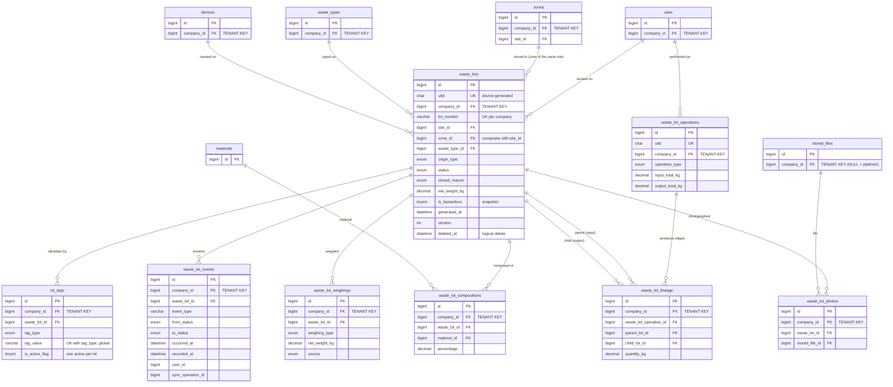

## 16.4 Pickups / providers

```mermaid
erDiagram
    companies ||--|| provider_profiles : "provider profile"
    companies ||--o{ provider_accepted_wastes : "provider accepts"
    treatment_channels ||--o{ provider_accepted_wastes : "via channel"
    companies ||--o{ provider_accreditations : "provider holds"
    accreditation_types ||--o{ provider_accreditations : "type"
    provider_accreditations ||--o{ provider_accreditation_scopes : "covers"
    companies ||--o{ provider_partnerships : "industrial side"
    companies ||--o{ provider_invitations : "industrial invites"
    companies ||--o{ pickups : "industrial owner"
    sites ||--o{ pickups : "from site"
    pickups ||--o{ pickup_lots : "contains"
    waste_lots ||--o{ pickup_lots : "shipped in"
    pickups ||--o{ pickup_charges : "charges"
    pickups ||--o{ pickup_events : "timeline"
    treatment_channels ||--o{ pickup_lots : "actual channel"

    provider_profiles {
        bigint id PK
        bigint company_id FK "TENANT KEY (provider)"
        tinyint is_collector
        tinyint is_transporter
        tinyint is_recycler
        tinyint is_published
    }
    provider_accepted_wastes {
        bigint id PK
        bigint company_id FK "TENANT KEY (provider)"
        bigint waste_family_id FK
        bigint waste_catalog_item_id FK
        bigint regulatory_waste_code_id FK
        bigint treatment_channel_id FK
    }
    provider_accreditations {
        bigint id PK
        bigint company_id FK "TENANT KEY (provider)"
        bigint accreditation_type_id FK
        varchar reference_number
        date valid_from
        date expires_on
        enum review_status
        bigint stored_file_id FK
    }
    provider_accreditation_scopes {
        bigint id PK
        bigint company_id FK "TENANT KEY (provider)"
        bigint provider_accreditation_id FK
        enum service_type
        tinyint hazardous_allowed
    }
    accreditation_types {
        bigint id PK
        bigint country_id FK
    }
    provider_partnerships {
        bigint id PK
        bigint company_id FK "TENANT KEY (industrial)"
        bigint provider_company_id FK "PARTY"
        enum status
    }
    provider_invitations {
        bigint id PK
        bigint company_id FK "TENANT KEY (industrial)"
        varchar email
        char token_hash UK
    }
    pickups {
        bigint id PK
        char ulid UK
        bigint company_id FK "TENANT KEY (industrial)"
        varchar pickup_number
        bigint site_id FK
        bigint provider_company_id FK "PARTY"
        bigint transporter_company_id FK "PARTY"
        enum status
        date requested_date
        date confirmed_date
        datetime collected_at
        decimal departure_weight_kg
        decimal received_weight_kg
        decimal weight_variance_pct
        tinyint variance_flagged
    }
    pickup_lots {
        bigint id PK
        bigint company_id FK "TENANT KEY (industrial)"
        bigint pickup_id FK
        bigint waste_lot_id FK
        bigint provider_company_id FK "PARTY"
        varchar lot_number_snapshot
        enum line_status
        tinyint is_active_flag "one active pickup per lot"
        decimal departure_weight_kg
        decimal received_weight_kg
        decimal net_amount
    }
    pickup_charges {
        bigint id PK
        bigint company_id FK "TENANT KEY"
        bigint pickup_id FK
        decimal amount
    }
    pickup_events {
        bigint id PK
        bigint company_id FK "TENANT KEY"
        bigint pickup_id FK
        bigint provider_company_id FK "PARTY"
        varchar event_type
        datetime occurred_at
    }
    waste_lots {
        bigint id PK
        bigint company_id FK "TENANT KEY"
    }
    sites {
        bigint id PK
        bigint company_id FK "TENANT KEY"
    }
    treatment_channels {
        bigint id PK
    }
    companies {
        bigint id PK
        enum company_type
    }
```

## 16.5 Compliance / documents

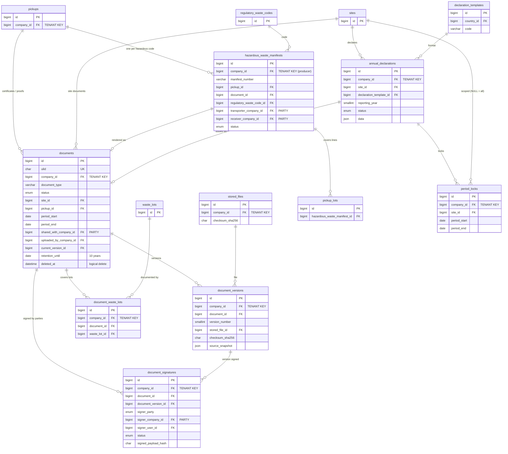

## 16.6 Reporting

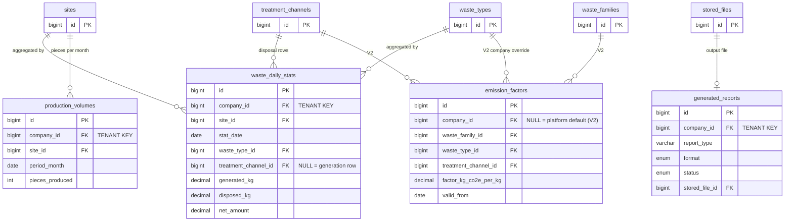

## 16.7 Integrations / synchronization

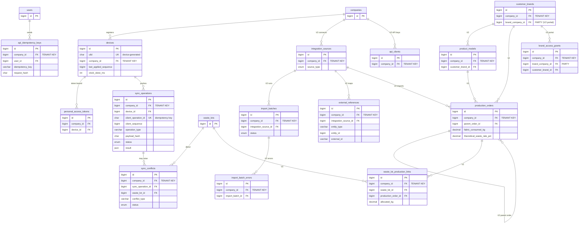

`audit_logs`, `authentication_logs`, `notifications` and `notification_logs` are intentionally **not** connected by FKs (§12, §15.15–15.16).

---

# 17. Indexing / performance

**Targets [CDC §4]:** 200 companies, 500 sites, 5 M lots, no degradation. Web pages < 2 s, scan < 1 s, 3-year dashboards < 5 s.

## 17.1 Volume estimates [INF]

| Table | Rows at target scale | Approx. size incl. indexes |
|---|---|---|
| `waste_lots` | 5 M | 4–6 GB |
| `waste_lot_events` | ~40 M (≈ 8 per lot) | 8–12 GB |
| `waste_lot_weighings` | ~7 M | 1–1.5 GB |
| `waste_lot_compositions` | ~10 M | 1 GB |
| `lot_tags` | ~5.5 M | 0.8 GB |
| `pickup_lots` | ~4.5 M | 2 GB |
| `audit_logs` | 50–100 M over years (partitioned) | 30–60 GB |
| `waste_daily_stats` | ~3 M/year | 0.5 GB/year |

**[REC] Data node sizing:** 8 vCPU / 32 GB RAM / NVMe, `innodb_buffer_pool_size` ≈ 20 GB. The **hot set** (current-year lots, in-stock lots, indexes of tenant-scoped tables) fits in memory. `innodb_log_file_size` 2 GB, `innodb_flush_log_at_trx_commit=1` (durability is required for traceability).

## 17.2 Index design rules

1. **Every tenant query starts with `company_id = ?`**, so every tenant composite index **starts with `company_id`**. Exceptions are global unique lookups (`ulid`, `lot_tags (tag_type, tag_value)`, `client_operation_id`), where the unique key itself is more selective than the tenant.
2. Within a composite index, order columns as **equality filters first, then the range/sort column**. An `IN (…)` list on a low-cardinality column (e.g. `status IN ('created','stored','awaiting_pickup')`) counts as several equality ranges and can sit before other equality columns.
3. **Covering indexes** only where a query is both very frequent and aggregating (current stock). Elsewhere, InnoDB's PK lookup is cheap enough.
4. **No single-column index on low-cardinality columns** (`status`, `is_hazardous`).
5. **Composite FKs double as access paths.** Each `(company_id, x_id)` FK index is chosen so that it also serves a real query, or it is extended into one (e.g. `ix_wle_lot_timeline`).
6. Indexes on huge append-only tables (`waste_lot_events`, `audit_logs`) are kept to the **strict minimum**. This is also why those tables do not declare secondary FKs.

## 17.3 High-frequency queries and their indexes

| # | Query (shape) | Index | Why this index |
|---|---|---|---|
| Q1 | **Current stock by site** — `SELECT zone_id, waste_type_id, COUNT(*), SUM(net_weight_kg) FROM waste_lots WHERE company_id=? AND status IN ('created','stored','awaiting_pickup') AND site_id=? GROUP BY zone_id, waste_type_id` | `ix_waste_lots_stock (company_id, status, site_id, zone_id, waste_type_id, net_weight_kg)` | **Covering**: the query never reads the clustered row. `status IN` gives 3 ranges, and `site_id` narrows within each. Only in-stock lots are touched, so the cost depends on stock size, not on the 5 M historical lots. Logically deleted lots are moved to `status='closed'` / `closed_reason='cancelled'` (§6.2), so the stock query needs no `deleted_at` check and stays index-only. |
| Q2 | **Current stock by zone** (zone screen, capacity alert evaluation) | Same index: `company_id, status IN, site_id = ?, zone_id = ?` | Prefix of Q1's index. |
| Q3 | **Stock by waste type, company-wide** (dashboard tile) | Same index, grouped by `waste_type_id` (site range not restricted) | All in-stock lots of the company are read **from the index only**. A dedicated `(company_id, waste_type_id, status)` index is **not** added: it would only help when filtering a single type across all sites, which Q1's index already handles through index condition pushdown. Revisit only if profiling shows a need. |
| Q4 | **Scan QR** → lot | `uq_lot_tags_value (tag_type, tag_value)` → then `waste_lots` PK | One unique lookup plus one PK lookup, which takes milliseconds and is well under the 1 s target. The tenant check is applied on the fetched row (scope adds `company_id = ?`). |
| Q5 | **Lot detail by ULID** (API binding) | `uq_waste_lots_ulid` | Unique. |
| Q6 | **Lot history** (timeline) — `WHERE company_id=? AND waste_lot_id=? ORDER BY occurred_at, id` | `ix_wle_lot_timeline (company_id, waste_lot_id, occurred_at, id)` | Ordered range, no filesort. Also serves the composite FK. |
| Q7 | **Lineage** (ancestors/descendants, recursive CTE) | `ix_wll_child (company_id, child_lot_id)`, `uq_wll_edge (company_id, parent_lot_id, child_lot_id)` | Each recursion step is an index lookup. |
| Q8 | **Lot list for a site, newest first, filtered by date** (UI, register) | `ix_waste_lots_site_generated (company_id, site_id, generated_at)` | Equality + range + order. Keyset pagination on `(generated_at, id)`. |
| Q9 | **Lot list company-wide by date** | `ix_waste_lots_company_generated (company_id, generated_at)` | Same, without the site filter. Default list sort without a date filter uses `uq_waste_lots_company_id_id` (keyset on `id DESC`). |
| Q10 | **Lots available for a pickup** — stored lots of site S, optionally of type T | `ix_waste_lots_stock` (status = 'stored', site_id = S, then `waste_type_id` via ICP) | Reuses Q1's index. |
| Q11 | **Pending pickups** (industrial dashboard) — `company_id=? AND status IN ('requested','confirmed') ORDER BY requested_date` | `ix_pickups_company_status_date (company_id, status, requested_date)` | Equality + IN + sorted range. |
| Q12 | **Provider inbox** — `provider_company_id=? AND status IN (…) ORDER BY requested_date` | `ix_pickups_provider_status_date (provider_company_id, status, requested_date)` | Party-scope predicate starts with the party column, not `company_id`. |
| Q13 | **Lots of a pickup / pickup of a lot** | `uq_pl_pickup_lot (company_id, pickup_id, waste_lot_id)` / `ix_pl_lot (company_id, waste_lot_id)` | Both directions. |
| Q14 | **Provider scan during collection** — `pickup_id=? AND qr_tag_value_snapshot=?` | `ix_pl_pickup_tag (pickup_id, qr_tag_value_snapshot)` | Resolves without cross-tenant reads (§3.5). |
| Q15 | **Expiring accreditations** (daily, platform-wide in system mode) — `review_status='approved' AND expires_on BETWEEN ? AND ?` | `ix_pa_review_expires (review_status, expires_on)` | Global range scan over a small table (thousands of rows). |
| Q16 | **Eligible providers for a waste type** (directory) | `ix_paw_catalog_item`, `ix_paw_family`, `ix_paw_reg_code` + `ix_pa_company_expires` | Union of three small index lookups, then validity checks per candidate. A few hundred providers at most. |
| Q17 | **Monthly reporting** — `SUM(generated_kg), SUM(disposed_kg) … FROM waste_daily_stats WHERE company_id=? AND stat_date BETWEEN ? AND ? [AND site_id=?] GROUP BY YEAR_MONTH, waste_type_id, treatment_channel_key` | `uq_wds_grain (company_id, site_id, stat_date, …)` with site; `ix_wds_company_date (company_id, stat_date)` without | 3 years of one company ≈ 10⁴–10⁵ narrow rows → < 300 ms. Results cached in Redis for 10 min (`t:{company}:dash:{hash}`). |
| Q18 | **Stats recompute of one bucket** — lots of (company, site, local date) + pickup lines collected that day | `ix_waste_lots_site_generated`, `ix_pickups_site_collected` + `uq_pl_pickup_lot` | Bounded by one day of one site. |
| Q19 | **Economic balance per period** | `ix_pickups_site_collected (company_id, site_id, collected_at)` + `ix_pc_pickup` | Pickups in the period, then their charges. Line amounts come from stats. |
| Q20 | **Audit for an entity** / **audit for the company** | `ix_audit_entity`, `ix_audit_company_created` (+ partition pruning on `created_at`) | Admin screens filter by date, so partitions are pruned. |
| Q21 | **Sync idempotency check** | `uq_sync_ops_client_op` | Unique point lookup per operation. |
| Q22 | **Device pull** — lots of sites S changed since cursor | `ix_waste_lots_sync_pull (company_id, site_id, updated_at, id)` | Keyset range per site. |
| Q23 | **Open conflicts / open stock alerts for a site** | `ix_sync_conflicts_open`, `ix_stock_alerts_site_resolved` | Small, frequent dashboard widgets. |
| Q24 | **Invoices overdue / renewals** (platform jobs) | `ix_invoices_status_due`, `ix_cs_status_period_end` | System-mode daily scans over small tables. |
| Q25 | **Tenant-filtered generic list** of any tenant table | Leading `company_id` in `uq_<table>_company_id_id` or a functional index | Keyset by `(company_id, id)`. |

## 17.4 Pagination strategy

| List | Strategy |
|---|---|
| Lots, lot events, pickups, pickup lines, audit logs, sync operations, notifications | **Cursor (keyset) pagination** (`cursorPaginate`) on `(sort_column, id)`. No `COUNT(*)` and no deep `OFFSET` (both get slow on millions of rows). The UI shows "load more" or next/previous. |
| Small admin lists (sites, zones, waste types, users, providers, plans, invoices) | Offset pagination with totals (`paginate`, max `per_page=100`). |
| Exports | Chunked by id (`chunkById`) inside queued jobs, never in the request. |

Maximum `per_page` is 100 (API default 25). Larger requests are rejected with 422.

## 17.5 Date and reporting index notes

- Business dates used for filters are **indexed in the composite with their tenant/site prefix** (`generated_at`, `collected_at`, `occurred_at`, `stat_date`, `expires_on`). There are no standalone date indexes on tenant tables.
- Reporting **never** scans `waste_lots` for multi-month ranges. It reads `waste_daily_stats`. The only live aggregation over `waste_lots` is current stock (Q1), which is bounded by stock size.
- Time zones: `stat_date` is computed in the **site's** time zone at recompute time, so monthly totals match local calendar months (FR/BE observe daylight saving time).

## 17.6 Other performance measures

- **N+1 prevention:** `Model::preventLazyLoading()` in non-production; API Resources declare their eager loads.
- **Redis caching** of global reference data (catalog, units, channels…; invalidated by the super-admin actions), the permission map per (company, user), and dashboard results.
- **Read replica (phase 2):** dashboards and exports can read from an async replica (`read` connection). Stats recompute writes to the primary.
- **Load test before go-live:** a seeded synthetic dataset (200 companies, 500 sites, 5 M lots, 40 M events) and k6 scenarios for scan, stock, lot list, sync push (100 ops) and dashboard (3 years). Acceptance = cahier targets at p95.

---

# 18. Data integrity / business rules

Legend for "Where enforced": **DB** = constraint · **Scope** = global scope · **FR** = Form Request · **Act** = Action/domain service (inside the transaction) · **Pol** = Policy/AccessResolver · **Sch** = Scheduler · **MW** = middleware · **UI** = front-end guidance only (never sufficient alone).

| # | Rule | Source requirement | Where enforced | Database constraint? | Application rule? | Test required? |
|---|---|---|---|---|---|---|
| R-01 | No query can read another company's data | §4 Multi-tenant, §5 | Scope (fail-closed) + MW + composite FKs + Larastan rules | **Yes**: composite FKs `(company_id, x_id)` | Yes: `TenantScope`, `TenantExists`, banned calls | **Yes**: isolation suite §3.11 (9 categories) |
| R-02 | A row never changes `company_id` | §4 Multi-tenant [INF] | `BelongsToCompany` updating hook | No | Yes | Yes |
| R-03 | Providers access pickups/documents only as a party; never `waste_lots` | §2, M4-03/04 [INF] | Party-aware scope, provider route group, Resources | No | Yes | Yes |
| R-04 | Expired (or unapproved) accreditation ⇒ provider not selectable | M4-02 | Query filter + FR + Act (request, confirm, collect) + Sch alerts | No (date-dependent; see §8.5) | Yes | **Yes**, each entry point |
| R-05 | Accreditation alert 30 days before expiry (plus J-7 and J0 [REC]) | M4-02 | Sch + `notified_*_at` de-dup | No | Yes | Yes (time-travel test) |
| R-06 | Weight variance > 5 % between departure and received is flagged | M4-04 | Act (`RecordPickupReception`) | No (threshold stored as snapshot) | Yes: `|pct| > threshold`, both directions; completion requires acknowledgement [REC] | Yes, boundary cases 4.99/5.00/5.01 %, departure 0 |
| R-07 | Lots and regulatory documents are never physically deleted | §4 Traçabilité | SoftDeletes + no delete endpoints + DB grants | **Yes** [REC]: app DB user has no `DELETE` on `waste_lots`, `documents`, `document_versions`, `waste_lot_events`, `audit_logs` | Yes | Yes (attempted `forceDelete` throws; grant test in CI) |
| R-08 | Logical deletion of a lot only when `created`/`stored`, not in a pickup, not documented, not in a locked period; with reason | §4 Traçabilité [INF] | Act + Pol (`lots.delete`) | Partial: `chk_waste_lots_closed` | Yes | Yes |
| R-09 | QR code is unique (globally, forever) | M2-02 | DB unique + device ULID | **Yes**: `uq_lot_tags_value` | Yes: values never reused | Yes |
| R-10 | One active QR (and one active RFID) per lot | M2-02, M2-03 [INF] | DB NULL-flag unique | **Yes**: `uq_lot_tags_active` | Yes | Yes |
| R-11 | Lot status transitions follow the state machine; each change timestamped with user | M2-05 | Act (`LotStateMachine`) + event row in same transaction | Partial: ENUM; `chk_waste_lots_closed` | Yes | **Yes**: full transition matrix (allowed + forbidden) |
| R-12 | A lot is in at most one active pickup | M4-03 [INF] | DB NULL-flag unique + Act | **Yes**: `uq_pl_active_lot` | Yes | Yes (concurrency test) |
| R-13 | Pickup status transitions; refusal/cancel releases lots to `stored` | M4-03 [INF] | Act (`PickupStateMachine`) | ENUM | Yes | Yes |
| R-14 | Pickup only to an active partner provider; provider ≠ owner | M0-07, M4-03 [INF] | FR + Act | **Yes**: `chk_pickups_parties` | Yes | Yes |
| R-15 | Grouping only same company, site, waste type, hazardous status; inputs `created`/`stored`, not in pickup | M2-06 [REC] | Act | Composite FKs (same company) | Yes | Yes |
| R-16 | Split produces ≥ 2 outputs; > 2 % weight difference requires comment | M2-06 [REC] | Act | No | Yes | Yes |
| R-17 | Lineage is append-only; no self-edge | M2-06, §4 Traçabilité | DB + no update/delete code paths | **Yes**: `chk_wll_not_self`, unique edge | Yes | Yes |
| R-18 | Zone must belong to the lot's site, and both to the lot's company | M1-01, M2-01 [INF] | DB composite FK | **Yes**: `fk_waste_lots_zone (company_id, site_id, zone_id)` | Yes (FR message) | Yes |
| R-19 | Composition percentages sum to 100.00; each in (0, 100] | M1-04 | FR + value object | Partial: `chk_wlc_percentage`, `chk_wtc_percentage` | Yes (sum) | Yes |
| R-20 | Hazardous regulatory code ⇒ hazardous waste type; lots snapshot hazard + code | M1-04 [INF] | Act | No | Yes | Yes |
| R-21 | Role × permission matrix configurable without code | §2 | Data (`role_has_permissions`) + AccessResolver | FK | Yes (audience guard) | Yes (matrix change takes effect without deploy; cache bust) |
| R-22 | Roles are site-specific; company-level permissions require a company-wide assignment | §2, §6 | AccessResolver + Pol | **Yes**: `uq_ura_assignment`, FK to `company_users` | Yes | **Yes**: user with role A on S1 and role B on S2 |
| R-23 | Workshop operator: mobile only | §2 | MW (`app.web.access` / `app.mobile.access`) | No | Yes | Yes |
| R-24 | Invitation expires after 7 days; single pending invitation per email/company | M0-08 | Act (check `expires_at`) + DB | **Yes**: `uq_user_invitations_pending` | Yes | Yes |
| R-25 | Email verification link valid 24 h | M0-02 | Laravel signed URL (`auth.verification.expire=1440`) | No | Config | Yes |
| R-26 | Password ≥ 12 chars; hashed (Argon2id) | M0-09, §4 Sécurité | FR (`Password::min(12)`) + Hash config | No | Yes | Yes |
| R-27 | Account locked after 5 failed logins | M0-09 | Fortify pipeline + `users.locked_until` | No | Yes (15-min auto-unlock [REC], admin unlock) | Yes |
| R-28 | Terms/privacy acceptance timestamped with version; re-acceptance on new version | M0-10 | Act + MW (blocks API until accepted) | FK to exact `legal_documents` row | Yes | Yes |
| R-29 | Company must be approved by super-admin before use; rejection requires reason; requester notified | M0-05, M0-06 | MW (status gate) + Act + Notification | ENUM | Yes | Yes |
| R-30 | Provider accreditations validated by super-admin before they count | M0-05 | Act + eligibility query (`review_status='approved'`) | ENUM | Yes | Yes |
| R-31 | Subscription state gates access: trialing/active = full; past_due = full + banner; expired/suspended = read-only + billing; cancelled = read-only until period end | M0-03, M0-11 [REC] | MW + Pol | `uq_cs_current` (one current) | Yes | Yes |
| R-32 | 30-day trial | M0-03 | Act (trial_ends_at = approval + 30 d) + Sch | No | Yes | Yes |
| R-33 | Active sites ≤ subscribed sites (per-site plans) | M0-03, M0-11 [INF] | Act (site activation) | No | Yes | Yes |
| R-34 | Invoice numbering gapless; issued invoices immutable; corrections by credit note | M7-04 [INF, legal] | Act + sequence lock | **Yes**: `uq_invoices_number`, `chk_invoices_credit_note` | Yes | Yes (concurrent issuance) |
| R-35 | Invoice shows tax id and VAT per country | M7-04 | Act (buyer snapshot + tax_rates) | No | Yes | Yes |
| R-36 | Bank transfer payments validated by super-admin | M0-04 | Pol (platform) + Act | ENUM | Yes | Yes |
| R-37 | Regulatory documents retained 10 years | M5-04 | `retention_until`, purge job excludes, Object Lock | `retention_until NOT NULL` | Yes | Yes (purge job skips) |
| R-38 | Issued document versions immutable; changes ⇒ new version or superseding document | M5-01..04 [REC] | Act; no update path on `document_versions` | No update grant [REC] | Yes | Yes |
| R-39 | Manifest signed by each party in order; signed data frozen | M5-02 | Act (sequence check, payload hash) | `uq_ds_party` | Yes | Yes |
| R-40 | Locked periods reject changes dated inside them (incl. offline sync → conflict) | M5-01/03 [REC] | Act guard `PeriodLockGuard` | No | Yes | Yes |
| R-41 | Offline operation applied exactly once | M2-08 | DB unique + same-transaction insert | **Yes**: `uq_sync_ops_client_op`, `uq_waste_lots_ulid` | Yes (payload hash check) | **Yes**: replay, concurrent duplicate, crash-after-commit simulations |
| R-42 | Offline operations of a device applied in `seq` order; dependents of a failed op rejected | M2-08 [REC] | Sync processor | No | Yes | Yes |
| R-43 | Online unsafe requests with `Idempotency-Key` are applied once | [REC] | MW + `api_idempotency_keys` | **Yes**: `uq_aik_key` | Yes | Yes |
| R-44 | Capacity alert when threshold exceeded; one open alert per subject | M2-07 | Job + DB | **Yes**: `uq_stock_alerts_open` | Yes | Yes |
| R-45 | No double counting in tonnage (generated = original lots; disposed = pickup lines) | M6-01 [INF] | Stats projector | No | Yes | **Yes**: split/group scenarios vs expected totals |
| R-46 | Audit every create/update/delete with user, action, object, old/new, timestamp, IP | M7-02 | `Auditable` trait (same transaction) | INSERT/SELECT-only grant | Yes | Yes (each audited model creates rows; secrets excluded) |
| R-47 | Personal data export/erasure on request (with retention exceptions) | §4 Données personnelles | Platform procedure + Act (anonymize) | No | Yes | Yes |
| R-48 | Rate limiting per IP | §4 Sécurité | Laravel rate limiters + Cloudflare | No | Yes | Yes |

---

# 19. MVP vs V2

## 19.1 Cahier V2 items and their impact on the MVP schema

| V2 item (cahier) | Built in MVP? | What MVP includes so V2 needs no rewrite | V2 additions |
|---|---|---|---|
| SMS phone verification (M0-02) | No | `users.phone`, `users.phone_verified_at` | `phone_verifications` |
| Card payment (M0-04) | No | `payments.method` ENUM includes `card`; `provider`, `provider_payment_id`; `PaymentGateway` interface | `payment_webhook_events`, gateway adapter |
| SSO SAML/Microsoft/Google (M0-12) | No | Global `users` + `company_users` (SSO maps onto them) | `sso_connections`, `user_sso_identities` |
| RFID UHF (M2-03) | No | `lot_tags.tag_type` ENUM includes `rfid_epc` | Reader endpoint only, **no table change** |
| Connected scale / IoT (M2-04) | No | `waste_lot_weighings.source` (`scale`), `device_reference` | `scale_devices`, nullable `waste_lot_weighings.scale_device_id` (instant ADD COLUMN) |
| Production link (M3-01..04) | No | `production_volumes` (MVP for M6-02), lot model unchanged | `integration_sources`, `import_batches`, `import_batch_errors`, `external_references`, `customer_brands`, `product_models`, `production_orders`, `waste_lot_production_links` |
| Marketplace (M4-06) | No | Normalized composition/color (filterable), `waste_lot_photos` | `marketplace_listings`, `marketplace_listing_lots`, `marketplace_offers` |
| Other countries' declarations (M5-03) | No (TN only) | `declaration_templates` keyed by country, `regulatory_waste_codes.code_system` | Template rows + generator classes (data, not schema) |
| CO₂ avoided (M6-03) | No | `waste_daily_stats` grain already includes type × channel | `emission_factors`, `waste_daily_stats.co2_avoided_kg` |
| Brand portal (M6-05) | No | `companies.company_type` includes `brand`; `roles.audience` includes `brand` | `customer_brands`, `brand_access_grants` |
| WhatsApp (M7-01) | No | `notification_preferences.channel`/`notification_logs.channel` include `whatsapp` | Channel class, opt-in UI |
| API keys per client (M7-03) | No (internal API documented from sprint 1) | `/api/v1` versioning, Sanctum `personal_access_tokens` with `company_id` | `api_clients` |
| English/Arabic (§1 Langues) | No (French) | Transloco from day 1, `name JSON` translations, `users.locale`, CSS logical properties, RTL spike | Translation files; PDF engine decision for Arabic (P-27) |

## 19.2 Tables required for MVP (89)

All tables numbered 1–89 in §14. By domain: platform reference (20), identity & RBAC (10), tenancy (6), billing (6), sites (4), company waste types (3), files & numbering (2), lots (8), sync & idempotency (4), providers (6), pickups (4), compliance (7), reporting (3), notifications (3), audit (1), framework (2).

## 19.3 Tables that should exist in MVP *because of* V2

Only those that cost little now and would be expensive to retrofit:

- **`waste_lot_lineage` / `waste_lot_operations`.** These are MVP requirements (M2-06), but they also become the backbone of marketplace and brand traceability.
- **`lot_tags`** as a separate table rather than a `qr_code` column on lots. RFID becomes data, not a migration on 5 M rows.
- **`stored_files`** as a registry. The marketplace (photos) and integrations (import files) reuse it.
- **`audit_logs` partitioned from day 1.** Partitioning later means rebuilding a large table.
- **`roles.company_id` + `audience`.** Brand and provider roles in V2 need no RBAC redesign.

## 19.4 V2 columns safely omitted from MVP

| Column | Table | Why omission is safe |
|---|---|---|
| `co2_avoided_kg` | `waste_daily_stats` | Instant ADD COLUMN; stats can be rebuilt for history. |
| `scale_device_id` | `waste_lot_weighings` | Instant ADD COLUMN (nullable). |
| `customer_brand_id` | `production_volumes` | Instant ADD COLUMN; MVP volumes are per site/month. |
| Any production FK on `waste_lots` | — | Not needed: links table (§11.2). |
| SSO flags on `users` | — | Separate identity table. |

## 19.5 V2 features that DO influence the initial architecture

1. **Arabic RTL**: CSS logical properties, `dir` handling and RTL-capable UI components from sprint 1. The PDF engine choice for Arabic is flagged (P-27).
2. **External API (M7-03, M3-01)**: `/api/v1`, OpenAPI from sprint 1, ULIDs everywhere, idempotency keys.
3. **RFID & scales**: tags and weighings modeled as separate tables with a `source` / `tag_type`.
4. **Brand portal & marketplace**: the party-aware scope pattern (§3.5) is designed now, so V2 adds parties without weakening isolation.
5. **CO₂ factors**: the stats grain (type × channel × day) already supports factor application.

---

# 20. Migration / implementation order

## 20.1 Laravel migration order (dependency-correct)

FKs that would create cycles are added in a **later "add foreign keys" migration** (marked ⟲).

```text
2026_10_01_000100_create_currencies_table
2026_10_01_000110_create_countries_table                      → currencies
2026_10_01_000120_create_tax_rates_table                      → countries, currencies
2026_10_01_000130_create_textile_activities_table
2026_10_01_000140_create_legal_documents_table
2026_10_01_000150_create_reference_vocabularies               zone_types, packaging_types, units, waste_families,
                                                              materials, color_families, treatment_channels
2026_10_01_000160_create_regulatory_waste_codes_table          (self FK)
2026_10_01_000170_create_waste_catalog_items_table            → waste_families, units, packaging_types, treatment_channels
2026_10_01_000180_create_waste_catalog_item_regulatory_codes  → waste_catalog_items, countries, regulatory_waste_codes
2026_10_01_000190_create_accreditation_types_table            → countries
2026_10_01_000200_create_declaration_templates_table          → countries
2026_10_01_000210_create_subscription_plans_and_prices        → currencies
2026_10_01_000220_create_invoice_number_sequences_table

2026_10_01_000300_create_users_table                          (last_company_id FK ⟲)
2026_10_01_000310_create_password_reset_tokens_table
2026_10_01_000320_create_permission_tables (Spatie, customized) permissions, roles (company FK ⟲), role_has_permissions,
                                                              model_has_roles, model_has_permissions
2026_10_01_000330_create_companies_table                      → countries, currencies, users  (logo FK ⟲)
2026_10_01_000331_add_company_fks_to_users_and_roles          ⟲ users.last_company_id, roles.company_id
2026_10_01_000340_create_personal_access_tokens_table         → companies  (device FK ⟲)
2026_10_01_000350_create_legal_acceptances_table              → users, legal_documents, companies
2026_10_01_000360_create_authentication_logs_table            (no FK)
2026_10_01_000370_create_company_textile_activities_table     → companies, textile_activities
2026_10_01_000380_create_company_users_table                  → companies, users

2026_10_01_000400_create_stored_files_table                   → companies, users
2026_10_01_000401_add_logo_fk_to_companies                    ⟲ companies.logo_stored_file_id
2026_10_01_000410_create_number_sequences_table               → companies

2026_10_01_000500_create_sites_table                          → companies, countries, users
2026_10_01_000510_create_zones_table                          → sites, zone_types
2026_10_01_000520_create_user_role_assignments_table          → company_users, roles, sites
2026_10_01_000530_create_user_invitations_tables              user_invitations, user_invitation_sites → companies, roles, sites

2026_10_01_000600_create_company_subscriptions_table          → companies, subscription_plans (self FK)
2026_10_01_000610_create_subscription_events_table            → company_subscriptions
2026_10_01_000620_create_subscription_usage_records_table     → company_subscriptions
2026_10_01_000630_create_invoices_tables                      invoices, invoice_items → company_subscriptions, stored_files, tax_rates, subscription_plan_prices, subscription_usage_records
2026_10_01_000640_create_payments_table                       → invoices, stored_files

2026_10_01_000700_create_waste_types_tables                   waste_types, waste_type_compositions, waste_type_unit_conversions
2026_10_01_000710_create_stock_thresholds_table               → sites, zones, waste_types
2026_10_01_000720_create_stock_alerts_table                   → stock_thresholds

2026_10_01_000800_create_devices_table                        → companies, users
2026_10_01_000801_add_device_fk_to_personal_access_tokens     ⟲
2026_10_01_000810_create_sync_operations_table                → devices
2026_10_01_000820_create_api_idempotency_keys_table           → companies, users

2026_10_01_000900_create_waste_lots_table                     → sites, zones, waste_types, devices, reference tables
2026_10_01_000910_create_waste_lot_compositions_table
2026_10_01_000920_create_lot_tags_table
2026_10_01_000930_create_waste_lot_events_table
2026_10_01_000940_create_waste_lot_weighings_table
2026_10_01_000950_create_waste_lot_operations_table
2026_10_01_000960_create_waste_lot_lineage_table
2026_10_01_000970_create_waste_lot_photos_table               → stored_files
2026_10_01_000980_create_sync_conflicts_table                 → sync_operations, waste_lots, sites

2026_10_01_001000_create_provider_tables                      provider_profiles, provider_accepted_wastes, provider_accreditations,
                                                              provider_accreditation_scopes, provider_partnerships, provider_invitations
2026_10_01_001100_create_pickups_table                        → companies, sites (self FK)
2026_10_01_001110_create_pickup_lots_table                    → pickups, waste_lots  (manifest FK ⟲)
2026_10_01_001120_create_pickup_charges_and_events_tables

2026_10_01_001200_create_documents_table                      → sites, pickups  (current_version FK ⟲)
2026_10_01_001210_create_document_versions_table              → documents, stored_files
2026_10_01_001211_add_current_version_fk_to_documents         ⟲
2026_10_01_001220_create_document_waste_lots_table
2026_10_01_001230_create_document_signatures_table
2026_10_01_001240_create_hazardous_waste_manifests_table      → pickups, documents
2026_10_01_001241_add_manifest_fk_to_pickup_lots              ⟲
2026_10_01_001250_create_annual_declarations_table            → declaration_templates, documents
2026_10_01_001260_create_period_locks_table                   → annual_declarations

2026_10_01_001300_create_production_volumes_table
2026_10_01_001310_create_waste_daily_stats_table
2026_10_01_001320_create_generated_reports_table              → stored_files

2026_10_01_001400_create_notifications_table (customized)
2026_10_01_001410_create_notification_preferences_table       → company_users
2026_10_01_001420_create_notification_logs_table

2026_10_01_001500_create_audit_logs_table (partitioned, raw DDL for PARTITION BY)
2026_10_01_001600_create_failed_jobs_and_job_batches_tables

2026_10_01_001900_apply_db_grants (documentation + ops script, not a Laravel migration: INSERT/SELECT only on audit/event tables)

V2 (later timestamps): emission_factors; integration_sources → import_batches → import_batch_errors → external_references;
api_clients; customer_brands → product_models → production_orders → waste_lot_production_links → brand_access_grants;
scale_devices (+ weighings column); marketplace_*; payment_webhook_events; sso_connections → user_sso_identities;
phone_verifications; ALTER waste_daily_stats ADD co2_avoided_kg.
```

**Migration rules [REC]:** migrations are never edited after merge. Every change is a new migration. Production migrations are **expand/contract** (add nullable column → backfill job → enforce) so they stay compatible with the previous release during zero-downtime deploys. Large-table ALTERs use `ALGORITHM=INSTANT` or `INPLACE, LOCK=NONE`, and the migration fails rather than silently copying a 5 M-row table.

## 20.2 Seeders and reference data

| Seeder | Content | Source / owner | Environment |
|---|---|---|---|
| `CurrencySeeder` | TND (3), MAD (2), EUR (2) | ISO 4217 | all |
| `CountrySeeder` | TN (signup on), MA, FR, BE (signup off): currency, locale, timezone, tax-ID label/pattern, waste code system, authority | Diva Software + legal | all |
| `TaxRateSeeder` | TN VAT standard rate, TN stamp duty; others as validated | **Accountant validation required** (P-10) | all |
| `TextileActivitySeeder` | spinning, weaving, knitting, dyeing, finishing, garment_making, washing, printing, other | Cahier M0-01 | all |
| `ZoneTypeSeeder` | cutting, sewing, dyeing, finishing, warehouse, waste_storage (cahier) + spinning, weaving, knitting, other | Cahier M1-01 | all |
| `PackagingTypeSeeder` | bag, bale, big_bag, drum (cahier) + box, pallet, container, bulk | Cahier M2-01 | all |
| `UnitSeeder` | kg (base), t, m3, l, piece | Cahier M1-05 | all |
| `WasteFamilySeeder` | textile_fibre, textile_product, packaging, chemical_sludge, oil, metal, other | [INF] | all |
| `MaterialSeeder` | CO, PES, EL, CV, PA, WO, LI, PAN, OTHER | EU Reg. 1007/2011 names | all |
| `ColorFamilySeeder` | 16 families | [INF] | all |
| `TreatmentChannelSeeder` | reuse, recycling, energy_recovery, landfill (cahier) + incineration, other_treatment | Cahier M4-01 | all |
| `RegulatoryWasteCodeSeeder` | EU LoW (chapters 04, 13, 15, 17, 19, 20 relevant subset first), TN list, MA list | **Official texts, validated by a regulatory expert** (P-21) | all |
| `WasteCatalogSeeder` | The 14 default items (cutting scraps, selvedges, yarn waste, garment rejects, roll ends, downgraded pieces, cardboard, cones, plastic films/bags, ETP sludge, dye residues, oils, needles, metals) + per-country codes | Cahier M1-03 + expert | all |
| `AccreditationTypeSeeder` | TN types (collection/transport/treatment/hazardous) | Regulatory expert | all |
| `DeclarationTemplateSeeder` | `TN_ANGED_ANNUAL` v1 | ANGed format (P-22) | all |
| `PermissionSeeder` | Full permission catalog (generated from a PHP enum, so code and DB cannot drift) | Code | all |
| `SystemRoleSeeder` | 9 system roles + default matrix (§5.B) | Diva Software validation | all |
| `SubscriptionPlanSeeder` | trial (30 days), per-site, per-volume (prices are placeholders until P-07 is decided) | Diva Software | all |
| `LegalDocumentSeeder` | CGU + privacy v1 (fr) | Legal | all |
| `PlatformAdminSeeder` | First super-admin from env variables (no default password) | Ops | prod: once |
| `DemoTenantSeeder` | 3 demo companies (2 industrial, 1 provider), sites, lots, pickups | Dev | dev/recette only |
| `PerformanceDatasetSeeder` | 200 companies, 500 sites, 5 M lots, 40 M events | Dev | perf env only |

**Default permission catalog (excerpt):**

- `app.web.access`, `app.mobile.access`
- `company.view`, `company.update`
- `users.view`, `users.invite`, `users.manage`, `roles.manage`
- `sites.view`, `sites.manage`, `zones.manage`
- `waste_types.view`, `waste_types.manage`
- `lots.view`, `lots.create`, `lots.update`, `lots.weigh`, `lots.move`, `lots.split`, `lots.group`, `lots.print_label`, `lots.delete`
- `stock.view`, `stock.thresholds.manage`
- `pickups.view`, `pickups.request`, `pickups.cancel`, `pickups.load`, `pickups.price`, `pickups.complete`, `pickups.override_eligibility`
- `providers.view`, `providers.partnerships.manage`
- `documents.view`, `documents.generate`, `documents.upload`, `documents.sign`, `documents.delete`
- `declarations.prepare`, `declarations.validate`, `periods.lock`, `periods.unlock`
- `dashboard.view`, `reports.view`, `reports.export`, `production_volumes.manage`
- `audit.view`, `sync_conflicts.resolve`
- `subscription.view`, `subscription.manage`, `invoices.view`, `payments.declare`
- Provider side: `provider.profile.manage`, `provider.accreditations.manage`, `provider.pickups.view`, `provider.pickups.respond`, `provider.pickups.receive`, `provider.certificates.upload`, `provider.manifests.sign`
- Platform side: `platform.companies.review`, `platform.companies.suspend`, `platform.providers.review`, `platform.catalog.manage`, `platform.countries.manage`, `platform.plans.manage`, `platform.invoices.manage`, `platform.payments.validate`, `platform.roles.manage`, `platform.legal.manage`

**Default matrix (summary):**

| Role | Permissions |
|---|---|
| `client_admin` | All industrial permissions, company-wide. |
| `environment_manager` | Everything except users/roles/subscription. |
| `workshop_operator` | `app.mobile.access`, `lots.view`, `lots.create`, `lots.weigh`, `lots.move`, `lots.print_label`, `lots.split`, `lots.group`, `stock.view`, `pickups.load`. |
| `management_viewer` | `app.web.access`, all `*.view` + `dashboard.view` + `reports.view` + `reports.export`. |
| `auditor` | `lots.view`, `documents.view`, `pickups.view`, `reports.view`. |
| `provider_admin` | All `provider.*`, plus `users.*` within the provider company. |
| `provider_operator` | `provider.pickups.view`, `provider.pickups.receive`, `provider.certificates.upload`. |

---

# 21. Laravel implementation recommendation

## 21.1 Structure: modular monolith inside `app/Modules`

```text
app/
├── Modules/
│   ├── Platform/          countries, currencies, tax rates, legal documents, reference vocabularies, platform admin (approvals)
│   ├── Tenancy/           Company, TenantContext, TenantScope, BelongsToCompany, EstablishTenantContext MW, System/ (allowlisted bypass)
│   ├── Identity/          User, auth (Fortify actions), lockout, invitations, memberships, legal acceptance, devices registration
│   ├── Access/            Role, Permission, UserRoleAssignment, AccessResolver, Gate::before, matrix editing
│   ├── Billing/           plans, subscriptions, usage, invoices, payments, PaymentGateway (V2)
│   ├── Sites/             Site, Zone, StockThreshold, StockAlert, StockQuery
│   ├── WasteCatalog/      catalog (global) + company WasteType, compositions, conversions
│   ├── Lots/              WasteLot, LotTag, events, weighings, operations, lineage, photos, LotStateMachine, labels
│   ├── Sync/              SyncProcessor, operation handlers, conflicts, pull feed
│   ├── Providers/         profiles, accepted wastes, accreditations, partnerships, ProviderDirectory, ProviderEligibility
│   ├── Pickups/           Pickup, PickupLot, charges, events, PickupStateMachine, provider portal endpoints
│   ├── Compliance/        Document, versions, signatures, manifests, declarations, register, period locks, retention
│   ├── Reporting/         stats projector, dashboard queries, report builders, production volumes
│   ├── Notifications/     notification classes, preferences, delivery log, recipient resolver
│   ├── Audit/             Auditable trait, AuditLogger, audit read API
│   ├── Files/             StoredFile, FileStorage service, antivirus scan, signed downloads
│   ├── Integrations/      (V2) sources, imports, external references, API clients
│   └── Production/        (V2) brands, models, orders, lot links, brand portal
├── Shared/
│   ├── Domain/            value objects (Weight, Money, Percentage, Composition, Ulid), base enums, DomainException
│   ├── Http/              base controller, problem+json renderer, pagination/filter helpers, Idempotency MW, RequestId MW
│   ├── Persistence/       TenantSqlQuery base, Bulk writers base, morph map, NumberSequence service
│   └── Support/           Clock, TenantCache, Context helpers
└── Providers/             AppServiceProvider (morph map, strict models), ModuleServiceProviders autoloaded
```

Each module uses the **same internal layout**. Folders are only created when needed:

```text
Modules/Lots/
├── Models/            WasteLot.php, LotTag.php, WasteLotEvent.php, WasteLotWeighing.php, WasteLotOperation.php, WasteLotLineage.php
├── Enums/             LotStatus.php, LotOriginType.php, ClosedReason.php, LotEventType.php, TagType.php, WeighingType.php
├── Domain/            LotStateMachine.php, GroupingPolicy.php (rules), CompositionCalculator.php
├── Actions/           CreateWasteLot.php, StoreWasteLot.php, MoveWasteLot.php, WeighWasteLot.php, SplitWasteLot.php,
│                      GroupWasteLots.php, AssignLotTag.php, DeleteWasteLot.php, RestoreWasteLot.php
├── Data/              CreateWasteLotData.php, SplitWasteLotData.php …  (readonly DTOs)
├── Queries/           LotListQuery.php, LotTimelineQuery.php, LotLineageQuery.php, Sql/ (raw reporting SQL, TenantSqlQuery)
├── Http/
│   ├── Controllers/   WasteLotController.php, LotScanController.php, LotSplitController.php …
│   ├── Requests/      StoreWasteLotRequest.php, SplitWasteLotRequest.php …
│   └── Resources/     WasteLotResource.php, WasteLotEventResource.php …
├── Policies/          WasteLotPolicy.php
├── Events/            WasteLotCreated.php, WasteLotStatusChanged.php, WasteLotsGrouped.php, WasteLotSplit.php
├── Listeners/         (only intra-module; cross-module listeners live in the consuming module)
├── Jobs/              RenderLotLabel.php
├── Labels/            LabelRenderer.php (dompdf 100×50 + simple-qrcode)
├── Database/          Factories/ (migrations stay in database/migrations for global ordering)
└── routes.php
```

## 21.2 What each building block is for (and what is deliberately avoided)

| Building block | Use | Avoid |
|---|---|---|
| **Models** (Eloquent) | Entities, relationships, casts (enums, value objects, encrypted), scopes, `BelongsToCompany`, `Auditable`, `HasUlids` (`uniqueIds(): ['ulid']`) | Business workflows in models; `$guarded = []`. Use explicit `$fillable`. |
| **Actions** | One public `handle()` per use case. Opens the DB transaction, authorizes (`Gate::authorize`), applies domain rules, writes, dispatches events **after commit**. Callable from controllers, sync processor, jobs, console. | "Service" god-classes; actions calling controllers. |
| **Domain services** | Pure rules shared by actions: `LotStateMachine`, `PickupStateMachine`, `ProviderEligibility`, `WeightVarianceCalculator`, `PeriodLockGuard` | Framework-heavy code in them. |
| **DTOs** (`Data/`) | `final readonly class` built from `FormRequest::validated()` or from sync payloads, so the same action serves web and offline sync | A DTO library (not needed); passing raw arrays to actions. |
| **Form Requests** | Input validation [CDC], `TenantExists`, `EligibleProvider`, password rules. `authorize()` delegates to policies. | Business state checks (they belong in actions). |
| **API Resources** | Output shape per **audience** (industrial vs provider: e.g. `ProviderPickupResource` hides prices) | Leaking internal ids. Expose `ulid` only. |
| **Policies** | Per-model authorization through `AccessResolver` (site-aware) | Role-name checks (`hasRole('admin')`). Always check permissions. |
| **Queries** | Read models: lists with filters, stock, timeline, lineage CTE, dashboards | Repositories wrapping Eloquent 1:1. |
| **Repositories** | **Not used.** Eloquent is the repository; Query classes cover complex reads. | — |
| **Jobs** | Async work (§2.3), all `TenantAwareJob` when tenant-specific, idempotent, `ShouldBeUnique` where relevant | Long synchronous work in requests. |
| **Events / Listeners** | Domain events after commit, consumed by other modules (stats, notifications, stock alerts) | Events as the primary write path (no event sourcing). |
| **Notifications** | One class per notification type (§13.2), queued | Sending mail in actions directly. |
| **Enums** | PHP backed enums for every ENUM/VARCHAR-type column, with `label()` via lang files | Magic strings. |
| **Value objects** | `Weight` (kg, BcMath), `Money` (amount + currency minor units), `Percentage`, `Composition` (sum = 100), `LotNumber` | Floats for weights or money. |

## 21.3 Cross-cutting conventions

- `Model::shouldBeStrict()` outside production (prevents lazy loading, silently discarded attributes and missing attributes).
- **Morph map enforced** (`Relation::enforceMorphMap`) with stable aliases (`waste_lot`, `pickup`, …) used in `audit_logs`, `notification_logs` and `external_references`.
- **Clock abstraction** (`Clock::now()`) so expiry rules (accreditations, invitations, trials) are testable with time travel.
- **Context:** `request_id`, `company_id`, `user_id` and `source` are added to Laravel `Context` by middleware, then propagated to logs, jobs and Sentry.

## 21.4 Architecture tests (Pest `arch()`)

- Controllers do not use `DB` or Eloquent builders directly. They call Actions or Queries.
- `App\Modules\*\Models` (tenant ones) use `BelongsToCompany`. The test is generated from the classification registry.
- No module uses another module's `Actions` namespace except through its public `Actions` classes (allowlist), and no module touches another module's `Domain` internals.
- `withoutGlobalScope(s)`, `DB::table`, `DB::select` only appear in allowlisted namespaces (complements Larastan).
- No `env()` outside config. No `dd`/`dump`. Enums are backed.

---

# 22. API architecture

## 22.1 Conventions

| Topic | Rule |
|---|---|
| Base | `/api/v1`, JSON only, `Accept: application/json`. Breaking changes → `/api/v2` (external clients in V2). |
| Identifiers | ULIDs in paths and payloads (`"site": "01HZ…"`). Reference data by `code` (`"packaging_type": "big_bag"`). |
| Naming | Plural kebab-case resources (`/waste-types`, `/pickups/{pickup}/lots`). Actions that are state transitions are **sub-resources with POST** (`POST /lots/{lot}/split`, `POST /pickups/{pickup}/confirm`), not PATCH on `status`. |
| Pagination | Cursor for large collections: `?cursor=…&per_page=25` → `{"data":[…],"meta":{"next_cursor":"…","prev_cursor":null,"per_page":25}}`. Offset for small admin lists: `?page=2` → `meta.total`. |
| Filtering | `filter[status]=stored,awaiting_pickup&filter[site]=01HZ…&filter[generated_between]=2026-01-01,2026-03-31` (allowlist per endpoint, spatie/laravel-query-builder). |
| Sorting | `sort=-generated_at,lot_number` (allowlist). |
| Searching | `filter[q]=L-2026-0042` → exact or prefix match on indexed business keys (lot number, pickup number, tag value). No unindexed `%LIKE%` on large tables. |
| Includes | `include=zone,waste_type,composition` (allowlist, eager loaded). |
| Authorization | `auth:sanctum` → `EstablishTenantContext` → `EnsureAppChannel` (web/mobile permission) → Form Request `authorize()` → Policy (site-aware). |
| Tenant scope | Implicit from session/token (§3.3). Never a request parameter. |
| Validation | Form Requests → **422** problem+json with `errors`. |
| Errors | RFC 9457 `application/problem+json`: `{"type":"https://docs.<domain>/errors/lot-already-split","title":"Lot already split","status":409,"code":"LOT_ALREADY_SPLIT","detail":"…","request_id":"01J…","errors":{…}}`. Codes are stable for clients. 401 unauthenticated, 403 forbidden (known resource, missing permission), **404 for other tenants' resources**, 409 state conflict / optimistic-lock version mismatch, 422 validation, 423 locked period or account, 429 rate limited. |
| Concurrency | Mutable resources return `version`. Writes may send `If-Match: <version>` (required for lot attribute updates from the web). Mismatch → 409. |
| Idempotency | `Idempotency-Key` header **required** on: pickup request submission, document issuance, payment declaration, invoice issuance (platform). Optional elsewhere. Same key + same body → stored response replayed. Same key + different body → 422 `IDEMPOTENCY_KEY_REUSED`. |
| Rate limiting | Named limiters: `auth` (5/min per IP+email for login, plus Cloudflare edge rule), `api` (120/min per user), `sync` (30/min per device, ≤ 100 ops/request), `exports` (10/hour per user), `public` (signup, 10/hour per IP). |
| Time | All timestamps ISO-8601 UTC with `Z`. Dates as `YYYY-MM-DD`. Decimals as **strings** (`"184.500"`), never JSON floats. |
| Locale | `Accept-Language` for messages. Defaults to `users.locale`. |
| Documentation | Scribe-generated OpenAPI 3.1 at `/docs` (internal), published per release. TypeScript types generated from it in the front CI. |

## 22.2 Route map (representative)

```text
# Public / auth (Fortify headless, prefix /api/v1/auth)
POST   /api/v1/auth/register                 industrial signup (M0-01): company + admin user + acceptances
POST   /api/v1/auth/register-provider        provider signup (M0-05) with accreditation uploads
POST   /api/v1/auth/login                    → 2FA challenge if enabled
POST   /api/v1/auth/two-factor-challenge
POST   /api/v1/auth/logout
POST   /api/v1/auth/forgot-password
POST   /api/v1/auth/reset-password
GET    /api/v1/auth/verify-email/{id}/{hash} signed, 24 h
POST   /api/v1/auth/invitations/{token}/accept
GET    /sanctum/csrf-cookie

# Me / context
GET    /api/v1/me                            profile, memberships, permissions per site
GET    /api/v1/me/companies
POST   /api/v1/me/current-company            switch tenant (session regenerate)
PUT    /api/v1/me/password
POST   /api/v1/me/two-factor                 enable / confirm / disable (Fortify)
POST   /api/v1/me/legal-acceptances
GET    /api/v1/me/notifications              cursor; POST /api/v1/me/notifications/{id}/read
PUT    /api/v1/me/notification-preferences

# Company administration
GET    /api/v1/company                       PATCH /api/v1/company
GET    /api/v1/company/onboarding            PATCH /api/v1/company/onboarding/{step}   (skip/resume, M0-07)
GET    /api/v1/users                         POST /api/v1/invitations, POST /api/v1/invitations/{invitation}/resend, DELETE /api/v1/invitations/{invitation}
PUT    /api/v1/users/{user}/assignments      replace site/role assignments
GET    /api/v1/roles                         POST /api/v1/roles (clone), PUT /api/v1/roles/{role}/permissions
GET    /api/v1/permissions
GET    /api/v1/audit-logs                    filter[entity], filter[user], filter[between]

# Sites / zones / stock
GET    /api/v1/sites                         POST, GET /{site}, PATCH /{site}, POST /{site}/deactivate
GET    /api/v1/sites/{site}/zones            POST /api/v1/sites/{site}/zones
PATCH  /api/v1/zones/{zone}
GET    /api/v1/stock?group_by=site,zone,waste_type&filter[site]=…     (M2-07)
GET    /api/v1/stock-thresholds              POST, PATCH, DELETE
GET    /api/v1/stock-alerts                  POST /api/v1/stock-alerts/{alert}/acknowledge

# Waste reference
GET    /api/v1/catalog/waste-items           global catalog (cached)
GET    /api/v1/references/{vocabulary}       units, packaging-types, materials, color-families, treatment-channels, zone-types, regulatory-codes
GET    /api/v1/waste-types                   POST (custom), POST /api/v1/waste-types/activate {catalog_item}, PATCH /{waste_type}, POST /{waste_type}/deactivate

# Lots & traceability
GET    /api/v1/lots                          cursor; filters: status, site, zone, waste_type, generated_between, q
POST   /api/v1/lots                          (web creation; Idempotency-Key optional)
GET    /api/v1/lots/{lot}                    include=composition,tags,zone,waste_type
PATCH  /api/v1/lots/{lot}                    attributes (If-Match: version)
GET    /api/v1/lots/{lot}/events             timeline (cursor)
GET    /api/v1/lots/{lot}/lineage?direction=ancestors|descendants
GET    /api/v1/lots/{lot}/documents
POST   /api/v1/lots/{lot}/store              POST /{lot}/move, POST /{lot}/weighings, POST /{lot}/split
POST   /api/v1/lots/group                    {lots:[…], zone, notes}
POST   /api/v1/lots/{lot}/tags               POST /api/v1/lots/{lot}/tags/{tag}/revoke
GET    /api/v1/lots/{lot}/label.pdf          100×50 mm
DELETE /api/v1/lots/{lot}                    logical deletion, body {reason}
POST   /api/v1/lots/{lot}/restore
GET    /api/v1/tags/{value}                  scan resolution (<1 s)

# Mobile (workshop PWA, bearer device token)
POST   /api/v1/mobile/devices                register device → token
POST   /api/v1/mobile/token/rotate
GET    /api/v1/mobile/bootstrap              reference data + stock for allowed sites (paged)
POST   /api/v1/mobile/sync/push              batch of operations (§7)
GET    /api/v1/mobile/sync/pull?cursor=…
POST   /api/v1/mobile/photos                 multipart, idempotent on photo ulid
GET    /api/v1/sync-conflicts                (web) POST /api/v1/sync-conflicts/{conflict}/resolve

# Providers (industrial side)
GET    /api/v1/providers/directory?filter[waste_type]=…&filter[eligible_on]=2026-11-03
GET    /api/v1/provider-partnerships         POST, PATCH /{partnership}
POST   /api/v1/provider-invitations

# Pickups (industrial side)
GET    /api/v1/pickups                       filter[status], filter[site], filter[provider], filter[requested_between]
POST   /api/v1/pickups                       draft
PUT    /api/v1/pickups/{pickup}/lots         set lots (draft)
POST   /api/v1/pickups/{pickup}/submit       Idempotency-Key required → requested
POST   /api/v1/pickups/{pickup}/cancel
POST   /api/v1/pickups/{pickup}/loading      scanned lots + departure weights → collected
POST   /api/v1/pickups/{pickup}/acknowledge-variance
PUT    /api/v1/pickups/{pickup}/prices       per-lot prices + charges (M4-05)
POST   /api/v1/pickups/{pickup}/complete
POST   /api/v1/pickups/{pickup}/duplicate    re-send to another provider after refusal

# Provider portal (provider tenant, party scope)
GET    /api/v1/provider/profile              PATCH
GET    /api/v1/provider/accreditations       POST (multipart PDF), POST /{accreditation}/renew
GET    /api/v1/provider/pickups              inbox
POST   /api/v1/provider/pickups/{pickup}/confirm   {confirmed_date}
POST   /api/v1/provider/pickups/{pickup}/refuse    {reason}
GET    /api/v1/provider/pickups/{pickup}/scan/{tagValue}
POST   /api/v1/provider/pickups/{pickup}/reception  received weights (per lot or total), treatment channel
POST   /api/v1/provider/pickups/{pickup}/certificates  multipart, lot links
GET    /api/v1/provider/signatures           pending signatures; POST /api/v1/provider/signatures/{signature}/sign

# Documents & compliance
GET    /api/v1/documents                     filter[type], filter[period], filter[pickup], filter[lot]
GET    /api/v1/documents/{document}          GET /{document}/versions/{version}/download (signed short URL)
POST   /api/v1/documents/{document}/issue    Idempotency-Key required
DELETE /api/v1/documents/{document}          logical, {reason}
GET    /api/v1/register?filter[site]=…&filter[between]=…        live register (paged)
POST   /api/v1/register/exports              → generated_reports (PDF/Excel)
POST   /api/v1/register/issue                → official period register document + optional lock
GET    /api/v1/manifests                     POST /api/v1/pickups/{pickup}/manifests (generate), POST /api/v1/manifests/{manifest}/sign
GET    /api/v1/declarations                  POST (draft for site+year), POST /{declaration}/compute, /validate, /submit
GET    /api/v1/period-locks                  POST, POST /{lock}/unlock

# Reporting
GET    /api/v1/dashboard?period=…&site=…     KPIs (M6-01/02), cached
GET    /api/v1/reports/economic-balance?between=…
GET    /api/v1/production-volumes            PUT /api/v1/production-volumes/{site}/{month}
POST   /api/v1/reports                       {type:'rse_report', format:'pdf', parameters} → 202 + report ulid
GET    /api/v1/reports/{report}              status; GET /{report}/download

# Billing (customer)
GET    /api/v1/subscription                  POST /api/v1/subscription/change-plan, /add-sites, /cancel
GET    /api/v1/invoices                      GET /{invoice}/pdf
POST   /api/v1/invoices/{invoice}/payments   declare transfer + proof (Idempotency-Key required)

# Files
GET    /api/v1/files/{file}                  policy via owning record → stream or 5-min pre-signed URL

# Platform admin (platform staff only)
GET    /api/v1/admin/companies?filter[status]=pending_approval
POST   /api/v1/admin/companies/{company}/approve | reject | suspend | reactivate
GET    /api/v1/admin/providers/accreditations?filter[review_status]=pending   POST …/{accreditation}/approve | reject
CRUD   /api/v1/admin/catalog/waste-items, /admin/reference/{vocabulary}, /admin/countries, /admin/plans, /admin/legal-documents
GET    /api/v1/admin/payments?filter[status]=pending   POST …/{payment}/validate | reject
POST   /api/v1/admin/invoices/{invoice}/issue
PUT    /api/v1/admin/roles/{role}/permissions          system role matrix

# Health
GET    /up                                   Laravel health
GET    /api/v1/health                        DB, Redis, queue lag, storage (platform-auth for details)
```

## 22.3 Example: list request end to end

```http
GET /api/v1/lots?filter[site]=01HZX…&filter[status]=stored&sort=-generated_at&per_page=25&include=waste_type
```

1. `auth:sanctum` resolves the user (session).
2. `EstablishTenantContext` sets company X.
3. `EnsureAppChannel` checks `app.web.access`.
4. `LotIndexRequest` validates the filters (the site ULID must exist **in X** through `TenantExists`) and authorizes `lots.view` **on that site**. Without a site filter, the query is restricted to the user's sites through `AccessResolver::siteIdsFor($user, 'lots.view')`.
5. `LotListQuery` builds `WHERE company_id = X AND site_id = S AND status = 'stored' ORDER BY generated_at DESC, id DESC LIMIT 26` using `ix_waste_lots_site_generated`.
6. `WasteLotResource::collection` → `{data, meta.next_cursor}`.

---

# 23. Security review

**Cahier requirements:** HTTPS everywhere; passwords hashed (bcrypt or Argon2); CSRF, XSS and SQL injection protection; OWASP Top 10 compliance; IP rate limiting (§4 Sécurité). INPDP + GDPR: client data export and deletion on request (§4 Données personnelles). Encrypted daily backups kept 30 days on external storage, with a monthly restore test (§4 Sauvegarde). Tenant isolation (§4 Multi-tenant).

Target verification level **[REC]:** OWASP ASVS 4.0 Level 2, with an external penetration test before go-live and after major V2 features.

| Area | Threat | Controls |
|---|---|---|
| **Tenant isolation** (OWASP A01) | Cross-tenant read/write through IDOR, missing scope, job leakage, cache keys, exports | §3 in full: fail-closed global scope, composite FKs, `TenantExists`, 404 on foreign ids, ULIDs, banned bypass calls (Larastan), party-aware scope, tenant-prefixed cache, isolation test suite in CI. **Highest-priority security control.** |
| **Authentication** (A07) | Credential stuffing, brute force, session theft | Argon2id; min 12 chars [CDC] + `Password::uncompromised()` (HIBP k-anonymity; *needs written validation* because it calls an external API); persistent lockout after 5 failures [CDC]; Fortify throttle per email+IP; Cloudflare rate rule on `/auth/*`; session regenerated on login and on company switch; idle timeout 2 h (web); `authentication_logs` + alert on lockout bursts. |
| **2FA** | Account takeover | Fortify TOTP [CDC]; **mandatory for `super_admin`, `platform_support` and `client_admin`** [REC]; recovery codes encrypted; 2FA reset only by platform staff with audited identity check. |
| **Authorization** (A01) | Privilege escalation, role confusion between sites | Permission-based policies (never role names), site-aware `AccessResolver`, company-level permissions only through company-wide assignments, audience guard on role editing (a client admin cannot grant platform permissions), `roles.manage` restricted to `client_admin`. Every authorization failure is logged at info level, and repeated failures are alerted. |
| **CSRF** | Forged state-changing requests | Sanctum SPA: `XSRF-TOKEN` cookie + `X-XSRF-TOKEN` header, `SameSite=Lax`, host-only cookies. The PWA and API clients use bearer tokens, so they are not CSRF-exposed. CORS **disabled** (same-origin hosts, §2.2). |
| **XSS** (A03) | Stored XSS through names, notes, document titles, provider descriptions | Angular auto-escaping; **ban `bypassSecurityTrust*`** (ESLint rule); no `innerHTML` with user data; strict **CSP** (`default-src 'self'; script-src 'self'; object-src 'none'; frame-ancestors 'none'; base-uri 'self'`, plus the style hashes Angular needs); `legal_documents.content_html` sanitized server-side (HTML Purifier, *needs written validation*) and rendered in a sandboxed container; email templates escape all variables. |
| **SQL injection** (A03) | Raw SQL with user input | Eloquent/Query Builder bindings only; `whereRaw`/`DB::raw` with variables banned (Larastan); sort/filter allowlists; `TenantSqlQuery` binds all parameters. |
| **Mass assignment** | Over-posting `company_id`, `status`, `version` | Explicit `$fillable`; DTOs from `validated()` only; `company_id` never fillable (set by trait). |
| **Rate limiting** [CDC] | Abuse, DoS, scraping | Laravel named limiters (§22.1) keyed by IP **(real IP from Cloudflare)** and by user/device; Cloudflare WAF + bot protection; request body size limits in Nginx (`client_max_body_size 25m` for uploads, 1 MB elsewhere). |
| **File upload** | Malware, polyglots, path traversal, oversized files | Allowlist (PDF, JPEG, PNG, WEBP, XLSX, CSV); MIME detected server-side (finfo, magic bytes) and must match the extension; max 20 MB; ClamAV scan before the file becomes downloadable; images re-encoded server-side (strips metadata, including GPS); generated storage names (ULID), original name only as metadata; stored outside any web root in private buckets. |
| **Document access** | Leaking certificates, invoices, manifests | Access only through the owning record's policy (§3.8); downloads of regulatory documents are audited; `Content-Disposition: attachment`; PDFs served with `Content-Security-Policy: sandbox`; files never exposed by public URL. |
| **Signed URLs** | URL leakage | Laravel signed URLs only for email verification (24 h) and invitation links (token hashed in DB, single use, 7 days); S3 pre-signed URLs **5 minutes**, generated after the policy check, never logged or emailed. |
| **API token security** | Token theft from devices | Tokens stored hashed (Sanctum); device-bound with `company_id`/`device_id`; abilities limited (`mobile:*`); 30-day sliding expiry with rotation; admin can **revoke a device** (lost tablet) remotely; `last_used_at` monitoring; V2 API clients: per-client tokens, IP allowlist, abilities, no expiry > 1 year. |
| **PDF engine** | SSRF / RCE through dompdf | `isRemoteEnabled=false`, `isPhpEnabled=false`, `isJavascriptEnabled=false`, `chroot` to the templates directory; only local assets (fonts, logos copied from `stored_files`). |
| **Spreadsheet export** | CSV/formula injection | Cells starting with `=`, `+`, `-`, `@`, tab or CR are prefixed with `'` in every export (Laravel Excel value binder). |
| **SSRF** | Server fetching attacker URLs | The application never fetches user-supplied URLs (no remote logos, no webhooks in MVP). V2 webhooks: egress allowlist. |
| **Audit logs** [CDC M7-02] | Tampering, repudiation | Same-transaction writes; DB grant **INSERT/SELECT only** for the app user on `audit_logs` (+ event tables); separate migration user with DDL rights, never used at runtime; yearly partitions exported read-only to object storage. **[REC V2]** Hash chaining (`row_hash = SHA256(prev_hash + row)`) if stronger tamper-evidence is required by auditors. |
| **Backups** [CDC] | Data loss, ransomware, backup theft | Encrypted at source (restic, AES-256) with a key stored **outside** Hetzner (password manager + sealed offline copy); external repository in a different provider/account with **append-only credentials** (the server cannot delete backups); 30-day retention [CDC]; monthly automated restore test [CDC]; quarterly manual DR drill (full rebuild from scratch, measure RTO). |
| **Secrets** | Leaked credentials | No secrets in Git (gitleaks in CI); `.env` root-readable only, deployed by the pipeline from an encrypted secret store (CI secrets / SOPS); distinct credentials per environment; `APP_KEY` rotation supported with `APP_PREVIOUS_KEYS`; DB users with minimal grants (app, migrations, backup, read-only reporting). |
| **Encryption** | Data exposure | TLS 1.2+ end to end (Cloudflare Full-Strict + origin certificate; HSTS with preload once stable); encryption at rest: **LUKS on the DB/data volume** [REC] (Hetzner volumes are not encrypted by default); S3 server-side encryption where supported; field-level encryption (Laravel `encrypted` casts) for 2FA secrets, integration credentials, SSO secrets. |
| **Security headers** | Clickjacking, sniffing | `Strict-Transport-Security`, `X-Content-Type-Options: nosniff`, `Referrer-Policy: strict-origin-when-cross-origin`, `Permissions-Policy` (camera allowed only on `m.` host), `frame-ancestors 'none'`. |
| **Dependencies** (A06) | Vulnerable packages | `composer audit`, `npm audit` in CI (fail on high); Renovate/Dependabot; pinned lockfiles; written validation for any new security-relevant package [CDC §5]. |
| **Logging & monitoring** (A09) | Undetected attacks | Structured logs with `request_id`; Sentry with PII scrubbing; alerts on auth failure spikes, 5xx rate, queue backlog, failed backups, disk usage; log retention 90 days (application) / 12 months (authentication). |
| **Platform staff access** | Insider risk | No generic impersonation in MVP; `runAs($company, $reason)` audited; 2FA mandatory; production DB access only through a bastion with personal accounts; quarterly access review. |
| **GDPR / INPDP** | Non-compliance | See below. |

### GDPR / INPDP implications

- **Roles:** for client data (lots, documents, users of the client), **Diva Software is a processor** and the client is the controller. For account and billing data, Diva Software is a controller. A **DPA** must be signed with clients; it is already modeled as `legal_documents.document_type='dpa'`.
- **Personal data processed:** user identity (name, email, phone), IP addresses and user agents (audit, authentication logs), driver names and vehicle plates (pickups), signatures, photos (which may show people: operators should be instructed to photograph waste only).
- **Tunisia (Loi organique n° 2004-63, INPDP):** a prior declaration to INPDP is required, and **transfers of personal data abroad are restricted** (generally subject to INPDP authorization). The cahier imposes **Hetzner**, whose data centers are in the EU, so this must be checked with legal counsel **before go-live** (§24 P-26).
- **Rights:** *export* = per-company ZIP (JSON/CSV of all tenant tables + documents) generated by a platform job. *Erasure* = **anonymization** of personal fields (users, drivers, contacts) while **keeping regulatory records** (lots, registers, manifests, certificates) for their legal retention, which conflicts with a literal "suppression" (§24 P-24). The procedure is documented and audited.
- **Retention schedule** (to validate): regulatory documents 10 years [CDC]; invoices 10 years (accounting); audit logs 10 years for regulatory entities [REC]; authentication logs 12 months; notification logs 3 years; sync operations 180 days; generated reports 30 days.
- **Sub-processors list** to publish: Hetzner (hosting, storage), Cloudflare (edge), email provider, error-monitoring provider, backup storage provider.
- Cookies: only strictly necessary cookies (session, XSRF), so no consent banner is needed. Any analytics would require consent.

---

# 24. Points à trancher / incohérences / risques

The cahier itself lists three open points (§7): commercial name, pricing grid, payment gateway for V2. The list below adds the issues found while designing. **None of them is silently resolved.** Each has a suggested decision that this blueprint assumes until Diva Software decides otherwise. Items marked **⚠ blocking** must be decided before the related sprint starts.

### P-01 — "Identifiant société sur chaque table" vs global tables
- **Problem:** The cahier (§4 Multi-tenant) says *"un identifiant société sur chaque table"*. Read literally, this would put `company_id` on reference tables (countries, catalog, units) and on users.
- **Why it matters:** Global reference data and one-person-many-companies (consultants, groups, auditors) cannot work with a strict reading.
- **Suggested decision:** `company_id` on every **tenant-owned** table; global/system tables classified explicitly (§3.2); users global with per-company memberships.
- **Impact:** Schema-wide; documented and tested by the classification test.
- **MVP or V2:** MVP ⚠ blocking (sprint 0).

### P-02 — Is the provider directory global or per client, and what about providers that never register?
- **Problem:** *"un prestataire est une société"* and M0-05 (provider self-signup) suggest a **global** directory, but M0-07 (client onboarding step "prestataires") and M4-01 (*"annuaire des prestataires"*) could also mean each client keeps its own list. Many local collectors may never create an account.
- **Why it matters:** It determines who owns provider data, whether pickups can target non-registered providers, and how emails are sent.
- **Suggested decision:** Global directory of **validated provider companies** + per-industrial `provider_partnerships`. Unregistered providers are **invited** (`provider_invitations`). Pickups only go to registered, validated providers. Alternative if adoption is a concern: allow "unmanaged providers" created by the industrial (company in an `unclaimed` state) whose responses the industrial records on their behalf. This needs a decision because it weakens the e-signature and certificate workflow.
- **Impact:** Providers module, onboarding, pickups.
- **MVP or V2:** MVP ⚠ blocking.

### P-03 — Can a company be both industrial and provider?
- **Problem:** Some textile groups recycle in-house or sell scraps to sister companies.
- **Why it matters:** `company_type` is single-valued, and scopes depend on it.
- **Suggested decision:** No. Two separate companies (accounts) under the same group, linked by partnership.
- **Impact:** Low.
- **MVP or V2:** MVP.

### P-04 — Who configures the role × permission matrix?
- **Problem:** *"matrice rôle × permission paramétrable, sans modification du code"* does not say whether it is platform-wide (super-admin) or per company (client admin).
- **Why it matters:** UI scope, support burden, risk of clients locking themselves out.
- **Suggested decision:** The super-admin edits the **system roles** (platform default matrix). Client admins can **clone a system role into a custom company role** and edit it (schema-ready via `roles.company_id`). If time is short, ship the company-custom UI in a later sprint with no schema change.
- **Impact:** Access module UI.
- **MVP or V2:** MVP (platform matrix) + MVP or V2 (custom roles).

### P-05 — Auditor / donneur d'ordre in MVP?
- **Problem:** The role "Auditeur / donneur d'ordre" (§2) appears without an MVP/V2 tag, but its portal (M6-05) is V2.
- **Why it matters:** Whether brands get accounts in MVP.
- **Suggested decision:** MVP: a read-only `auditor` role that a client admin can assign to an invited person **inside the industrial company** (site-scoped). V2: brand companies + `brand_access_grants` scoped to their orders.
- **Impact:** RBAC seed only.
- **MVP or V2:** MVP light / V2 full.

### P-06 — Phone verification: MVP or V2? (inconsistency)
- **Problem:** M0-02 says the phone is verified *"par code SMS ou WhatsApp"*, lot MVP *"(SMS en V2)"*. But WhatsApp is V2 (M7-01), so no channel is left for MVP.
- **Why it matters:** Signup flow, provider costs.
- **Suggested decision:** MVP stores the phone **unverified**; V2 adds SMS/WhatsApp verification (`phone_verifications`).
- **Impact:** Signup UI, M0-02 acceptance criteria.
- **MVP or V2:** MVP ⚠ (acceptance criteria wording).

### P-07 — Pricing grid and definition of "volume"
- **Problem:** The cahier leaves open per site / per volume / mixed (§7). "Volume" is undefined: tonnes generated, tonnes shipped, number of lots?
- **Why it matters:** Usage metering, invoicing, plan seeding.
- **Suggested decision:** Model supports all (price components). Define volume as **tonnes of waste generated (lots `origin_type='created'`) per month** (simple and hard to game), measured from `waste_daily_stats`.
- **Impact:** Billing module.
- **MVP or V2:** MVP ⚠ blocking for the billing sprint.

### P-08 — Trial: start, limits, end
- **Problem:** The 30-day trial is defined by duration only.
- **Why it matters:** Trial abuse, user experience, data retention.
- **Suggested decision:** Starts at **super-admin approval**; limited to 2 sites and 10 users; at the end, without a paid plan → `expired` = read-only, data exportable, kept 12 months, then the company is closed (with anonymization if requested).
- **Impact:** Billing, access middleware.
- **MVP or V2:** MVP.

### P-09 — Issuing entity, currency and billing of foreign clients
- **Problem:** Diva Software (Tunisia) will invoice clients in MA, FR and BE.
- **Why it matters:** Currency, legal mentions, numbering per entity.
- **Suggested decision:** One issuing entity in MVP (Tunisian), invoices in the client's country currency (`currency_code` on subscription), and a single global numbering series.
- **Impact:** Billing.
- **MVP or V2:** MVP (TN clients) / V2 (others).

### P-10 — Taxes, stamp duty and e-invoicing obligations
- **Problem:** M7-04 requires *"TVA selon le pays"*. Export of services from Tunisia may be VAT-exempt; Tunisian invoices carry a stamp duty; Tunisia has an electronic invoicing system (TTN / El Fatoora) for some taxpayers; France is rolling out mandatory B2B e-invoicing from September 2026.
- **Why it matters:** Invoice legality.
- **Suggested decision:** `tax_rates` per country with validity dates; **accountant validation before the billing sprint**; e-invoicing out of MVP unless legally required for Diva Software.
- **Impact:** Billing.
- **MVP or V2:** MVP ⚠ blocking (billing sprint).

### P-11 — Platform staff access to tenant data (support)
- **Problem:** Not specified. Support often needs to "see what the client sees".
- **Why it matters:** Confidentiality, GDPR, trust.
- **Suggested decision:** No impersonation in MVP. `runAs` for specific admin operations, audited. V2: client-consented, time-boxed support access.
- **Impact:** Platform module.
- **MVP or V2:** MVP.

### P-12 — Lockout after 5 failures: temporary or permanent?
- **Problem:** M0-09 says *"verrouillage après 5 échecs"* without a duration.
- **Why it matters:** A permanent lock enables denial-of-service against known emails; too short a lock gives weak protection.
- **Suggested decision:** 15-minute automatic unlock + email to the user + manual unlock by the client admin; escalation (1 h) after repeated locks.
- **Impact:** Identity.
- **MVP or V2:** MVP.

### P-13 — "Opérateur atelier — mobile uniquement"
- **Problem:** Is this a hard restriction or a description?
- **Why it matters:** Some operators may need a desktop at the weighing station.
- **Suggested decision:** Configurable permissions `app.web.access` / `app.mobile.access`; the seeded operator role is mobile-only.
- **Impact:** Low.
- **MVP or V2:** MVP.

### P-14 — Exact meaning of "prestataire à agrément expiré ne peut plus être choisi"
- **Problem:** Which accreditation counts (any, or the one relevant to the waste and service)? What about pickups already confirmed when the accreditation expires before collection?
- **Why it matters:** Regulatory compliance vs operational blocking.
- **Suggested decision:** Eligibility = at least one **approved** accreditation, **valid on the pickup date**, whose scope covers the service and the waste (scopes required for hazardous waste). Re-checked at request, confirmation and collection; collection blocked if invalid, with an audited override permission `pickups.override_eligibility` (default: nobody).
- **Impact:** Providers, pickups.
- **MVP or V2:** MVP ⚠ blocking.

### P-15 — Grouping semantics
- **Problem:** M2-06 does not say whether a "lot d'expédition" can mix waste types.
- **Why it matters:** Tonnage by type, hazardous handling.
- **Suggested decision:** Grouping = **same type, same site, same hazard status** (new lot G, inputs closed, lineage kept). Mixed shipments are handled by putting several lots in one pickup.
- **Impact:** Lots module, reporting.
- **MVP or V2:** MVP ⚠.

### P-16 — Weight variance details
- **Problem:** Per lot or per pickup? Losses only, or gains too? What counts as "departure weight" (operator weighing vs truck weighbridge)? Who must react?
- **Why it matters:** False alarms, provider relationship, M4-04 acceptance.
- **Suggested decision:** Variance at **pickup level always**, per lot when per-lot received weights are entered; **both directions**; 5.00 % threshold (configurable per company); acknowledgement with comment required before completion.
- **Impact:** Pickups.
- **MVP or V2:** MVP.

### P-17 — Prices: per lot or per pickup, and visibility to providers
- **Problem:** M4-05 says *"prix de vente ou coût d'élimination par lot"*, but contracts are often per tonne per waste type, with transport billed per trip.
- **Why it matters:** Data entry burden, confidentiality.
- **Suggested decision:** Price per lot line (with per-kg/per-tonne/flat modes and bulk entry per type) + pickup-level charges. Prices **hidden from providers** by default (company setting to share).
- **Impact:** Pickups, reporting.
- **MVP or V2:** MVP.

### P-18 — Who sets "traité" and "clôturé"?
- **Problem:** Statuses are listed (M2-05) without actors or triggers.
- **Why it matters:** Lots could stay "collected" forever if providers do not act.
- **Suggested decision:** `treated` when the provider declares treatment or uploads a certificate, or when the environment manager records it on the provider's behalf. `closed` when the environment manager completes the pickup. Automatic reminder after 30 days in `collected`.
- **Impact:** Pickups, lots.
- **MVP or V2:** MVP.

### P-19 — Label printing from a PWA, especially offline
- **Problem:** M2-02 requires thermal labels (100 × 50 mm). PWAs cannot reliably drive thermal printers: iOS has no Web Bluetooth, and printing through the OS dialog depends on drivers. Offline, the server-assigned lot number is unknown.
- **Why it matters:** This is a core workshop flow and a hardware dependency.
- **Suggested decision:** Sprint-0 spike with the target printer models. MVP baseline: label rendered client-side as a 100 × 50 mm PDF/HTML and printed through the OS print dialog (Android printer service / AirPrint-capable printers). Fallback: **pre-printed QR label rolls** (`lot_tags` unassigned). The offline label shows a short code (last 8 characters of the ULID) instead of the lot number. **Diva Software must specify the printer models.**
- **Impact:** PWA, hardware budget.
- **MVP or V2:** MVP ⚠ blocking (sprint 0).

### P-20 — Hazardous waste manifest: legal format and e-signature validity
- **Problem:** M5-02 asks for a pre-filled manifest *"signé électroniquement par chaque intervenant"*. The exact Tunisian format and whether a simple electronic signature is legally accepted by ANGed are not stated. Tunisian law on electronic exchanges and qualified certificates (national certification authority) may require a qualified signature.
- **Why it matters:** A non-compliant manifest is worthless in an inspection.
- **Suggested decision:** MVP = authenticated click-to-sign with evidence (hash, time, IP, identity) + PDF; obtain ANGed confirmation; qualified signature integration (`signature_method='qualified_certificate'`) as an option if required.
- **Impact:** Compliance module, possibly cost (certificates).
- **MVP or V2:** MVP ⚠ blocking (compliance sprint).

### P-21 — Source of regulatory waste codes
- **Problem:** The cahier requires *"code déchet réglementaire"* but does not provide the nomenclatures (Tunisian list, Moroccan catalog, EU LoW).
- **Why it matters:** Seed data correctness, hazardous classification.
- **Suggested decision:** Diva Software provides or validates the official lists; a regulatory expert validates the default catalog mapping (14 items × country).
- **Impact:** Seeders.
- **MVP or V2:** MVP ⚠.

### P-22 — Annual declaration (ANGed): per site or per company? Format? Channel?
- **Problem:** M5-03 does not define granularity, content, or submission method (paper, portal, file upload).
- **Why it matters:** Data model (`annual_declarations` uniqueness), generator.
- **Suggested decision:** Per site (establishment), generated as PDF + Excel; submission outside the platform with the receipt reference recorded. **ANGed template required.**
- **Impact:** Compliance.
- **MVP or V2:** MVP ⚠.

### P-23 — Waste register legal content
- **Problem:** M5-01 *"registre chronologique"*: which events (generation, storage, shipment, treatment)? Per site? Retention?
- **Why it matters:** Register generator; period locking.
- **Suggested decision:** Per site, one line per lot movement that matters legally (creation, shipment with provider and channel, treatment); issued monthly or yearly as an immutable document.
- **Impact:** Compliance.
- **MVP or V2:** MVP.

### P-24 — Data erasure vs "no physical deletion" and 10-year retention
- **Problem:** §4 asks for *"export et suppression des données d'un client sur demande"*, while §4 Traçabilité and M5-04 forbid deleting lots and documents and require 10-year retention.
- **Why it matters:** Legal contradiction; affects offboarding.
- **Suggested decision:** "Suppression" = **anonymization of personal data** + account closure; regulatory records kept for their retention period, then purged. The client receives a full export at closure.
- **Impact:** Platform procedures, legal terms.
- **MVP or V2:** MVP ⚠ (legal terms).

### P-25 — Retention durations not stated by the cahier
- **Problem:** Only certificates (10 years) and backups (30 days) are specified.
- **Why it matters:** Storage growth, GDPR minimization.
- **Suggested decision:** Schedule in §23 (audit logs of regulatory entities 10 years, authentication logs 12 months, notification logs 3 years, sync operations 180 days). The 10 years run **from the issue date** of the document.
- **Impact:** Purge jobs.
- **MVP or V2:** MVP.

### P-26 — Hosting in the EU vs Tunisian data protection
- **Problem:** The cahier imposes Hetzner (EU data centers); the first market is Tunisia, whose law restricts transfers of personal data abroad.
- **Why it matters:** Possible need for INPDP authorization before go-live.
- **Suggested decision:** Legal check with INPDP during cadrage; minimize personal data; DPA with clients.
- **Impact:** Go-live risk.
- **MVP or V2:** MVP ⚠ blocking (before production).

### P-27 — dompdf cannot render Arabic correctly
- **Problem:** The cahier imposes laravel-dompdf and requires Arabic (RTL) in V2. dompdf lacks proper Arabic glyph shaping and bidi support.
- **Why it matters:** Arabic PDFs (labels, reports, invoices) would be unreadable.
- **Suggested decision:** Keep dompdf for MVP (French). Before V2 Arabic, spike **mPDF** (Arabic support) or a headless-Chromium renderer (e.g. Gotenberg) behind the same `PdfRenderer` interface; requires written derogation.
- **Impact:** V2 stack.
- **MVP or V2:** V2 (decision needed before V2 starts).

### P-28 — KPI definitions
- **Problem:** "Taux de valorisation" and "part enfouie" are not defined. Is energy recovery valorization? Which weight (departure or received)? What is the denominator?
- **Why it matters:** RSE reports go to brands and auditors and must be defensible.
- **Suggested decision:** Valorization rate = (reuse + recycling + energy recovery) / total disposed, using received weight when known, otherwise departure; landfill share = landfill / total disposed. Flags are configurable on `treatment_channels`.
- **Impact:** Reporting.
- **MVP or V2:** MVP.

### P-29 — kg per piece and CO₂ factor sources
- **Problem:** M6-02 needs pieces produced; the granularity is undefined. M6-03 (V2) needs factor sources.
- **Why it matters:** KPI accuracy.
- **Suggested decision:** MVP: pieces per **site per month** (`production_volumes`). V2: per order/client from production data; CO₂ factors from a cited public database chosen by Diva Software, versioned.
- **Impact:** Reporting.
- **MVP or V2:** MVP / V2.

### P-30 — Imports in MVP (onboarding)
- **Problem:** CSV/Excel import is V2 (M3-01, production only). New clients will have existing stock and provider lists.
- **Why it matters:** Onboarding effort during the pilot.
- **Suggested decision:** Optional MVP extra: import of initial stock and providers through `import_batches` (pull the table forward). Otherwise manual entry.
- **Impact:** +1 to 2 sprint-weeks if accepted.
- **MVP or V2:** Decide during cadrage.

### P-31 — Offline conflict policy
- **Problem:** "Sans perte ni doublon" (M2-08) does not define behaviour when two offline operators modify the same lot.
- **Why it matters:** Users must understand outcomes.
- **Suggested decision:** §7.8 policy: physical facts recorded and ordered by time (last-writer-wins for current state); structural conflicts → human resolution queue.
- **Impact:** Sync module, training.
- **MVP or V2:** MVP ⚠ (validation by Diva Software).

### P-32 — iOS PWA constraints
- **Problem:** On iOS, storage can be evicted for non-installed web apps, there is no Background Sync, and camera permissions in standalone mode can be fragile.
- **Why it matters:** The offline guarantee depends on the device.
- **Suggested decision:** Require **installation to the home screen**, request persistent storage, sync when the app is in the foreground, and show the pending-ops count prominently. Recommend Android rugged devices for workshops (also better for gloves and scanning).
- **Impact:** Device policy.
- **MVP or V2:** MVP.

### P-33 — 99.5 % availability with the imposed single-provider topology
- **Problem:** The cahier diagram shows one Hetzner server.
- **Why it matters:** A single server makes 99.5 % fragile (hardware failure + restore time).
- **Suggested decision:** 2 nodes (app + data) in MVP, with a documented restore procedure tested quarterly (RTO target < 4 h); replica and second app node in phase 2.
- **Impact:** Hosting cost.
- **MVP or V2:** MVP.

### P-34 — Immutability of historical reference values
- **Problem:** Not addressed: if a waste type's code or name changes, should past lots and documents change?
- **Why it matters:** Regulatory consistency.
- **Suggested decision:** Snapshots on lots, pickup lines, manifests and invoices (§4.8); catalog changes never propagate silently.
- **Impact:** Schema (already applied).
- **MVP or V2:** MVP.

### P-35 — Inter-site transfers of lots
- **Problem:** Not mentioned; common in practice (central storage area).
- **Why it matters:** Stock per site, register per site.
- **Suggested decision:** Allowed (`transferred` event), with permission on both sites; appears in both sites' registers.
- **Impact:** Lots.
- **MVP or V2:** MVP.

### P-36 — OpenAPI timing (inconsistency)
- **Problem:** §5 says OpenAPI is "tenue à jour à chaque sprint"; M7-03 (documented API with keys) and the deliverables table ("API (OpenAPI en V2)") say V2.
- **Why it matters:** Effort planning.
- **Suggested decision:** Generate the spec from sprint 1 (internal contract, front type generation); publish externally with API keys in V2.
- **Impact:** None on schema.
- **MVP or V2:** MVP (internal) / V2 (public).

### P-37 — Multi-site pickups and separate transporters
- **Problem:** §6 says *"un prestataire"* per pickup; real collections may visit several sites, or use a transporter different from the recycler.
- **Why it matters:** Hazardous manifests need transporter and receiver.
- **Suggested decision:** One pickup = one site, one receiver, optional separate transporter. Multi-site tours are V2.
- **Impact:** Pickups.
- **MVP or V2:** MVP.

### P-38 — Lots rejected by the provider at reception
- **Problem:** Not covered (contamination, wrong type).
- **Why it matters:** Lot status after rejection, financial impact.
- **Suggested decision:** `pickup_lots.line_status='rejected'` with reason; the lot stays `collected`, is flagged, and is resolved manually (return or reclassification) in MVP; a dedicated flow in V2.
- **Impact:** Pickups.
- **MVP or V2:** MVP light.

### P-39 — Who is a tenant vs a customer record?
- **Problem:** Brands (*donneurs d'ordre*) appear as user roles (§2), as customers of production orders (M3-02) and as portal users (M6-05).
- **Why it matters:** Duplicated identities.
- **Suggested decision:** `customer_brands` = the industrial's customer record (V2). A brand **company** (tenant of type `brand`) exists only when the brand uses the portal, linked through `customer_brands.brand_company_id`.
- **Impact:** V2 design (already reflected).
- **MVP or V2:** V2.

### P-40 — Time zones and day boundaries
- **Problem:** Countries span UTC+0/+1 with and without daylight saving time.
- **Why it matters:** Monthly totals and register dates.
- **Suggested decision:** Store UTC; report by **site-local** date (`waste_daily_stats.stat_date`); display in the user's time zone.
- **Impact:** Reporting.
- **MVP or V2:** MVP.

---

# 25. Architecture Decision Record

```text
ADR-01  Architecture        API-first modular monolith (Laravel), one API for web, PWA, providers, ERPs   [CDC]
ADR-02  Backend             Laravel latest stable (13.x expected, ≥ 12), PHP 8.4, API only             [CDC + REC]
ADR-03  Database            MariaDB 11.4 LTS (≥ 10.11 accepted), InnoDB, utf8mb4, UTC, READ-COMMITTED   [CDC + REC]
ADR-04  Tenancy             Single DB, company_id on tenant tables, fail-closed global scope,
                            context middleware, composite tenant FKs, party-aware scope for pickups/docs [CDC + REC]
ADR-05  Identity            Global users + company_users memberships                                     [REC]
ADR-06  Authentication      Sanctum (SPA cookie for web, device-bound tokens for PWA), Fortify headless,
                            Argon2id, TOTP (mandatory for admins), persistent lockout                    [CDC + REC]
ADR-07  Authorization       spatie/laravel-permission for roles/permissions/matrix;
                            custom user_role_assignments (user × role × site|all) + AccessResolver       [CDC + REC]
ADR-08  Identifiers         BIGINT PKs + ULID public ids (client-generated offline); server business numbers [REC]
ADR-09  Time types          DATETIME (not TIMESTAMP, 2038 vs 10-year retention), DATETIME(3) for events  [REC]
ADR-10  Deletion            Logical deletion for lots/documents (+ cancelled status for lots), statuses
                            elsewhere, append-only history tables, restricted DB grants                  [CDC + REC]
ADR-11  Traceability        Current-state lot row + append-only events + weighings + lineage DAG for
                            split/grouping (new lots, inputs closed, never mutated)                      [REC]
ADR-12  Composition         Normalized (material, percentage) rows, not JSON                             [REC]
ADR-13  Zone types          Global reference table (translated), not ENUM, not per company               [REC]
ADR-14  Offline sync        Outbox-always PWA (Dexie), operation intents with ULID idempotency keys,
                            server sync_operations in the same transaction, per-device ordering,
                            fact-vs-structure conflict policy, human conflict queue                      [REC]
ADR-15  Queue/cache         Redis (separate noeviction instance for queues/sessions), Horizon, Scheduler
                            on one node, jobs after commit, per-tenant fan-out                            [CDC + REC]
ADR-16  Files               S3-compatible private storage from day 1, stored_files registry, tenant prefixes,
                            ClamAV, policy-gated 5-min URLs, Object Lock for regulatory versions if available [CDC + REC]
ADR-17  Documents           Generic documents + immutable versions + signatures + typed detail tables
                            (manifests, declarations) + explicit link tables; 10-year retention          [REC]
ADR-18  PDF/Excel/QR        laravel-dompdf, Laravel Excel, simple-qrcode (server); JS QR for offline labels;
                            dompdf hardened; Arabic PDF engine to decide before V2                       [CDC + REC]
ADR-19  Reporting           Live stock via covering index; dashboards from waste_daily_stats
                            (recompute-by-bucket, nightly reconcile) + Redis cache; KPIs in code         [REC]
ADR-20  Audit               Custom Auditable trait, same-transaction JSON diffs, partitioned audit_logs,
                            insert-only grant, request_id correlation                                     [REC]
ADR-21  Notifications       Laravel Notifications, queued, mail + database (+ WhatsApp V2), recipients by
                            permission, delivery log                                                      [CDC + REC]
ADR-22  API                 /api/v1 REST, Form Requests, API Resources, problem+json, cursor pagination,
                            allowlisted filters, Idempotency-Key on critical writes, Scribe OpenAPI      [CDC + REC]
ADR-23  Frontend            Angular latest (v22 expected), standalone, signals, one workspace with two apps
                            (web, workshop PWA) + shared libs, no global store                           [CDC + REC]
ADR-24  UI                  PrimeNG (RTL spike in sprint 0), ECharts, Transloco, CSS logical properties    [CDC choice + REC]
ADR-25  PWA                 Angular Service Worker + Dexie + ZXing (@zxing/browser), m.<domain> origin     [CDC + REC]
ADR-26  Infra               Hetzner: app node + data node, Cloudflare (real IP restored), Nginx, PHP-FPM;
                            Ubuntu 24.04 LTS; dev/recette/prod                                            [CDC + REC]
ADR-27  Backups             mariadb-backup nightly + binlogs 15 min, restic encrypted, external append-only
                            repository, 30 days, automated monthly restore test                           [CDC + REC]
ADR-28  Quality             Pest (+ arch tests, MariaDB in CI), Larastan level 8 + disallowed calls, Pint,
                            Vitest, ESLint, Playwright smoke, mandatory review                            [CDC + REC]
ADR-29  Deployment          Deployer atomic releases, expand/contract migrations, Horizon restart         [REC]
ADR-30  Monitoring          Sentry (EU) or GlitchTip, Pulse, Horizon, uptime + node metrics               [REC]
```

### A. Final table count

| Scope | Tables |
|---|---|
| **MVP** | **89** (83 application tables + 6 framework/package technical tables: `password_reset_tokens`, `personal_access_tokens`, `model_has_permissions`, `notifications`, `failed_jobs`, `job_batches`) |
| **V2 additions** | **19** |
| **Total** | **108** |

### B. Core aggregates

| Aggregate (root) | Members | Invariants owned |
|---|---|---|
| **Company** (`companies`) | `company_textile_activities`, onboarding state, settings | Tenant lifecycle, approval |
| **Membership** (`company_users`) | `user_role_assignments`, `notification_preferences` | Who can do what, where |
| **User** (`users`) | `legal_acceptances`, 2FA, lockout | Credentials, identity |
| **Role** (`roles`) | `role_has_permissions` | Matrix, audience guard |
| **Subscription** (`company_subscriptions`) | `subscription_events`, `subscription_usage_records` | One current subscription, plan limits, trial |
| **Invoice** (`invoices`) | `invoice_items`, `payments` | Gapless numbering, immutability after issue |
| **Site** (`sites`) | `zones`, `stock_thresholds`, `stock_alerts` | Capacity, zone ∈ site |
| **WasteType** (`waste_types`) | `waste_type_compositions`, `waste_type_unit_conversions` | Hazard ⇔ code, composition = 100 % |
| **WasteLot** (`waste_lots`) | `lot_tags`, `waste_lot_events`, `waste_lot_weighings`, `waste_lot_compositions`, `waste_lot_photos` | State machine, unique active tag, history append-only |
| **LotOperation** (`waste_lot_operations`) | `waste_lot_lineage` | Split/grouping rules, lineage integrity |
| **ProviderProfile** (provider `companies`) | `provider_profiles`, `provider_accepted_wastes`, `provider_accreditations` (+ scopes) | Eligibility, accreditation validity |
| **Partnership** (`provider_partnerships`) | — | Pickups only to active partners |
| **Pickup** (`pickups`) | `pickup_lots`, `pickup_charges`, `pickup_events` | Pickup state machine, one active pickup per lot, variance rule |
| **Document** (`documents`) | `document_versions`, `document_waste_lots`, `document_signatures` | Immutability, signatures order, retention |
| **HazardousWasteManifest** | (links to Document and pickup lines) | One per code per pickup, party signatures |
| **AnnualDeclaration** | `period_locks` | Frozen data after validation |
| **Device / SyncOperation** | `sync_conflicts` | Exactly-once application |

### C. Main risks

| # | Risk | Likelihood / impact | Mitigation |
|---|---|---|---|
| 1 | **Tenant data leak** through a missed scope or raw query | Medium / critical | Fail-closed scope, composite FKs, static bans, isolation test suite, mandatory senior review on Tenancy/Access. |
| 2 | **Offline sync defects** (duplicates, losses, confusing conflicts), especially on iOS | Medium / high | Outbox-always design, idempotency in-transaction, chaos tests (kill network mid-batch, replay), Android-first device recommendation, early field test in pilot. |
| 3 | **Label printing hardware** from a PWA | High / high | Sprint-0 spike with target printers; pre-printed label fallback. |
| 4 | **Unknown regulatory formats** (ANGed declaration, manifest, register, codes, e-signature validity) | High / high | Get official templates during cadrage; regulatory expert; data model is format-agnostic (templates + snapshots). |
| 5 | **Reporting correctness** (double counting with split/group, weight choices) | Medium / high | Explicit counting rules (§6.6), scenario tests, KPI definitions validated (P-28). |
| 6 | **Scope creep from V2** (production, marketplace, CO₂) into MVP | Medium / medium | V2 tables designed but not built; change control on the backlog. |
| 7 | **Single-provider hosting and 99.5 % SLA** | Low / high | 2 nodes, tested restore, monitoring, replica in phase 2. |
| 8 | **Legal/data residency** (INPDP transfer, GDPR erasure vs retention) | Medium / high | Legal check before go-live (P-24, P-26). |
| 9 | **PrimeNG upgrade churn / RTL gaps** | Medium / medium | Pin versions, RTL spike, wrapper components for the most used widgets. |
| 10 | **Performance at 5 M lots** | Low / medium | Indexes per §17, synthetic 5 M dataset load test before pilot. |

### D. Recommended implementation sequence

| Order | Increment | Contents | Exit criteria |
|---|---|---|---|
| 0 | **Cadrage & sprint 0** | Decide the ⚠ points of §24; validate this MCD; repositories, CI (Pint, Larastan, Pest on MariaDB, Vitest, ESLint), Docker dev env, recette env; spikes: **label printing**, **iOS/Android offline PWA + camera**, **PrimeNG RTL**, dompdf label 100×50 | Written validation by Diva Software (cahier §7) |
| 1 | **Foundation** | Reference tables + seeders, users/companies/memberships, Sanctum + Fortify, **TenantContext + scope + composite FK conventions + isolation test harness**, AccessResolver + roles/permissions, audit trait, stored files, number sequences, problem+json, Scribe | Isolation suite green; audit on all models |
| 2 | **Onboarding & administration** | Industrial and provider signup, email verification, super-admin approval (M0-01..06), invitations (M0-08), legal acceptance (M0-10), onboarding wizard (M0-07), sites/zones (M1-01), company waste types from catalog (M1-02..05) | A company can be onboarded end to end |
| 3 | **Traceability core (web)** | Lots, tags, labels, events, weighings, composition, state machine, split/grouping + lineage (M2-01, 02, 04, 05, 06), stock + thresholds + alerts (M2-07) | Full lot lifecycle on the web |
| 4 | **Workshop PWA & sync** | Device registration, Dexie outbox, push/pull, conflicts queue, scanning, offline labels (M2-08) | Field test: 1 day offline, no loss, no duplicate |
| 5 | **Providers & pickups** | Directory, accreditations + review + expiry alerts (M4-01, 02), partnerships, pickup workflow, provider portal, scanning at collection, received weights + variance (M4-03, 04), prices + economic balance (M4-05) | Pickup end to end with a provider account |
| 6 | **Compliance** | Documents + versions + retention, certificates (M5-04), register + exports (M5-01), hazardous manifest + signatures (M5-02), ANGed annual declaration (M5-03), period locks | Documents validated against official templates |
| 7 | **Reporting** | `waste_daily_stats` projector, dashboard (M6-01), production volumes + kg/piece (M6-02), RSE report PDF/Excel with logo (M6-04) | 3-year synthetic dataset dashboard < 5 s |
| 8 | **Billing & notifications polish** | Plans, trial, subscriptions, usage, invoices with tax rules, transfer payments + validation (M0-03, 04, 11, M7-04), full notification catalog (M7-01), audit UI (M7-02) | Invoice issued, paid, PDF archived |
| 9 | **Hardening & pilot** | Load test at 5 M lots, pentest, backup restore drill, documentation (install, deploy, architecture, user guides), pilot with 2–3 clients (cahier §7) | PV de recette signed |
| 10 | **V2** | In the order Diva Software prioritizes; integrations (M3) and CO₂ (M6-03) first, as they reuse the most MVP structures | — |

---

*End of document.*
